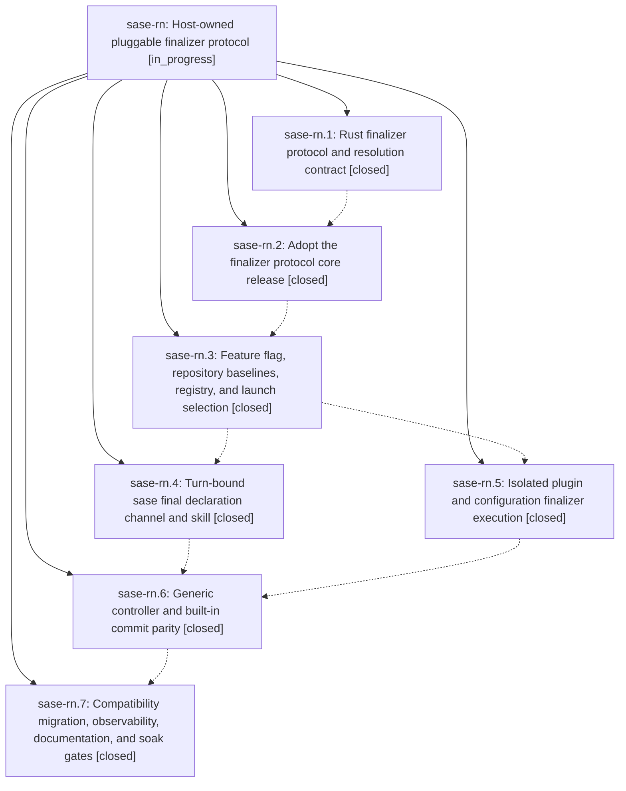

# Bead: sase-rn — Host-owned pluggable finalizer protocol

[Bead Pages](../README.md) / sase-rn

**Status:** ◐ in_progress · **Type:** ▸ plan · **Tier:** epic
**Owner:** `bryanbugyi34@gmail.com` · **Created by:** [bbugyi200.athena.08y](https://github.com/sase-org/sase--agents/blob/main/families/bbugyi200.athena.08y.md) · **Assignee:** `sase-rn.land`
**Created:** 2026-08-20 16:34:59 EDT
**Plan:** [202608/pluggable\_finalizers.md](https://github.com/sase-org/sase--plans/blob/main/202608/pluggable_finalizers.md)

## Description

SASE agents finish through a beta-gated, host-owned finalizer protocol in which trusted configuration activates named built-in or plugin providers, `%final` selects those configured instances per launch, `/sase_final` submits one atomic turn-bound declaration, and the built-in `commit` instance preserves every current attribution, publication, discarded-work, and merge-conflict guarantee while requiring a reason whenever an agent refuses to commit attributable repository changes.

## Phases

| Bead | Title | Status | Size | Created | Agents | Commits |
|---|---|---|---|---|---:|---:|
| [sase-rn.1](sase-rn.1.md) | Rust finalizer protocol and resolution contract | ✓ closed | medium | 2026-08-20 | 1 | 1 |
| [sase-rn.2](sase-rn.2.md) | Adopt the finalizer protocol core release | ✓ closed | small | 2026-08-20 | 1 | 1 |
| [sase-rn.3](sase-rn.3.md) | Feature flag, repository baselines, registry, and launch selection | ✓ closed | medium | 2026-08-20 | 1 | 1 |
| [sase-rn.4](sase-rn.4.md) | Turn-bound sase final declaration channel and skill | ✓ closed | medium | 2026-08-20 | 1 | 1 |
| [sase-rn.5](sase-rn.5.md) | Isolated plugin and configuration finalizer execution | ✓ closed | medium | 2026-08-20 | 1 | 1 |
| [sase-rn.6](sase-rn.6.md) | Generic controller and built-in commit parity | ✓ closed | medium | 2026-08-20 | 1 | 1 |
| [sase-rn.7](sase-rn.7.md) | Compatibility migration, observability, documentation, and soak gates | ✓ closed | medium | 2026-08-20 | 1 | 1 |

## Lineage

## Agents

| Agent | Bead | Commits |
|---|---|---:|
| [bbugyi200.athena.sase-rn.1](https://github.com/sase-org/sase--agents/blob/main/agents/bbugyi200.athena.sase-rn.1/README.md) | [sase-rn.1](sase-rn.1.md) | 1 |
| [bbugyi200.athena.sase-rn.2](https://github.com/sase-org/sase--agents/blob/main/agents/bbugyi200.athena.sase-rn.2/README.md) | [sase-rn.2](sase-rn.2.md) | 1 |
| [bbugyi200.athena.sase-rn.3](https://github.com/sase-org/sase--agents/blob/main/agents/bbugyi200.athena.sase-rn.3/README.md) | [sase-rn.3](sase-rn.3.md) | 1 |
| [bbugyi200.athena.sase-rn.4](https://github.com/sase-org/sase--agents/blob/main/agents/bbugyi200.athena.sase-rn.4/README.md) | [sase-rn.4](sase-rn.4.md) | 1 |
| [bbugyi200.athena.sase-rn.5](https://github.com/sase-org/sase--agents/blob/main/agents/bbugyi200.athena.sase-rn.5/README.md) | [sase-rn.5](sase-rn.5.md) | 1 |
| [bbugyi200.athena.sase-rn.6](https://github.com/sase-org/sase--agents/blob/main/agents/bbugyi200.athena.sase-rn.6/README.md) | [sase-rn.6](sase-rn.6.md) | 1 |
| [bbugyi200.athena.sase-rn.7](https://github.com/sase-org/sase--agents/blob/main/agents/bbugyi200.athena.sase-rn.7/README.md) | [sase-rn.7](sase-rn.7.md) | 1 |
| [bbugyi200.athena.sase-rn.land](https://github.com/sase-org/sase--agents/blob/main/agents/bbugyi200.athena.sase-rn.land/README.md) | [sase-rn](README.md) | 0 |

## Commits

| Repo | Commit | Subject | Bead | Committed |
|---|---|---|---|---|
| sase-core | [`sase-core@09576c3`](https://github.com/sase-org/sase-core/commit/09576c3acbfb8f3366f6c08dff6d4df2b1f3a134) | feat(finalizer): add shared finalizer protocol | [sase-rn.1](sase-rn.1.md) | 2026-08-20 17:07:38 EDT |
| sase | [`8f82eb9`](https://github.com/sase-org/sase/commit/8f82eb99205cfb4f6b0db08f56d81ea0efa5bbfb) | feat(core): adopt finalizer protocol bindings | [sase-rn.2](sase-rn.2.md) | 2026-08-20 17:24:53 EDT |
| sase | [`b1c6bb1`](https://github.com/sase-org/sase/commit/b1c6bb105fd82239c6624115ea58fa5af423657c) | feat(finalizers): add beta finalizer foundation | [sase-rn.3](sase-rn.3.md) | 2026-08-20 18:09:37 EDT |
| sase | [`78550c9`](https://github.com/sase-org/sase/commit/78550c993bedfd12be3a4338c7f5004460120605) | feat: add pluggable finalizer execution runtime | [sase-rn.5](sase-rn.5.md) | 2026-08-20 18:38:01 EDT |
| sase | [`f2b296c`](https://github.com/sase-org/sase/commit/f2b296c45cc8ec039249b9c525fca05cf437f390) | feat(finalizers): add final declaration channel | [sase-rn.4](sase-rn.4.md) | 2026-08-20 18:44:49 EDT |
| sase | [`cad0e61`](https://github.com/sase-org/sase/commit/cad0e6100f1f7f310b9a568fb6521e32d97cc2ef) | feat(finalizers): execute builtin commit declarations | [sase-rn.6](sase-rn.6.md) | 2026-08-20 19:13:56 EDT |
| sase | [`4afec20`](https://github.com/sase-org/sase/commit/4afec203b8dd72ac2e56ae9c964f3a76edfcbfc3) | feat(finalizers): complete beta compatibility soak | [sase-rn.7](sase-rn.7.md) | 2026-08-20 19:36:56 EDT |
