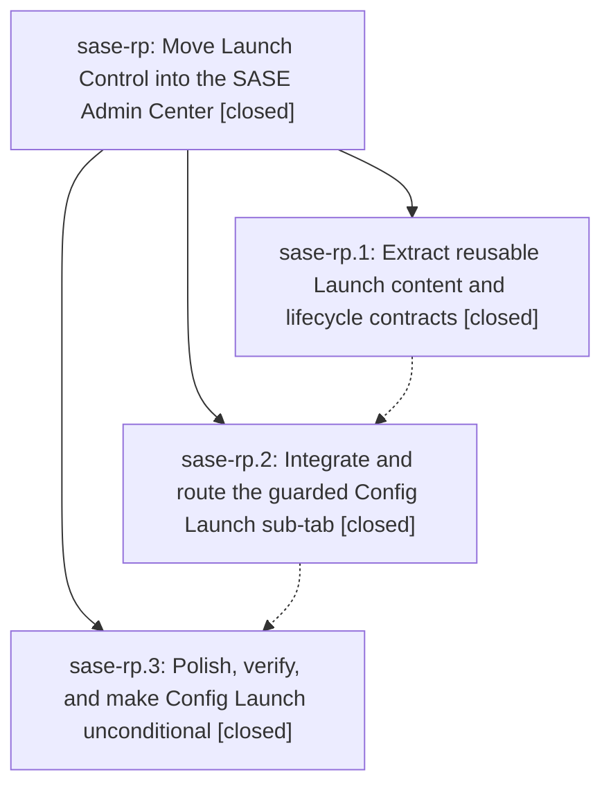

# Bead: sase-rp — Move Launch Control into the SASE Admin Center

[Bead Pages](../README.md) / sase-rp

**Status:** ✓ closed · **Resolution:** done · **Type:** ▸ plan · **Tier:** epic
**Owner:** `bryanbugyi34@gmail.com` · **Created by:** [bbugyi200.athena.sase-ri.land.w2](https://github.com/sase-org/sase--agents/blob/main/families/bbugyi200.athena.sase-ri.land.w2.md) · **Assignee:** `sase-rp.land`
**Created:** 2026-08-21 06:23:55 EDT · **Closed:** 2026-08-21 08:53:59 EDT
**Plan:** [202608/admin\_center\_launch.md](https://github.com/sase-org/sase--plans/blob/main/202608/admin_center_launch.md)

## Description

Launch configuration becomes a polished, lazy Config sub-tab in the SASE Admin Center, and every Launch Control entry point—including the `,m` leader key—opens Config directly on Launch without losing current editing, override, navigation, refresh, or responsiveness guarantees.

## Notes

[2026-08-21T12:53:59Z · sase-rp.land] Implemented Config Launch refresh dedup. Verified focused functional suite passed with 99 tests; feature-flag check passed; embedded Config Launch visual snapshot passed; standalone Launch default visual still shows the known unrelated drift; just check reached the known Symvision private-import baseline with no findings in changed files; git diff --check passed.

## Phases

| Bead | Title | Status | Size | Created | Agents | Commits |
|---|---|---|---|---|---:|---:|
| [sase-rp.1](sase-rp.1.md) | Extract reusable Launch content and lifecycle contracts | ✓ closed | medium | 2026-08-21 | 1 | 1 |
| [sase-rp.2](sase-rp.2.md) | Integrate and route the guarded Config Launch sub-tab | ✓ closed | medium | 2026-08-21 | 1 | 1 |
| [sase-rp.3](sase-rp.3.md) | Polish, verify, and make Config Launch unconditional | ✓ closed | medium | 2026-08-21 | 1 | 1 |

## Lineage

## Agents

| Agent | Bead | Commits |
|---|---|---:|
| [bbugyi200.athena.sase-rp.1](https://github.com/sase-org/sase--agents/blob/main/agents/bbugyi200.athena.sase-rp.1/README.md) | [sase-rp.1](sase-rp.1.md) | 1 |
| [bbugyi200.athena.sase-rp.2](https://github.com/sase-org/sase--agents/blob/main/agents/bbugyi200.athena.sase-rp.2/README.md) | [sase-rp.2](sase-rp.2.md) | 1 |
| [bbugyi200.athena.sase-rp.3](https://github.com/sase-org/sase--agents/blob/main/agents/bbugyi200.athena.sase-rp.3/README.md) | [sase-rp.3](sase-rp.3.md) | 1 |
| [bbugyi200.athena.sase-rp.land](https://github.com/sase-org/sase--agents/blob/main/families/bbugyi200.athena.sase-rp.land.md) | [sase-rp](README.md) | 1 |

## Commits

| Repo | Commit | Subject | Bead | Committed |
|---|---|---|---|---|
| sase | [`0e18509`](https://github.com/sase-org/sase/commit/0e18509f8a664d29ee1950787a62a5c7f44a8717) | feat(tui): extract reusable launch pane | [sase-rp.1](sase-rp.1.md) | 2026-08-21 07:13:51 EDT |
| sase | [`4421c90`](https://github.com/sase-org/sase/commit/4421c90bf1e582270386a9d2f4c781f8fddcb32b) | feat(tui): route launch settings through admin center | [sase-rp.2](sase-rp.2.md) | 2026-08-21 07:48:23 EDT |
| sase | [`4119b0d`](https://github.com/sase-org/sase/commit/4119b0d8d827fa8678ec89cf518a84aff12d0cfa) | feat(tui)!: make Config Launch unconditional | [sase-rp.3](sase-rp.3.md) | 2026-08-21 08:19:23 EDT |
| sase | [`3e0bebe`](https://github.com/sase-org/sase/commit/3e0bebedd26e1be97ce3b07f0ac89f1ffd3fa4eb) | fix: dedupe embedded launch refresh callbacks | [sase-rp](README.md) | 2026-08-21 08:54:48 EDT |
