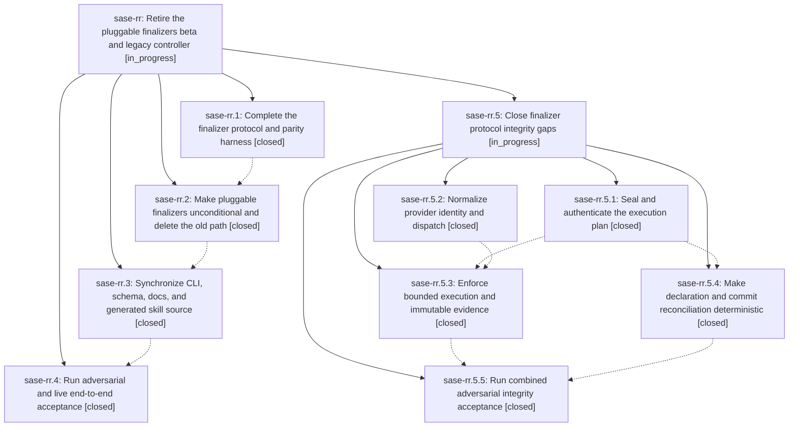

# Bead: sase-rr — Retire the pluggable finalizers beta and legacy controller

[Bead Pages](../README.md) / sase-rr

**Status:** ◐ in_progress · **Type:** ▸ plan · **Tier:** epic
**Owner:** `bryanbugyi34@gmail.com` · **Created by:** [bbugyi200.athena.096](https://github.com/sase-org/sase--agents/blob/main/families/bbugyi200.athena.096.md) · **Assignee:** `sase-rr.land`
**Created:** 2026-08-21 13:05:41 UTC
**Plan:** [202608/retire\_pluggable\_finalizers.md](https://github.com/sase-org/sase--plans/blob/main/202608/retire_pluggable_finalizers.md)

<!-- sase:links:start -->

## Links

| Relation | Artifact | Why |
| --- | --- | --- |
| related | [bead:sase-rz][1] | The retiring-finalizers plan surfaced this protected-memory follow-up and defines the now-unconditional contract to document. |

[1]: https://github.com/sase-org/sase--beads/blob/main/pages/sase-rz/README.md

<!-- sase:links:end -->

## Description

Make host-owned pluggable finalization unconditional, remove the deprecated Off path and beta compatibility code, prove the complete protocol end to end, and close flag bead sase-ro only after the combined tree is green.

## Notes

[2026-08-21T14:26:00Z · sase-ri.land.w2.f2.w2] DISCOVERED ISSUE: just check lint (symvision) on 2026-08-21 at HEAD e9d3521f4 flags private cross-file imports in src/sase/finalizers/declaration.py (_load_latest_context, _load_latest_submission, _load_plan, _normalize_submission_envelope, _repository_obligation_id, _require_artifacts_dir, _validate_provider_payloads). Those helpers sit in this epic's finalizer protocol files. Routed as corroboration rather than a new task; the same gate-blocker set is already recorded on sase-rm.

[2026-08-21T15:22:14Z · research.0u.cdx] DISCOVERED ISSUE: At primary HEAD dc7da84f on 2026-08-21, external finalizer declaration payloads do not satisfy the protocol design: src/sase/finalizers/declaration.py:_validate_provider_payloads validates only builtin@commit and accepts any non-commit payload without invoking the selected provider's validate operation; src/sase/finalizers/executor.py:_provider_request passes config/selection but not the accepted payload or host obligations to describe/validate/execute/verify. Reproduction: inspect lines 750-777 of declaration.py and _provider_request in executor.py. Impact: declaration-driven external finalizers cannot validate or consume model input, despite every external provider currently forcing submission_required=true. This is causally owned by sase-rr's protocol completion/acceptance scope; no standalone task created.

[2026-08-21T18:45:47Z · 0a0] DISCOVERED ISSUE: just check lint (symvision) on 2026-08-21 during isolate_pandoc_workdir implementation flags unused public ArtifactLinkCommitResult and ensure_artifact_link_commit_published in src/sase/sdd/_artifact_link_commit.py and auto_commit_artifact_link_indexes_if_possible in src/sase/finalizers/reconciliation.py. All three have in-file callers (and a test-only import of ensure_artifact_link_commit_published); none have a non-test consumer. The same escalated just test-scoped run then failed three fakey e2e nodes after sase-rr made pluggable finalizers unconditional: tests/fakey/test_retry_pipeline_e2e.py::test_execution_override_runs_fakey_with_requested_model_metadata (agent_meta gained a finalizers block the assertion does not expect) plus test_retryable_failure_then_success_records_lifecycle_and_nudge and test_fallback_switches_the_real_subprocess_model (both raise "sase final context requires active finalizer turn metadata: SASE_AGENT_NAME or agent_meta.json name"). Working tree only touches src/sase/attachments/markdown_pdf.py, src/sase/attachments/_markdown_pdf_rendering.py, and tests/test_markdown_pdf.py. Not a flake: the lint is static and the three fakey failures reproduced in this one escalated 1497-item run. Routed here because these files and the fakey agent_meta/finalizer protocol are owned by this epic rather than a standalone task.

[2026-08-21T19:24:26Z · 09u.f0] DISCOVERED ISSUE: During compact_bead_wait_status_tokens verification on 2026-08-21, just check's escalated full scoped lane failed the three tests/fakey/test_retry_pipeline_e2e.py retry/fallback nodes. Focused rerun reproduced the same finalizer-context failure: fakey child prompts inherit the turn's SASE Final Declaration text, then fail with 'sase final context requires active finalizer turn metadata: SASE_AGENT_NAME or agent_meta.json name'. This corroborates the existing finalizer-epic note from 0a0; the wait-token diff does not touch finalizers, workflow execution, or fakey provider code.

[2026-08-21T21:33:04Z · 0a6--1] DISCOVERED ISSUE: During fix_publish_release_metadata verification on 2026-08-21, 'just check' failed at lint (feature flags) after fmt, ruff, and mypy passed. Exact failure: tools/check_feature_flags rule 8 reports live flag bead 'sase-ro' has no definition (key 'pluggable_finalizers'); the bead was created 2026-08-20T21:30:24Z by sase-rn.3. The local diff only touches tools/ratchet_core_window, .github/workflows/publish.yml, and their tests, so this is unrelated to release metadata reconciliation. Not routed to closed task sase-pp because that task fixed the young cross-workspace orphan-bead window; this pluggable_finalizers bead is now the flag bead this epic description explicitly owns closing after the combined tree is green. The finalizer closeout should restore a valid registry state or close sase-ro before relying on just check as green.

[2026-08-21T22:25:05Z · sase-s0.land] DISCOVERED ISSUE corroboration from epic sase-s0 phases sase-s0.2 and sase-s0.3: both independently hit tools/check_feature_flags rule 8 because live flag bead sase-ro names pluggable_finalizers after its registry definition/Off branch were removed. No standalone task created: this is explicitly owned by active epic sase-rr and is already recorded in its notes; close sase-ro as part of that epic's combined green-tree landing.

## References

- file:explicit:4ac14f733cd4c83b0ca56786

## Phases

| Bead | Title | Status | Size | Created | Agents | Commits |
|---|---|---|---|---|---:|---:|
| [sase-rr.1](sase-rr.1.md) | Complete the finalizer protocol and parity harness | ✓ closed | medium | 2026-08-21 | 1 | 1 |
| [sase-rr.2](sase-rr.2.md) | Make pluggable finalizers unconditional and delete the old path | ✓ closed | medium | 2026-08-21 | 1 | 1 |
| [sase-rr.3](sase-rr.3.md) | Synchronize CLI, schema, docs, and generated skill source | ✓ closed | small | 2026-08-21 | 1 | 1 |
| [sase-rr.4](sase-rr.4.md) | Run adversarial and live end-to-end acceptance | ✓ closed | medium | 2026-08-21 | 1 | 1 |

## Lineage

## Agents

| Agent | Bead | Commits |
|---|---|---:|
| [bbugyi200.athena.sase-rr.1](https://github.com/sase-org/sase--agents/blob/main/agents/bbugyi200.athena.sase-rr.1/README.md) | [sase-rr.1](sase-rr.1.md) | 1 |
| [bbugyi200.athena.sase-rr.2](https://github.com/sase-org/sase--agents/blob/main/agents/bbugyi200.athena.sase-rr.2/README.md) | [sase-rr.2](sase-rr.2.md) | 1 |
| [bbugyi200.athena.sase-rr.3](https://github.com/sase-org/sase--agents/blob/main/agents/bbugyi200.athena.sase-rr.3/README.md) | [sase-rr.3](sase-rr.3.md) | 1 |
| [bbugyi200.athena.sase-rr.4](https://github.com/sase-org/sase--agents/blob/main/agents/bbugyi200.athena.sase-rr.4/README.md) | [sase-rr.4](sase-rr.4.md) | 1 |
| [bbugyi200.athena.sase-rr.5.1](https://github.com/sase-org/sase--agents/blob/main/agents/bbugyi200.athena.sase-rr.5.1/README.md) | [sase-rr.5.1](sase-rr.5.1.md) | 2 |
| [bbugyi200.athena.sase-rr.5.2](https://github.com/sase-org/sase--agents/blob/main/agents/bbugyi200.athena.sase-rr.5.2/README.md) | [sase-rr.5.2](sase-rr.5.2.md) | 1 |
| [bbugyi200.athena.sase-rr.5.3](https://github.com/sase-org/sase--agents/blob/main/agents/bbugyi200.athena.sase-rr.5.3/README.md) | [sase-rr.5.3](sase-rr.5.3.md) | 2 |
| [bbugyi200.athena.sase-rr.5.4](https://github.com/sase-org/sase--agents/blob/main/agents/bbugyi200.athena.sase-rr.5.4/README.md) | [sase-rr.5.4](sase-rr.5.4.md) | 1 |
| [bbugyi200.athena.sase-rr.5.5](https://github.com/sase-org/sase--agents/blob/main/agents/bbugyi200.athena.sase-rr.5.5/README.md) | [sase-rr.5.5](sase-rr.5.5.md) | 2 |
| [bbugyi200.athena.sase-rr.5.land](https://github.com/sase-org/sase--agents/blob/main/agents/bbugyi200.athena.sase-rr.5.land/README.md) | [sase-rr.5](sase-rr.5.md) | 0 |
| [bbugyi200.athena.sase-rr.land](https://github.com/sase-org/sase--agents/blob/main/families/bbugyi200.athena.sase-rr.land.md) | [sase-rr](README.md) | 0 |

## Commits

| Repo | Commit | Subject | Bead | Committed |
|---|---|---|---|---|
| sase | [`980bedf`](https://github.com/sase-org/sase/commit/980bedfea8c30d6d6202b7b31d2254dbe679f2ef) | feat(finalizers): complete generic controller protocol and conflict resume | [sase-rr.1](sase-rr.1.md) | 2026-08-21 15:08:09 UTC |
| sase | [`2f9c4ae`](https://github.com/sase-org/sase/commit/2f9c4ae2955e680f5da2249e20cccca15e0b972c) | feat(finalizers)!: make pluggable finalizers the only completion path | [sase-rr.2](sase-rr.2.md) | 2026-08-21 16:19:53 UTC |
| sase | [`2f244b7`](https://github.com/sase-org/sase/commit/2f244b7c40336ec4d242d2180d96a43907af2728) | docs(finalizers): sync unconditional finalizer contracts | [sase-rr.3](sase-rr.3.md) | 2026-08-21 18:46:44 UTC |
| sase | [`2800900`](https://github.com/sase-org/sase/commit/28009002d5da032104d57805a6df293ffeca6b3e) | fix(finalizers): prove live e2e acceptance and validate external payloads | [sase-rr.4](sase-rr.4.md) | 2026-08-21 19:28:17 UTC |
| sase | [`3d66071`](https://github.com/sase-org/sase/commit/3d66071d37ce85b736bbf9561f1be0a3dd872478) | fix(finalizers): canonicalize provider identity and dispatch | [sase-rr.5.2](sase-rr.5.2.md) | 2026-08-21 21:07:40 UTC |
| sase | [`9af9e1c`](https://github.com/sase-org/sase/commit/9af9e1c3fc6e85abd2b361f121721e35f9676160) | feat(finalizers): seal and authenticate the host-owned execution plan | [sase-rr.5.1](sase-rr.5.1.md) | 2026-08-21 21:21:24 UTC |
| sase-core | [`sase-core@10d3bbd`](https://github.com/sase-org/sase-core/commit/10d3bbd66d04f6440b413d58b6eebc63fcc791af) | feat(finalizer): validate and authenticate resolved plan digests | [sase-rr.5.1](sase-rr.5.1.md) | 2026-08-21 21:24:26 UTC |
| sase | [`c2f46e8`](https://github.com/sase-org/sase/commit/c2f46e84e87edcd9994b4b8bde494099652b1941) | fix(finalizers): serialize declaration accept and host-order commits | [sase-rr.5.4](sase-rr.5.4.md) | 2026-08-21 22:15:21 UTC |
| sase | [`6639a28`](https://github.com/sase-org/sase/commit/6639a28016163be274ace52c293bd7aeebfb8470) | feat(finalizers): enforce bounded attempts and immutable evidence | [sase-rr.5.3](sase-rr.5.3.md) | 2026-08-21 22:22:29 UTC |
| sase-core | [`sase-core@fee049e`](https://github.com/sase-org/sase-core/commit/fee049e54580fe256070c400f693a4a4d67129e3) | feat(finalizer): validate unique increasing attempt ledgers | [sase-rr.5.3](sase-rr.5.3.md) | 2026-08-21 22:23:27 UTC |
| sase | [`47830f9`](https://github.com/sase-org/sase/commit/47830f9dedcf9e44601499d6e901a979970213e9) | test(finalizer): align final directive completion expectation | [sase-rr.5.5](sase-rr.5.5.md) | 2026-08-21 23:07:31 UTC |
| sase-core | [`sase-core@f7e8247`](https://github.com/sase-org/sase-core/commit/f7e8247d95a5dc63e244a1fb0ca3a97d61871503) | fix(finalizer): hide final directive name completion | [sase-rr.5.5](sase-rr.5.5.md) | 2026-08-21 23:09:27 UTC |
