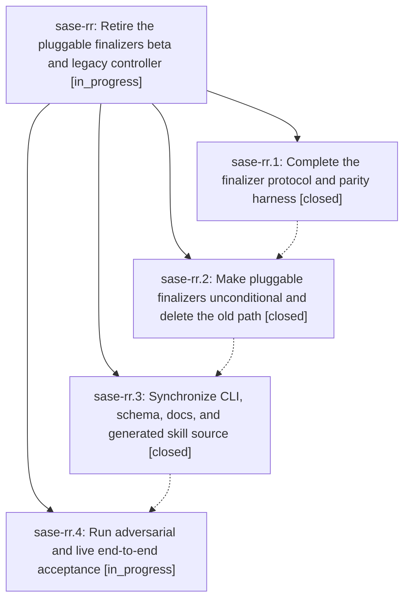

# Bead: sase-rr — Retire the pluggable finalizers beta and legacy controller

[Bead Pages](../README.md) / sase-rr

**Status:** ◐ in_progress · **Type:** ▸ plan · **Tier:** epic
**Owner:** `bryanbugyi34@gmail.com` · **Created by:** [bbugyi200.athena.096](https://github.com/sase-org/sase--agents/blob/main/families/bbugyi200.athena.096.md) · **Assignee:** `sase-rr.land`
**Created:** 2026-08-21 13:05:41 UTC
**Plan:** [202608/retire\_pluggable\_finalizers.md](https://github.com/sase-org/sase--plans/blob/main/202608/retire_pluggable_finalizers.md)

## Description

Make host-owned pluggable finalization unconditional, remove the deprecated Off path and beta compatibility code, prove the complete protocol end to end, and close flag bead sase-ro only after the combined tree is green.

## Notes

[2026-08-21T14:26:00Z · sase-ri.land.w2.f2.w2] DISCOVERED ISSUE: just check lint (symvision) on 2026-08-21 at HEAD e9d3521f4 flags private cross-file imports in src/sase/finalizers/declaration.py (_load_latest_context, _load_latest_submission, _load_plan, _normalize_submission_envelope, _repository_obligation_id, _require_artifacts_dir, _validate_provider_payloads). Those helpers sit in this epic's finalizer protocol files. Routed as corroboration rather than a new task; the same gate-blocker set is already recorded on sase-rm.

[2026-08-21T15:22:14Z · research.0u.cdx] DISCOVERED ISSUE: At primary HEAD dc7da84f on 2026-08-21, external finalizer declaration payloads do not satisfy the protocol design: src/sase/finalizers/declaration.py:_validate_provider_payloads validates only builtin@commit and accepts any non-commit payload without invoking the selected provider's validate operation; src/sase/finalizers/executor.py:_provider_request passes config/selection but not the accepted payload or host obligations to describe/validate/execute/verify. Reproduction: inspect lines 750-777 of declaration.py and _provider_request in executor.py. Impact: declaration-driven external finalizers cannot validate or consume model input, despite every external provider currently forcing submission_required=true. This is causally owned by sase-rr's protocol completion/acceptance scope; no standalone task created.

## Phases

| Bead | Title | Status | Size | Created | Agents | Commits |
|---|---|---|---|---|---:|---:|
| [sase-rr.1](sase-rr.1.md) | Complete the finalizer protocol and parity harness | ✓ closed | medium | 2026-08-21 | 1 | 1 |
| [sase-rr.2](sase-rr.2.md) | Make pluggable finalizers unconditional and delete the old path | ✓ closed | medium | 2026-08-21 | 1 | 1 |
| [sase-rr.3](sase-rr.3.md) | Synchronize CLI, schema, docs, and generated skill source | ✓ closed | small | 2026-08-21 | 1 | 1 |
| [sase-rr.4](sase-rr.4.md) | Run adversarial and live end-to-end acceptance | ◐ in_progress | medium | 2026-08-21 | 1 | 0 |

## Lineage

## Agents

| Agent | Bead | Commits |
|---|---|---:|
| [bbugyi200.athena.sase-rr.1](https://github.com/sase-org/sase--agents/blob/main/agents/bbugyi200.athena.sase-rr.1/README.md) | [sase-rr.1](sase-rr.1.md) | 1 |
| [bbugyi200.athena.sase-rr.2](https://github.com/sase-org/sase--agents/blob/main/agents/bbugyi200.athena.sase-rr.2/README.md) | [sase-rr.2](sase-rr.2.md) | 1 |
| [bbugyi200.athena.sase-rr.3](https://github.com/sase-org/sase--agents/blob/main/agents/bbugyi200.athena.sase-rr.3/README.md) | [sase-rr.3](sase-rr.3.md) | 1 |
| [bbugyi200.athena.sase-rr.4](https://github.com/sase-org/sase--agents/blob/main/agents/bbugyi200.athena.sase-rr.4/README.md) | [sase-rr.4](sase-rr.4.md) | 0 |
| [bbugyi200.athena.sase-rr.land](https://github.com/sase-org/sase--agents/blob/main/agents/bbugyi200.athena.sase-rr.land/README.md) | [sase-rr](README.md) | 0 |

## Commits

| Repo | Commit | Subject | Bead | Committed |
|---|---|---|---|---|
| sase | [`980bedf`](https://github.com/sase-org/sase/commit/980bedfea8c30d6d6202b7b31d2254dbe679f2ef) | feat(finalizers): complete generic controller protocol and conflict resume | [sase-rr.1](sase-rr.1.md) | 2026-08-21 15:08:09 UTC |
| sase | [`2f9c4ae`](https://github.com/sase-org/sase/commit/2f9c4ae2955e680f5da2249e20cccca15e0b972c) | feat(finalizers)!: make pluggable finalizers the only completion path | [sase-rr.2](sase-rr.2.md) | 2026-08-21 16:19:53 UTC |
| sase | [`2f244b7`](https://github.com/sase-org/sase/commit/2f244b7c40336ec4d242d2180d96a43907af2728) | docs(finalizers): sync unconditional finalizer contracts | [sase-rr.3](sase-rr.3.md) | 2026-08-21 18:46:44 UTC |
