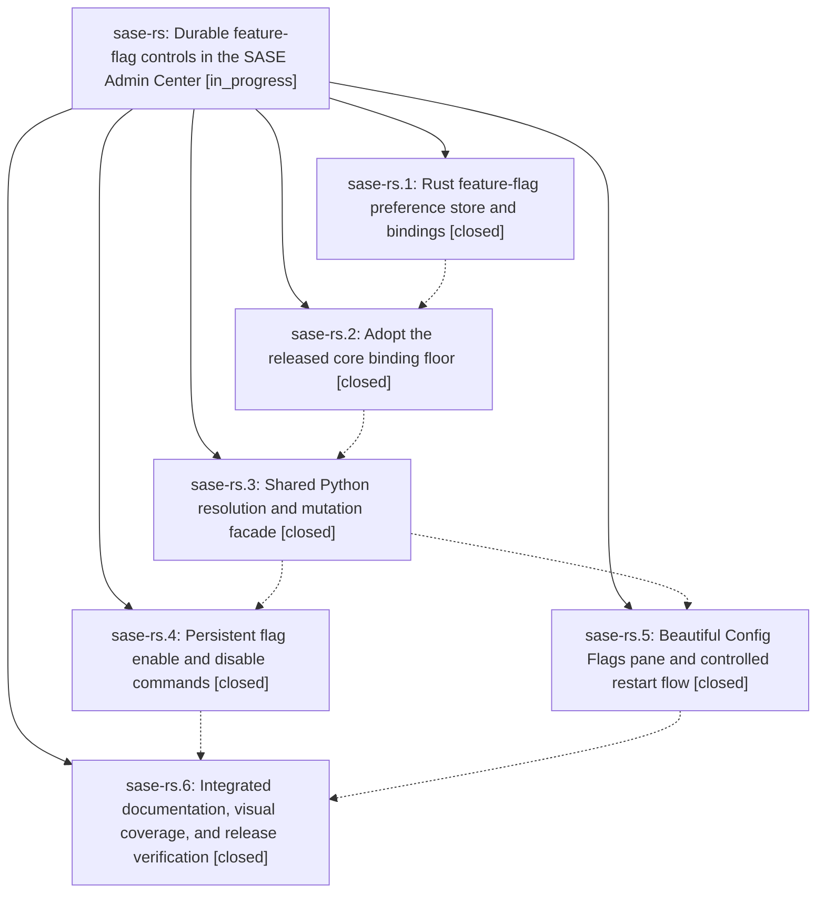

# Bead: sase-rs — Durable feature-flag controls in the SASE Admin Center

[Bead Pages](../README.md) / sase-rs

**Status:** ◐ in_progress · **Type:** ▸ plan · **Tier:** epic
**Owner:** `bryanbugyi34@gmail.com` · **Created by:** [bbugyi200.athena.09g](https://github.com/sase-org/sase--agents/blob/main/families/bbugyi200.athena.09g.md) · **Assignee:** `sase-rs.land`
**Created:** 2026-08-21 13:58:39 UTC
**Plan:** [202608/feature\_flag\_control\_center.md](https://github.com/sase-org/sase--plans/blob/main/202608/feature_flag_control_center.md)

## Description

Users can inspect and persistently enable or disable every registered SASE feature flag from either a polished Config > Flags pane or the sase flag CLI, with both surfaces sharing one crash-safe state mutation path and applying changes through the established ACE and AXE restart flows without editing normal configuration files.

## Notes

[2026-08-21T18:03:00Z · 09t] DISCOVERED ISSUE: just check fails at lint (symvision) on unused public decision_json in src/sase/feature_flags/cli_json.py. The helper is only called by mutation_json in the same file and is listed in __all__. Introduced by closed phase sase-rs.4 (persistent flag enable/disable JSON serialization). No non-test importer exists. Fix: rename to _decision_json, drop it from __all__, keep the in-file mutation_json caller. Reproduced via just check on 2026-08-21 while implementing session-local ACE proc live output; the working tree does not touch src/sase/feature_flags/. Not a flake: the gate is static and reports the same symbol every run.

[2026-08-21T18:11:07Z · 09v] DISCOVERED ISSUE: independently reproduced just check lint (symvision) unused public decision_json in src/sase/feature_flags/cli_json.py while implementing centralized artifact-ref prompt expansion. Working tree does not touch feature_flags. Helper is only used by mutation_json in the same file and exported in __all__. Same static unused-export finding as the 09t note; not a flake.

[2026-08-21T18:45:48Z · 0a0] DISCOVERED ISSUE: just check lint (symvision) on 2026-08-21 during isolate_pandoc_workdir implementation flags unused public FlagToggleConfirmation, flag_matches_filter, and is_shadowed_decision in src/sase/ace/tui/modals/feature_flags_pane_rendering.py, config_hub_strip_thresholds in src/sase/ace/tui/modals/config_hub_pane.py, and independently reproduces unused public decision_json in src/sase/feature_flags/cli_json.py already noted here. Working tree does not touch feature_flags or ACE Config/Flags panes. Not a flake: the gate is static and reports the same symbols every run. Fix shape for decision_json remains privatize-in-file; the Flags pane helpers look like the same leftover public exports from closed phase sase-rs.5.

## Phases

| Bead | Title | Status | Size | Created | Agents | Commits |
|---|---|---|---|---|---:|---:|
| [sase-rs.1](sase-rs.1.md) | Rust feature-flag preference store and bindings | ✓ closed | medium | 2026-08-21 | 1 | 1 |
| [sase-rs.2](sase-rs.2.md) | Adopt the released core binding floor | ✓ closed | small | 2026-08-21 | 1 | 2 |
| [sase-rs.3](sase-rs.3.md) | Shared Python resolution and mutation facade | ✓ closed | medium | 2026-08-21 | 1 | 2 |
| [sase-rs.4](sase-rs.4.md) | Persistent flag enable and disable commands | ✓ closed | medium | 2026-08-21 | 1 | 1 |
| [sase-rs.5](sase-rs.5.md) | Beautiful Config Flags pane and controlled restart flow | ✓ closed | medium | 2026-08-21 | 1 | 2 |
| [sase-rs.6](sase-rs.6.md) | Integrated documentation, visual coverage, and release verification | ✓ closed | small | 2026-08-21 | 1 | 1 |

## Lineage

## Agents

| Agent | Bead | Commits |
|---|---|---:|
| [bbugyi200.athena.sase-rs.1](https://github.com/sase-org/sase--agents/blob/main/agents/bbugyi200.athena.sase-rs.1/README.md) | [sase-rs.1](sase-rs.1.md) | 1 |
| [bbugyi200.athena.sase-rs.2](https://github.com/sase-org/sase--agents/blob/main/families/bbugyi200.athena.sase-rs.2.md) | [sase-rs.2](sase-rs.2.md) | 2 |
| [bbugyi200.athena.sase-rs.3](https://github.com/sase-org/sase--agents/blob/main/agents/bbugyi200.athena.sase-rs.3/README.md) | [sase-rs.3](sase-rs.3.md) | 2 |
| [bbugyi200.athena.sase-rs.4](https://github.com/sase-org/sase--agents/blob/main/agents/bbugyi200.athena.sase-rs.4/README.md) | [sase-rs.4](sase-rs.4.md) | 1 |
| [bbugyi200.athena.sase-rs.5](https://github.com/sase-org/sase--agents/blob/main/agents/bbugyi200.athena.sase-rs.5/README.md) | [sase-rs.5](sase-rs.5.md) | 2 |
| [bbugyi200.athena.sase-rs.6](https://github.com/sase-org/sase--agents/blob/main/families/bbugyi200.athena.sase-rs.6.md) | [sase-rs.6](sase-rs.6.md) | 1 |
| [bbugyi200.athena.sase-rs.land](https://github.com/sase-org/sase--agents/blob/main/agents/bbugyi200.athena.sase-rs.land/README.md) | [sase-rs](README.md) | 0 |

## Commits

| Repo | Commit | Subject | Bead | Committed |
|---|---|---|---|---|
| sase-core | [`sase-core@c04a219`](https://github.com/sase-org/sase-core/commit/c04a2192392cd0226baa68d83db17f2e148be9b2) | feat(core): add versioned feature-flag preference store | [sase-rs.1](sase-rs.1.md) | 2026-08-21 14:35:08 UTC |
| sase-core | [`sase-core@e5181a6`](https://github.com/sase-org/sase-core/commit/e5181a69d20f904f63499387623b6097ad39b80e) | fix(clippy): use Option::unwrap\_or in pull-request URL parser | [sase-rs.2](sase-rs.2.md) | 2026-08-21 14:56:37 UTC |
| sase | [`f355faa`](https://github.com/sase-org/sase/commit/f355faa969513ae0bf09d27423240c3d0f167e03) | build(deps): raise sase-core-rs floor to 0.29.6 | [sase-rs.2](sase-rs.2.md) | 2026-08-21 15:48:29 UTC |
| sase | [`b88dfc7`](https://github.com/sase-org/sase/commit/b88dfc729359edaf7bda546e6bf581c7f2266b07) | fix(telemetry): drop duplicate sase\_finalizer catalog entries | [sase-rs.3](sase-rs.3.md) | 2026-08-21 16:55:10 UTC |
| sase | [`9223d47`](https://github.com/sase-org/sase/commit/9223d47c4617075c6298c2dd4663b56ecb6281ac) | feat(flags): add shared Python saved-state resolution and mutation facade | [sase-rs.3](sase-rs.3.md) | 2026-08-21 16:57:16 UTC |
| sase | [`c3679dc`](https://github.com/sase-org/sase/commit/c3679dcf1e8118e8c2d5c5f4723b34c9469f76ce) | feat(flags): add persistent sase flag enable and disable commands | [sase-rs.4](sase-rs.4.md) | 2026-08-21 17:35:03 UTC |
| sase | [`b8a827b`](https://github.com/sase-org/sase/commit/b8a827bea3807b40ab11d9f61056a77c31227376) | feat(tui): add Config Flags pane with sunset rollout and ACE+AXE restart | [sase-rs.5](sase-rs.5.md) | 2026-08-21 17:54:05 UTC |
| sase--plans | [`sase--plans@74b93bd`](https://github.com/sase-org/sase--plans/commit/74b93bd1e8c212c2317b4ec920b7dc1caba838c6) | chore(sdd): record sase-rs.5 read of the feature-flag control-center plan | [sase-rs.5](sase-rs.5.md) | 2026-08-21 17:56:52 UTC |
| sase | [`48f1365`](https://github.com/sase-org/sase/commit/48f1365d3ae94ae21226a8e8203a6efdf89a2e3e) | feat(flags): polish Config Flags docs, journeys, and chrome goldens | [sase-rs.6](sase-rs.6.md) | 2026-08-21 19:25:34 UTC |
