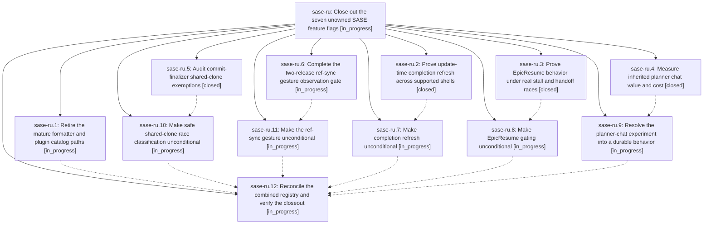

# Bead: sase-ru — Close out the seven unowned SASE feature flags

[Bead Pages](../README.md) / sase-ru

**Status:** ◐ in_progress · **Type:** ▸ plan · **Tier:** epic
**Owner:** `bryanbugyi34@gmail.com` · **Created by:** [bbugyi200.athena.09i](https://github.com/sase-org/sase--agents/blob/main/families/bbugyi200.athena.09i.md) · **Assignee:** `sase-ru.land`
**Created:** 2026-08-21 10:44:25 EDT
**Plan:** [202608/open\_feature\_flag\_closeout.md](https://github.com/sase-org/sase--plans/blob/main/202608/open_feature_flag_closeout.md)

## Description

The seven in-scope SASE feature flags are retired only after their authored acceptance evidence is satisfied, their winning behavior is made unconditional, and their dedicated flag beads are closed without disturbing the separately owned artifact_links and pluggable_finalizers work.

## Phases

| Bead | Title | Status | Size | Created | Agents | Commits |
|---|---|---|---|---|---:|---:|
| [sase-ru.1](sase-ru.1.md) | Retire the mature formatter and plugin catalog paths | ◐ in_progress | medium | 2026-08-21 | 1 | 0 |
| [sase-ru.10](sase-ru.10.md) | Make safe shared-clone race classification unconditional | ◐ in_progress | small | 2026-08-21 | 1 | 0 |
| [sase-ru.11](sase-ru.11.md) | Make the ref-sync gesture unconditional | ◐ in_progress | small | 2026-08-21 | 1 | 0 |
| [sase-ru.12](sase-ru.12.md) | Reconcile the combined registry and verify the closeout | ◐ in_progress | medium | 2026-08-21 | 1 | 0 |
| [sase-ru.2](sase-ru.2.md) | Prove update-time completion refresh across supported shells | ✓ closed | medium | 2026-08-21 | 1 | 2 |
| [sase-ru.3](sase-ru.3.md) | Prove EpicResume behavior under real stall and handoff races | ✓ closed | medium | 2026-08-21 | 1 | 0 |
| [sase-ru.4](sase-ru.4.md) | Measure inherited planner chat value and cost | ✓ closed | medium | 2026-08-21 | 1 | 1 |
| [sase-ru.5](sase-ru.5.md) | Audit commit-finalizer shared-clone exemptions | ✓ closed | medium | 2026-08-21 | 1 | 2 |
| [sase-ru.6](sase-ru.6.md) | Complete the two-release ref-sync gesture observation gate | ◐ in_progress | small | 2026-08-21 | 1 | 0 |
| [sase-ru.7](sase-ru.7.md) | Make completion refresh unconditional | ◐ in_progress | small | 2026-08-21 | 1 | 0 |
| [sase-ru.8](sase-ru.8.md) | Make EpicResume gating unconditional | ◐ in_progress | small | 2026-08-21 | 1 | 0 |
| [sase-ru.9](sase-ru.9.md) | Resolve the planner-chat experiment into a durable behavior | ◐ in_progress | medium | 2026-08-21 | 1 | 0 |

## Lineage

## Agents

| Agent | Bead | Commits |
|---|---|---:|
| [bbugyi200.athena.sase-ru.1](https://github.com/sase-org/sase--agents/blob/main/families/bbugyi200.athena.sase-ru.1.md) | [sase-ru.1](sase-ru.1.md) | 0 |
| [bbugyi200.athena.sase-ru.10](https://github.com/sase-org/sase--agents/blob/main/agents/bbugyi200.athena.sase-ru.10/README.md) | [sase-ru.10](sase-ru.10.md) | 0 |
| [bbugyi200.athena.sase-ru.11](https://github.com/sase-org/sase--agents/blob/main/agents/bbugyi200.athena.sase-ru.11/README.md) | [sase-ru.11](sase-ru.11.md) | 0 |
| [bbugyi200.athena.sase-ru.12](https://github.com/sase-org/sase--agents/blob/main/agents/bbugyi200.athena.sase-ru.12/README.md) | [sase-ru.12](sase-ru.12.md) | 0 |
| [bbugyi200.athena.sase-ru.2](https://github.com/sase-org/sase--agents/blob/main/agents/bbugyi200.athena.sase-ru.2/README.md) | [sase-ru.2](sase-ru.2.md) | 2 |
| [bbugyi200.athena.sase-ru.3](https://github.com/sase-org/sase--agents/blob/main/agents/bbugyi200.athena.sase-ru.3/README.md) | [sase-ru.3](sase-ru.3.md) | 0 |
| [bbugyi200.athena.sase-ru.4](https://github.com/sase-org/sase--agents/blob/main/agents/bbugyi200.athena.sase-ru.4/README.md) | [sase-ru.4](sase-ru.4.md) | 1 |
| [bbugyi200.athena.sase-ru.5](https://github.com/sase-org/sase--agents/blob/main/agents/bbugyi200.athena.sase-ru.5/README.md) | [sase-ru.5](sase-ru.5.md) | 2 |
| [bbugyi200.athena.sase-ru.6](https://github.com/sase-org/sase--agents/blob/main/agents/bbugyi200.athena.sase-ru.6/README.md) | [sase-ru.6](sase-ru.6.md) | 0 |
| [bbugyi200.athena.sase-ru.7](https://github.com/sase-org/sase--agents/blob/main/agents/bbugyi200.athena.sase-ru.7/README.md) | [sase-ru.7](sase-ru.7.md) | 0 |
| [bbugyi200.athena.sase-ru.8](https://github.com/sase-org/sase--agents/blob/main/agents/bbugyi200.athena.sase-ru.8/README.md) | [sase-ru.8](sase-ru.8.md) | 0 |
| [bbugyi200.athena.sase-ru.9](https://github.com/sase-org/sase--agents/blob/main/agents/bbugyi200.athena.sase-ru.9/README.md) | [sase-ru.9](sase-ru.9.md) | 0 |
| [bbugyi200.athena.sase-ru.land](https://github.com/sase-org/sase--agents/blob/main/agents/bbugyi200.athena.sase-ru.land/README.md) | [sase-ru](README.md) | 0 |

## Commits

| Repo | Commit | Subject | Bead | Committed |
|---|---|---|---|---|
| sase--plans | [`sase--plans@661460d`](https://github.com/sase-org/sase--plans/commit/661460d5bd91ec44d7fe7d820476b98e7e60c000) | docs(plan): link planner-chat trial evidence to the flag closeout plan | [sase-ru.4](sase-ru.4.md) | 2026-08-21 11:07:36 EDT |
| sase | [`f425005`](https://github.com/sase-org/sase/commit/f425005a0f95b1ced138ae5018ed8a60e99e2c6d) | test(completion): soak unmanaged refresh across bash, fish, and zsh | [sase-ru.2](sase-ru.2.md) | 2026-08-21 11:26:21 EDT |
| sase--plans | [`sase--plans@84aeb6a`](https://github.com/sase-org/sase--plans/commit/84aeb6a1f82e51951f4ebd92b3266a91fa7ceeac) | docs(plans): record completion-soak artifact read of flag closeout plan | [sase-ru.2](sase-ru.2.md) | 2026-08-21 11:29:08 EDT |
| sase | [`f4fde13`](https://github.com/sase-org/sase/commit/f4fde13df67b8c7df4cafc00839eab669799de30) | feat(llm\_provider): emit attributable shared-clone classification events | [sase-ru.5](sase-ru.5.md) | 2026-08-21 11:34:14 EDT |
| sase--plans | [`sase--plans@3975633`](https://github.com/sase-org/sase--plans/commit/3975633814f39766b2b01e91d063169f25b530a9) | chore(sdd): record sase-ru.5 read of the flag closeout plan | [sase-ru.5](sase-ru.5.md) | 2026-08-21 11:38:41 EDT |
