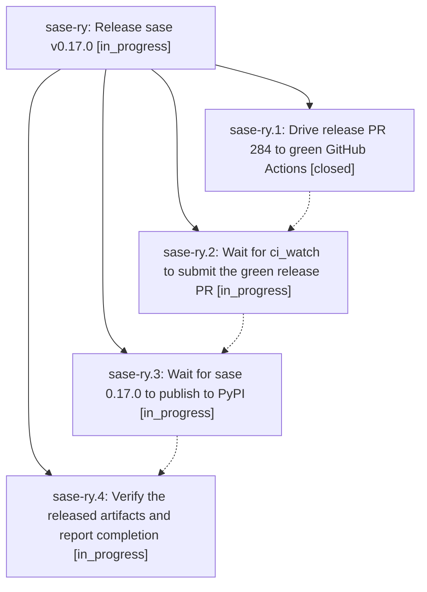

# Bead: sase-ry — Release sase v0.17.0

[Bead Pages](../README.md) / sase-ry

**Status:** ◐ in_progress · **Type:** ▸ plan · **Tier:** epic
**Owner:** `bryanbugyi34@gmail.com` · **Created by:** [bbugyi200.athena.0a1](https://github.com/sase-org/sase--agents/blob/main/families/bbugyi200.athena.0a1.md) · **Assignee:** `sase-ry.land`
**Created:** 2026-08-21 18:56:03 UTC
**Plan:** [202608/release\_v0\_17\_0.md](https://github.com/sase-org/sase--plans/blob/main/202608/release_v0_17_0.md)

## Description

Release PR 284 is green, submitted by ci_watch, published as sase 0.17.0 on PyPI, and independently verified with a durable evidence trail

## Phases

| Bead | Title | Status | Size | Created | Agents | Commits |
|---|---|---|---|---|---:|---:|
| [sase-ry.1](sase-ry.1.md) | Drive release PR 284 to green GitHub Actions | ✓ closed | medium | 2026-08-21 | 1 | 1 |
| [sase-ry.2](sase-ry.2.md) | Wait for ci\_watch to submit the green release PR | ◐ in_progress | small | 2026-08-21 | 2 | 2 |
| [sase-ry.3](sase-ry.3.md) | Wait for sase 0.17.0 to publish to PyPI | ◐ in_progress | small | 2026-08-21 | 1 | 0 |
| [sase-ry.4](sase-ry.4.md) | Verify the released artifacts and report completion | ◐ in_progress | small | 2026-08-21 | 1 | 0 |

## Lineage

## Agents

| Agent | Bead | Commits |
|---|---|---:|
| [bbugyi200.athena.sase-ry.1](https://github.com/sase-org/sase--agents/blob/main/families/bbugyi200.athena.sase-ry.1.md) | [sase-ry.1](sase-ry.1.md) | 1 |
| [bbugyi200.athena.sase-ry.2](https://github.com/sase-org/sase--agents/blob/main/families/bbugyi200.athena.sase-ry.2.md) | [sase-ry.2](sase-ry.2.md) | 0 |
| [bbugyi200.athena.sase-ry.2--2--code](https://github.com/sase-org/sase--agents/blob/main/agents/bbugyi200.athena.sase-ry.2--2--code/README.md) | [sase-ry.2](sase-ry.2.md) | 2 |
| [bbugyi200.athena.sase-ry.3](https://github.com/sase-org/sase--agents/blob/main/agents/bbugyi200.athena.sase-ry.3/README.md) | [sase-ry.3](sase-ry.3.md) | 0 |
| [bbugyi200.athena.sase-ry.4](https://github.com/sase-org/sase--agents/blob/main/agents/bbugyi200.athena.sase-ry.4/README.md) | [sase-ry.4](sase-ry.4.md) | 0 |
| [bbugyi200.athena.sase-ry.land](https://github.com/sase-org/sase--agents/blob/main/agents/bbugyi200.athena.sase-ry.land/README.md) | [sase-ry](README.md) | 0 |

## Commits

| Repo | Commit | Subject | Bead | Committed |
|---|---|---|---|---|
| sase | [`c83926b`](https://github.com/sase-org/sase/commit/c83926b522afbcc305aee6f14503255fa61e192f) | ci: install just in release core floor smoke | [sase-ry.1](sase-ry.1.md) | 2026-08-21 19:10:53 UTC |
| sase | [`2647b71`](https://github.com/sase-org/sase/commit/2647b717a48d387d45092b3fe27172f598f76aa8) | fix(release): let Publish ratchet the 0.29.9 core floor | [sase-ry.2](sase-ry.2.md) | 2026-08-21 23:29:04 UTC |
| sase | [`959a547`](https://github.com/sase-org/sase/commit/959a547709e7ed6a400494ed57a2009749ad4cdb) | test(release): keep ledger invariants off the core-floor contract set | [sase-ry.2](sase-ry.2.md) | 2026-08-21 23:44:58 UTC |
