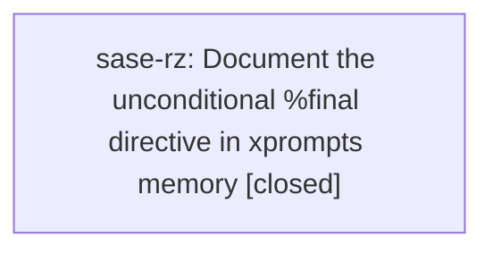

# Bead: sase-rz — Document the unconditional %final directive in xprompts memory

[Bead Pages](../README.md) / sase-rz

**Status:** ✓ closed · **Resolution:** done · **Type:** ◆ task · **Task type:** ▤ memory
**Owner:** `bryanbugyi34@gmail.com` · **Created by:** [bbugyi200.athena.sase-rr.land--1](https://github.com/sase-org/sase--agents/blob/main/families/bbugyi200.athena.sase-rr.land.md) · **Assignee:** `sase-rz` · **Size:** small
**Created:** 2026-08-21 19:53:08 UTC · **Closed:** 2026-08-22 16:43:25 UTC

<!-- sase:links:start -->

## Links

| Relation | Artifact | Why |
| --- | --- | --- |
| related | [bead:sase-jy][1] | Prior xprompts-memory directive repair in the same table; different directive and root cause. |
| related | [bead:sase-rr][2] | The retiring-finalizers plan surfaced this protected-memory follow-up and defines the now-unconditional contract to document. |

[1]: https://github.com/sase-org/sase--beads/blob/main/pages/sase-jy/README.md
[2]: https://github.com/sase-org/sase--beads/blob/main/pages/sase-rr/README.md

<!-- sase:links:end -->

## Description

PROPOSED BY epic bead sase-rr through the linked retire_pluggable_finalizers plan landing instructions. The audited sase/memory/xprompts.md directive table omits %final entirely, while sase-rr made finalizer selection and /sase_final unconditional and updated the ordinary public docs and generated skill source. This protected memory note was explicitly excluded from the epic because memory edits require direct user approval. Scope: add the complete repeatable %final selector syntax (including none, removal, dependencies, and required-instance semantics as appropriate) to the Directives section, reconcile the stale provider-neutral commit-finalizer wording below it with the shipped host-owned finalizer protocol, and run sase memory init after receiving approval.

---

\## Memory update

- **Path:** `xprompts.md`

Add the shipped unconditional %final directive syntax and reconcile the stale finalizer workflow wording; regenerate derived memory/provider shims with sase memory init after explicit approval.

## Notes

[2026-08-22T16:43:25Z · sase-rz] Added the repeatable %final selector syntax (none, !name, add, required instances, configured after-order) to the xprompts.md Directives section and replaced the stale provider-neutral /sase_git_commit wording with the host-owned /sase_final plus sase stitch create protocol. Ran sase memory init --no-commit; sase memory init --check reports no drift; audited sase memory read contains the new %final contract and no provider-neutral /sase_git_commit wording; git diff --check passes; just check passed fmt, keep-sorted, ruff, mypy, feature flags, pyscripts, test-waits, changelog, terminology, symvision, toobig, SASE validation, committed plans, and scoped tests.

## Lineage

## Agents

| Agent | Bead | Commits |
|---|---|---:|
| [bbugyi200.athena.sase-rz](https://github.com/sase-org/sase--agents/blob/main/agents/bbugyi200.athena.sase-rz/README.md) | [sase-rz](README.md) | 1 |

## Commits

| Repo | Commit | Subject | Bead | Committed |
|---|---|---|---|---|
| sase | [`b351ceb`](https://github.com/sase-org/sase/commit/b351ceb33e3b06f294fec1ecea5fd370d8087fc9) | docs(memory): document the unconditional %final directive | [sase-rz](README.md) | 2026-08-22 16:45:38 UTC |
