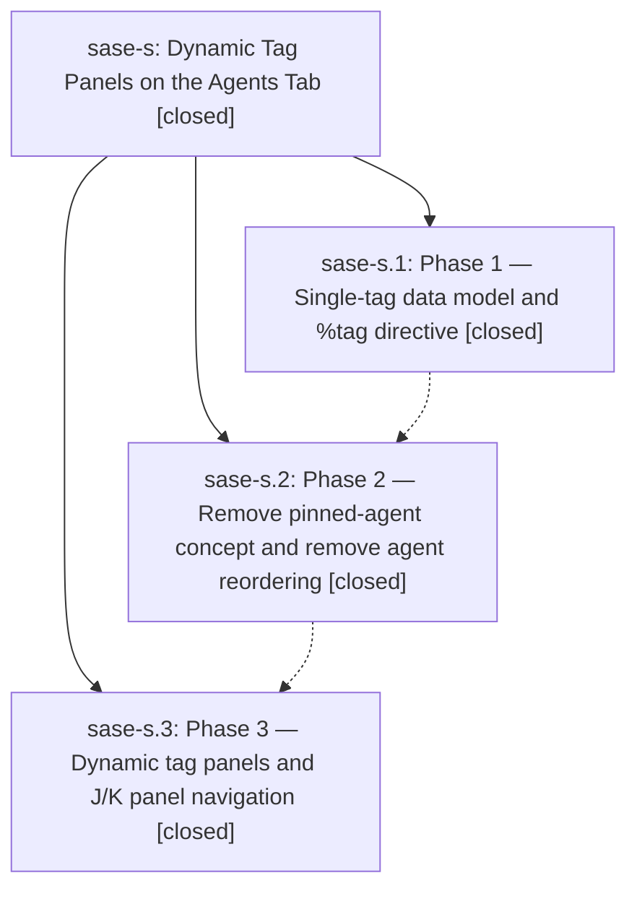

# Bead: sase-s — Dynamic Tag Panels on the Agents Tab

[Bead Pages](../README.md) / sase-s

**Status:** ✓ closed · **Resolution:** (unrecorded) · **Type:** plan · **Tier:** epic
**Owner:** `bryanbugyi34@gmail.com`
**Created:** 2026-04-25 22:55:37 UTC · **Closed:** 2026-04-26 00:33:07 UTC
**Plan:** [202604/dynamic\_tag\_panels.md](https://github.com/sase-org/sase--plans/blob/main/202604/dynamic_tag_panels.md)

## Phases

| Bead | Title | Status | Size | Agents | Commits |
|---|---|---|---|---:|---:|
| [sase-s.1](sase-s.1.md) | Phase 1 — Single-tag data model and %tag directive | ✓ closed | small | 0 | 1 |
| [sase-s.2](sase-s.2.md) | Phase 2 — Remove pinned-agent concept and remove agent reordering | ✓ closed | small | 0 | 1 |
| [sase-s.3](sase-s.3.md) | Phase 3 — Dynamic tag panels and J/K panel navigation | ✓ closed | small | 0 | 1 |

## Lineage

## Commits

| Commit | Subject | Bead | Committed (UTC) |
|---|---|---|---|
| [`f3ee769`](https://github.com/sase-org/sase/commit/f3ee769b93eefca3fd4c229cea3f700b136db167) | feat: phase 1 single-tag data model and %tag directive (sase-s.1) | [sase-s.1](sase-s.1.md) | 2026-04-25 23:19:29 |
| [`d68ef67`](https://github.com/sase-org/sase/commit/d68ef67a0d3a8530a655d8e8df6d863442af4018) | feat: phase 2 remove pinned-agent concept and agent reordering (sase-s.2) | [sase-s.2](sase-s.2.md) | 2026-04-25 23:56:50 |
| [`5bf25bb`](https://github.com/sase-org/sase/commit/5bf25bbed600c263b01227da772e2ef4525c7591) | feat: phase 3 dynamic tag panels and J/K panel navigation (sase-s.3) | [sase-s.3](sase-s.3.md) | 2026-04-26 00:29:34 |
