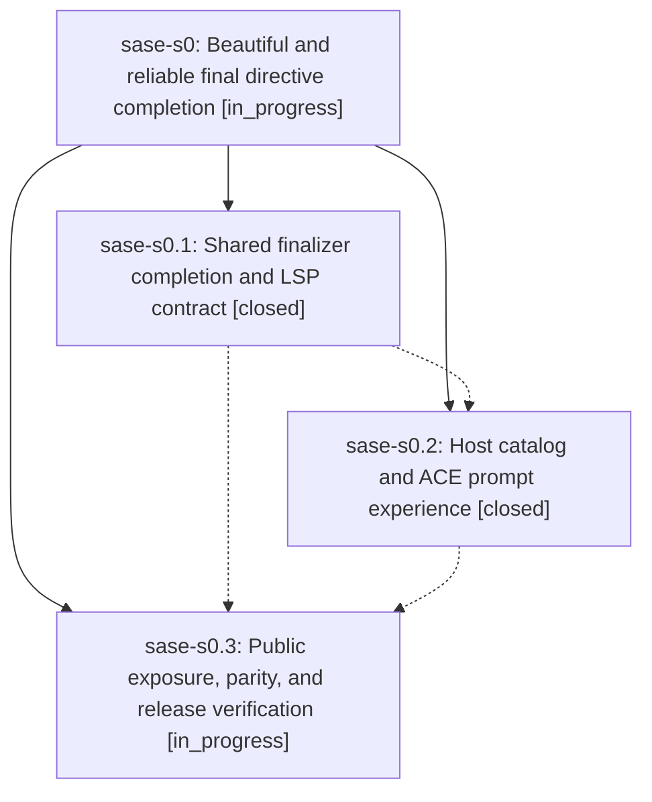

# Bead: sase-s0 — Beautiful and reliable final directive completion

[Bead Pages](../README.md) / sase-s0

**Status:** ◐ in_progress · **Type:** ▸ plan · **Tier:** epic
**Owner:** `bryanbugyi34@gmail.com` · **Created by:** [bbugyi200.athena.sase-rr.land.w1](https://github.com/sase-org/sase--agents/blob/main/families/bbugyi200.athena.sase-rr.land.w1.md) · **Assignee:** `sase-s0.land`
**Created:** 2026-08-21 20:34:58 UTC
**Plan:** [202608/final\_directive\_completion.md](https://github.com/sase-org/sase--plans/blob/main/202608/final_directive_completion.md)

## Description

The %final directive is easy to discover and safely completes configured finalizer selectors in ACE and external LSP editors, with shared semantics, responsive catalogs, clear policy metadata, and polished presentation.

## Phases

| Bead | Title | Status | Size | Created | Agents | Commits |
|---|---|---|---|---|---:|---:|
| [sase-s0.1](sase-s0.1.md) | Shared finalizer completion and LSP contract | ✓ closed | medium | 2026-08-21 | 1 | 1 |
| [sase-s0.2](sase-s0.2.md) | Host catalog and ACE prompt experience | ✓ closed | medium | 2026-08-21 | 1 | 1 |
| [sase-s0.3](sase-s0.3.md) | Public exposure, parity, and release verification | ◐ in_progress | small | 2026-08-21 | 1 | 0 |

## Lineage

## Agents

| Agent | Bead | Commits |
|---|---|---:|
| [bbugyi200.athena.sase-s0.1](https://github.com/sase-org/sase--agents/blob/main/agents/bbugyi200.athena.sase-s0.1/README.md) | [sase-s0.1](sase-s0.1.md) | 1 |
| [bbugyi200.athena.sase-s0.2](https://github.com/sase-org/sase--agents/blob/main/agents/bbugyi200.athena.sase-s0.2/README.md) | [sase-s0.2](sase-s0.2.md) | 1 |
| [bbugyi200.athena.sase-s0.3](https://github.com/sase-org/sase--agents/blob/main/agents/bbugyi200.athena.sase-s0.3/README.md) | [sase-s0.3](sase-s0.3.md) | 0 |
| [bbugyi200.athena.sase-s0.land](https://github.com/sase-org/sase--agents/blob/main/agents/bbugyi200.athena.sase-s0.land/README.md) | [sase-s0](README.md) | 0 |

## Commits

| Repo | Commit | Subject | Bead | Committed |
|---|---|---|---|---|
| sase-core | [`sase-core@0ec9bbe`](https://github.com/sase-org/sase-core/commit/0ec9bbe6b74024c454953d0deb7d4ebd5410cecf) | feat(editor): add finalizer catalog completion and LSP contract | [sase-s0.1](sase-s0.1.md) | 2026-08-21 20:57:47 UTC |
| sase | [`f88c9ed`](https://github.com/sase-org/sase/commit/f88c9eded9ea9b6395415d27ecd4a9babb5c970c) | feat(completion): add host %final catalog and ACE argument completion | [sase-s0.2](sase-s0.2.md) | 2026-08-21 21:46:53 UTC |
