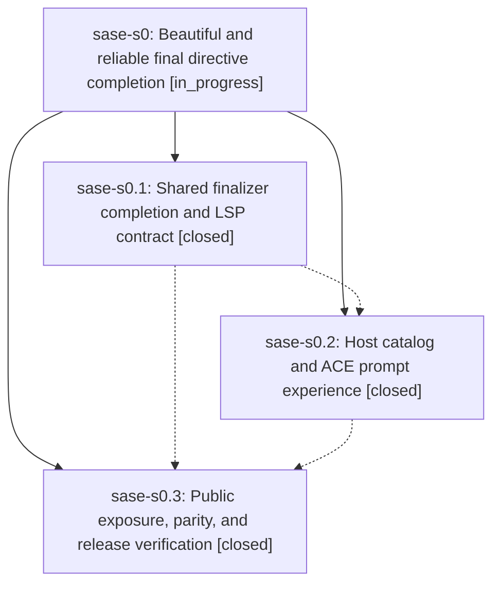

# Bead: sase-s0 — Beautiful and reliable final directive completion

[Bead Pages](../README.md) / sase-s0

**Status:** ◐ in_progress · **Type:** ▸ plan · **Tier:** epic
**Owner:** `bryanbugyi34@gmail.com` · **Created by:** [bbugyi200.athena.sase-rr.land.w1](https://github.com/sase-org/sase--agents/blob/main/families/bbugyi200.athena.sase-rr.land.w1.md) · **Assignee:** `sase-s0.land`
**Created:** 2026-08-21 20:34:58 UTC
**Plan:** [202608/final\_directive\_completion.md](https://github.com/sase-org/sase--plans/blob/main/202608/final_directive_completion.md)

## Description

The %final directive is easy to discover and safely completes configured finalizer selectors in ACE and external LSP editors, with shared semantics, responsive catalogs, clear policy metadata, and polished presentation.

## Notes

[2026-08-21T23:31:46Z · sase-s0.land--3] VERIFIED: tale plan:202608/final_directive_parity_completion.md is implemented. sase-core LSP snippet tests now positively assert public %final plus %final:${1:instance} and %final(${1:instance}, ${2:instance}) with clause-local edits. sase parity harness covers public %final, shared catalog, ACE warm inventory, helper-bridge schema-v1, add/remove/none/docs/UTF-16, and failure degradation; helper payloads live in tests/_xprompt_directive_completion_parity_helpers.py so toobig stays under 1000 lines (parity file 835). ACE Ctrl-T panel test updated because public %final pushed %model off the visible page.

Combined-tree gates: just check-full fail-fast on pre-existing lint (feature flags) sase-ro / pluggable_finalizers; remaining lint green including toobig. just test: 2 failed / 35933 passed / 11 skipped, both pre-existing (sase-iv contract-manifest budget, sase-rv skills inventory). just test-visual: 347 failed / 434 passed / 1 skipped; both finalizer PNG nodes passed. The 347 are standing ACE header-chrome golden drift, corroborated on sase-r5 (+9); not rebaselined (sase-lo).

## Phases

| Bead | Title | Status | Size | Created | Agents | Commits |
|---|---|---|---|---|---:|---:|
| [sase-s0.1](sase-s0.1.md) | Shared finalizer completion and LSP contract | ✓ closed | medium | 2026-08-21 | 1 | 1 |
| [sase-s0.2](sase-s0.2.md) | Host catalog and ACE prompt experience | ✓ closed | medium | 2026-08-21 | 1 | 1 |
| [sase-s0.3](sase-s0.3.md) | Public exposure, parity, and release verification | ✓ closed | small | 2026-08-21 | 1 | 2 |

## Lineage

## Agents

| Agent | Bead | Commits |
|---|---|---:|
| [bbugyi200.athena.sase-s0.1](https://github.com/sase-org/sase--agents/blob/main/agents/bbugyi200.athena.sase-s0.1/README.md) | [sase-s0.1](sase-s0.1.md) | 1 |
| [bbugyi200.athena.sase-s0.2](https://github.com/sase-org/sase--agents/blob/main/agents/bbugyi200.athena.sase-s0.2/README.md) | [sase-s0.2](sase-s0.2.md) | 1 |
| [bbugyi200.athena.sase-s0.3](https://github.com/sase-org/sase--agents/blob/main/agents/bbugyi200.athena.sase-s0.3/README.md) | [sase-s0.3](sase-s0.3.md) | 2 |
| [bbugyi200.athena.sase-s0.land](https://github.com/sase-org/sase--agents/blob/main/families/bbugyi200.athena.sase-s0.land.md) | [sase-s0](README.md) | 2 |

## Commits

| Repo | Commit | Subject | Bead | Committed |
|---|---|---|---|---|
| sase-core | [`sase-core@0ec9bbe`](https://github.com/sase-org/sase-core/commit/0ec9bbe6b74024c454953d0deb7d4ebd5410cecf) | feat(editor): add finalizer catalog completion and LSP contract | [sase-s0.1](sase-s0.1.md) | 2026-08-21 20:57:47 UTC |
| sase | [`f88c9ed`](https://github.com/sase-org/sase/commit/f88c9eded9ea9b6395415d27ecd4a9babb5c970c) | feat(completion): add host %final catalog and ACE argument completion | [sase-s0.2](sase-s0.2.md) | 2026-08-21 21:46:53 UTC |
| sase | [`f618be6`](https://github.com/sase-org/sase/commit/f618be6a809dc0f13a62a2a0e8fba8ac26adc2af) | feat(completion): expose final directive completions | [sase-s0.3](sase-s0.3.md) | 2026-08-21 22:11:28 UTC |
| sase-core | [`sase-core@eca4d68`](https://github.com/sase-org/sase-core/commit/eca4d688a8efd66fdec512499d31c838aa294699) | feat(editor): expose final directive completion | [sase-s0.3](sase-s0.3.md) | 2026-08-21 22:13:56 UTC |
| sase | [`6ee4e1d`](https://github.com/sase-org/sase/commit/6ee4e1d3d26c35d3641de2e267f9297d94b236e1) | test(completion): cover ACE and LSP %final completion parity | [sase-s0](README.md) | 2026-08-21 23:36:51 UTC |
| sase-core | [`sase-core@82a5e4a`](https://github.com/sase-org/sase-core/commit/82a5e4a4331b6ec42760291e93706ce4d20df60c) | test(editor): expect final directive name and snippet completions | [sase-s0](README.md) | 2026-08-21 23:37:45 UTC |
