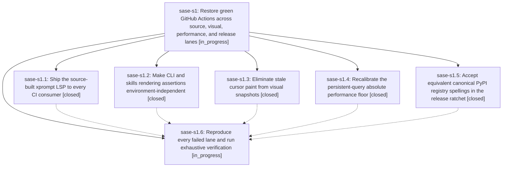

# Bead: sase-s1 — Restore green GitHub Actions across source, visual, performance, and release lanes

[Bead Pages](../README.md) / sase-s1

**Status:** ◐ in_progress · **Type:** ▸ plan · **Tier:** epic
**Owner:** `bryanbugyi34@gmail.com` · **Created by:** [bbugyi200.athena.0al](https://github.com/sase-org/sase--agents/blob/main/families/bbugyi200.athena.0al.md) · **Assignee:** `sase-s1.land`
**Created:** 2026-08-22 12:30:18 UTC
**Plan:** [202608/restore\_github\_actions.md](https://github.com/sase-org/sase--plans/blob/main/202608/restore_github_actions.md)

## Description

GitHub Actions uses complete source-built Rust artifacts, portable test assertions, deterministic visual cursor normalization, evidence-based performance floors, and safe release-lock source validation so every currently failing SASE lane passes without weakening product contracts or accepting unintended generated changes.

## Notes

[2026-08-22T12:54:44Z · 0am] DISCOVERED ISSUE: During move_final_declaration_to_memory verification on 2026-08-22, just check after just install escalated to the full suite (rules: core-identity-changed; 14 xdist workers, 35969 items) and failed two already-owned groups: (1) 28 tests/test_xprompt_directive_completion_parity.py and tests/test_xprompt_finalizer_completion_parity.py nodes because .venv/bin/sase-xprompt-lsp is missing after just install — this is sase-s1.1. (2) tests/main/test_skills_handler.py::test_skills_inventory_reports_retired_deletion_drift because Console(width=160) truncated the full xdist tmp SKILL.md path; serial rerun on the same tree passed (1 passed in 4.35s) — exact duplicate of ready flake sase-rv and in sase-s1.2 portable skills-rendering scope. Local diff moves /sase_final guidance into generated memory and does not touch LSP packaging or skills inventory rendering. Corroborated sase-rv; no standalone task created.

## Phases

| Bead | Title | Status | Size | Created | Agents | Commits |
|---|---|---|---|---|---:|---:|
| [sase-s1.1](sase-s1.1.md) | Ship the source-built xprompt LSP to every CI consumer | ✓ closed | medium | 2026-08-22 | 1 | 1 |
| [sase-s1.2](sase-s1.2.md) | Make CLI and skills rendering assertions environment-independent | ✓ closed | small | 2026-08-22 | 1 | 1 |
| [sase-s1.3](sase-s1.3.md) | Eliminate stale cursor paint from visual snapshots | ✓ closed | medium | 2026-08-22 | 1 | 1 |
| [sase-s1.4](sase-s1.4.md) | Recalibrate the persistent-query absolute performance floor | ✓ closed | small | 2026-08-22 | 1 | 1 |
| [sase-s1.5](sase-s1.5.md) | Accept equivalent canonical PyPI registry spellings in the release ratchet | ✓ closed | small | 2026-08-22 | 1 | 1 |
| [sase-s1.6](sase-s1.6.md) | Reproduce every failed lane and run exhaustive verification | ◐ in_progress | medium | 2026-08-22 | 1 | 0 |

## Lineage

## Agents

| Agent | Bead | Commits |
|---|---|---:|
| [bbugyi200.athena.sase-s1.1](https://github.com/sase-org/sase--agents/blob/main/agents/bbugyi200.athena.sase-s1.1/README.md) | [sase-s1.1](sase-s1.1.md) | 1 |
| [bbugyi200.athena.sase-s1.2](https://github.com/sase-org/sase--agents/blob/main/agents/bbugyi200.athena.sase-s1.2/README.md) | [sase-s1.2](sase-s1.2.md) | 1 |
| [bbugyi200.athena.sase-s1.3](https://github.com/sase-org/sase--agents/blob/main/families/bbugyi200.athena.sase-s1.3.md) | [sase-s1.3](sase-s1.3.md) | 1 |
| [bbugyi200.athena.sase-s1.4](https://github.com/sase-org/sase--agents/blob/main/agents/bbugyi200.athena.sase-s1.4/README.md) | [sase-s1.4](sase-s1.4.md) | 1 |
| [bbugyi200.athena.sase-s1.5](https://github.com/sase-org/sase--agents/blob/main/agents/bbugyi200.athena.sase-s1.5/README.md) | [sase-s1.5](sase-s1.5.md) | 1 |
| [bbugyi200.athena.sase-s1.6](https://github.com/sase-org/sase--agents/blob/main/agents/bbugyi200.athena.sase-s1.6/README.md) | [sase-s1.6](sase-s1.6.md) | 0 |
| [bbugyi200.athena.sase-s1.land](https://github.com/sase-org/sase--agents/blob/main/agents/bbugyi200.athena.sase-s1.land/README.md) | [sase-s1](README.md) | 0 |

## Commits

| Repo | Commit | Subject | Bead | Committed |
|---|---|---|---|---|
| sase | [`0438e70`](https://github.com/sase-org/sase/commit/0438e70e702480279e4a9b40b309e695cc65f009) | test(perf): recalibrate persistent-query absolute floor | [sase-s1.4](sase-s1.4.md) | 2026-08-22 13:06:45 UTC |
| sase | [`fd1e42e`](https://github.com/sase-org/sase/commit/fd1e42e972918b3b64329083bf9484f921f560f5) | ci: ship xprompt lsp core artifact | [sase-s1.1](sase-s1.1.md) | 2026-08-22 13:19:09 UTC |
| sase | [`c718da9`](https://github.com/sase-org/sase/commit/c718da9119cf8dccf4a2719a8ce6717991f1ebd1) | fix(release): normalize canonical PyPI lock sources | [sase-s1.5](sase-s1.5.md) | 2026-08-22 13:22:48 UTC |
| sase | [`b05d2d5`](https://github.com/sase-org/sase/commit/b05d2d5bfd33209dea439a79cd68ccd99a83fc38) | test(cli): make help and skills assertions environment-independent | [sase-s1.2](sase-s1.2.md) | 2026-08-22 13:25:33 UTC |
| sase | [`e52cc27`](https://github.com/sase-org/sase/commit/e52cc27d8a3db54fb5340f25e475f40f2665ad09) | test(ace): clear stale TextArea caret cache in visual snapshots | [sase-s1.3](sase-s1.3.md) | 2026-08-22 13:33:00 UTC |
