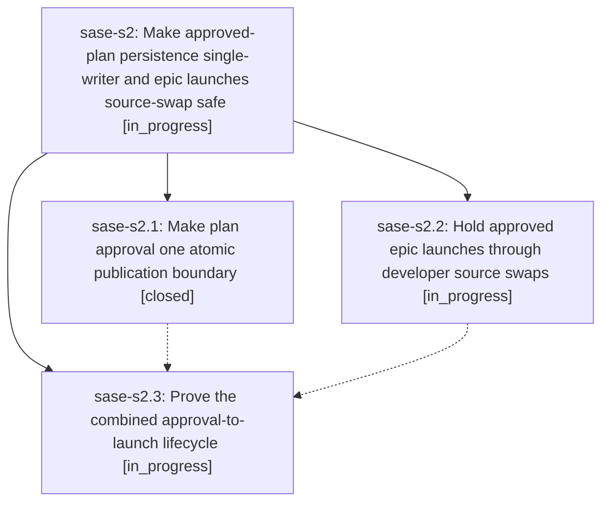

# Bead: sase-s2 — Make approved-plan persistence single-writer and epic launches source-swap safe

[Bead Pages](../README.md) / sase-s2

**Status:** ◐ in_progress · **Type:** ▸ plan · **Tier:** epic
**Owner:** `bryanbugyi34@gmail.com` · **Created by:** [bbugyi200.athena.0an](https://github.com/sase-org/sase--agents/blob/main/families/bbugyi200.athena.0an.md) · **Assignee:** `sase-s2.land`
**Created:** 2026-08-22 12:48:35 UTC
**Plan:** [202608/plan\_approval\_launch\_reliability.md](https://github.com/sase-org/sase--plans/blob/main/202608/plan_approval_launch_reliability.md)

## Description

Approved tales produce exactly one canonical plan commit before their runner resumes, artifact-link finalization cannot be poisoned by a competing plan writer, and an approved epic waits safely through an in-progress developer update instead of ending as a failed launch with no work started.

## Phases

| Bead | Title | Status | Size | Created | Agents | Commits |
|---|---|---|---|---|---:|---:|
| [sase-s2.1](sase-s2.1.md) | Make plan approval one atomic publication boundary | ✓ closed | medium | 2026-08-22 | 1 | 1 |
| [sase-s2.2](sase-s2.2.md) | Hold approved epic launches through developer source swaps | ◐ in_progress | medium | 2026-08-22 | 1 | 0 |
| [sase-s2.3](sase-s2.3.md) | Prove the combined approval-to-launch lifecycle | ◐ in_progress | small | 2026-08-22 | 1 | 0 |

## Lineage

## Agents

| Agent | Bead | Commits |
|---|---|---:|
| [bbugyi200.athena.sase-s2.1](https://github.com/sase-org/sase--agents/blob/main/agents/bbugyi200.athena.sase-s2.1/README.md) | [sase-s2.1](sase-s2.1.md) | 1 |
| [bbugyi200.athena.sase-s2.2](https://github.com/sase-org/sase--agents/blob/main/agents/bbugyi200.athena.sase-s2.2/README.md) | [sase-s2.2](sase-s2.2.md) | 0 |
| [bbugyi200.athena.sase-s2.3](https://github.com/sase-org/sase--agents/blob/main/agents/bbugyi200.athena.sase-s2.3/README.md) | [sase-s2.3](sase-s2.3.md) | 0 |
| [bbugyi200.athena.sase-s2.land](https://github.com/sase-org/sase--agents/blob/main/agents/bbugyi200.athena.sase-s2.land/README.md) | [sase-s2](README.md) | 0 |

## Commits

| Repo | Commit | Subject | Bead | Committed |
|---|---|---|---|---|
| sase | [`209375b`](https://github.com/sase-org/sase/commit/209375b22e8a90f5fa46e2d5e5e4ea5deec7f170) | fix(plan): publish archives before approval responses | [sase-s2.1](sase-s2.1.md) | 2026-08-22 13:22:44 UTC |
