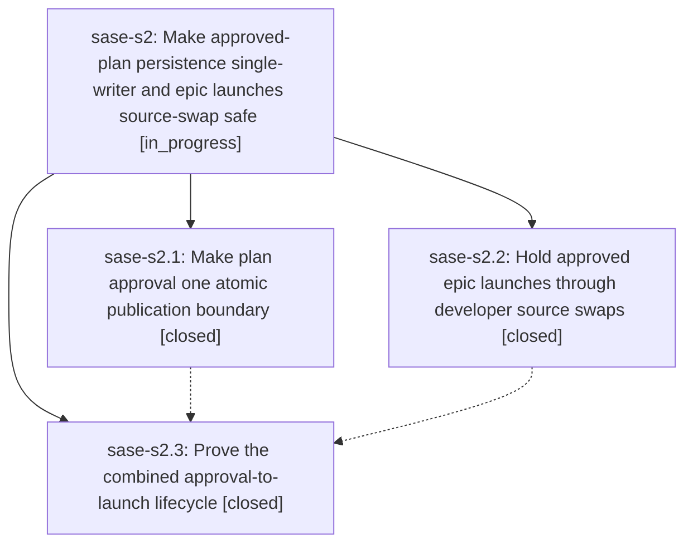

# Bead: sase-s2 — Make approved-plan persistence single-writer and epic launches source-swap safe

[Bead Pages](../README.md) / sase-s2

**Status:** ◐ in_progress · **Type:** ▸ plan · **Tier:** epic
**Owner:** `bryanbugyi34@gmail.com` · **Created by:** [bbugyi200.athena.0an](https://github.com/sase-org/sase--agents/blob/main/families/bbugyi200.athena.0an.md) · **Assignee:** `sase-s2.land`
**Created:** 2026-08-22 12:48:35 UTC
**Plan:** [202608/plan\_approval\_launch\_reliability.md](https://github.com/sase-org/sase--plans/blob/main/202608/plan_approval_launch_reliability.md)

## Description

Approved tales produce exactly one canonical plan commit before their runner resumes, artifact-link finalization cannot be poisoned by a competing plan writer, and an approved epic waits safely through an in-progress developer update instead of ending as a failed launch with no work started.

## Notes

[2026-08-22T14:07:06Z · 0ax] DISCOVERED ISSUE: During group_wait_dependency_indicators verification on 2026-08-22, just check escalated to the full suite (rules: core-identity-changed) and deterministically failed the plan-approval gate/action cluster. Focused rerun of tests/test_gate_e2e_smoke.py::test_e2e_tale_plan_gate_structure_and_branches and tests/test_plan_auto_approval.py::test_handle_plan_approval_auto_approve failed again on the unchanged tree: approving with commit raises GateError / PlanApprovalActionError because archive_approved_plan cannot resolve a project from host_action_data keys [bundle_path, original_plan_file, plan_tier, request_id, request_kind, response_dir, session_id]. Local diff only changes ACE WAITING row wait-count presentation/docs/tests and one visual golden, not plan approval, gate execution, or archive project resolution. This is causally related to this epic current approved-plan persistence/lifecycle proof scope.

## Phases

| Bead | Title | Status | Size | Created | Agents | Commits |
|---|---|---|---|---|---:|---:|
| [sase-s2.1](sase-s2.1.md) | Make plan approval one atomic publication boundary | ✓ closed | medium | 2026-08-22 | 1 | 1 |
| [sase-s2.2](sase-s2.2.md) | Hold approved epic launches through developer source swaps | ✓ closed | medium | 2026-08-22 | 0 | 1 |
| [sase-s2.3](sase-s2.3.md) | Prove the combined approval-to-launch lifecycle | ✓ closed | small | 2026-08-22 | 1 | 1 |

## Lineage

## Agents

| Agent | Bead | Commits |
|---|---|---:|
| [bbugyi200.athena.sase-s2.1](https://github.com/sase-org/sase--agents/blob/main/agents/bbugyi200.athena.sase-s2.1/README.md) | [sase-s2.1](sase-s2.1.md) | 1 |
| [bbugyi200.athena.sase-s2.3](https://github.com/sase-org/sase--agents/blob/main/families/bbugyi200.athena.sase-s2.3.md) | [sase-s2.3](sase-s2.3.md) | 1 |
| [bbugyi200.athena.sase-s2.land](https://github.com/sase-org/sase--agents/blob/main/agents/bbugyi200.athena.sase-s2.land/README.md) | [sase-s2](README.md) | 0 |

## Commits

| Repo | Commit | Subject | Bead | Committed |
|---|---|---|---|---|
| sase | [`209375b`](https://github.com/sase-org/sase/commit/209375b22e8a90f5fa46e2d5e5e4ea5deec7f170) | fix(plan): publish archives before approval responses | [sase-s2.1](sase-s2.1.md) | 2026-08-22 13:22:44 UTC |
| sase | [`f8a0dd8`](https://github.com/sase-org/sase/commit/f8a0dd8585d364db9c0f92fcb676f4f6c951c367) | feat: Hold approved epic launches through developer source swaps (sase-s2.2) | [sase-s2.2](sase-s2.2.md) | 2026-08-22 13:51:00 UTC |
| sase | [`62538c4`](https://github.com/sase-org/sase/commit/62538c4b0c5fbe8bafb786e0e51e52b3f086975e) | test(plan): prove combined approval-to-launch lifecycle (sase-s2.3) | [sase-s2.3](sase-s2.3.md) | 2026-08-22 15:10:43 UTC |
