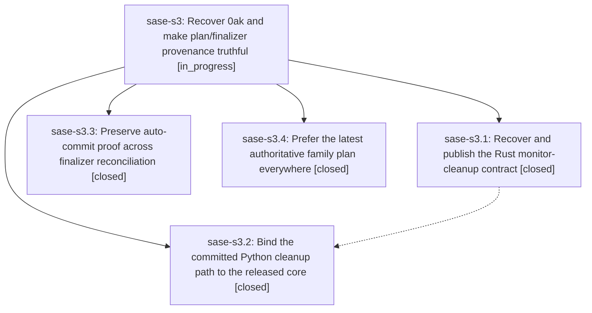

# Bead: sase-s3 — Recover 0ak and make plan/finalizer provenance truthful

[Bead Pages](../README.md) / sase-s3

**Status:** ◐ in_progress · **Type:** ▸ plan · **Tier:** epic
**Owner:** `bryanbugyi34@gmail.com` · **Created by:** [bbugyi200.athena.0av](https://github.com/sase-org/sase--agents/blob/main/families/bbugyi200.athena.0av.md) · **Assignee:** `sase-s3.land`
**Created:** 2026-08-22 13:57:32 UTC
**Plan:** [202608/0ak\_failure\_recovery.md](https://github.com/sase-org/sase--plans/blob/main/202608/0ak_failure_recovery.md)

## Description

The approved monitor-kill lifecycle is complete on a released Rust core, commit finalization recognizes its own reconciliation commits, and every family surface shows the latest authoritative plan.

## Phases

| Bead | Title | Status | Size | Created | Agents | Commits |
|---|---|---|---|---|---:|---:|
| [sase-s3.1](sase-s3.1.md) | Recover and publish the Rust monitor-cleanup contract | ✓ closed | medium | 2026-08-22 | 1 | 2 |
| [sase-s3.2](sase-s3.2.md) | Bind the committed Python cleanup path to the released core | ✓ closed | medium | 2026-08-22 | 1 | 1 |
| [sase-s3.3](sase-s3.3.md) | Preserve auto-commit proof across finalizer reconciliation | ✓ closed | small | 2026-08-22 | 1 | 1 |
| [sase-s3.4](sase-s3.4.md) | Prefer the latest authoritative family plan everywhere | ✓ closed | small | 2026-08-22 | 1 | 1 |

## Lineage

## Agents

| Agent | Bead | Commits |
|---|---|---:|
| [bbugyi200.athena.sase-s3.1](https://github.com/sase-org/sase--agents/blob/main/agents/bbugyi200.athena.sase-s3.1/README.md) | [sase-s3.1](sase-s3.1.md) | 2 |
| [bbugyi200.athena.sase-s3.2](https://github.com/sase-org/sase--agents/blob/main/families/bbugyi200.athena.sase-s3.2.md) | [sase-s3.2](sase-s3.2.md) | 1 |
| [bbugyi200.athena.sase-s3.3](https://github.com/sase-org/sase--agents/blob/main/agents/bbugyi200.athena.sase-s3.3/README.md) | [sase-s3.3](sase-s3.3.md) | 1 |
| [bbugyi200.athena.sase-s3.4](https://github.com/sase-org/sase--agents/blob/main/agents/bbugyi200.athena.sase-s3.4/README.md) | [sase-s3.4](sase-s3.4.md) | 1 |
| [bbugyi200.athena.sase-s3.land](https://github.com/sase-org/sase--agents/blob/main/agents/bbugyi200.athena.sase-s3.land/README.md) | [sase-s3](README.md) | 0 |

## Commits

| Repo | Commit | Subject | Bead | Committed |
|---|---|---|---|---|
| sase-core | [`sase-core@c7447f0`](https://github.com/sase-org/sase-core/commit/c7447f03d3094fbbaf9b67973f04baf76662bd63) | feat(agent-cleanup)!: add monitor cleanup side effects | [sase-s3.1](sase-s3.1.md) | 2026-08-22 14:10:31 UTC |
| sase | [`e674ffc`](https://github.com/sase-org/sase/commit/e674ffc6f2cbced56e60088eaf51c1a08619999c) | fix(ace): prefer latest family plan previews | [sase-s3.4](sase-s3.4.md) | 2026-08-22 14:41:23 UTC |
| sase | [`cf72b00`](https://github.com/sase-org/sase/commit/cf72b00d1885113147072a501473d3ab0eb3829d) | fix(finalizers): prove auto-commits with pre-reconciliation ledger | [sase-s3.3](sase-s3.3.md) | 2026-08-22 14:54:26 UTC |
| sase-core | [`sase-core@7e1d09b`](https://github.com/sase-org/sase-core/commit/7e1d09b4f68c34324ba5cf7b6100ead7cf2cc8ff) | feat(agent-cleanup)!: add monitor cleanup side effects | [sase-s3.1](sase-s3.1.md) | 2026-08-22 14:55:50 UTC |
| sase | [`959d559`](https://github.com/sase-org/sase/commit/959d55926de21dc2106a65d943fb3e8e268d1f3b) | feat: raise sase-core-rs floor to 0.30.0 | [sase-s3.2](sase-s3.2.md) | 2026-08-22 16:03:33 UTC |
