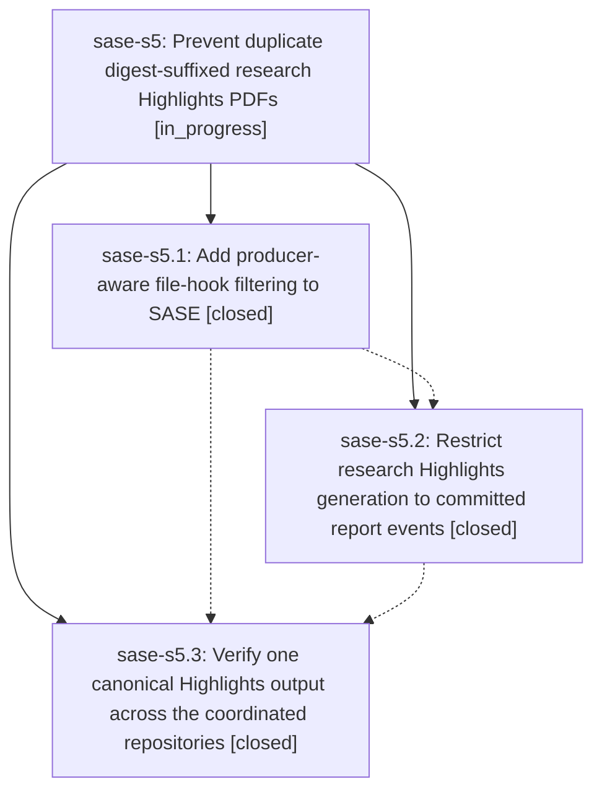

# Bead: sase-s5 — Prevent duplicate digest-suffixed research Highlights PDFs

[Bead Pages](../README.md) / sase-s5

**Status:** ◐ in_progress · **Type:** ▸ plan · **Tier:** epic
**Owner:** `bryanbugyi34@gmail.com` · **Created by:** [bbugyi200.athena.0b7](https://github.com/sase-org/sase--agents/blob/main/families/bbugyi200.athena.0b7.md) · **Assignee:** `sase-s5.land`
**Created:** 2026-08-22 17:48:12 UTC
**Plan:** [202608/file\_hook\_producer\_filter.md](https://github.com/sase-org/sase--plans/blob/main/202608/file_hook_producer_filter.md)

## Description

Each newly added consolidated research report invokes Bob exactly once from its canonical checkout path, producing only the intended basename while preserving artifact durability and existing file-hook behavior by default.

## Phases

| Bead | Title | Status | Size | Created | Agents | Commits |
|---|---|---|---|---|---:|---:|
| [sase-s5.1](sase-s5.1.md) | Add producer-aware file-hook filtering to SASE | ✓ closed | medium | 2026-08-22 | 1 | 1 |
| [sase-s5.2](sase-s5.2.md) | Restrict research Highlights generation to committed report events | ✓ closed | small | 2026-08-22 | 1 | 1 |
| [sase-s5.3](sase-s5.3.md) | Verify one canonical Highlights output across the coordinated repositories | ✓ closed | small | 2026-08-22 | 1 | 1 |

## Lineage

## Agents

| Agent | Bead | Commits |
|---|---|---:|
| [bbugyi200.athena.sase-s5.1](https://github.com/sase-org/sase--agents/blob/main/agents/bbugyi200.athena.sase-s5.1/README.md) | [sase-s5.1](sase-s5.1.md) | 1 |
| [bbugyi200.athena.sase-s5.2](https://github.com/sase-org/sase--agents/blob/main/agents/bbugyi200.athena.sase-s5.2/README.md) | [sase-s5.2](sase-s5.2.md) | 1 |
| [bbugyi200.athena.sase-s5.3](https://github.com/sase-org/sase--agents/blob/main/agents/bbugyi200.athena.sase-s5.3/README.md) | [sase-s5.3](sase-s5.3.md) | 1 |
| [bbugyi200.athena.sase-s5.land](https://github.com/sase-org/sase--agents/blob/main/agents/bbugyi200.athena.sase-s5.land/README.md) | [sase-s5](README.md) | 0 |

## Commits

| Repo | Commit | Subject | Bead | Committed |
|---|---|---|---|---|
| sase | [`740df45`](https://github.com/sase-org/sase/commit/740df4518679807b4e8667b71f85d72cbdd0245d) | feat(file-hooks): add producer-aware file-hook filtering | [sase-s5.1](sase-s5.1.md) | 2026-08-22 18:15:09 UTC |
| sase-research-artifacts | [`sase-research-artifacts@a045047`](https://github.com/sase-org/sase-research-artifacts/commit/a045047c76cdd2b762171f8b62a34490839aace8) | fix(provider): restrict research highlights producers | [sase-s5.2](sase-s5.2.md) | 2026-08-22 18:28:45 UTC |
| sase | [`176247a`](https://github.com/sase-org/sase/commit/176247aa0d9aee43fb1b3b7b8e9c3db988437806) | test(file-hooks): prove research-highlights runs once on the canonical path | [sase-s5.3](sase-s5.3.md) | 2026-08-22 18:50:53 UTC |
