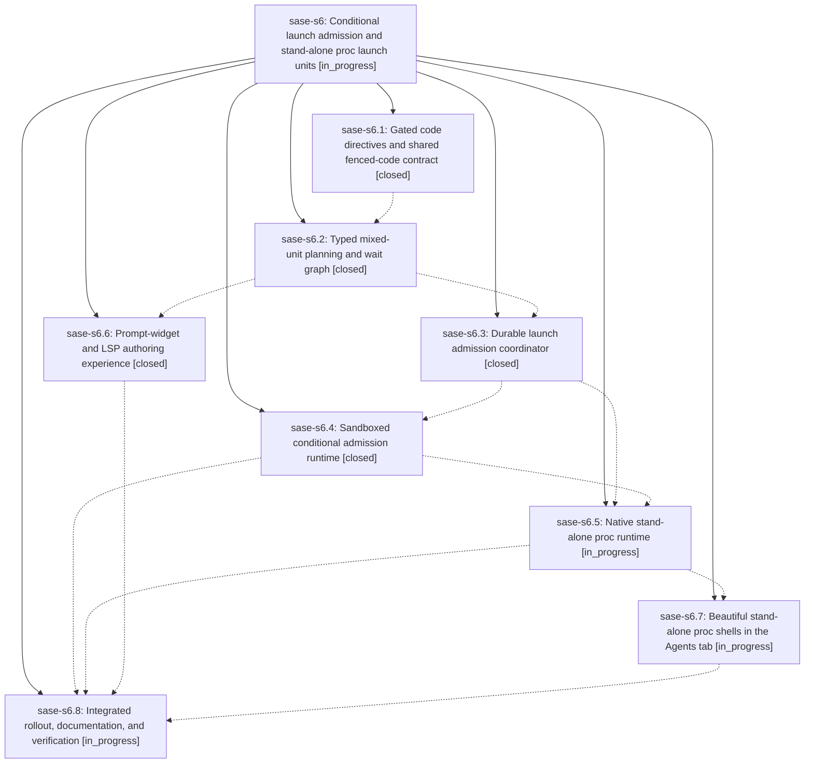

# Bead: sase-s6 — Conditional launch admission and stand-alone proc launch units

[Bead Pages](../README.md) / sase-s6

**Status:** ◐ in_progress · **Type:** ▸ plan · **Tier:** epic
**Owner:** `bryanbugyi34@gmail.com` · **Created by:** [bbugyi200.athena.0b8](https://github.com/sase-org/sase--agents/blob/main/families/bbugyi200.athena.0b8.md) · **Assignee:** `sase-s6.land`
**Created:** 2026-08-22 18:14:56 UTC
**Plan:** [202608/typed\_launch\_units.md](https://github.com/sase-org/sase--plans/blob/main/202608/typed_launch_units.md)

## Description

SASE accepts typed Agent and stand-alone Proc launch units with durable %if admission, first-class %proc execution, shared prompt-widget and LSP authoring assistance, and an attractive Agents-tab proc-shell experience without conflating procs with agents.

## Phases

| Bead | Title | Status | Size | Created | Agents | Commits |
|---|---|---|---|---|---:|---:|
| [sase-s6.1](sase-s6.1.md) | Gated code directives and shared fenced-code contract | ✓ closed | medium | 2026-08-22 | 1 | 2 |
| [sase-s6.2](sase-s6.2.md) | Typed mixed-unit planning and wait graph | ✓ closed | medium | 2026-08-22 | 1 | 2 |
| [sase-s6.3](sase-s6.3.md) | Durable launch admission coordinator | ✓ closed | medium | 2026-08-22 | 1 | 2 |
| [sase-s6.4](sase-s6.4.md) | Sandboxed conditional admission runtime | ✓ closed | medium | 2026-08-22 | 1 | 1 |
| [sase-s6.5](sase-s6.5.md) | Native stand-alone proc runtime | ◐ in_progress | medium | 2026-08-22 | 1 | 0 |
| [sase-s6.6](sase-s6.6.md) | Prompt-widget and LSP authoring experience | ✓ closed | medium | 2026-08-22 | 1 | 1 |
| [sase-s6.7](sase-s6.7.md) | Beautiful stand-alone proc shells in the Agents tab | ◐ in_progress | medium | 2026-08-22 | 1 | 0 |
| [sase-s6.8](sase-s6.8.md) | Integrated rollout, documentation, and verification | ◐ in_progress | medium | 2026-08-22 | 1 | 0 |

## Lineage

## Agents

| Agent | Bead | Commits |
|---|---|---:|
| [bbugyi200.athena.sase-s6.1](https://github.com/sase-org/sase--agents/blob/main/agents/bbugyi200.athena.sase-s6.1/README.md) | [sase-s6.1](sase-s6.1.md) | 2 |
| [bbugyi200.athena.sase-s6.2](https://github.com/sase-org/sase--agents/blob/main/agents/bbugyi200.athena.sase-s6.2/README.md) | [sase-s6.2](sase-s6.2.md) | 2 |
| [bbugyi200.athena.sase-s6.3](https://github.com/sase-org/sase--agents/blob/main/agents/bbugyi200.athena.sase-s6.3/README.md) | [sase-s6.3](sase-s6.3.md) | 2 |
| [bbugyi200.athena.sase-s6.4](https://github.com/sase-org/sase--agents/blob/main/agents/bbugyi200.athena.sase-s6.4/README.md) | [sase-s6.4](sase-s6.4.md) | 1 |
| [bbugyi200.athena.sase-s6.5](https://github.com/sase-org/sase--agents/blob/main/agents/bbugyi200.athena.sase-s6.5/README.md) | [sase-s6.5](sase-s6.5.md) | 0 |
| [bbugyi200.athena.sase-s6.6](https://github.com/sase-org/sase--agents/blob/main/agents/bbugyi200.athena.sase-s6.6/README.md) | [sase-s6.6](sase-s6.6.md) | 1 |
| [bbugyi200.athena.sase-s6.7](https://github.com/sase-org/sase--agents/blob/main/agents/bbugyi200.athena.sase-s6.7/README.md) | [sase-s6.7](sase-s6.7.md) | 0 |
| [bbugyi200.athena.sase-s6.8](https://github.com/sase-org/sase--agents/blob/main/agents/bbugyi200.athena.sase-s6.8/README.md) | [sase-s6.8](sase-s6.8.md) | 0 |
| [bbugyi200.athena.sase-s6.land](https://github.com/sase-org/sase--agents/blob/main/agents/bbugyi200.athena.sase-s6.land/README.md) | [sase-s6](README.md) | 0 |

## Commits

| Repo | Commit | Subject | Bead | Committed |
|---|---|---|---|---|
| sase | [`316dd82`](https://github.com/sase-org/sase/commit/316dd8265f6ba79da9cac3099b19819858acde9e) | feat(xprompt): add gated typed\_launch\_units fenced-code contract | [sase-s6.1](sase-s6.1.md) | 2026-08-22 19:22:47 UTC |
| sase-core | [`sase-core@a38ec1a`](https://github.com/sase-org/sase-core/commit/a38ec1ab37fcce9f2fadaae4872467e1851902a6) | feat(editor): add CodeValue, fence scanner, and gated if/proc | [sase-s6.1](sase-s6.1.md) | 2026-08-22 19:24:36 UTC |
| sase | [`5c9fb7d`](https://github.com/sase-org/sase/commit/5c9fb7d07b43c0a72d2f2a74e0adfbe241989cfd) | feat(agent-launch): add typed launch plan facade | [sase-s6.2](sase-s6.2.md) | 2026-08-22 20:45:41 UTC |
| sase-core | [`sase-core@c2ddb5f`](https://github.com/sase-org/sase-core/commit/c2ddb5ffee963e24eb3e865999d047d7fd480c27) | feat(agent-launch): plan typed launch units | [sase-s6.2](sase-s6.2.md) | 2026-08-22 20:47:15 UTC |
| sase | [`383f349`](https://github.com/sase-org/sase/commit/383f34956a3f3f0f462429bce7cbffad4d17ff82) | feat(agent-launch): persist typed launch admission after approval | [sase-s6.3](sase-s6.3.md) | 2026-08-22 21:45:11 UTC |
| sase-core | [`sase-core@818c6ed`](https://github.com/sase-org/sase-core/commit/818c6ed590fc2bf6b51944a8fd07ab842226065b) | feat(agent-launch): plan durable admission journal actions | [sase-s6.3](sase-s6.3.md) | 2026-08-22 21:47:39 UTC |
| sase | [`057e0bb`](https://github.com/sase-org/sase/commit/057e0bbacd6170a49c254421a548ab0925978649) | feat(xprompt): surface directive recipe completions | [sase-s6.6](sase-s6.6.md) | 2026-08-22 22:23:22 UTC |
| sase | [`13266fd`](https://github.com/sase-org/sase/commit/13266fdcaea9f420917478ced04a12d072036246) | feat(agent-launch): evaluate sandboxed %if admission predicates | [sase-s6.4](sase-s6.4.md) | 2026-08-22 22:39:53 UTC |
