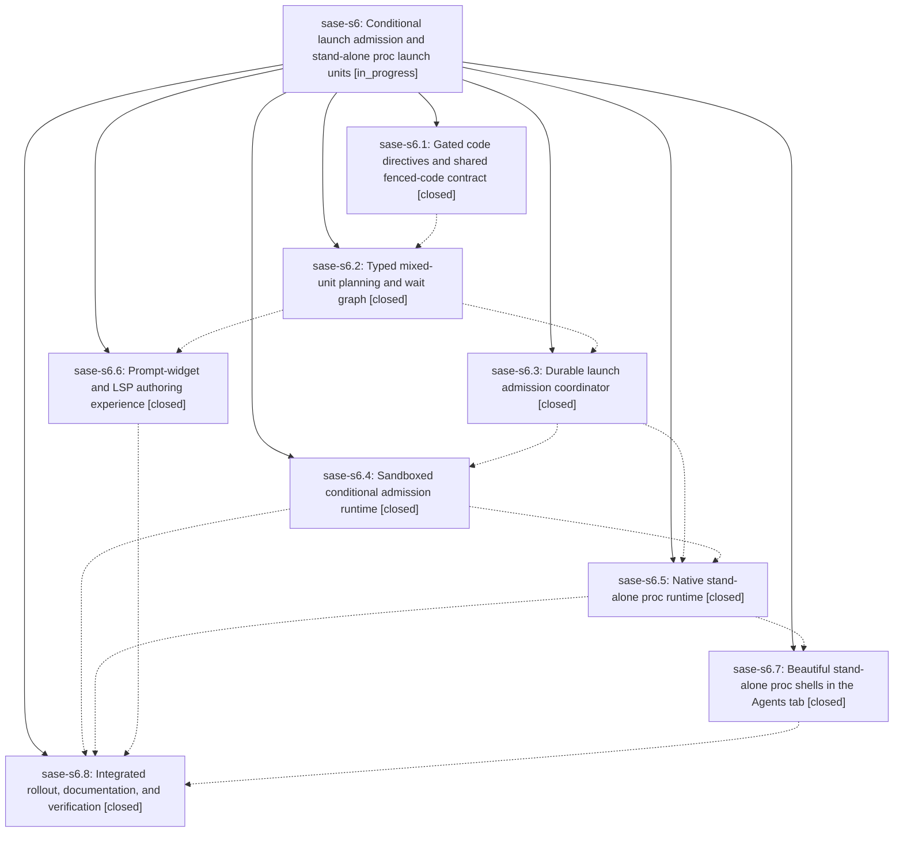

# Bead: sase-s6 — Conditional launch admission and stand-alone proc launch units

[Bead Pages](../README.md) / sase-s6

**Status:** ◐ in_progress · **Type:** ▸ plan · **Tier:** epic
**Owner:** `bryanbugyi34@gmail.com` · **Created by:** [bbugyi200.athena.0b8](https://github.com/sase-org/sase--agents/blob/main/families/bbugyi200.athena.0b8.md) · **Assignee:** `sase-s6.land`
**Created:** 2026-08-22 14:14:56 EDT
**Plan:** [202608/typed\_launch\_units.md](https://github.com/sase-org/sase--plans/blob/main/202608/typed_launch_units.md)

## Description

SASE accepts typed Agent and stand-alone Proc launch units with durable %if admission, first-class %proc execution, shared prompt-widget and LSP authoring assistance, and an attractive Agents-tab proc-shell experience without conflating procs with agents.

## Notes

[2026-08-23T08:43:29Z · root] DISCOVERED ISSUE: During unrelated dev-update lock verification on 2026-08-23 at HEAD a5193276b, the required just install rebuilt sase_core_rs from linked sase-core 92a4fc4 (0.31.4) but left .venv/bin/sase-xprompt-lsp at 0.31.2 (mtime 2026-08-22 15:50). just check-full then failed exactly three tests/test_xprompt_directive_completion_parity.py nodes, and the same three failed serially. The %wait parity diff lacks agent=/proc=/unit= rows from this epic's typed-launch contract; the local commit only changes dev-update code-swap locking. just rust-dev-install .venv is the immediate environment repair because it refreshes both the binding and LSP. This belongs to the active integrated rollout/verification rather than a new standalone task.

[2026-08-23T12:07:50Z · 0bm] DISCOVERED ISSUE: At HEAD afe374f93 with typed_launch_units enabled, the ACE prompt #gh:sase %proc("echo hello && sleep 20 && world") creates an AGENT SHELL, strips the proc directive/body, and invokes the LLM with an empty prompt. The pure typed planner correctly classifies that exact prompt as one ProcUnit, so Rust parsing/classification and native proc dispatch are not the failing layer. Root cause: src/sase/main/query_handler/_launch.py routes direct operator launches (non-SASE_AGENT, including ACE and direct sase run) straight to legacy launch_agents_from_cwd; typed planning/admission is attached only by create_launch_approval_request_from_prompt for LaunchApproval. docs/configuration.md explicitly documents this direct-path limitation, but it contradicts sase-s6 acceptance requiring enabled-state ACE/CLI execution. The fix should give direct user launches a durable typed-admission bundle/path, preserve legacy/force-reuse compatibility when no typed directive is present, resolve the selected project from the submitted VCS ref/current context correctly, and emit proc-aware durable run results so ACE refreshes Proc/Agents projections without requiring AgentLaunchResult rows. A validated tale plan will follow.

[2026-08-23T12:16:07Z · 0bf] DISCOVERED ISSUE: While implementing the unrelated configured_timezone_audit plan on 2026-08-23 at HEAD afe374f93, just check's lint (mypy) gate fails with 20 name-defined/no-redef errors in src/sase/agent/launch_admission.py. Reproduction: .venv/bin/mypy src/sase/agent/launch_admission.py (or just check / just _lint-mypy). Confirmed not caused by my tree via git stash on clean HEAD -- identical 20 errors. Root cause: commit 9a63ac5d6 (refactor(agent): split launch_admission into focused sibling modules, a SASE_TYPE=stitch toobig split-file commit under this epic) moved code into launch_admission_engine.py/_runtime.py/_store.py but left launch_admission.py referencing LaunchUnitWire, AgentLaunchResult, AgentUnitWire, agent_unit_dispatch_prompt, ProcUnitWire, LaunchPlanWire, LaunchRequestError, and launch_plan_from_dict without importing them from their new homes, plus a duplicate _format_admission_summary definition (lines 265 and 328) left behind by the split. Impact: every agent's just check/just check-full is red at the mypy gate regardless of their own diff until this lands. Scope: re-add the missing imports (trace each symbol to its new sibling module) and remove the duplicate _format_admission_summary. I did not attempt the fix myself since I don't have full context on the intended post-split import surface.

[2026-08-23T12:18:13Z · 0bk] DISCOVERED ISSUE: During unrelated agents_tree_depth_colors implementation on 2026-08-23, just check fails at fmt (python) on HEAD afe374f93 before any other gate. Reproduction: just fmt-py-check (or .venv/bin/ruff format --check src/ tests/). The only unformatted file is src/sase/agent/launch_admission.py: hanging-indent sibling imports, a backslash continuation, and a missing blank line before _evaluate_launch_condition. Confirmed not caused by my tree (git status does not list that file). Rerunning the same command is identically red, so this is a true format failure, not a flake. Root cause is the same sase-s6 split/rollout as 0bf's mypy DISCOVERED ISSUE on this file: commit 9a63ac5d6 split launch_admission, then afe374f93 (sase-s6.8) landed the hanging-indent imports. Impact: every agent's just check is red at fmt regardless of their own diff until ruff format is applied to that file (and 0bf's missing-import/duplicate-def mypy errors are also still standing). Scope: run ruff format on src/sase/agent/launch_admission.py; do not mix that with Agents-tab tree-color work.

[2026-08-23T12:21:29Z · 0bk] DISCOVERED ISSUE (same file, extra lint): after fmt, just _lint-symvision also fails on src/sase/agent/launch_admission.py unused private functions left by the split: _all_terminal, _call_proc_dispatcher, _dispatch_agent_unit, _evaluate_launch_condition, _request_safe_inputs, _request_source_cwd, _stop_proc_identity, _typed_plan_from_request, _unit. Confirmed not caused by Agents-tab tree-color work.

[2026-08-23T12:28:45Z · 0bf--1] DISCOVERED ISSUE: While running the full suite (just test) after implementing the unrelated configured_timezone_audit plan at HEAD afe374f93, tests/test_launch_admission_mixed_matrix.py::test_plan_digest_mismatch_is_rejected fails with 'DID NOT RAISE LaunchRequestError'. Reproduction: .venv/bin/python -m pytest tests/test_launch_admission_mixed_matrix.py::test_plan_digest_mismatch_is_rejected -x -v. Confirmed not caused by my tree: my working-tree diff to src/sase/agent/launch_admission.py is cosmetic import-reformatting only (ruff/isort reflow), no logic changes. Root cause: same sase-s6 split as 0bf's/0bk's DISCOVERED ISSUE notes on this bead -- commit 9a63ac5d6 (refactor(agent): split launch_admission into focused sibling modules) moved typed_plan_from_request() into src/sase/agent/launch_admission_engine.py (now at line 382) but dropped the plan_digest mismatch validation during the move. dispatch_typed_launch_request() in src/sase/agent/launch_admission.py calls this engine version (lines 71 and 115). The dropped check (raise LaunchRequestError('plan_digest_mismatch', 'plan_digest', ...) when data['plan_digest'] != plan.content_digest) survives only in the dead, unused sibling function _typed_plan_from_request() at src/sase/agent/launch_admission.py:274-290 -- the same function 0bk's symvision DISCOVERED ISSUE note already flags as unused-private left over from the split. Impact: approved-launch plan digest validation is silently bypassed -- a request whose plan_digest does not match typed_plan.content_digest is accepted instead of rejected, so a tampered or stale typed_plan could be dispatched without detection. Scope: port the digest-mismatch check from the dead launch_admission.py:_typed_plan_from_request into launch_admission_engine.py:typed_plan_from_request (or call the same validation helper from both), then delete the dead sibling function per 0bk's symvision note. I did not attempt the fix myself since it is unrelated to my task.

[2026-08-23T12:38:12Z · 0bk] DISCOVERED ISSUE (tests): unrelated agents_tree_depth_colors just test-scoped escalated full-suite on 2026-08-23: 36203 passed, 5 failed, all in this epic's typed-launch surface and none in Agents-tab tree rendering. Failures: tests/test_xprompt_directive_completion_parity.py::test_ace_and_lsp_directive_name_rows_match; test_ace_and_lsp_include_typed_launch_directives_when_enabled; test_ace_and_lsp_directive_argument_rows_match[%wait(]; test_failure_degradation_retains_static_directive_rows; tests/test_launch_admission_mixed_matrix.py::test_plan_digest_mismatch_is_rejected. Matches the earlier LSP 0.31.2 vs sase-core 0.31.4 parity note plus leftover launch_admission split breakage.

[2026-08-23T12:47:37Z · 0bn] DISCOVERED ISSUE: During unrelated family_monitor_phase_order implementation on 2026-08-23 at HEAD 1dd58f06c, just check fails at lint (mypy) with 20 name-defined/no-redef errors in src/sase/agent/launch_admission.py. Reproduction: just check or .venv/bin/mypy src/sase/agent/launch_admission.py. Confirmed not caused by my tree: git status lists only family-projection/docs/test files; mypy on those four files is clean. Independent corroboration of 0bf's DISCOVERED ISSUE on this bead — the leftover post-split helpers still reference LaunchUnitWire, AgentLaunchResult, AgentUnitWire, agent_unit_dispatch_prompt, ProcUnitWire, LaunchPlanWire, LaunchRequestError, and launch_plan_from_dict without imports, plus a duplicate _format_admission_summary (lines 265 and 328). Same failure on a later SHA than 0bf's afe374f93 observation. I did not attempt the fix; it is out of scope for the family monitor phase-order tale.

[2026-08-23T13:00:48Z · 0bn] DISCOVERED ISSUE (tests, independent corroboration of 0bf--1): family_monitor_phase_order just test-scoped at HEAD 1dd58f06c escalated to the full suite and failed only tests/test_launch_admission_mixed_matrix.py::test_plan_digest_mismatch_is_rejected (DID NOT RAISE LaunchRequestError). 36220 passed, 13 skipped. Same leftover split: digest-mismatch validation lives in unused launch_admission.py:_typed_plan_from_request and is not called from launch_admission_engine.py:typed_plan_from_request. Not caused by the family-shell projection diff.

## Phases

| Bead | Title | Status | Size | Created | Agents | Commits |
|---|---|---|---|---|---:|---:|
| [sase-s6.1](sase-s6.1.md) | Gated code directives and shared fenced-code contract | ✓ closed | medium | 2026-08-22 | 1 | 2 |
| [sase-s6.2](sase-s6.2.md) | Typed mixed-unit planning and wait graph | ✓ closed | medium | 2026-08-22 | 1 | 2 |
| [sase-s6.3](sase-s6.3.md) | Durable launch admission coordinator | ✓ closed | medium | 2026-08-22 | 1 | 2 |
| [sase-s6.4](sase-s6.4.md) | Sandboxed conditional admission runtime | ✓ closed | medium | 2026-08-22 | 1 | 2 |
| [sase-s6.5](sase-s6.5.md) | Native stand-alone proc runtime | ✓ closed | medium | 2026-08-22 | 1 | 2 |
| [sase-s6.6](sase-s6.6.md) | Prompt-widget and LSP authoring experience | ✓ closed | medium | 2026-08-22 | 1 | 2 |
| [sase-s6.7](sase-s6.7.md) | Beautiful stand-alone proc shells in the Agents tab | ✓ closed | medium | 2026-08-22 | 1 | 1 |
| [sase-s6.8](sase-s6.8.md) | Integrated rollout, documentation, and verification | ✓ closed | medium | 2026-08-22 | 1 | 2 |

## Lineage

## Agents

| Agent | Bead | Commits |
|---|---|---:|
| [bbugyi200.athena.sase-s6.1](https://github.com/sase-org/sase--agents/blob/main/agents/bbugyi200.athena.sase-s6.1/README.md) | [sase-s6.1](sase-s6.1.md) | 2 |
| [bbugyi200.athena.sase-s6.2](https://github.com/sase-org/sase--agents/blob/main/agents/bbugyi200.athena.sase-s6.2/README.md) | [sase-s6.2](sase-s6.2.md) | 2 |
| [bbugyi200.athena.sase-s6.3](https://github.com/sase-org/sase--agents/blob/main/agents/bbugyi200.athena.sase-s6.3/README.md) | [sase-s6.3](sase-s6.3.md) | 2 |
| [bbugyi200.athena.sase-s6.4](https://github.com/sase-org/sase--agents/blob/main/agents/bbugyi200.athena.sase-s6.4/README.md) | [sase-s6.4](sase-s6.4.md) | 2 |
| [bbugyi200.athena.sase-s6.5](https://github.com/sase-org/sase--agents/blob/main/agents/bbugyi200.athena.sase-s6.5/README.md) | [sase-s6.5](sase-s6.5.md) | 2 |
| [bbugyi200.athena.sase-s6.6](https://github.com/sase-org/sase--agents/blob/main/agents/bbugyi200.athena.sase-s6.6/README.md) | [sase-s6.6](sase-s6.6.md) | 2 |
| [bbugyi200.athena.sase-s6.7](https://github.com/sase-org/sase--agents/blob/main/agents/bbugyi200.athena.sase-s6.7/README.md) | [sase-s6.7](sase-s6.7.md) | 1 |
| [bbugyi200.athena.sase-s6.8](https://github.com/sase-org/sase--agents/blob/main/families/bbugyi200.athena.sase-s6.8.md) | [sase-s6.8](sase-s6.8.md) | 0 |
| [bbugyi200.athena.sase-s6.land](https://github.com/sase-org/sase--agents/blob/main/agents/bbugyi200.athena.sase-s6.land/README.md) | [sase-s6](README.md) | 1 |

## Commits

| Repo | Commit | Subject | Bead | Committed |
|---|---|---|---|---|
| sase | [`316dd82`](https://github.com/sase-org/sase/commit/316dd8265f6ba79da9cac3099b19819858acde9e) | feat(xprompt): add gated typed\_launch\_units fenced-code contract | [sase-s6.1](sase-s6.1.md) | 2026-08-22 15:22:47 EDT |
| sase-core | [`sase-core@a38ec1a`](https://github.com/sase-org/sase-core/commit/a38ec1ab37fcce9f2fadaae4872467e1851902a6) | feat(editor): add CodeValue, fence scanner, and gated if/proc | [sase-s6.1](sase-s6.1.md) | 2026-08-22 15:24:36 EDT |
| sase | [`5c9fb7d`](https://github.com/sase-org/sase/commit/5c9fb7d07b43c0a72d2f2a74e0adfbe241989cfd) | feat(agent-launch): add typed launch plan facade | [sase-s6.2](sase-s6.2.md) | 2026-08-22 16:45:41 EDT |
| sase-core | [`sase-core@c2ddb5f`](https://github.com/sase-org/sase-core/commit/c2ddb5ffee963e24eb3e865999d047d7fd480c27) | feat(agent-launch): plan typed launch units | [sase-s6.2](sase-s6.2.md) | 2026-08-22 16:47:15 EDT |
| sase | [`383f349`](https://github.com/sase-org/sase/commit/383f34956a3f3f0f462429bce7cbffad4d17ff82) | feat(agent-launch): persist typed launch admission after approval | [sase-s6.3](sase-s6.3.md) | 2026-08-22 17:45:11 EDT |
| sase-core | [`sase-core@818c6ed`](https://github.com/sase-org/sase-core/commit/818c6ed590fc2bf6b51944a8fd07ab842226065b) | feat(agent-launch): plan durable admission journal actions | [sase-s6.3](sase-s6.3.md) | 2026-08-22 17:47:39 EDT |
| sase | [`057e0bb`](https://github.com/sase-org/sase/commit/057e0bbacd6170a49c254421a548ab0925978649) | feat(xprompt): surface directive recipe completions | [sase-s6.6](sase-s6.6.md) | 2026-08-22 18:23:22 EDT |
| sase-core | [`sase-core@cc28bc5`](https://github.com/sase-org/sase-core/commit/cc28bc5bdbec73a37c1d68d28f607f967ebd8da5) | feat(editor): expose directive recipe authoring contract | [sase-s6.6](sase-s6.6.md) | 2026-08-22 18:24:06 EDT |
| sase | [`13266fd`](https://github.com/sase-org/sase/commit/13266fdcaea9f420917478ced04a12d072036246) | feat(agent-launch): evaluate sandboxed %if admission predicates | [sase-s6.4](sase-s6.4.md) | 2026-08-22 18:39:53 EDT |
| sase-core | [`sase-core@e950120`](https://github.com/sase-org/sase-core/commit/e950120d8452608440028025f61c298d928c0cec) | feat(agent-launch): add sandboxed %if condition evaluator | [sase-s6.4](sase-s6.4.md) | 2026-08-22 18:44:01 EDT |
| sase | [`0f00bec`](https://github.com/sase-org/sase/commit/0f00becd749b533f850bf4a81d1cccbefe35b792) | feat(agent-launch): dispatch stand-alone %proc units natively | [sase-s6.5](sase-s6.5.md) | 2026-08-22 19:44:30 EDT |
| sase-core | [`sase-core@92a4fc4`](https://github.com/sase-org/sase-core/commit/92a4fc4bff40dad7e9960617da2df72a1fbf5807) | feat(agent-launch): add native %proc dispatch helpers | [sase-s6.5](sase-s6.5.md) | 2026-08-22 19:46:43 EDT |
| sase | [`a6a184f`](https://github.com/sase-org/sase/commit/a6a184fad0845f0a79e88aeff029a61432443002) | feat(ace): surface proc shells in agents tab | [sase-s6.7](sase-s6.7.md) | 2026-08-22 21:03:22 EDT |
| sase-core | [`sase-core@b39dfbf`](https://github.com/sase-org/sase-core/commit/b39dfbf976f596d257b413b064cac51dc9d08c2c) | fix: false invalid-if-form diagnostic (sase-s6.8) | [sase-s6.8](sase-s6.8.md) | 2026-08-23 07:07:41 EDT |
| sase | [`afe374f`](https://github.com/sase-org/sase/commit/afe374f93d474b03e817841b296ea51848a04af7) | doc: Integrated rollout, documentation, and verification  (sase-s6.8) | [sase-s6.8](sase-s6.8.md) | 2026-08-23 07:09:34 EDT |
| sase | [`0c648e0`](https://github.com/sase-org/sase/commit/0c648e0337e916cea611e7e2bff92c358d0137fc) | fix(ace): group stand-alone proc shells under their project | [sase-s6](README.md) | 2026-08-23 09:26:33 EDT |
