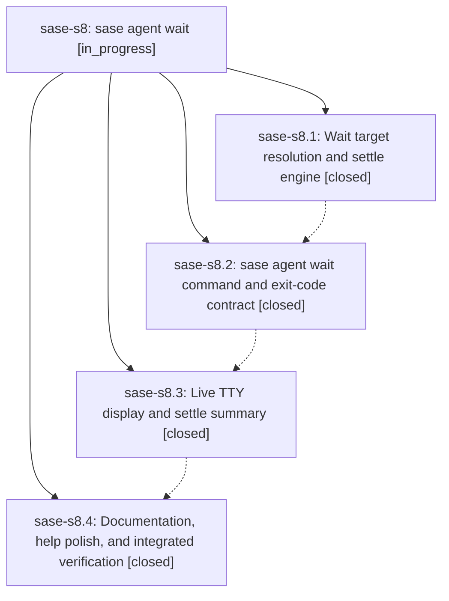

# Bead: sase-s8 — sase agent wait

[Bead Pages](../README.md) / sase-s8

**Status:** ◐ in_progress · **Type:** ▸ plan · **Tier:** epic
**Owner:** `bryanbugyi34@gmail.com` · **Created by:** [bbugyi200.athena.0bd](https://github.com/sase-org/sase--agents/blob/main/families/bbugyi200.athena.0bd.md) · **Assignee:** `sase-s8.land`
**Created:** 2026-08-23 07:39:39 EDT
**Plan:** [202608/agent\_wait\_command.md](https://github.com/sase-org/sase--plans/blob/main/202608/agent_wait_command.md)

## Description

`sase agent wait` blocks until named agents (or every agent running right now) reach a terminal state, reports each outcome with output good enough to act on, and exits non-zero when any target failed, is blocked on a human, or timed out.

## Notes

[2026-08-23T14:23:01Z · toobig-3l.split_file.tests.ace.tui.test_config_hub_pane.0] DISCOVERED ISSUE: During unrelated ConfigHubPane test-module split verification on 2026-08-23, just check fails at lint (mypy) before scoped tests. Reproduction: just check or .venv/bin/mypy. Error: src/sase/agent/wait_watch/__init__.py:11: Module "sase.agent.wait_watch._types" has no attribute "is_terminal_state"; maybe "_is_terminal_state"? [attr-defined]. The local diff only splits tests/ace/tui/test_config_hub_pane.py into smaller test modules and does not touch src/sase/agent/wait_watch. Inspection shows __init__.py re-exports is_terminal_state but _types.py defines only _is_terminal_state, while active epic sase-s8 owns the wait_watch surface and phase sase-s8.4 owns integrated verification. This is a deterministic mypy failure, not a flake, and blocks just check for unrelated agents until the export/helper mismatch is resolved.

[2026-08-23T14:37:16Z · 0bo.f0] DISCOVERED ISSUE: Independent corroboration of the wait_watch mypy failure already noted on this epic. During unrelated family_runtime_slash_spacing implementation on 2026-08-23 at HEAD 184fa9aed, just check failed at lint (mypy) before scoped tests: src/sase/agent/wait_watch/__init__.py:11 Module "sase.agent.wait_watch._types" has no attribute "is_terminal_state"; maybe "_is_terminal_state"? [attr-defined]. Reproduction: just check or .venv/bin/mypy. Confirmed not caused by my tree: git status lists only the family-runtime slash-spacing renderer, tests, docs, and two PNG goldens. Root cause is commit 184fa9aed itself renaming is_terminal_state to _is_terminal_state in _types.py while __init__.py still re-exports the public name and src/sase/agents/_wait_live_rows.py still imports is_terminal_state from sase.agent.wait_watch. Deterministic, not a flake. I did not fix it; it is out of scope for the slash-spacing tale.

## Phases

| Bead | Title | Status | Size | Created | Agents | Commits |
|---|---|---|---|---|---:|---:|
| [sase-s8.1](sase-s8.1.md) | Wait target resolution and settle engine | ✓ closed | medium | 2026-08-23 | 1 | 1 |
| [sase-s8.2](sase-s8.2.md) | sase agent wait command and exit-code contract | ✓ closed | medium | 2026-08-23 | 1 | 1 |
| [sase-s8.3](sase-s8.3.md) | Live TTY display and settle summary | ✓ closed | medium | 2026-08-23 | 1 | 1 |
| [sase-s8.4](sase-s8.4.md) | Documentation, help polish, and integrated verification | ✓ closed | small | 2026-08-23 | 1 | 1 |

## Lineage

## Agents

| Agent | Bead | Commits |
|---|---|---:|
| [bbugyi200.athena.sase-s8.1](https://github.com/sase-org/sase--agents/blob/main/agents/bbugyi200.athena.sase-s8.1/README.md) | [sase-s8.1](sase-s8.1.md) | 1 |
| [bbugyi200.athena.sase-s8.2](https://github.com/sase-org/sase--agents/blob/main/agents/bbugyi200.athena.sase-s8.2/README.md) | [sase-s8.2](sase-s8.2.md) | 1 |
| [bbugyi200.athena.sase-s8.3](https://github.com/sase-org/sase--agents/blob/main/agents/bbugyi200.athena.sase-s8.3/README.md) | [sase-s8.3](sase-s8.3.md) | 1 |
| [bbugyi200.athena.sase-s8.4](https://github.com/sase-org/sase--agents/blob/main/families/bbugyi200.athena.sase-s8.4.md) | [sase-s8.4](sase-s8.4.md) | 1 |
| [bbugyi200.athena.sase-s8.land](https://github.com/sase-org/sase--agents/blob/main/agents/bbugyi200.athena.sase-s8.land/README.md) | [sase-s8](README.md) | 0 |

## Commits

| Repo | Commit | Subject | Bead | Committed |
|---|---|---|---|---|
| sase | [`db4aeca`](https://github.com/sase-org/sase/commit/db4aecacb8848514825526bf890833f3460c390c) | feat(agent): add wait watch engine | [sase-s8.1](sase-s8.1.md) | 2026-08-23 08:10:25 EDT |
| sase | [`09ec5af`](https://github.com/sase-org/sase/commit/09ec5aff1ad0a38710ac48b0de830988db8073e4) | feat(agent): add sase agent wait CLI command | [sase-s8.2](sase-s8.2.md) | 2026-08-23 08:42:28 EDT |
| sase | [`4f32a6e`](https://github.com/sase-org/sase/commit/4f32a6ec75cc2bf14a77b98f4c15fb190741351c) | feat(agent): add live TTY panel for sase agent wait | [sase-s8.3](sase-s8.3.md) | 2026-08-23 09:42:36 EDT |
| sase | [`ab73c84`](https://github.com/sase-org/sase/commit/ab73c8498d1ccbaef92391d672e134ced27bd321) | docs(agent): document agent wait command | [sase-s8.4](sase-s8.4.md) | 2026-08-23 10:39:36 EDT |
