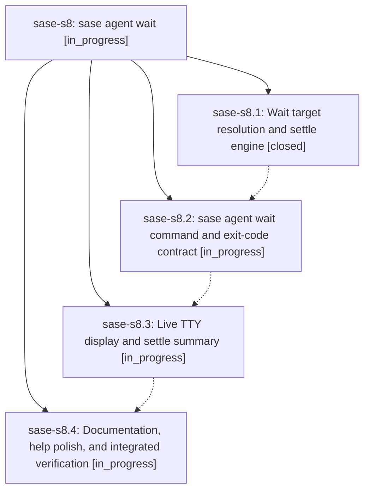

# Bead: sase-s8 — sase agent wait

[Bead Pages](../README.md) / sase-s8

**Status:** ◐ in_progress · **Type:** ▸ plan · **Tier:** epic
**Owner:** `bryanbugyi34@gmail.com` · **Created by:** [bbugyi200.athena.0bd](https://github.com/sase-org/sase--agents/blob/main/families/bbugyi200.athena.0bd.md) · **Assignee:** `sase-s8.land`
**Created:** 2026-08-23 07:39:39 EDT
**Plan:** [202608/agent\_wait\_command.md](https://github.com/sase-org/sase--plans/blob/main/202608/agent_wait_command.md)

## Description

`sase agent wait` blocks until named agents (or every agent running right now) reach a terminal state, reports each outcome with output good enough to act on, and exits non-zero when any target failed, is blocked on a human, or timed out.

## Phases

| Bead | Title | Status | Size | Created | Agents | Commits |
|---|---|---|---|---|---:|---:|
| [sase-s8.1](sase-s8.1.md) | Wait target resolution and settle engine | ✓ closed | medium | 2026-08-23 | 1 | 1 |
| [sase-s8.2](sase-s8.2.md) | sase agent wait command and exit-code contract | ◐ in_progress | medium | 2026-08-23 | 1 | 0 |
| [sase-s8.3](sase-s8.3.md) | Live TTY display and settle summary | ◐ in_progress | medium | 2026-08-23 | 1 | 0 |
| [sase-s8.4](sase-s8.4.md) | Documentation, help polish, and integrated verification | ◐ in_progress | small | 2026-08-23 | 1 | 0 |

## Lineage

## Agents

| Agent | Bead | Commits |
|---|---|---:|
| [bbugyi200.athena.sase-s8.1](https://github.com/sase-org/sase--agents/blob/main/agents/bbugyi200.athena.sase-s8.1/README.md) | [sase-s8.1](sase-s8.1.md) | 1 |
| [bbugyi200.athena.sase-s8.2](https://github.com/sase-org/sase--agents/blob/main/agents/bbugyi200.athena.sase-s8.2/README.md) | [sase-s8.2](sase-s8.2.md) | 0 |
| [bbugyi200.athena.sase-s8.3](https://github.com/sase-org/sase--agents/blob/main/agents/bbugyi200.athena.sase-s8.3/README.md) | [sase-s8.3](sase-s8.3.md) | 0 |
| [bbugyi200.athena.sase-s8.4](https://github.com/sase-org/sase--agents/blob/main/agents/bbugyi200.athena.sase-s8.4/README.md) | [sase-s8.4](sase-s8.4.md) | 0 |
| [bbugyi200.athena.sase-s8.land](https://github.com/sase-org/sase--agents/blob/main/agents/bbugyi200.athena.sase-s8.land/README.md) | [sase-s8](README.md) | 0 |

## Commits

| Repo | Commit | Subject | Bead | Committed |
|---|---|---|---|---|
| sase | [`db4aeca`](https://github.com/sase-org/sase/commit/db4aecacb8848514825526bf890833f3460c390c) | feat(agent): add wait watch engine | [sase-s8.1](sase-s8.1.md) | 2026-08-23 08:10:25 EDT |
