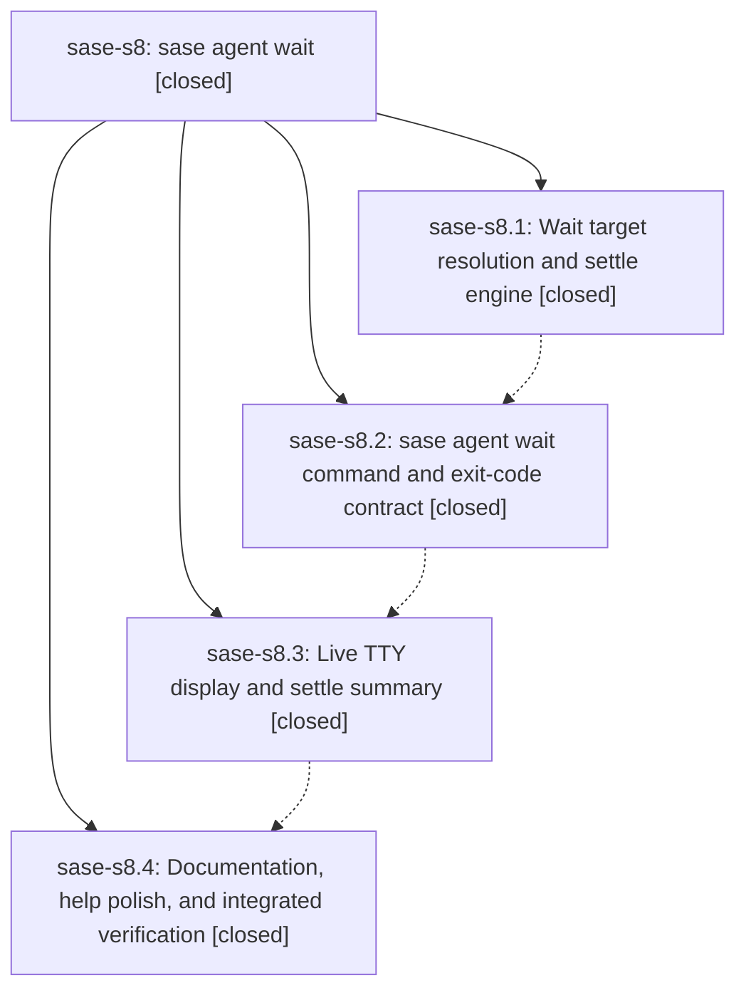

# Bead: sase-s8 — sase agent wait

[Bead Pages](../README.md) / sase-s8

**Status:** ✓ closed · **Resolution:** done · **Type:** ▸ plan · **Tier:** epic
**Owner:** `bryanbugyi34@gmail.com` · **Created by:** [bbugyi200.athena.0bd](https://github.com/sase-org/sase--agents/blob/main/families/bbugyi200.athena.0bd.md) · **Assignee:** `sase-s8.land`
**Created:** 2026-08-23 07:39:39 EDT · **Closed:** 2026-08-23 11:18:20 EDT
**Plan:** [202608/agent\_wait\_command.md](https://github.com/sase-org/sase--plans/blob/main/202608/agent_wait_command.md)

## Description

`sase agent wait` blocks until named agents (or every agent running right now) reach a terminal state, reports each outcome with output good enough to act on, and exits non-zero when any target failed, is blocked on a human, or timed out.

## Notes

[2026-08-23T14:23:01Z · toobig-3l.split_file.tests.ace.tui.test_config_hub_pane.0] DISCOVERED ISSUE: During unrelated ConfigHubPane test-module split verification on 2026-08-23, just check fails at lint (mypy) before scoped tests. Reproduction: just check or .venv/bin/mypy. Error: src/sase/agent/wait_watch/__init__.py:11: Module "sase.agent.wait_watch._types" has no attribute "is_terminal_state"; maybe "_is_terminal_state"? [attr-defined]. The local diff only splits tests/ace/tui/test_config_hub_pane.py into smaller test modules and does not touch src/sase/agent/wait_watch. Inspection shows __init__.py re-exports is_terminal_state but _types.py defines only _is_terminal_state, while active epic sase-s8 owns the wait_watch surface and phase sase-s8.4 owns integrated verification. This is a deterministic mypy failure, not a flake, and blocks just check for unrelated agents until the export/helper mismatch is resolved.

[2026-08-23T14:37:16Z · 0bo.f0] DISCOVERED ISSUE: Independent corroboration of the wait_watch mypy failure already noted on this epic. During unrelated family_runtime_slash_spacing implementation on 2026-08-23 at HEAD 184fa9aed, just check failed at lint (mypy) before scoped tests: src/sase/agent/wait_watch/__init__.py:11 Module "sase.agent.wait_watch._types" has no attribute "is_terminal_state"; maybe "_is_terminal_state"? [attr-defined]. Reproduction: just check or .venv/bin/mypy. Confirmed not caused by my tree: git status lists only the family-runtime slash-spacing renderer, tests, docs, and two PNG goldens. Root cause is commit 184fa9aed itself renaming is_terminal_state to _is_terminal_state in _types.py while __init__.py still re-exports the public name and src/sase/agents/_wait_live_rows.py still imports is_terminal_state from sase.agent.wait_watch. Deterministic, not a flake. I did not fix it; it is out of scope for the slash-spacing tale.

[2026-08-23T14:47:20Z · 0bo.f0] DISCOVERED ISSUE (tests, same wait_watch export): family_runtime_slash_spacing just test-scoped at HEAD 184fa9aed escalated to the full suite (core-identity-changed) and failed 2 tests + 3 collection errors, all wait_watch-related: ERROR tests/test_agent_wait_cli.py, tests/test_agent_wait_live.py, tests/test_agent_wait_watch.py ImportError cannot import name is_terminal_state from sase.agent.wait_watch._types; FAILED tests/main/test_agents_dispatch_handler.py::test_dispatch_wait AttributeError module sase.agents has no attribute cli_wait (cli_wait import dies on the same wait_watch export); FAILED tests/test_contract_manifest.py::test_contract_manifest_matches_marker_selection RuntimeError pytest -m contract --collect-only failed (exit 2) — collection error, not a stale-manifest mismatch, so not +1'd on sase-iu. 36304 passed. Local slash-spacing diff does not touch wait_watch.

[2026-08-23T15:04:20Z · 0bs] DISCOVERED ISSUE: Independent corroboration of the wait_watch mypy failure already on this epic. During unrelated home_task_types_note implementation on 2026-08-23, just check failed at lint (mypy) before scoped tests: src/sase/agent/wait_watch/__init__.py:11 Module "sase.agent.wait_watch._types" has no attribute "is_terminal_state"; maybe "_is_terminal_state"? [attr-defined]. Reproduction: just check or .venv/bin/mypy. Confirmed not caused by my tree: the local diff is init_memory/task_types/docs/tests around sase/memory/task_types.md only. I did not attempt the fix.

[2026-08-23T15:15:45Z · 0bu] DISCOVERED ISSUE: Independent corroboration of the wait_watch mypy failure already recorded on this epic. During unrelated finalization_bead_autoclose implementation on 2026-08-23, just check failed at lint (mypy) before scoped tests: src/sase/agent/wait_watch/__init__.py:11 Module "sase.agent.wait_watch._types" has no attribute "is_terminal_state"; maybe "_is_terminal_state"? [attr-defined]. Confirmed unrelated to this tree: git status lists only final declaration memory/skill docs, commit bead autoclose code/tests, CLI help, and generated memory/completion files; no wait_watch files are modified. Reproduction: just check or .venv/bin/mypy. I did not attempt the fix because active epic sase-s8 owns the wait_watch surface.

[2026-08-23T15:16:39Z · 0bt] DISCOVERED ISSUE: Independent corroboration of the wait_watch mypy failure during unrelated remove_legacy_commit_command implementation. just check fails at lint (mypy) before scoped tests: src/sase/agent/wait_watch/__init__.py:11 Module "sase.agent.wait_watch._types" has no attribute "is_terminal_state"; maybe "_is_terminal_state"? [attr-defined]. Reproduction: just check or .venv/bin/mypy. Confirmed not caused by this tree: git diff -- src/sase/agent/wait_watch/ is empty; HEAD 184fa9aed renamed the helper to _is_terminal_state while __init__.py still re-exports is_terminal_state. Changed files in this tale (stitch create parser/handler) are mypy-clean in isolation. I did not fix it; it belongs on epic sase-s8.

[2026-08-23T15:18:20Z · sase-s8.land] LANDED epic sase-s8 (`sase agent wait`). All four phases closed and verified against the
source and the epic's four commits.

VERIFIED (step 1):
- sase-s8.1 / db4aecacb: src/sase/agent/wait_watch/ exists as the presentation-neutral
  engine the plan specified (_types/_resolve/_classify/_watch), with no rich, argparse,
  or sys.exit. Classification runs off scan_agent_artifacts and reuses
  WAIT_SUCCESS_OUTCOMES / FAILURE_OUTCOMES / KNOWN_DONE_OUTCOMES and is_process_alive, so
  it cannot drift from the wait-checks chop. The commit also repaired the corrupted
  launch_admission.py import formatting the phase had reported as blocking.
- sase-s8.2 / 09ec5aff1: closed with no note ("agent forgot to close"), so I verified it
  from source. Subparser registered in parser_agent.py, dispatched from agent_handler.py
  to sase.agents.cli_wait.handle_agents_wait, -a/-i/-j/-p/-q/-t/-w all present and
  alphabetical, difflib did-you-mean on unknown names, tribe refusal, self/own-family
  refusal (_target_intersects_caller), and the duration parser lifted into the shared
  src/sase/core/cli_duration.py with monitor_handler.py migrated onto it rather than
  duplicated, exactly as the plan required.
- sase-s8.3 / 4f32a6ec7: _wait_render_live.py + _wait_live_rows.py deliver the Live panel,
  the why-column, terminal-blocker warnings, the settle summary, and SIGINT/SIGTERM
  teardown; the project column goes through project_display_name_for, never the
  ProjectSpec key.
- sase-s8.4 / ab73c8498: docs/cli.md (table row + semantics subsection + exit-code
  precedence), docs/monitors.md (gate idiom), docs/agent_families.md cross-reference.
- 55 tests pass across tests/test_agent_wait_watch.py, tests/test_agent_wait_cli.py,
  tests/test_agent_wait_live.py, tests/main/test_agents_dispatch_handler.py.
- Live smoke: `sase agent wait -h` matches cli_rules.md, and `sase agent wait -j -t 5s -a`
  ran against real artifacts, correctly excluded my own family, aggregated a clan, and
  exited 1 on a STALLED member.

INTEGRATED (step 2) — one real conflict from a commit that landed mid-epic:
- Unrelated commit 184fa9aed (feat(ace): show current family shell runtime) privatized
  is_terminal_state to _is_terminal_state in wait_watch/_types.py while __init__.py still
  re-exported the public name and src/sase/agents/_wait_live_rows.py still imported it.
  That broke mypy and collection of all three wait test modules, turning `just check` red
  repo-wide; four separate agents recorded it on this epic (toobig-3l, 0bo.f0 twice, 0bs).
  Fixed by restoring the public name — cross-package use makes public correct under the
  Symvision hierarchy. mypy is clean (3740 files) and symvision passes.
- Reviewed every other commit since db4aecacb for conflict or duplication and found none:
  1dd58f06c's configured-timezone work does not touch this feature (the wait surface
  formats only monotonic elapsed seconds, so tests/test_timezone_display_guard.py has
  nothing to catch here); the ACE Procs/proc-shell commits (0c648e033, 0ccfd7a6f,
  3d2065412, ab0260376, 2e0ac0f37) operate on procs.jsonl rows, which scan_agent_artifacts
  does not surface, matching `sase agent list`; the query-grammar commits are a separate
  dialect. The JSON envelope's raw project key was checked against `sase agent list -j`
  and deliberately matches it, per the plan's join requirement.

CROSS-EPIC GATE FIX: symvision refused the Justfile entry
`--epic-symbol "sase-s9(ProcQueryFilter)"` ("already properly used") after sase-s9's
commit 2e0ac0f37 gave the symbol a real consumer, which blocked `just check` at lint for
every agent. Removed that one line; sase-s9's other two entries are untouched. Recorded on
sase-s9 so its land agent is not surprised.

FOLLOW-UPS from child beads — all four triaged:
- sase-s8.1 x3 (format launch_admission.py; repair launch-admission baseline failures;
  restore launch_admission.py typed-source health): DECLINED, all three already resolved.
  Verified now: `just _lint-mypy` Success on 3740 files, `ruff format --check` clean,
  `ruff check src/ tests/` clean, and
  tests/test_launch_admission_mixed_matrix.py 9 passed including
  test_plan_digest_mismatch_is_rejected, the node the phase reported failing.
- sase-s8.4 x1 (test-cost budget regression): DUPLICATE of in-progress task sase-j0.
  Forwarded the monitor dt6qs6frtzr9 numbers there as a note, not a +1, since I did not
  reproduce the cost gate myself.

NEW TASK: sase-sf (flake, large) —
tests/test_plan_approval_launch_reliability_integration.py::test_archive_publication_order_survives_inverted_scheduling[host_first-2]
failed once in my `just check` full parallel lane and passed on two reruns of the same
tree (6 passed serially, 11 passed under isolated xdist). Linked related to sase-s2, which
shipped that test file.

VERIFICATION: `just check` at HEAD 2e0ac0f37 plus this two-line diff ran every whole-repo
lint gate green and escalated its scoped lane to the whole suite: 36354 passed, 12 skipped,
1 failed — the sase-sf fl

… and 568 more characters

## Phases

| Bead | Title | Status | Size | Created | Agents | Commits |
|---|---|---|---|---|---:|---:|
| [sase-s8.1](sase-s8.1.md) | Wait target resolution and settle engine | ✓ closed | medium | 2026-08-23 | 1 | 1 |
| [sase-s8.2](sase-s8.2.md) | sase agent wait command and exit-code contract | ✓ closed | medium | 2026-08-23 | 1 | 1 |
| [sase-s8.3](sase-s8.3.md) | Live TTY display and settle summary | ✓ closed | medium | 2026-08-23 | 1 | 1 |
| [sase-s8.4](sase-s8.4.md) | Documentation, help polish, and integrated verification | ✓ closed | small | 2026-08-23 | 1 | 1 |

## Lineage

## Agents

| Agent | Bead | Commits |
|---|---|---:|
| [bbugyi200.athena.sase-s8.1](https://github.com/sase-org/sase--agents/blob/main/agents/bbugyi200.athena.sase-s8.1/README.md) | [sase-s8.1](sase-s8.1.md) | 1 |
| [bbugyi200.athena.sase-s8.2](https://github.com/sase-org/sase--agents/blob/main/agents/bbugyi200.athena.sase-s8.2/README.md) | [sase-s8.2](sase-s8.2.md) | 1 |
| [bbugyi200.athena.sase-s8.3](https://github.com/sase-org/sase--agents/blob/main/agents/bbugyi200.athena.sase-s8.3/README.md) | [sase-s8.3](sase-s8.3.md) | 1 |
| [bbugyi200.athena.sase-s8.4](https://github.com/sase-org/sase--agents/blob/main/families/bbugyi200.athena.sase-s8.4.md) | [sase-s8.4](sase-s8.4.md) | 1 |
| [bbugyi200.athena.sase-s8.land](https://github.com/sase-org/sase--agents/blob/main/agents/bbugyi200.athena.sase-s8.land/README.md) | [sase-s8](README.md) | 1 |

## Commits

| Repo | Commit | Subject | Bead | Committed |
|---|---|---|---|---|
| sase | [`db4aeca`](https://github.com/sase-org/sase/commit/db4aecacb8848514825526bf890833f3460c390c) | feat(agent): add wait watch engine | [sase-s8.1](sase-s8.1.md) | 2026-08-23 08:10:25 EDT |
| sase | [`09ec5af`](https://github.com/sase-org/sase/commit/09ec5aff1ad0a38710ac48b0de830988db8073e4) | feat(agent): add sase agent wait CLI command | [sase-s8.2](sase-s8.2.md) | 2026-08-23 08:42:28 EDT |
| sase | [`4f32a6e`](https://github.com/sase-org/sase/commit/4f32a6ec75cc2bf14a77b98f4c15fb190741351c) | feat(agent): add live TTY panel for sase agent wait | [sase-s8.3](sase-s8.3.md) | 2026-08-23 09:42:36 EDT |
| sase | [`ab73c84`](https://github.com/sase-org/sase/commit/ab73c8498d1ccbaef92391d672e134ced27bd321) | docs(agent): document agent wait command | [sase-s8.4](sase-s8.4.md) | 2026-08-23 10:39:36 EDT |
| sase | [`42b900f`](https://github.com/sase-org/sase/commit/42b900fa19de41fcee3bd8473385e46a567352ed) | fix(agent): restore public is\_terminal\_state in wait\_watch | [sase-s8](README.md) | 2026-08-23 11:20:52 EDT |
