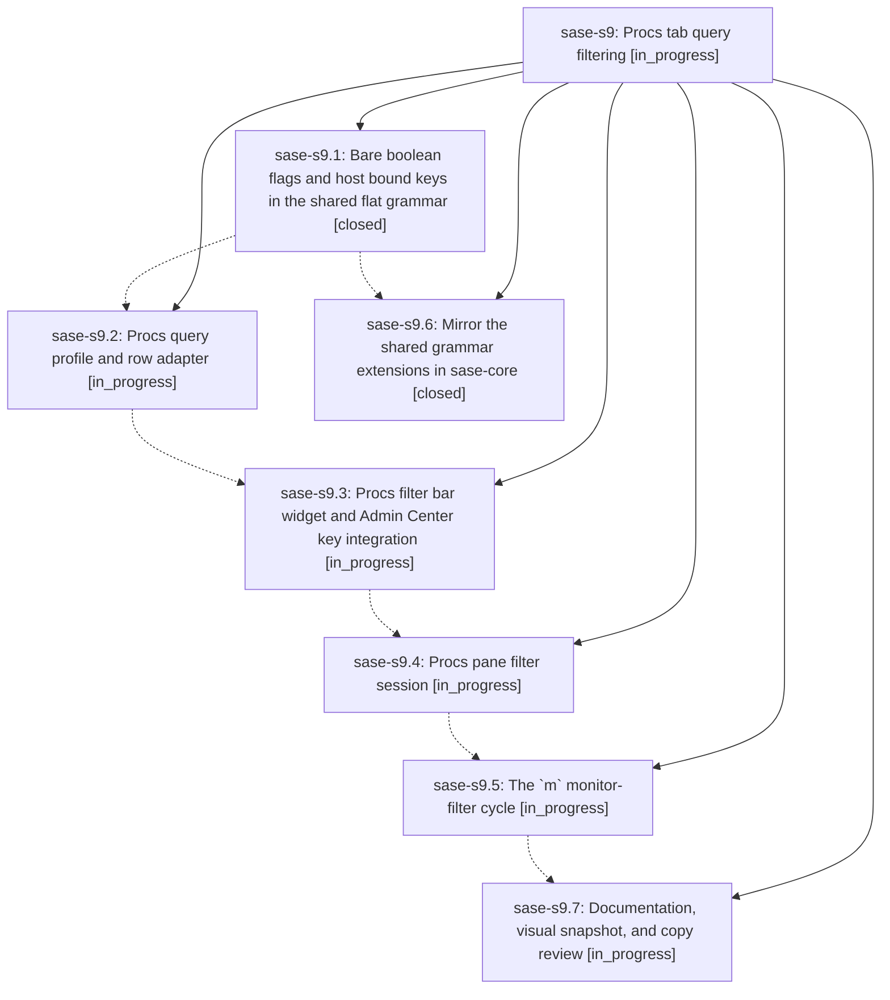

# Bead: sase-s9 — Procs tab query filtering

[Bead Pages](../README.md) / sase-s9

**Status:** ◐ in_progress · **Type:** ▸ plan · **Tier:** epic
**Owner:** `bryanbugyi34@gmail.com` · **Created by:** [bbugyi200.athena.0bh](https://github.com/sase-org/sase--agents/blob/main/families/bbugyi200.athena.0bh.md) · **Assignee:** `sase-s9.land`
**Created:** 2026-08-23 08:01:34 EDT
**Plan:** [202608/procs\_filter.md](https://github.com/sase-org/sase--plans/blob/main/202608/procs_filter.md)

## Description

The Admin Center Procs tab has a slash-revealed query bar backed by a real, shared query dialect: free text matches a proc's command and output, closed `key:value` filters cover monitor/running/status/runtime/completion-time, every term negates with `-`, boolean keys have a bare shorthand, and `m` cycles the monitor filter on, inverted, and off.

## Phases

| Bead | Title | Status | Size | Created | Agents | Commits |
|---|---|---|---|---|---:|---:|
| [sase-s9.1](sase-s9.1.md) | Bare boolean flags and host bound keys in the shared flat grammar | ✓ closed | medium | 2026-08-23 | 1 | 1 |
| [sase-s9.2](sase-s9.2.md) | Procs query profile and row adapter | ◐ in_progress | medium | 2026-08-23 | 1 | 1 |
| [sase-s9.3](sase-s9.3.md) | Procs filter bar widget and Admin Center key integration | ◐ in_progress | small | 2026-08-23 | 1 | 0 |
| [sase-s9.4](sase-s9.4.md) | Procs pane filter session | ◐ in_progress | medium | 2026-08-23 | 1 | 0 |
| [sase-s9.5](sase-s9.5.md) | The \`m\` monitor-filter cycle | ◐ in_progress | small | 2026-08-23 | 1 | 0 |
| [sase-s9.6](sase-s9.6.md) | Mirror the shared grammar extensions in sase-core | ✓ closed | medium | 2026-08-23 | 1 | 1 |
| [sase-s9.7](sase-s9.7.md) | Documentation, visual snapshot, and copy review | ◐ in_progress | small | 2026-08-23 | 1 | 0 |

## Lineage

## Agents

| Agent | Bead | Commits |
|---|---|---:|
| [bbugyi200.athena.sase-s9.1](https://github.com/sase-org/sase--agents/blob/main/agents/bbugyi200.athena.sase-s9.1/README.md) | [sase-s9.1](sase-s9.1.md) | 1 |
| [bbugyi200.athena.sase-s9.2](https://github.com/sase-org/sase--agents/blob/main/agents/bbugyi200.athena.sase-s9.2/README.md) | [sase-s9.2](sase-s9.2.md) | 0 |
| [bbugyi200.athena.sase-s9.3](https://github.com/sase-org/sase--agents/blob/main/agents/bbugyi200.athena.sase-s9.3/README.md) | [sase-s9.3](sase-s9.3.md) | 0 |
| [bbugyi200.athena.sase-s9.4](https://github.com/sase-org/sase--agents/blob/main/agents/bbugyi200.athena.sase-s9.4/README.md) | [sase-s9.4](sase-s9.4.md) | 0 |
| [bbugyi200.athena.sase-s9.5](https://github.com/sase-org/sase--agents/blob/main/agents/bbugyi200.athena.sase-s9.5/README.md) | [sase-s9.5](sase-s9.5.md) | 0 |
| [bbugyi200.athena.sase-s9.6](https://github.com/sase-org/sase--agents/blob/main/agents/bbugyi200.athena.sase-s9.6/README.md) | [sase-s9.6](sase-s9.6.md) | 1 |
| [bbugyi200.athena.sase-s9.7](https://github.com/sase-org/sase--agents/blob/main/agents/bbugyi200.athena.sase-s9.7/README.md) | [sase-s9.7](sase-s9.7.md) | 0 |
| [bbugyi200.athena.sase-s9.land](https://github.com/sase-org/sase--agents/blob/main/agents/bbugyi200.athena.sase-s9.land/README.md) | [sase-s9](README.md) | 0 |

## Commits

| Repo | Commit | Subject | Bead | Committed |
|---|---|---|---|---|
| sase | [`dcbf570`](https://github.com/sase-org/sase/commit/dcbf570d53a3b8e705955b9729df84672f1abb7c) | feat(query): add flat boolean flags and bounds | [sase-s9.1](sase-s9.1.md) | 2026-08-23 08:55:48 EDT |
| sase | [`ab02603`](https://github.com/sase-org/sase/commit/ab0260376c0af00e8b6042c4dc7651145c1b0748) | feat: Procs query profile and row adapter (sase-s9.2) | [sase-s9.2](sase-s9.2.md) | 2026-08-23 09:41:21 EDT |
| sase | [`f0b932c`](https://github.com/sase-org/sase/commit/f0b932c9d5ce3880cc793f9252a7b4eb56f22c30) | test(query): cover Rust parity for bare flags and bound keys | [sase-s9.6](sase-s9.6.md) | 2026-08-23 09:41:27 EDT |
