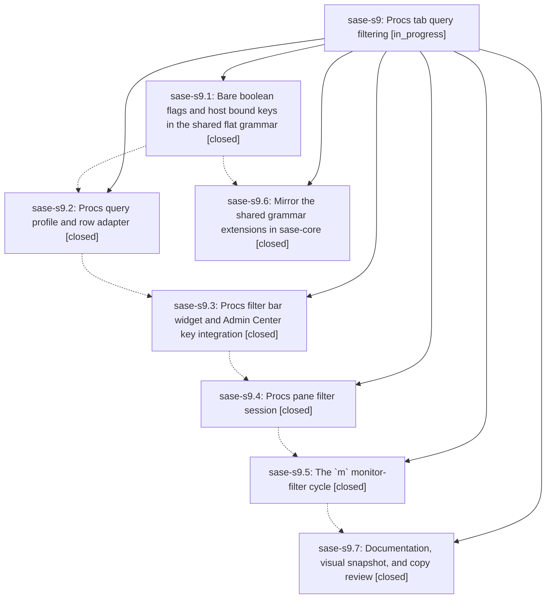

# Bead: sase-s9 — Procs tab query filtering

[Bead Pages](../README.md) / sase-s9

**Status:** ◐ in_progress · **Type:** ▸ plan · **Tier:** epic
**Owner:** `bryanbugyi34@gmail.com` · **Created by:** [bbugyi200.athena.0bh](https://github.com/sase-org/sase--agents/blob/main/families/bbugyi200.athena.0bh.md) · **Assignee:** `sase-s9.land`
**Created:** 2026-08-23 08:01:34 EDT
**Plan:** [202608/procs\_filter.md](https://github.com/sase-org/sase--plans/blob/main/202608/procs_filter.md)

<!-- sase:links:start -->

## Links

| Relation | Artifact | Why |
| --- | --- | --- |
| related | [bead:sase-sb][1] | Discovered when sase-s9.2 skipped /sase_final and entered a poll/wait loop |

[1]: https://github.com/sase-org/sase--beads/blob/main/pages/sase-sb/README.md

<!-- sase:links:end -->

## Description

The Admin Center Procs tab has a slash-revealed query bar backed by a real, shared query dialect: free text matches a proc's command and output, closed `key:value` filters cover monitor/running/status/runtime/completion-time, every term negates with `-`, boolean keys have a bare shorthand, and `m` cycles the monitor filter on, inverted, and off.

## Notes

[2026-08-23T14:59:19Z · 0bs] DISCOVERED ISSUE: just _lint-symvision (and therefore just check lint) fails on unused public symbol ProcsFilterBar in src/sase/ace/tui/modals/procs_filter_bar.py. Reproduction: just _lint-symvision. The class is referenced from src/sase/ace/tui/styles.tcss and tests/ace/tui/widgets/test_procs_filter_bar.py but from no non-test Python file, so Symvision treats it as unused. This workspace's Justfile already whitelists sase-s9(ProcQueryFilter), sase-s9(proc_query_row), and sase-s9(query_needs_output), but not ProcsFilterBar. Closed phase sase-s9.3 owned adding the widget and Admin Center key integration; closed sase-s9.4 owned the pane filter session. Remaining in-progress phases are sase-s9.5 (m monitor-filter cycle) and sase-s9.7 (docs/visual). Confirmed not caused by the home-task-types-note work: that tree only touches init_memory, task_types, docs, and tests around task_types.md. Fix belongs on this epic: either import/compose ProcsFilterBar from the Admin Center Procs pane (matching PatchFilterBar), add --epic-symbol sase-s9(ProcsFilterBar) until a later phase consumes it, or add a # symvision: src/sase/ace/tui/styles.tcss pragma if CSS is the intended lasting consumer.

[2026-08-23T15:12:02Z · sase-s8.land] DISCOVERED ISSUE (already fixed, no action needed from sase-s9): the Justfile carried a stale `--epic-symbol "sase-s9(ProcQueryFilter)"` exemption. Commit 2e0ac0f37 (feat(ace): wire Procs filter bar into pane) gave ProcQueryFilter a real consumer in src/sase/ace/tui/modals/procs_pane_filter.py, so symvision started refusing the entry with "symbol 'ProcQueryFilter' is already properly used. Remove this unnecessary --epic-symbol entry." and `just check` went red at lint for every agent in the repo. Reproduction: `just symvision` at HEAD 2e0ac0f37. I removed only that one line while landing epic sase-s8, because the gate blocked my own landing; `just symvision` is now clean. The two remaining sase-s9 entries (proc_query_row, query_needs_output) are untouched and still needed. sase-s9's land agent should re-run `sase bead epic-symbols sase-s9` as usual and not be surprised that one entry is already gone.

[2026-08-23T15:18:21Z · 0bt] DISCOVERED ISSUE: Independent corroboration during unrelated remove_legacy_commit_command verification. just _lint-symvision fails: --epic-symbol sase-s9(ProcQueryFilter): symbol ProcQueryFilter is already properly used. Remove this unnecessary --epic-symbol entry. Reproduction: just _lint-symvision or just check (after mypy). Confirmed not caused by this tree: Justfile is unmodified. I did not fix it; remaining in-progress phases are sase-s9.5 and sase-s9.7, and closed sase-s9.1 owned the query grammar types.

## Phases

| Bead | Title | Status | Size | Created | Agents | Commits |
|---|---|---|---|---|---:|---:|
| [sase-s9.1](sase-s9.1.md) | Bare boolean flags and host bound keys in the shared flat grammar | ✓ closed | medium | 2026-08-23 | 1 | 1 |
| [sase-s9.2](sase-s9.2.md) | Procs query profile and row adapter | ✓ closed | medium | 2026-08-23 | 0 | 1 |
| [sase-s9.3](sase-s9.3.md) | Procs filter bar widget and Admin Center key integration | ✓ closed | small | 2026-08-23 | 1 | 1 |
| [sase-s9.4](sase-s9.4.md) | Procs pane filter session | ✓ closed | medium | 2026-08-23 | 1 | 1 |
| [sase-s9.5](sase-s9.5.md) | The \`m\` monitor-filter cycle | ✓ closed | small | 2026-08-23 | 1 | 1 |
| [sase-s9.6](sase-s9.6.md) | Mirror the shared grammar extensions in sase-core | ✓ closed | medium | 2026-08-23 | 1 | 2 |
| [sase-s9.7](sase-s9.7.md) | Documentation, visual snapshot, and copy review | ✓ closed | small | 2026-08-23 | 1 | 1 |

## Lineage

## Agents

| Agent | Bead | Commits |
|---|---|---:|
| [bbugyi200.athena.sase-s9.1](https://github.com/sase-org/sase--agents/blob/main/agents/bbugyi200.athena.sase-s9.1/README.md) | [sase-s9.1](sase-s9.1.md) | 1 |
| [bbugyi200.athena.sase-s9.3](https://github.com/sase-org/sase--agents/blob/main/agents/bbugyi200.athena.sase-s9.3/README.md) | [sase-s9.3](sase-s9.3.md) | 1 |
| [bbugyi200.athena.sase-s9.4](https://github.com/sase-org/sase--agents/blob/main/agents/bbugyi200.athena.sase-s9.4/README.md) | [sase-s9.4](sase-s9.4.md) | 1 |
| [bbugyi200.athena.sase-s9.5](https://github.com/sase-org/sase--agents/blob/main/agents/bbugyi200.athena.sase-s9.5/README.md) | [sase-s9.5](sase-s9.5.md) | 1 |
| [bbugyi200.athena.sase-s9.6](https://github.com/sase-org/sase--agents/blob/main/agents/bbugyi200.athena.sase-s9.6/README.md) | [sase-s9.6](sase-s9.6.md) | 2 |
| [bbugyi200.athena.sase-s9.7](https://github.com/sase-org/sase--agents/blob/main/agents/bbugyi200.athena.sase-s9.7/README.md) | [sase-s9.7](sase-s9.7.md) | 1 |
| [bbugyi200.athena.sase-s9.land](https://github.com/sase-org/sase--agents/blob/main/agents/bbugyi200.athena.sase-s9.land/README.md) | [sase-s9](README.md) | 0 |

## Commits

| Repo | Commit | Subject | Bead | Committed |
|---|---|---|---|---|
| sase | [`dcbf570`](https://github.com/sase-org/sase/commit/dcbf570d53a3b8e705955b9729df84672f1abb7c) | feat(query): add flat boolean flags and bounds | [sase-s9.1](sase-s9.1.md) | 2026-08-23 08:55:48 EDT |
| sase | [`ab02603`](https://github.com/sase-org/sase/commit/ab0260376c0af00e8b6042c4dc7651145c1b0748) | feat: Procs query profile and row adapter (sase-s9.2) | [sase-s9.2](sase-s9.2.md) | 2026-08-23 09:41:21 EDT |
| sase | [`f0b932c`](https://github.com/sase-org/sase/commit/f0b932c9d5ce3880cc793f9252a7b4eb56f22c30) | test(query): cover Rust parity for bare flags and bound keys | [sase-s9.6](sase-s9.6.md) | 2026-08-23 09:41:27 EDT |
| sase-core | [`sase-core@aeefa36`](https://github.com/sase-org/sase-core/commit/aeefa360c80ac12c7cc7684ee4988f745c14038e) | feat(query): port bare-boolean flags and host bound keys | [sase-s9.6](sase-s9.6.md) | 2026-08-23 09:43:40 EDT |
| sase | [`3d20654`](https://github.com/sase-org/sase/commit/3d2065412ca76bd7fd706655ec91c21c29f59c67) | feat(ace): add Procs filter bar with priority-tab handoff | [sase-s9.3](sase-s9.3.md) | 2026-08-23 09:58:41 EDT |
| sase | [`2e0ac0f`](https://github.com/sase-org/sase/commit/2e0ac0f37c0dafb6e5ef3afc2c213abae9058d15) | feat(ace): wire Procs filter bar into pane with empty-state and count messaging | [sase-s9.4](sase-s9.4.md) | 2026-08-23 10:40:57 EDT |
| sase | [`7db3ea9`](https://github.com/sase-org/sase/commit/7db3ea954ea0b971ba6db4d6d5d2e4f2fe29c213) | feat(ace): bind m to cycle the Procs monitor filter | [sase-s9.5](sase-s9.5.md) | 2026-08-23 11:23:54 EDT |
| sase | [`37abe19`](https://github.com/sase-org/sase/commit/37abe195b91db320983f9a450859d5f3c4b768f0) | docs(ace): document Procs tab filtering and add filtered PNG snapshot | [sase-s9.7](sase-s9.7.md) | 2026-08-23 11:48:51 EDT |
