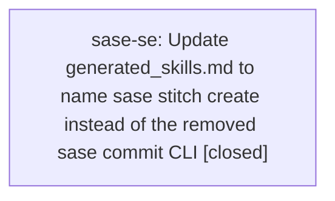

# Bead: sase-se — Update generated\_skills.md to name sase stitch create instead of the removed sase commit CLI

[Bead Pages](../README.md) / sase-se

**Status:** ✓ closed · **Resolution:** done · **Type:** ◆ task · **Task type:** ▤ memory
**Owner:** `bryanbugyi34@gmail.com` · **Created by:** [bbugyi200.athena.0bt](https://github.com/sase-org/sase--agents/blob/main/families/bbugyi200.athena.0bt.md) · **Assignee:** `sase-se` · **Size:** small
**Created:** 2026-08-23 11:06:59 EDT · **Closed:** 2026-09-06 15:56:17 EDT

<!-- sase:links:start -->

## Links

| Relation | Artifact | Why |
| --- | --- | --- |
| related | [bead:sase-ca][1] | both update generated_skills.md; sase-ca is the Uniform Agent Runtimes / hg-skill table, this bead is the removed sase commit CLI contract |
| related | [plan:202608/remove_legacy_commit_command.md][2] | this tale removed sase commit and recorded the protected-memory follow-up |

[1]: https://github.com/sase-org/sase--beads/blob/main/pages/sase-ca/README.md
[2]: https://github.com/sase-org/sase--plans/blob/main/202608/remove_legacy_commit_command.md

<!-- sase:links:end -->

## Description

\## Memory update

- **Path:** `generated_skills.md`

The audited `sase/memory/generated_skills.md` note still describes a `sase commit`
CLI/skill synchronization contract. After tale `plan:202608/remove_legacy_commit_command.md`,
the top-level `sase commit` command is gone: tracked VCS dispatch lives only at
`sase stitch create`. The current conversation did not grant permission to edit a SASE
memory file, so this bead records the required follow-up.

Replace the `## CLI/Skill Contract Synchronization` section so it names
`sase stitch create` as the CLI whose argument changes must land in the same turn as
in-repo callers, generated skill sources, and parser/skill tests. Keep the nearby
"no sase commit" noun phrase only if it is rewritten so it cannot be mistaken for the
removed command (it currently means "no landed revision in the sase repo"). Then run
the mandatory `sase memory init` regeneration.

Related but not a duplicate: closed task sase-ca is a different `generated_skills.md`
mismatch (Uniform Agent Runtimes vs Gemini-only `/sase_hg_commit`).

---

\## Memory update

- **Path:** `generated_skills.md`

\## Memory update

- **Path:** `generated_skills.md`

The audited `sase/memory/generated_skills.md` note still describes a `sase commit`
CLI/skill synchronization contract. After tale `plan:202608/remove_legacy_commit_command.md`,
the top-level `sase commit` command is gone: tracked VCS dispatch lives only at
`sase stitch create`. The current conversation did not grant permission to edit a SASE
memory file, so this bead records the required follow-up.

Replace the `## CLI/Skill Contract Synchronization` section so it names
`sase stitch create` as the CLI whose argument changes must land in the same turn as
in-repo callers, generated skill sources, and parser/skill tests. Keep the nearby
"no sase commit" noun phrase only if it is rewritten so it cannot be mistaken for the
removed command (it currently means "no landed revision in the sase repo"). Then run
the mandatory `sase memory init` regeneration.

Related but not a duplicate: closed task sase-ca is a different `generated_skills.md`
mismatch (Uniform Agent Runtimes vs Gemini-only `/sase_hg_commit`).

## Notes

[2026-09-06T19:56:17Z · sase-se] Updated generated_skills.md to name sase stitch create instead of the removed sase commit CLI, rewrote the ambiguous no-sase-commit wording, ran sase memory init --no-commit, formatted Markdown, and verified with just check; the scoped lane escalated to the governed full suite due contract-set-only/core-identity-changed and passed.

## Lineage

## Agents

| Agent | Bead | Commits |
|---|---|---:|
| [bbugyi200.athena.sase-se](https://github.com/sase-org/sase--agents/blob/main/agents/bbugyi200.athena.sase-se/README.md) | [sase-se](README.md) | 1 |

## Commits

| Repo | Commit | Subject | Bead | Committed |
|---|---|---|---|---|
| sase | [`eab4639`](https://github.com/sase-org/sase/commit/eab4639cc0f06e37f4cc176001b42f2337aea83c) | docs(memory): update generated skills commit guidance | [sase-se](README.md) | 2026-09-06 16:03:31 EDT |
