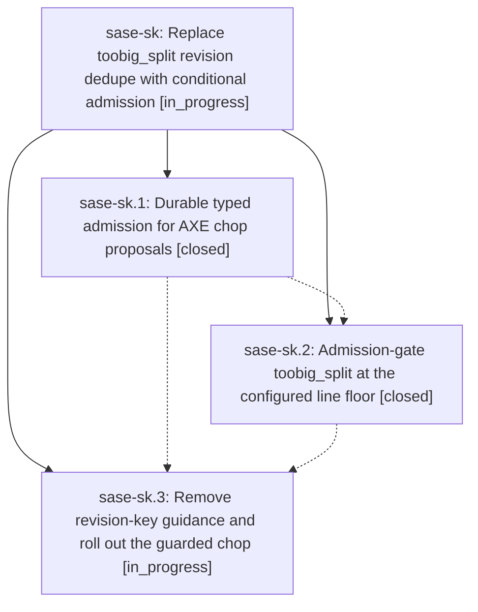

# Bead: sase-sk — Replace toobig\_split revision dedupe with conditional admission

[Bead Pages](../README.md) / sase-sk

**Status:** ◐ in_progress · **Type:** ▸ plan · **Tier:** epic
**Owner:** `bryanbugyi34@gmail.com` · **Created by:** [bbugyi200.athena.0c1](https://github.com/sase-org/sase--agents/blob/main/families/bbugyi200.athena.0c1.md) · **Assignee:** `sase-sk.land`
**Created:** 2026-08-23 16:21:05 EDT
**Plan:** [202608/toobig\_split\_conditional\_admission.md](https://github.com/sase-org/sase--plans/blob/main/202608/toobig_split_conditional_admission.md)

## Description

AXE retries oversized-file maintenance without repository-HEAD dedupe keys, and each queued toobig_split proposal uses durable %if admission to allocate no agent or workspace unless its target file is still at least 700 lines long.

## Phases

| Bead | Title | Status | Size | Created | Agents | Commits |
|---|---|---|---|---|---:|---:|
| [sase-sk.1](sase-sk.1.md) | Durable typed admission for AXE chop proposals | ✓ closed | medium | 2026-08-23 | 1 | 1 |
| [sase-sk.2](sase-sk.2.md) | Admission-gate toobig\_split at the configured line floor | ✓ closed | medium | 2026-08-23 | 1 | 0 |
| [sase-sk.3](sase-sk.3.md) | Remove revision-key guidance and roll out the guarded chop | ◐ in_progress | small | 2026-08-23 | 1 | 0 |

## Lineage

## Agents

| Agent | Bead | Commits |
|---|---|---:|
| [bbugyi200.athena.sase-sk.1](https://github.com/sase-org/sase--agents/blob/main/agents/bbugyi200.athena.sase-sk.1/README.md) | [sase-sk.1](sase-sk.1.md) | 1 |
| [bbugyi200.athena.sase-sk.2](https://github.com/sase-org/sase--agents/blob/main/agents/bbugyi200.athena.sase-sk.2/README.md) | [sase-sk.2](sase-sk.2.md) | 0 |
| [bbugyi200.athena.sase-sk.3](https://github.com/sase-org/sase--agents/blob/main/agents/bbugyi200.athena.sase-sk.3/README.md) | [sase-sk.3](sase-sk.3.md) | 0 |
| [bbugyi200.athena.sase-sk.land](https://github.com/sase-org/sase--agents/blob/main/agents/bbugyi200.athena.sase-sk.land/README.md) | [sase-sk](README.md) | 0 |

## Commits

| Repo | Commit | Subject | Bead | Committed |
|---|---|---|---|---|
| sase | [`faed143`](https://github.com/sase-org/sase/commit/faed143237163b5618384fb60eb9bc16947a36bf) | feat(axe): route chop proposals through typed admission | [sase-sk.1](sase-sk.1.md) | 2026-08-23 17:24:39 EDT |
