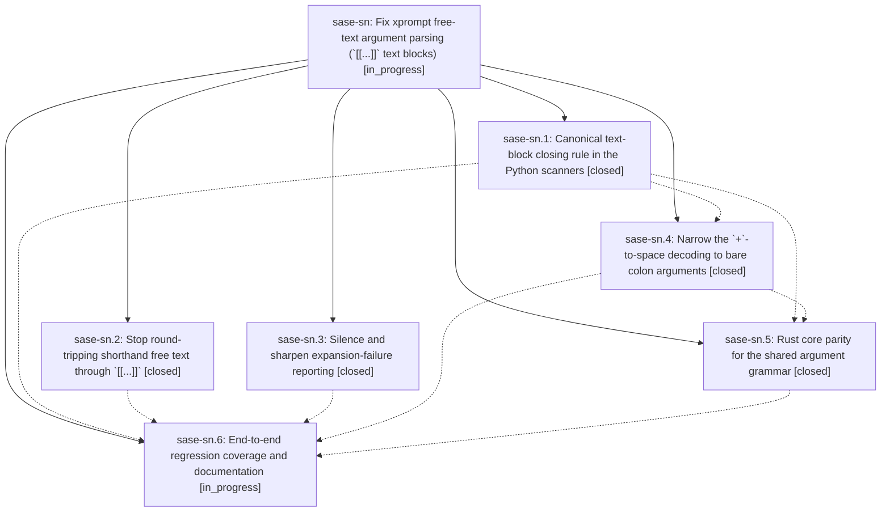

# Bead: sase-sn — Fix xprompt free-text argument parsing (\`\[\[...\]\]\` text blocks)

[Bead Pages](../README.md) / sase-sn

**Status:** ◐ in_progress · **Type:** ▸ plan · **Tier:** epic
**Owner:** `bryanbugyi34@gmail.com` · **Created by:** [bbugyi200.athena.0c5](https://github.com/sase-org/sase--agents/blob/main/families/bbugyi200.athena.0c5.md) · **Assignee:** `sase-sn.land`
**Created:** 2026-08-24 06:11:46 EDT
**Plan:** [202608/xprompt\_text\_block\_args.md](https://github.com/sase-org/sase--plans/blob/main/202608/xprompt_text_block_args.md)

## Description

Free-text xprompt arguments survive prose that contains `]]`, `+`, commas, and apostrophes; the `[[...]]` text-block rule has one authoritative definition that every Python and Rust argument scanner shares; and a failed xprompt argument binding reports itself once, accurately, instead of leaking a stray error from a best-effort diagnostic and then failing later with an unrelated directive error.

## Phases

| Bead | Title | Status | Size | Created | Agents | Commits |
|---|---|---|---|---|---:|---:|
| [sase-sn.1](sase-sn.1.md) | Canonical text-block closing rule in the Python scanners | ✓ closed | medium | 2026-08-24 | 1 | 1 |
| [sase-sn.2](sase-sn.2.md) | Stop round-tripping shorthand free text through \`\[\[...\]\]\` | ✓ closed | medium | 2026-08-24 | 1 | 1 |
| [sase-sn.3](sase-sn.3.md) | Silence and sharpen expansion-failure reporting | ✓ closed | small | 2026-08-24 | 1 | 1 |
| [sase-sn.4](sase-sn.4.md) | Narrow the \`+\`-to-space decoding to bare colon arguments | ✓ closed | small | 2026-08-24 | 1 | 1 |
| [sase-sn.5](sase-sn.5.md) | Rust core parity for the shared argument grammar | ✓ closed | medium | 2026-08-24 | 1 | 1 |
| [sase-sn.6](sase-sn.6.md) | End-to-end regression coverage and documentation | ◐ in_progress | small | 2026-08-24 | 1 | 0 |

## Lineage

## Agents

| Agent | Bead | Commits |
|---|---|---:|
| [bbugyi200.athena.sase-sn.1](https://github.com/sase-org/sase--agents/blob/main/agents/bbugyi200.athena.sase-sn.1/README.md) | [sase-sn.1](sase-sn.1.md) | 1 |
| [bbugyi200.athena.sase-sn.2](https://github.com/sase-org/sase--agents/blob/main/families/bbugyi200.athena.sase-sn.2.md) | [sase-sn.2](sase-sn.2.md) | 1 |
| [bbugyi200.athena.sase-sn.3](https://github.com/sase-org/sase--agents/blob/main/agents/bbugyi200.athena.sase-sn.3/README.md) | [sase-sn.3](sase-sn.3.md) | 1 |
| [bbugyi200.athena.sase-sn.4](https://github.com/sase-org/sase--agents/blob/main/agents/bbugyi200.athena.sase-sn.4/README.md) | [sase-sn.4](sase-sn.4.md) | 1 |
| [bbugyi200.athena.sase-sn.5](https://github.com/sase-org/sase--agents/blob/main/agents/bbugyi200.athena.sase-sn.5/README.md) | [sase-sn.5](sase-sn.5.md) | 1 |
| [bbugyi200.athena.sase-sn.6](https://github.com/sase-org/sase--agents/blob/main/agents/bbugyi200.athena.sase-sn.6/README.md) | [sase-sn.6](sase-sn.6.md) | 0 |
| [bbugyi200.athena.sase-sn.land](https://github.com/sase-org/sase--agents/blob/main/agents/bbugyi200.athena.sase-sn.land/README.md) | [sase-sn](README.md) | 0 |

## Commits

| Repo | Commit | Subject | Bead | Committed |
|---|---|---|---|---|
| sase | [`4d0da0d`](https://github.com/sase-org/sase/commit/4d0da0d4be1c0ab5284946c3a6393c3d758a6302) | fix(xprompt): bind shorthand text directly from source, not re-lexed | [sase-sn.2](sase-sn.2.md) | 2026-08-24 06:35:32 EDT |
| sase | [`d0ea16e`](https://github.com/sase-org/sase/commit/d0ea16ef8eac7043636b4292237d1efc2b92ba9a) | fix(xprompt): silence swallowed expansion errors and name surplus bindings | [sase-sn.3](sase-sn.3.md) | 2026-08-24 06:42:04 EDT |
| sase | [`6ca6e79`](https://github.com/sase-org/sase/commit/6ca6e798ed2277eab8e1741abc66b2117480f455) | fix(xprompt): honor text-block terminators in python scanners | [sase-sn.1](sase-sn.1.md) | 2026-08-24 07:06:02 EDT |
| sase | [`ec76ec6`](https://github.com/sase-org/sase/commit/ec76ec6ef9e0ea99d1f89a96d2edbaa64372e844) | fix(xprompt): narrow +-to-space decoding to bare colon arguments | [sase-sn.4](sase-sn.4.md) | 2026-08-24 08:05:19 EDT |
| sase-core | [`sase-core@1d3c9c6`](https://github.com/sase-org/sase-core/commit/1d3c9c6e5b7bcb408932b31d99473eeb99e49cd2) | fix(xprompt): close \[\[...\]\] blocks at terminator-position \]\] | [sase-sn.5](sase-sn.5.md) | 2026-08-24 08:52:31 EDT |
