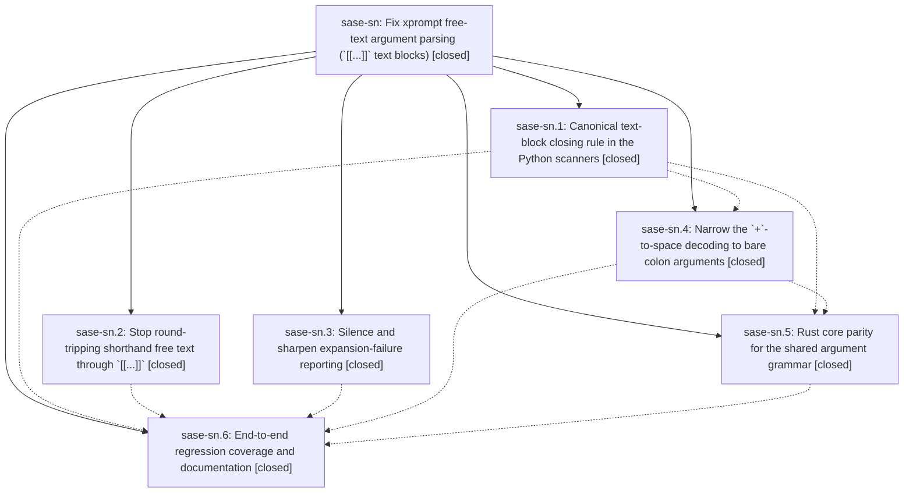

# Bead: sase-sn — Fix xprompt free-text argument parsing (\`\[\[...\]\]\` text blocks)

[Bead Pages](../README.md) / sase-sn

**Status:** ✓ closed · **Resolution:** done · **Type:** ▸ plan · **Tier:** epic
**Owner:** `bryanbugyi34@gmail.com` · **Created by:** [bbugyi200.athena.0c5](https://github.com/sase-org/sase--agents/blob/main/families/bbugyi200.athena.0c5.md) · **Assignee:** `sase-sn.land`
**Created:** 2026-08-24 06:11:46 EDT · **Closed:** 2026-08-24 10:10:40 EDT
**Plan:** [202608/xprompt\_text\_block\_args.md](https://github.com/sase-org/sase--plans/blob/main/202608/xprompt_text_block_args.md)

<!-- sase:links:start -->

## Links

| Relation | Artifact | Why |
| --- | --- | --- |
| related | [bead:sase-sr][1] | Epic sase-sn shared the [[...]] closing rule and the + decoding across these same six scanners and deliberately left quoting, escapes, and bracket nesting divergent |
| related | [bead:sase-ss][2] | Epic sase-sn narrowed + decoding to bare colon args, which is what made these two sase-core guards stale |
| related | [bead:sase-st][3] | Epic sase-sn defined the closing rule and updated docs/xprompt.md; this note is the memory-file counterpart it could not edit |

[1]: https://github.com/sase-org/sase--beads/blob/main/pages/sase-sr/README.md
[2]: https://github.com/sase-org/sase--beads/blob/main/pages/sase-ss/README.md
[3]: https://github.com/sase-org/sase--beads/blob/main/pages/sase-st/README.md

<!-- sase:links:end -->

## Description

Free-text xprompt arguments survive prose that contains `]]`, `+`, commas, and apostrophes; the `[[...]]` text-block rule has one authoritative definition that every Python and Rust argument scanner shares; and a failed xprompt argument binding reports itself once, accurately, instead of leaking a stray error from a best-effort diagnostic and then failing later with an unrelated directive error.

## Notes

[2026-08-24T14:10:40Z · sase-sn.land] Verified all six phases against the source and their commits (4d0da0d4b sase-sn.2, d0ea16ef8 sase-sn.3, 6ca6e798e sase-sn.1, ec76ec6ef sase-sn.4, 1907346f8 sase-sn.6 in sase; 1d3c9c6 sase-sn.5 and 81f114a sase-sn.6 in sase-core). sase-sn.2 had only an auto-close note with no verification claimed, so I read the code directly: processor.py binds `#name: text`, `#name:: text`, and `#name(args): text` through _consume_trailing_shorthand_text (paren form appends positionally, as the plan recommended), and preprocess_shorthand_syntax is gone from the expansion path but retained for the three detection-only callers. Reproduced the original defect end to end on this tree: the shorthand round-trip and the structural reference path both bind 1 positional (was 10), C++/A+B survive, and extract_static_clan_directive returns a clean StaticClanDirective on a %clan(..., summary=[[...prose with ]]...]]) segment that previously raised DirectiveError. find_text_block_close_for_args and its Rust twin (crates/sase_core/src/xprompt_text_block.rs) implement the same terminator rule and back all three Python scanners plus ArgScanner, QuoteState, and the agent-launch parsers; decode narrowing verified at every call site including workflow_validator_extract (colon-kind only) and parse_workflow_reference. 243 targeted tests pass.

INTEGRATION. Reviewed every non-epic commit since the first epic commit (bac22b968, 5dc897395, abefcc4fb, 4041c17e4, f7595ad53 in sase; 8d51bd8, afd1f87 in sase-core). Two real gaps found and fixed as epic work:

1. pyproject.toml still allowed sase-core-rs>=0.31.0, but the epic's Rust parity only shipped in 0.31.11. Epic sase-so (sase-so.1/8d51bd8, sase-so.2) now routes real clan summaries through the Rust format_clan_directive/plan_typed_launch_units text-block round trip, so a fresh install resolving 0.31.0 would still hit the original DirectiveError. Ratcheted the floor to >=0.31.11,<0.32.0 and relocked uv.lock, matching the convention in d61f3bbc6/959d55926. Confirmed the published 0.31.11 wheel parses `summary=[[...]]` containing `]]` and `+` correctly.

2. docs/xprompt.md's residual-ambiguity paragraph (written by sase-sn.6) was wrong about its own example: #name([[foo]]]]) binds `foo]]` correctly, because only the final `]]` sits in terminator position. The real residual ambiguity is a content `]]` followed by a terminator (#name([[a]], b]]) binds two args). Rewrote the paragraph and verified the documented quoted-argument workaround actually works for both positional and named values.

No other conflict found: abefcc4fb/4041c17e4 carry clan_summary as structured wire metadata rather than parsing text, and the sase-core parity commit landed after 8d51bd8, so the typed-launch path was already covered (typed_launch_clan_summary_ignores_inner_text_block_marker and _keeps_unbalanced_inner_closer).

FOLLOW-UPS. Three PROPOSED FOLLOW-UP entries (two on sase-sn.5, one on sase-sn.6) plus the epic plan's two out-of-scope items were triaged into three ready task beads, after searching and sweeping all task beads and reviewing the 21 in-progress epics for causal links; none were duplicates.
- sase-sr (bug, large): the sase-sn.5 dialect-divergence note merged with the plan's "unbalanced apostrophes" and "nested parentheses" out-of-scope items. These are one defect with one remediation -- a shared quoting/nesting rule across all six scanners -- so filing them separately would have been three views of the same fix. Evidence: %clan(research.x, summary=don't stop, tribe=research) raises DirectiveError in Python but parses correctly through plan_typed_launch_units in Rust.
- sase-ss (bug, small): the sase-sn.5 note that axe_chop validate_literal_clan_summary still rejects `+` (now provably obsolete, since text blocks are no longer + decoded) and that editor colon_arg_context aborts on `+`. Recorded that the sibling `]]` guard is still partly needed and should be narrowed rather than dropped. Linked related to sase-so and sase-rj.
- sase-st (memory, small): the sase-sn.6 request to document the closing rule in sase/memory/xprompts.md, with proposed wording. Not applied here: memory edits require the project owner's explicit permission in the requesting conversation plus sase memory init.

VERIFICATION. just check green end to end, with the scoped lane escalating to the full suite (rules: contract-set-only, core-identity-changed, packaging-config). One environmental note, not epic work and already owned: building sase_core_rs from the linked sase-core checkout at HEAD fails tools/validate_sase_core_rs because afd1f87 ships finalizer_wire_schema_version 2 while this repo still pins 1. That is epic sase-sp's core commit outrunning its own in-progress Python phase sase-sp.2 ("Adopt the released core floor and the deferral config schema"), so I filed nothing and ran the gates against the published 0.31.11 wheel instead -- which is the configuration the floor bump actually needs to prove. sase bead epic-symbols sase-sn reports no entries.

## Phases

| Bead | Title | Status | Size | Created | Agents | Commits |
|---|---|---|---|---|---:|---:|
| [sase-sn.1](sase-sn.1.md) | Canonical text-block closing rule in the Python scanners | ✓ closed | medium | 2026-08-24 | 1 | 1 |
| [sase-sn.2](sase-sn.2.md) | Stop round-tripping shorthand free text through \`\[\[...\]\]\` | ✓ closed | medium | 2026-08-24 | 1 | 1 |
| [sase-sn.3](sase-sn.3.md) | Silence and sharpen expansion-failure reporting | ✓ closed | small | 2026-08-24 | 1 | 1 |
| [sase-sn.4](sase-sn.4.md) | Narrow the \`+\`-to-space decoding to bare colon arguments | ✓ closed | small | 2026-08-24 | 1 | 1 |
| [sase-sn.5](sase-sn.5.md) | Rust core parity for the shared argument grammar | ✓ closed | medium | 2026-08-24 | 1 | 1 |
| [sase-sn.6](sase-sn.6.md) | End-to-end regression coverage and documentation | ✓ closed | small | 2026-08-24 | 1 | 2 |

## Lineage

## Agents

| Agent | Bead | Commits |
|---|---|---:|
| [bbugyi200.athena.sase-sn.1](https://github.com/sase-org/sase--agents/blob/main/agents/bbugyi200.athena.sase-sn.1/README.md) | [sase-sn.1](sase-sn.1.md) | 1 |
| [bbugyi200.athena.sase-sn.2](https://github.com/sase-org/sase--agents/blob/main/families/bbugyi200.athena.sase-sn.2.md) | [sase-sn.2](sase-sn.2.md) | 1 |
| [bbugyi200.athena.sase-sn.3](https://github.com/sase-org/sase--agents/blob/main/agents/bbugyi200.athena.sase-sn.3/README.md) | [sase-sn.3](sase-sn.3.md) | 1 |
| [bbugyi200.athena.sase-sn.4](https://github.com/sase-org/sase--agents/blob/main/agents/bbugyi200.athena.sase-sn.4/README.md) | [sase-sn.4](sase-sn.4.md) | 1 |
| [bbugyi200.athena.sase-sn.5](https://github.com/sase-org/sase--agents/blob/main/agents/bbugyi200.athena.sase-sn.5/README.md) | [sase-sn.5](sase-sn.5.md) | 1 |
| [bbugyi200.athena.sase-sn.6](https://github.com/sase-org/sase--agents/blob/main/agents/bbugyi200.athena.sase-sn.6/README.md) | [sase-sn.6](sase-sn.6.md) | 2 |
| [bbugyi200.athena.sase-sn.land](https://github.com/sase-org/sase--agents/blob/main/agents/bbugyi200.athena.sase-sn.land/README.md) | [sase-sn](README.md) | 1 |

## Commits

| Repo | Commit | Subject | Bead | Committed |
|---|---|---|---|---|
| sase | [`4d0da0d`](https://github.com/sase-org/sase/commit/4d0da0d4be1c0ab5284946c3a6393c3d758a6302) | fix(xprompt): bind shorthand text directly from source, not re-lexed | [sase-sn.2](sase-sn.2.md) | 2026-08-24 06:35:32 EDT |
| sase | [`d0ea16e`](https://github.com/sase-org/sase/commit/d0ea16ef8eac7043636b4292237d1efc2b92ba9a) | fix(xprompt): silence swallowed expansion errors and name surplus bindings | [sase-sn.3](sase-sn.3.md) | 2026-08-24 06:42:04 EDT |
| sase | [`6ca6e79`](https://github.com/sase-org/sase/commit/6ca6e798ed2277eab8e1741abc66b2117480f455) | fix(xprompt): honor text-block terminators in python scanners | [sase-sn.1](sase-sn.1.md) | 2026-08-24 07:06:02 EDT |
| sase | [`ec76ec6`](https://github.com/sase-org/sase/commit/ec76ec6ef9e0ea99d1f89a96d2edbaa64372e844) | fix(xprompt): narrow +-to-space decoding to bare colon arguments | [sase-sn.4](sase-sn.4.md) | 2026-08-24 08:05:19 EDT |
| sase-core | [`sase-core@1d3c9c6`](https://github.com/sase-org/sase-core/commit/1d3c9c6e5b7bcb408932b31d99473eeb99e49cd2) | fix(xprompt): close \[\[...\]\] blocks at terminator-position \]\] | [sase-sn.5](sase-sn.5.md) | 2026-08-24 08:52:31 EDT |
| sase | [`1907346`](https://github.com/sase-org/sase/commit/1907346f8e4170ee31f639db9fe452930bff9ce5) | test(xprompt): add text-block launch regression and shared corpus | [sase-sn.6](sase-sn.6.md) | 2026-08-24 09:28:05 EDT |
| sase-core | [`sase-core@81f114a`](https://github.com/sase-org/sase-core/commit/81f114a2ac7f1f01d1ffa4e0988fcedada214236) | test(xprompt): parse the shared text-block argument corpus | [sase-sn.6](sase-sn.6.md) | 2026-08-24 09:30:35 EDT |
| sase | [`04af855`](https://github.com/sase-org/sase/commit/04af855998fd1d8d9b7e5a9096aa8b3b2ddade6d) | build(deps): raise the sase-core-rs floor to 0.31.11 | [sase-sn](README.md) | 2026-08-24 10:13:15 EDT |
