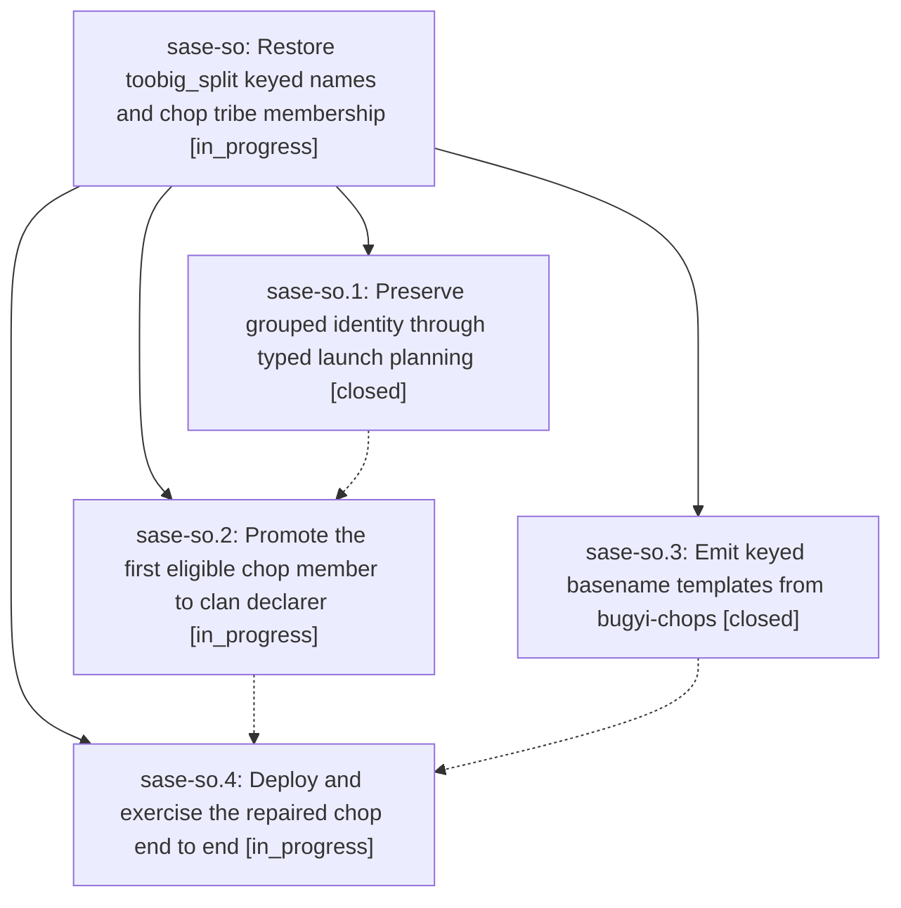

# Bead: sase-so — Restore toobig\_split keyed names and chop tribe membership

[Bead Pages](../README.md) / sase-so

**Status:** ◐ in_progress · **Type:** ▸ plan · **Tier:** epic
**Owner:** `bryanbugyi34@gmail.com` · **Created by:** [bbugyi200.athena.0c6](https://github.com/sase-org/sase--agents/blob/main/families/bbugyi200.athena.0c6.md) · **Assignee:** `sase-so.land`
**Created:** 2026-08-24 07:02:25 EDT
**Plan:** [202608/toobig\_split\_identity\_tribe.md](https://github.com/sase-org/sase--plans/blob/main/202608/toobig_split_identity_tribe.md)

## Description

Typed toobig_split admission preserves clan identity and @chop metadata while new agents use concise keyed basename names.

## Phases

| Bead | Title | Status | Size | Created | Agents | Commits |
|---|---|---|---|---|---:|---:|
| [sase-so.1](sase-so.1.md) | Preserve grouped identity through typed launch planning | ✓ closed | medium | 2026-08-24 | 1 | 2 |
| [sase-so.2](sase-so.2.md) | Promote the first eligible chop member to clan declarer | ◐ in_progress | medium | 2026-08-24 | 1 | 0 |
| [sase-so.3](sase-so.3.md) | Emit keyed basename templates from bugyi-chops | ✓ closed | small | 2026-08-24 | 1 | 0 |
| [sase-so.4](sase-so.4.md) | Deploy and exercise the repaired chop end to end | ◐ in_progress | xsmall | 2026-08-24 | 1 | 0 |

## Lineage

## Agents

| Agent | Bead | Commits |
|---|---|---:|
| [bbugyi200.athena.sase-so.1](https://github.com/sase-org/sase--agents/blob/main/agents/bbugyi200.athena.sase-so.1/README.md) | [sase-so.1](sase-so.1.md) | 2 |
| [bbugyi200.athena.sase-so.2](https://github.com/sase-org/sase--agents/blob/main/agents/bbugyi200.athena.sase-so.2/README.md) | [sase-so.2](sase-so.2.md) | 0 |
| [bbugyi200.athena.sase-so.3](https://github.com/sase-org/sase--agents/blob/main/agents/bbugyi200.athena.sase-so.3/README.md) | [sase-so.3](sase-so.3.md) | 0 |
| [bbugyi200.athena.sase-so.4](https://github.com/sase-org/sase--agents/blob/main/agents/bbugyi200.athena.sase-so.4/README.md) | [sase-so.4](sase-so.4.md) | 0 |
| [bbugyi200.athena.sase-so.land](https://github.com/sase-org/sase--agents/blob/main/agents/bbugyi200.athena.sase-so.land/README.md) | [sase-so](README.md) | 0 |

## Commits

| Repo | Commit | Subject | Bead | Committed |
|---|---|---|---|---|
| sase | [`abefcc4`](https://github.com/sase-org/sase/commit/abefcc4fba5f44198d4375e8ed865b37a81b5c0d) | feat(agent-launch): keep clan and family identity through typed planning | [sase-so.1](sase-so.1.md) | 2026-08-24 07:50:43 EDT |
| sase-core | [`sase-core@8d51bd8`](https://github.com/sase-org/sase-core/commit/8d51bd8df4b9de8c465c4cd8eb54174b17a79800) | feat(agent-launch): preserve grouped identity on typed AgentUnitWire | [sase-so.1](sase-so.1.md) | 2026-08-24 07:52:33 EDT |
