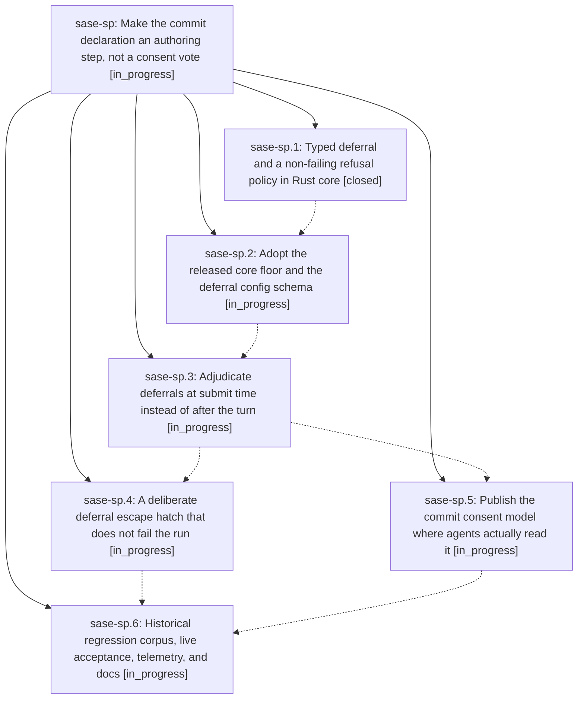

# Bead: sase-sp — Make the commit declaration an authoring step, not a consent vote

[Bead Pages](../README.md) / sase-sp

**Status:** ◐ in_progress · **Type:** ▸ plan · **Tier:** epic
**Owner:** `bryanbugyi34@gmail.com` · **Created by:** [bbugyi200.athena.0ca](https://github.com/sase-org/sase--agents/blob/main/families/bbugyi200.athena.0ca.md) · **Assignee:** `sase-sp.land`
**Created:** 2026-08-24 09:19:07 EDT
**Plan:** [202608/finalizer\_commit\_authoring.md](https://github.com/sase-org/sase--plans/blob/main/202608/finalizer_commit_authoring.md)

## Description

The finalizer declaration asks an agent only to author commit messages. Leaving a tree dirty becomes a rare, typed, host-adjudicated deferral that is corrected while the agent is still alive and never destroys a run.

## Phases

| Bead | Title | Status | Size | Created | Agents | Commits |
|---|---|---|---|---|---:|---:|
| [sase-sp.1](sase-sp.1.md) | Typed deferral and a non-failing refusal policy in Rust core | ✓ closed | medium | 2026-08-24 | 1 | 1 |
| [sase-sp.2](sase-sp.2.md) | Adopt the released core floor and the deferral config schema | ◐ in_progress | small | 2026-08-24 | 1 | 0 |
| [sase-sp.3](sase-sp.3.md) | Adjudicate deferrals at submit time instead of after the turn | ◐ in_progress | medium | 2026-08-24 | 1 | 0 |
| [sase-sp.4](sase-sp.4.md) | A deliberate deferral escape hatch that does not fail the run | ◐ in_progress | medium | 2026-08-24 | 1 | 0 |
| [sase-sp.5](sase-sp.5.md) | Publish the commit consent model where agents actually read it | ◐ in_progress | medium | 2026-08-24 | 1 | 0 |
| [sase-sp.6](sase-sp.6.md) | Historical regression corpus, live acceptance, telemetry, and docs | ◐ in_progress | medium | 2026-08-24 | 1 | 0 |

## Lineage

## Agents

| Agent | Bead | Commits |
|---|---|---:|
| [bbugyi200.athena.sase-sp.1](https://github.com/sase-org/sase--agents/blob/main/agents/bbugyi200.athena.sase-sp.1/README.md) | [sase-sp.1](sase-sp.1.md) | 1 |
| [bbugyi200.athena.sase-sp.2](https://github.com/sase-org/sase--agents/blob/main/families/bbugyi200.athena.sase-sp.2.md) | [sase-sp.2](sase-sp.2.md) | 0 |
| [bbugyi200.athena.sase-sp.3](https://github.com/sase-org/sase--agents/blob/main/agents/bbugyi200.athena.sase-sp.3/README.md) | [sase-sp.3](sase-sp.3.md) | 0 |
| [bbugyi200.athena.sase-sp.4](https://github.com/sase-org/sase--agents/blob/main/agents/bbugyi200.athena.sase-sp.4/README.md) | [sase-sp.4](sase-sp.4.md) | 0 |
| [bbugyi200.athena.sase-sp.5](https://github.com/sase-org/sase--agents/blob/main/agents/bbugyi200.athena.sase-sp.5/README.md) | [sase-sp.5](sase-sp.5.md) | 0 |
| [bbugyi200.athena.sase-sp.6](https://github.com/sase-org/sase--agents/blob/main/agents/bbugyi200.athena.sase-sp.6/README.md) | [sase-sp.6](sase-sp.6.md) | 0 |
| [bbugyi200.athena.sase-sp.land](https://github.com/sase-org/sase--agents/blob/main/agents/bbugyi200.athena.sase-sp.land/README.md) | [sase-sp](README.md) | 0 |

## Commits

| Repo | Commit | Subject | Bead | Committed |
|---|---|---|---|---|
| sase-core | [`sase-core@afd1f87`](https://github.com/sase-org/sase-core/commit/afd1f872ae785bac21cce97c4b8b85f24ebb82f7) | feat(finalizer): add typed deferral reason and non-failing Deferred status | [sase-sp.1](sase-sp.1.md) | 2026-08-24 09:33:11 EDT |
| sase | [`7b74525`](https://github.com/sase-org/sase/commit/7b74525044362eaee944f3dbe79474dc35eec651) | fix(finalizer): speak core finalizer wire v2 and decouple the plugin envelope | [sase-sp](README.md) | 2026-08-24 10:56:50 EDT |
