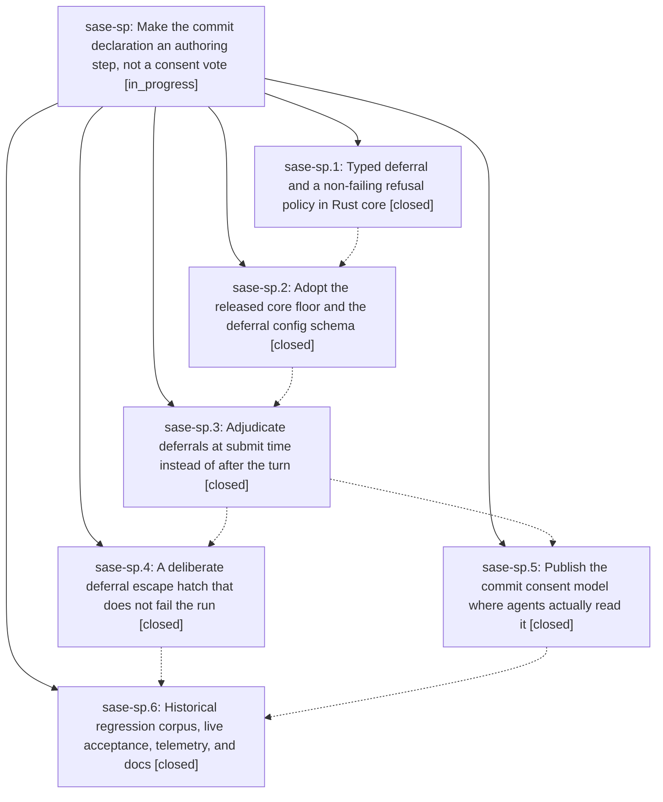

# Bead: sase-sp — Make the commit declaration an authoring step, not a consent vote

[Bead Pages](../README.md) / sase-sp

**Status:** ◐ in_progress · **Type:** ▸ plan · **Tier:** epic
**Owner:** `bryanbugyi34@gmail.com` · **Created by:** [bbugyi200.athena.0ca](https://github.com/sase-org/sase--agents/blob/main/families/bbugyi200.athena.0ca.md) · **Assignee:** `sase-sp.land`
**Created:** 2026-08-24 09:19:07 EDT
**Plan:** [202608/finalizer\_commit\_authoring.md](https://github.com/sase-org/sase--plans/blob/main/202608/finalizer_commit_authoring.md)

## Description

The finalizer declaration asks an agent only to author commit messages. Leaving a tree dirty becomes a rare, typed, host-adjudicated deferral that is corrected while the agent is still alive and never destroys a run.

## Notes

Check to make sure the 0cr sase agent didn't commit work that conflicts with this epic.

[2026-08-24T18:41:35Z · 0cq] DISCOVERED ISSUE: During unrelated Artifacts query-history implementation at HEAD f72ff9f38, just check escalated to the full pytest lane and failed tests/test_config_schema.py::test_default_config_matches_public_schema with finalizers.instances.commit.refusal: 'defer' is not one of ['fail']. Focused rerun reproduced the same schema error. The local diff does not touch src/sase/default_config.yml or config schema code; this appears causally tied to this epic's deferral/refusal-policy work, especially phase sase-sp.2's deferral config schema scope.

[2026-08-24T19:12:55Z · 0cw] DISCOVERED ISSUE: During unrelated Agents-tab mark navigation work at HEAD d88994bd8, just check failed at lint (symvision) after fmt, keep-sorted, ruff, mypy, feature-flag, pyscripts, test-waits, changelog, and terminology gates passed. Failure is deterministic gate output from just _lint-symvision: unused public symbols AuthenticatedFinalizerPlan in src/sase/finalizers/plan.py plus configured_instance_from_json and configured_instance_to_json in src/sase/finalizers/config.py. My local diff only touches src/sase/ace/tui/actions/agents/_marking_navigation.py and tests/ace/tui/test_agent_marking.py, so this is unrelated to the mark-navigation tale. Routed here via /sase_new_task instead of creating a standalone task because active epic sase-sp owns finalizer declaration/refusal/config work and is a credible causal owner for public finalizer APIs left unused.

## Phases

| Bead | Title | Status | Size | Created | Agents | Commits |
|---|---|---|---|---|---:|---:|
| [sase-sp.1](sase-sp.1.md) | Typed deferral and a non-failing refusal policy in Rust core | ✓ closed | medium | 2026-08-24 | 1 | 1 |
| [sase-sp.2](sase-sp.2.md) | Adopt the released core floor and the deferral config schema | ✓ closed | small | 2026-08-24 | 1 | 1 |
| [sase-sp.3](sase-sp.3.md) | Adjudicate deferrals at submit time instead of after the turn | ✓ closed | medium | 2026-08-24 | 1 | 1 |
| [sase-sp.4](sase-sp.4.md) | A deliberate deferral escape hatch that does not fail the run | ✓ closed | medium | 2026-08-24 | 1 | 1 |
| [sase-sp.5](sase-sp.5.md) | Publish the commit consent model where agents actually read it | ✓ closed | medium | 2026-08-24 | 1 | 1 |
| [sase-sp.6](sase-sp.6.md) | Historical regression corpus, live acceptance, telemetry, and docs | ✓ closed | medium | 2026-08-24 | 1 | 1 |

## Lineage

## Agents

| Agent | Bead | Commits |
|---|---|---:|
| [bbugyi200.athena.sase-sp.1](https://github.com/sase-org/sase--agents/blob/main/agents/bbugyi200.athena.sase-sp.1/README.md) | [sase-sp.1](sase-sp.1.md) | 1 |
| [bbugyi200.athena.sase-sp.2](https://github.com/sase-org/sase--agents/blob/main/families/bbugyi200.athena.sase-sp.2.md) | [sase-sp.2](sase-sp.2.md) | 1 |
| [bbugyi200.athena.sase-sp.3](https://github.com/sase-org/sase--agents/blob/main/agents/bbugyi200.athena.sase-sp.3/README.md) | [sase-sp.3](sase-sp.3.md) | 1 |
| [bbugyi200.athena.sase-sp.4](https://github.com/sase-org/sase--agents/blob/main/families/bbugyi200.athena.sase-sp.4.md) | [sase-sp.4](sase-sp.4.md) | 1 |
| [bbugyi200.athena.sase-sp.5](https://github.com/sase-org/sase--agents/blob/main/agents/bbugyi200.athena.sase-sp.5/README.md) | [sase-sp.5](sase-sp.5.md) | 1 |
| [bbugyi200.athena.sase-sp.6](https://github.com/sase-org/sase--agents/blob/main/agents/bbugyi200.athena.sase-sp.6/README.md) | [sase-sp.6](sase-sp.6.md) | 1 |
| [bbugyi200.athena.sase-sp.land](https://github.com/sase-org/sase--agents/blob/main/agents/bbugyi200.athena.sase-sp.land/README.md) | [sase-sp](README.md) | 0 |

## Commits

| Repo | Commit | Subject | Bead | Committed |
|---|---|---|---|---|
| sase-core | [`sase-core@afd1f87`](https://github.com/sase-org/sase-core/commit/afd1f872ae785bac21cce97c4b8b85f24ebb82f7) | feat(finalizer): add typed deferral reason and non-failing Deferred status | [sase-sp.1](sase-sp.1.md) | 2026-08-24 09:33:11 EDT |
| sase | [`7b74525`](https://github.com/sase-org/sase/commit/7b74525044362eaee944f3dbe79474dc35eec651) | fix(finalizer): speak core finalizer wire v2 and decouple the plugin envelope | [sase-sp](README.md) | 2026-08-24 10:56:50 EDT |
| sase | [`570b6be`](https://github.com/sase-org/sase/commit/570b6be4b0c12eec328e1b8c66ac1440672fd81a) | feat(finalizers): raise sase-core-rs floor and wire FinalizerDeferralWire | [sase-sp.2](sase-sp.2.md) | 2026-08-24 11:01:09 EDT |
| sase | [`524d8f2`](https://github.com/sase-org/sase/commit/524d8f26f2b3ff619132248135ef2322349463c5) | feat(finalizers): adjudicate typed deferrals at submit time | [sase-sp.3](sase-sp.3.md) | 2026-08-24 12:12:14 EDT |
| sase | [`4580649`](https://github.com/sase-org/sase/commit/45806495fa3905e8d279f1bc504a24a9f02461e2) | feat(final): publish commit declaration consent model | [sase-sp.5](sase-sp.5.md) | 2026-08-24 12:50:15 EDT |
| sase | [`2b046b1`](https://github.com/sase-org/sase/commit/2b046b17460b2e86e24a157c1ba54a97549fd06a) | feat(finalizers): defer commit on refusal instead of failing the turn | [sase-sp.4](sase-sp.4.md) | 2026-08-24 13:22:05 EDT |
| sase | [`96675cd`](https://github.com/sase-org/sase/commit/96675cd1aa8641dd4aa9f0cd4d112c2b1723adfb) | test(finalizers): add historical refusal regression corpus and deferral telemetry | [sase-sp.6](sase-sp.6.md) | 2026-08-24 15:25:22 EDT |
