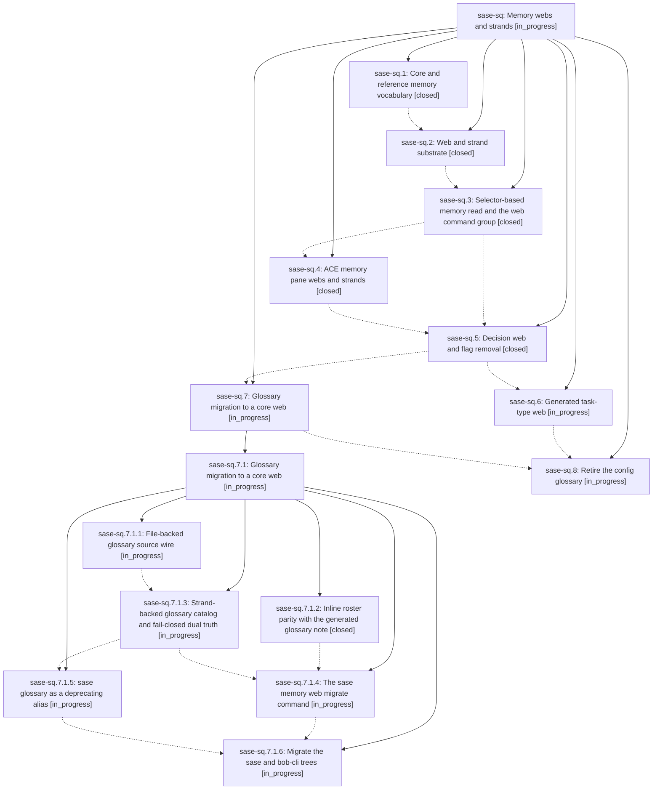

# Bead: sase-sq — Memory webs and strands

[Bead Pages](../README.md) / sase-sq

**Status:** ◐ in_progress · **Type:** ▸ plan · **Tier:** epic
**Owner:** `bryanbugyi34@gmail.com` · **Created by:** [bbugyi200.athena.0cb](https://github.com/sase-org/sase--agents/blob/main/families/bbugyi200.athena.0cb.md) · **Assignee:** `sase-sq.land`
**Created:** 2026-08-24 09:32:12 EDT
**Plan:** [202608/memory\_webs.md](https://github.com/sase-org/sase--plans/blob/main/202608/memory_webs.md)

## Description

A keyed memory collection is a first-class SASE memory kind: one flat web descriptor note plus a sibling directory of strand files, configured by users adding files, rendered as core or reference memory per web, and read with `sase memory read <web>:<keyword>`. The glossary, task types, and a new decision log all run on that one substrate, and the config-backed glossary is gone.

## Notes

[2026-08-24T15:42:12Z · 0ch] DISCOVERED ISSUE: During unrelated pool-launch-reservation verification on 2026-08-24, just check passed fmt, Ruff, mypy, feature-flag/script/test-wait/changelog/terminology, Symvision, and toobig lint, then failed only SASE validation at init memory --check. Reproduction: just check, or .venv/bin/sase validate. Failure: home memory initialization wants to refresh ~/.local/share/chezmoi/home/sase/memory/sase.md, README.md, AGENTS.md, CLAUDE.md, GEMINI.md, QWEN.md, and OPENCODE.md, and reports blocker 'unreferenced memory file sase/memory/obsidian.md'. Impact: every agent's required just check remains red after code/lint gates pass until the memory/web generator state and chezmoi home memory agree. I did not run sase memory init because current instructions forbid memory-file/provider-shim edits without explicit user permission, and this is unrelated to the pool reservation diff. Duplicate search across task(memory) statuses found no obsidian/init-memory/unreferenced-memory match; routed here because this epic owns the active memory-web substrate and reference/core memory transition.

[2026-08-24T22:57:38Z · 0d2] DISCOVERED ISSUE: During canonical_parent_plan_refs verification on 2026-08-24, just check passed fmt, Ruff, mypy, feature-flag/script/test-wait/changelog/terminology, Symvision, and toobig lint, then failed only SASE validation at init memory --check. Reproduction: just check, or .venv/bin/sase validate. Current failure wants to refresh ~/.local/share/chezmoi/home/sase/memory/sase.md (+1) and ~/.local/share/chezmoi/home/sase/memory/README.md (+8 -5). I did not run sase memory init because current instructions forbid memory-file/provider-shim edits without explicit user permission, and this is unrelated to the parent-plan display diff. This corroborates the existing init-memory drift note on this memory-web epic rather than a new task.

## Phases

| Bead | Title | Status | Size | Created | Agents | Commits |
|---|---|---|---|---|---:|---:|
| [sase-sq.1](sase-sq.1.md) | Core and reference memory vocabulary | ✓ closed | large | 2026-08-24 | 1 | 2 |
| [sase-sq.2](sase-sq.2.md) | Web and strand substrate | ✓ closed | large | 2026-08-24 | 1 | 1 |
| [sase-sq.3](sase-sq.3.md) | Selector-based memory read and the web command group | ✓ closed | medium | 2026-08-24 | 1 | 1 |
| [sase-sq.4](sase-sq.4.md) | ACE memory pane webs and strands | ✓ closed | medium | 2026-08-24 | 1 | 1 |
| [sase-sq.5](sase-sq.5.md) | Decision web and flag removal | ✓ closed | medium | 2026-08-24 | 1 | 1 |
| [sase-sq.6](sase-sq.6.md) | Generated task-type web | ◐ in_progress | medium | 2026-08-24 | 1 | 1 |
| [sase-sq.7](sase-sq.7.md) | Glossary migration to a core web | ◐ in_progress | large | 2026-08-24 | 1 | 0 |
| [sase-sq.8](sase-sq.8.md) | Retire the config glossary | ◐ in_progress | large | 2026-08-24 | 1 | 0 |

## Lineage

## Agents

| Agent | Bead | Commits |
|---|---|---:|
| [bbugyi200.athena.sase-sq.1](https://github.com/sase-org/sase--agents/blob/main/families/bbugyi200.athena.sase-sq.1.md) | [sase-sq.1](sase-sq.1.md) | 2 |
| [bbugyi200.athena.sase-sq.2](https://github.com/sase-org/sase--agents/blob/main/families/bbugyi200.athena.sase-sq.2.md) | [sase-sq.2](sase-sq.2.md) | 1 |
| [bbugyi200.athena.sase-sq.3](https://github.com/sase-org/sase--agents/blob/main/agents/bbugyi200.athena.sase-sq.3/README.md) | [sase-sq.3](sase-sq.3.md) | 1 |
| [bbugyi200.athena.sase-sq.4](https://github.com/sase-org/sase--agents/blob/main/agents/bbugyi200.athena.sase-sq.4/README.md) | [sase-sq.4](sase-sq.4.md) | 1 |
| [bbugyi200.athena.sase-sq.5](https://github.com/sase-org/sase--agents/blob/main/families/bbugyi200.athena.sase-sq.5.md) | [sase-sq.5](sase-sq.5.md) | 1 |
| [bbugyi200.athena.sase-sq.6](https://github.com/sase-org/sase--agents/blob/main/agents/bbugyi200.athena.sase-sq.6/README.md) | [sase-sq.6](sase-sq.6.md) | 1 |
| [bbugyi200.athena.sase-sq.7](https://github.com/sase-org/sase--agents/blob/main/families/bbugyi200.athena.sase-sq.7.md) | [sase-sq.7](sase-sq.7.md) | 0 |
| [bbugyi200.athena.sase-sq.7.1.1](https://github.com/sase-org/sase--agents/blob/main/agents/bbugyi200.athena.sase-sq.7.1.1/README.md) | [sase-sq.7.1.1](sase-sq.7.1.1.md) | 0 |
| [bbugyi200.athena.sase-sq.7.1.2](https://github.com/sase-org/sase--agents/blob/main/agents/bbugyi200.athena.sase-sq.7.1.2/README.md) | [sase-sq.7.1.2](sase-sq.7.1.2.md) | 1 |
| [bbugyi200.athena.sase-sq.7.1.3](https://github.com/sase-org/sase--agents/blob/main/agents/bbugyi200.athena.sase-sq.7.1.3/README.md) | [sase-sq.7.1.3](sase-sq.7.1.3.md) | 0 |
| [bbugyi200.athena.sase-sq.7.1.4](https://github.com/sase-org/sase--agents/blob/main/agents/bbugyi200.athena.sase-sq.7.1.4/README.md) | [sase-sq.7.1.4](sase-sq.7.1.4.md) | 0 |
| [bbugyi200.athena.sase-sq.7.1.5](https://github.com/sase-org/sase--agents/blob/main/agents/bbugyi200.athena.sase-sq.7.1.5/README.md) | [sase-sq.7.1.5](sase-sq.7.1.5.md) | 0 |
| [bbugyi200.athena.sase-sq.7.1.6](https://github.com/sase-org/sase--agents/blob/main/agents/bbugyi200.athena.sase-sq.7.1.6/README.md) | [sase-sq.7.1.6](sase-sq.7.1.6.md) | 0 |
| [bbugyi200.athena.sase-sq.7.1.land](https://github.com/sase-org/sase--agents/blob/main/agents/bbugyi200.athena.sase-sq.7.1.land/README.md) | [sase-sq.7.1](sase-sq.7.1.md) | 0 |
| [bbugyi200.athena.sase-sq.8](https://github.com/sase-org/sase--agents/blob/main/agents/bbugyi200.athena.sase-sq.8/README.md) | [sase-sq.8](sase-sq.8.md) | 0 |
| [bbugyi200.athena.sase-sq.land](https://github.com/sase-org/sase--agents/blob/main/agents/bbugyi200.athena.sase-sq.land/README.md) | [sase-sq](README.md) | 0 |

## Commits

| Repo | Commit | Subject | Bead | Committed |
|---|---|---|---|---|
| sase | [`c9ca0db`](https://github.com/sase-org/sase/commit/c9ca0db5f8d0d7b5d007010e661abb1d2b5638dc) | feat(memory): rename memory tiers to core and reference | [sase-sq.1](sase-sq.1.md) | 2026-08-24 12:41:31 EDT |
| sase-core | [`sase-core@f6eedd9`](https://github.com/sase-org/sase-core/commit/f6eedd98fbb6e72cb0adeb7fd40a71ff5b47906e) | feat(memory): support core and reference memory tiers | [sase-sq.1](sase-sq.1.md) | 2026-08-24 12:49:09 EDT |
| sase | [`f72ff9f`](https://github.com/sase-org/sase/commit/f72ff9f385643bfe1f7a9b35f72702bd4b055163) | feat(memory): add memory web substrate | [sase-sq.2](sase-sq.2.md) | 2026-08-24 13:51:40 EDT |
| sase | [`cbda792`](https://github.com/sase-org/sase/commit/cbda7926f05ffc09eb1c3aaa4693f4fe6a1fbda7) | feat(memory): make memory read/show variadic over note/web/strand selectors and add the web command group | [sase-sq.3](sase-sq.3.md) | 2026-08-24 15:12:12 EDT |
| sase | [`b3e0cc0`](https://github.com/sase-org/sase/commit/b3e0cc0e48d71722e6ec0ffa0525c4127d7cdb0b) | feat: add ACE memory web browsing | [sase-sq.4](sase-sq.4.md) | 2026-08-24 16:22:15 EDT |
| sase | [`0adb544`](https://github.com/sase-org/sase/commit/0adb544096e9e87001cee9631c98e0a32be6c5d4) | feat(memory): remove memory\_webs flag and ship the decisions web | [sase-sq.5](sase-sq.5.md) | 2026-08-24 17:56:58 EDT |
| sase | [`2450497`](https://github.com/sase-org/sase/commit/2450497bbc17dca97a27b08c4527612e43e0eaac) | feat(memory): add lookup and roster modules for memory web decisions | [sase-sq.7.1.2](sase-sq.7.1.2.md) | 2026-08-24 18:32:20 EDT |
| sase | [`eb77577`](https://github.com/sase-org/sase/commit/eb775777bd4080924c17bb3910583a1c1ed828bb) | feat(memory): generate task-type strands as a memory web with structured notes | [sase-sq.6](sase-sq.6.md) | 2026-08-24 19:04:02 EDT |
