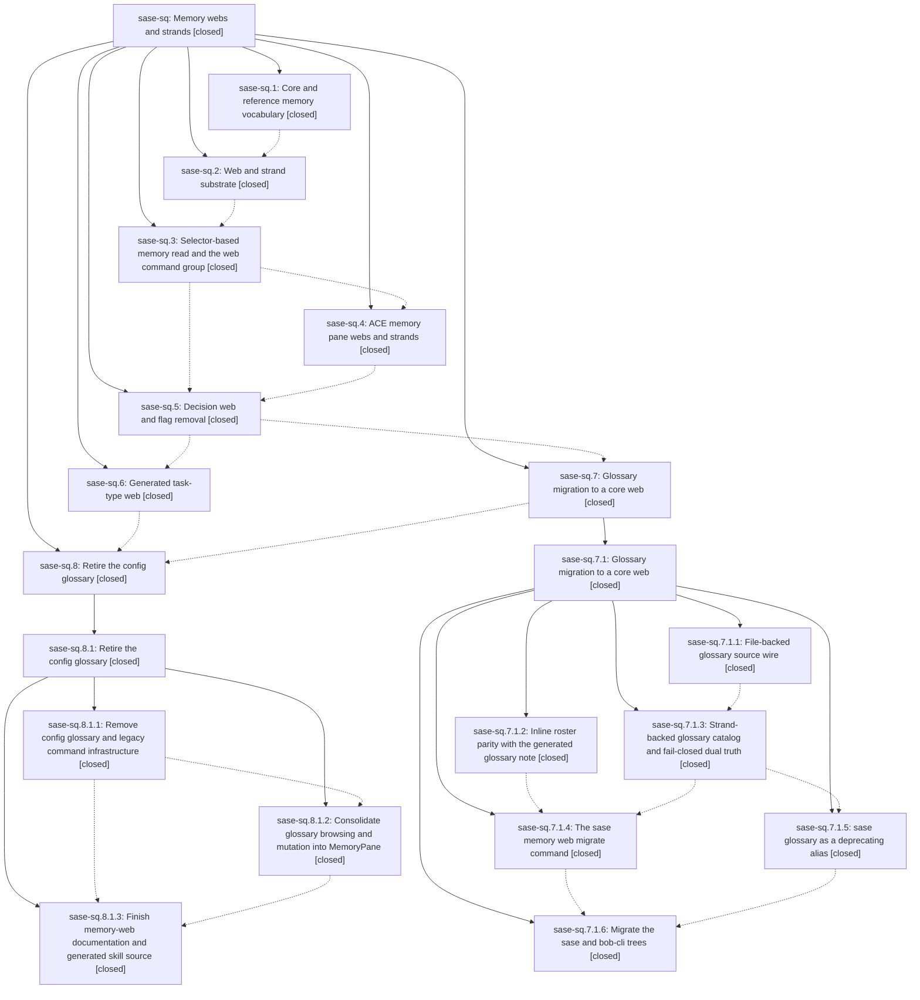

# Bead: sase-sq — Memory webs and strands

[Bead Pages](../README.md) / sase-sq

**Status:** ✓ closed · **Resolution:** done · **Type:** ▸ plan · **Tier:** epic
**Owner:** `bryanbugyi34@gmail.com` · **Created by:** [bbugyi200.athena.0cb](https://github.com/sase-org/sase--agents/blob/main/families/bbugyi200.athena.0cb.md) · **Assignee:** `sase-sq.land`
**Created:** 2026-08-24 09:32:12 EDT · **Closed:** 2026-08-25 04:15:17 EDT
**Plan:** [202608/memory\_webs.md](https://github.com/sase-org/sase--plans/blob/main/202608/memory_webs.md)

## Description

A keyed memory collection is a first-class SASE memory kind: one flat web descriptor note plus a sibling directory of strand files, configured by users adding files, rendered as core or reference memory per web, and read with `sase memory read <web>:<keyword>`. The glossary, task types, and a new decision log all run on that one substrate, and the config-backed glossary is gone.

## Notes

[2026-08-24T15:42:12Z · 0ch] DISCOVERED ISSUE: During unrelated pool-launch-reservation verification on 2026-08-24, just check passed fmt, Ruff, mypy, feature-flag/script/test-wait/changelog/terminology, Symvision, and toobig lint, then failed only SASE validation at init memory --check. Reproduction: just check, or .venv/bin/sase validate. Failure: home memory initialization wants to refresh ~/.local/share/chezmoi/home/sase/memory/sase.md, README.md, AGENTS.md, CLAUDE.md, GEMINI.md, QWEN.md, and OPENCODE.md, and reports blocker 'unreferenced memory file sase/memory/obsidian.md'. Impact: every agent's required just check remains red after code/lint gates pass until the memory/web generator state and chezmoi home memory agree. I did not run sase memory init because current instructions forbid memory-file/provider-shim edits without explicit user permission, and this is unrelated to the pool reservation diff. Duplicate search across task(memory) statuses found no obsidian/init-memory/unreferenced-memory match; routed here because this epic owns the active memory-web substrate and reference/core memory transition.

[2026-08-24T22:57:38Z · 0d2] DISCOVERED ISSUE: During canonical_parent_plan_refs verification on 2026-08-24, just check passed fmt, Ruff, mypy, feature-flag/script/test-wait/changelog/terminology, Symvision, and toobig lint, then failed only SASE validation at init memory --check. Reproduction: just check, or .venv/bin/sase validate. Current failure wants to refresh ~/.local/share/chezmoi/home/sase/memory/sase.md (+1) and ~/.local/share/chezmoi/home/sase/memory/README.md (+8 -5). I did not run sase memory init because current instructions forbid memory-file/provider-shim edits without explicit user permission, and this is unrelated to the parent-plan display diff. This corroborates the existing init-memory drift note on this memory-web epic rather than a new task.

[2026-08-24T23:54:00Z · 0d5] DISCOVERED ISSUE: During restore_chop_wait_chains verification on 2026-08-24, just check passed fmt, Ruff, mypy, feature-flag/script/test-wait/changelog/terminology, Symvision, and toobig lint, then failed only SASE validation at init memory --check. Reproduction: just check, or .venv/bin/sase validate. Current failure wants to update the generated memory README at sase/memory/README.md (+2 -2). I did not run sase memory init because current instructions forbid memory-file/provider-shim edits without explicit user permission, and this is unrelated to the AXE chop wait-chain diff. This corroborates the existing init-memory drift notes on this memory-web epic rather than a new task.

[2026-08-25T07:47:45Z · sase-sq.land] LAND PROGRESS (sase-sq.land, master 39bc4bc70 + uncommitted landing diff). Recording state before handing the full suite to a monitor.

VERIFIED (step 1). Read the epic bead, all 8 phase beads, both nested child epics (sase-sq.7.1, sase-sq.8.1) and every note. All 8 phases are CLOSED/done. Checked the plan's five acceptance criteria against the tree, not the notes: sase/memory/glossary.md is a user-owned core web (web: true, roster: inline, closure: mentions) with 39 strands and no memory.glossary in sase/sase.yml, home, or bob-cli origin/master; sase/memory/task_types.md is a generated core web with 5 registry-driven strands; sase/memory/decisions.md is a core web with 6 records; AGENTS.md carries '## Tier 1 (core) Memory' / '## Tier 2 (reference) Memory'; the memory_webs flag is gone from src/sase/feature_flags/ and its flag bead sase-sy is closed. Verified the rendering invariant directly: no strand body from any of the three webs appears in AGENTS.md. Verified the sase-core half in the linked checkout at v0.32.3 (c0958b0): MemoryTierWire parses core/reference with short/long serde aliases, GLOSSARY_WIRE_SCHEMA_VERSION = 2. Exercised the CLI end to end: memory web list shows all three webs, memory web show decisions renders the index, and a mixed batch read of glossary:stitch decisions:memory-webs task_types:bug resolves with the glossary's mention closure intact. sase bead epic-symbols sase-sq reports no entries.

INTEGRATED (step 2). Reviewed all 64 commits since c9ca0db5f, 48 of them non-epic. The nested land agents covered the windows after af27e67e0; I reviewed the earlier window they never saw. One commit genuinely interacts: c09fe5170 (core memory priority) landed mid-epic and already integrated itself — memory/web/frontmatter.py parses priority, rejects it on reference webs, models.py carries it, root_planning.py:237 passes web.priority into the core-note overlay, and amd/_memory.py:248 orders by (priority, path). 39bc4bc70, the only commit after the last epic commit, is an unrelated script split. No conflicts or duplication found.

FIXED AS EPIC WORK. sase-sq.8.1's close note claims six gap-fixes; none of them were ever committed to this repo (there is no commit from sase-sq.8.1.land, and the tree still carried all six defects). All six are epic-caused and are fixed in this turn's diff:
1. memory-README.template.md emitted *is* / *renders* while prettier normalizes generated Markdown to _is_ / _renders_, so sase memory init --check reported permanent one-line drift in the sase and home roots. This is the exact blocker behind this epic's own notes 1-3. Fixed the template; sase memory init --check and sase validate are now clean for every root, and bob-cli's origin/master README already carries _is_, so all three roots agree.
2. cebab38a1 dropped `from datetime import UTC, datetime` from tests/main/test_memory_log.py along with the glossary-log tests, leaving two proposal tests raising NameError. Restored; 12 passed.
3. tests/ace/tui/widgets/test_prompt_glossary_panel_entry.py still asserted GlossaryPanelRequested.term, removed by 93d379e0a. Rewritten against note_identity, including a real source_path case that exercises the glossary:<slug> derivation and a new no-source-path miss case; 7 passed.
4. tests/xprompt/test_repo_mention_catalog.py::test_glossary_claimed_name_excluded seeded its exclusion from a memory.glossary config block that no longer feeds the catalog. Reseeded from a real glossary web descriptor plus strand; 13 passed.
5. Removing the Glossary sub-tab left _config_hub_strip_thresholds branching at tab_count >= 7, which is now unreachable, so both flag states fell back to the 5-tab-era 85/73 and micro kicked in at 73 against a 59-cell compact strip. I re-measured the rendered strip myself rather than trusting the phase note: 6 tabs (Flags on) render 81 full / 59 compact, 5 tabs (Flags off) 68 / 48. Retuned to 82/60 and 69/49 with the branch at >= 6, and rewrote the stale comments that still named a Gloss tab. Updated the paired threshold test plus five more that assumed the old tab count: config-hub digit navigation (04->03 launch, f4+6->f4+5 snippets), the flags-pane prefix forward (07->06 xprompts), and two feature-flags catalog assertions (six shortcuts -> five, and the tab-id tuple that still listed 'glossary').
6. Rebaselined 18 Config-hub PNG goldens. I checked every diff first by computing its changed-pixel bounding box: all 18 are confined to a single 26px text row, the tab strip, with no change anywhere else in any frame. The two 70x32 frames also flip micro -> compact, which is the point of fix 5.

GATES SO FAR. just check passes fmt (python), fmt (markdown), keep-sorted, ruff, mypy, feature flags, pyscripts, test waits, changelog, patch/stitch terminology, and toobig, then fails only at lint (symvision) on sase-tb (18 private chat_fork imports from unrelated commit 9a7fd2e99, +4 corroborations, not this epic's files). sase validate is green on all seven checks. Targeted suites green: 294 memory/init-memory, 573 scoped-selection, 382 ACE config, 20 config-hub visual. tools/select_tests escalates to the full suite on this diff, so the full suite is running under a monitor before this epic closes.

FOLLOW-UPS (step 3). Every PROPOSED FOLLOW-UP on the direct phase beads is dispositioned. sase-sq.1: (n1) ratchet the sase-core-rs floor — the release exists as v0.32.3 and 7.1.land already recorded it as evidence on sase-so.5.1, the in-progress phase that owns the ratchet; no action. (n2) regenerate bob-cli memory — done; bob-cli origin/master carries type: core / type: reference notes, 4 glossary strands, 4 task-type strands, and no memory.glossary; the local checkout being 5 commits behind origin is stale-clone drift, not epic work. (n3) sase skill init — done; the deployed ~/.claude/skills/sase_memory_read/SKILL.md documents the two-axis model and web:keyword reads, and sase skill init --check is clean. (n4) memory-directory-map.png/prompt still say short/long — filed as sase-te (bug, small); regenerating the PNG needs an image model, so it could not be discharged here. (n5) internal short/long identifier rename — filed as sase-tf (bug, medium), 121 sites, linked related to sase-te. sase-sq.3: (n1) config-schema 'defer' refusal — already fixed on master by 6a91ae88e and recorded on sase-o0. (n2) test_canonical_query_round_trip_property Hypothesis too_slow — duplicate of sase-sv, which already carries a +1 naming the exact tests/test_vcs_log_filter_query.py node; I could not reproduce it (passes in 0.47s, absent from tests/reproducible_flake_baseline.txt) so I recorded a negative-reproduction note rather than a +1. (n3) test_project_beads_skips_when_store_is_absent — already a +1 on sase-eq. sase-sq.5: (n1) roster.py inline-branch wrapping — already fixed; roster.py:48 wraps through wrap_markdown at markdown_print_width(). (n2) sase-core v0.32.0 bead-notes schema break — routed to sase-t2 by 7.1.land and no longer reproducing: this workspace rebuilt sase_core_rs from the v0.32.3 checkout and every bead mutation this turn succeeded.

[2026-08-25T08:15:17Z · sase-sq.land--1] LAND COMPLETE (sase-sq.land, master 39bc4bc70 + landing diff). Full detail of steps 1-2 is in note #4; this note records the verification that gated the close.

VERIFIED (step 1). Read the epic, al

… and 5306 more characters

## Phases

| Bead | Title | Status | Size | Created | Agents | Commits |
|---|---|---|---|---|---:|---:|
| [sase-sq.1](sase-sq.1.md) | Core and reference memory vocabulary | ✓ closed | large | 2026-08-24 | 1 | 2 |
| [sase-sq.2](sase-sq.2.md) | Web and strand substrate | ✓ closed | large | 2026-08-24 | 1 | 1 |
| [sase-sq.3](sase-sq.3.md) | Selector-based memory read and the web command group | ✓ closed | medium | 2026-08-24 | 1 | 1 |
| [sase-sq.4](sase-sq.4.md) | ACE memory pane webs and strands | ✓ closed | medium | 2026-08-24 | 1 | 1 |
| [sase-sq.5](sase-sq.5.md) | Decision web and flag removal | ✓ closed | medium | 2026-08-24 | 1 | 1 |
| [sase-sq.6](sase-sq.6.md) | Generated task-type web | ✓ closed | medium | 2026-08-24 | 1 | 1 |
| [sase-sq.7](sase-sq.7.md) | Glossary migration to a core web | ✓ closed | large | 2026-08-24 | 1 | 0 |
| [sase-sq.8](sase-sq.8.md) | Retire the config glossary | ✓ closed | large | 2026-08-24 | 1 | 0 |

## Lineage

## Agents

| Agent | Bead | Commits |
|---|---|---:|
| [bbugyi200.athena.sase-sq.1](https://github.com/sase-org/sase--agents/blob/main/families/bbugyi200.athena.sase-sq.1.md) | [sase-sq.1](sase-sq.1.md) | 2 |
| [bbugyi200.athena.sase-sq.2](https://github.com/sase-org/sase--agents/blob/main/families/bbugyi200.athena.sase-sq.2.md) | [sase-sq.2](sase-sq.2.md) | 1 |
| [bbugyi200.athena.sase-sq.3](https://github.com/sase-org/sase--agents/blob/main/agents/bbugyi200.athena.sase-sq.3/README.md) | [sase-sq.3](sase-sq.3.md) | 1 |
| [bbugyi200.athena.sase-sq.4](https://github.com/sase-org/sase--agents/blob/main/agents/bbugyi200.athena.sase-sq.4/README.md) | [sase-sq.4](sase-sq.4.md) | 1 |
| [bbugyi200.athena.sase-sq.5](https://github.com/sase-org/sase--agents/blob/main/families/bbugyi200.athena.sase-sq.5.md) | [sase-sq.5](sase-sq.5.md) | 1 |
| [bbugyi200.athena.sase-sq.6](https://github.com/sase-org/sase--agents/blob/main/agents/bbugyi200.athena.sase-sq.6/README.md) | [sase-sq.6](sase-sq.6.md) | 1 |
| [bbugyi200.athena.sase-sq.7](https://github.com/sase-org/sase--agents/blob/main/families/bbugyi200.athena.sase-sq.7.md) | [sase-sq.7](sase-sq.7.md) | 0 |
| [bbugyi200.athena.sase-sq.7.1.1](https://github.com/sase-org/sase--agents/blob/main/agents/bbugyi200.athena.sase-sq.7.1.1/README.md) | [sase-sq.7.1.1](sase-sq.7.1.1.md) | 2 |
| [bbugyi200.athena.sase-sq.7.1.2](https://github.com/sase-org/sase--agents/blob/main/agents/bbugyi200.athena.sase-sq.7.1.2/README.md) | [sase-sq.7.1.2](sase-sq.7.1.2.md) | 1 |
| [bbugyi200.athena.sase-sq.7.1.3](https://github.com/sase-org/sase--agents/blob/main/families/bbugyi200.athena.sase-sq.7.1.3.md) | [sase-sq.7.1.3](sase-sq.7.1.3.md) | 1 |
| [bbugyi200.athena.sase-sq.7.1.4](https://github.com/sase-org/sase--agents/blob/main/agents/bbugyi200.athena.sase-sq.7.1.4/README.md) | [sase-sq.7.1.4](sase-sq.7.1.4.md) | 1 |
| [bbugyi200.athena.sase-sq.7.1.5](https://github.com/sase-org/sase--agents/blob/main/agents/bbugyi200.athena.sase-sq.7.1.5/README.md) | [sase-sq.7.1.5](sase-sq.7.1.5.md) | 1 |
| [bbugyi200.athena.sase-sq.7.1.6](https://github.com/sase-org/sase--agents/blob/main/families/bbugyi200.athena.sase-sq.7.1.6.md) | [sase-sq.7.1.6](sase-sq.7.1.6.md) | 1 |
| [bbugyi200.athena.sase-sq.7.1.land](https://github.com/sase-org/sase--agents/blob/main/agents/bbugyi200.athena.sase-sq.7.1.land/README.md) | [sase-sq.7.1](sase-sq.7.1.md) | 1 |
| [bbugyi200.athena.sase-sq.8](https://github.com/sase-org/sase--agents/blob/main/families/bbugyi200.athena.sase-sq.8.md) | [sase-sq.8](sase-sq.8.md) | 0 |
| [bbugyi200.athena.sase-sq.8.1.1](https://github.com/sase-org/sase--agents/blob/main/agents/bbugyi200.athena.sase-sq.8.1.1/README.md) | [sase-sq.8.1.1](sase-sq.8.1.1.md) | 1 |
| [bbugyi200.athena.sase-sq.8.1.2](https://github.com/sase-org/sase--agents/blob/main/agents/bbugyi200.athena.sase-sq.8.1.2/README.md) | [sase-sq.8.1.2](sase-sq.8.1.2.md) | 1 |
| [bbugyi200.athena.sase-sq.8.1.3](https://github.com/sase-org/sase--agents/blob/main/agents/bbugyi200.athena.sase-sq.8.1.3/README.md) | [sase-sq.8.1.3](sase-sq.8.1.3.md) | 1 |
| [bbugyi200.athena.sase-sq.8.1.land](https://github.com/sase-org/sase--agents/blob/main/agents/bbugyi200.athena.sase-sq.8.1.land/README.md) | [sase-sq.8.1](sase-sq.8.1.md) | 1 |
| [bbugyi200.athena.sase-sq.land](https://github.com/sase-org/sase--agents/blob/main/families/bbugyi200.athena.sase-sq.land.md) | [sase-sq](README.md) | 1 |

## Commits

| Repo | Commit | Subject | Bead | Committed |
|---|---|---|---|---|
| sase | [`c9ca0db`](https://github.com/sase-org/sase/commit/c9ca0db5f8d0d7b5d007010e661abb1d2b5638dc) | feat(memory): rename memory tiers to core and reference | [sase-sq.1](sase-sq.1.md) | 2026-08-24 12:41:31 EDT |
| sase-core | [`sase-core@f6eedd9`](https://github.com/sase-org/sase-core/commit/f6eedd98fbb6e72cb0adeb7fd40a71ff5b47906e) | feat(memory): support core and reference memory tiers | [sase-sq.1](sase-sq.1.md) | 2026-08-24 12:49:09 EDT |
| sase | [`f72ff9f`](https://github.com/sase-org/sase/commit/f72ff9f385643bfe1f7a9b35f72702bd4b055163) | feat(memory): add memory web substrate | [sase-sq.2](sase-sq.2.md) | 2026-08-24 13:51:40 EDT |
| sase | [`cbda792`](https://github.com/sase-org/sase/commit/cbda7926f05ffc09eb1c3aaa4693f4fe6a1fbda7) | feat(memory): make memory read/show variadic over note/web/strand selectors and add the web command group | [sase-sq.3](sase-sq.3.md) | 2026-08-24 15:12:12 EDT |
| sase | [`b3e0cc0`](https://github.com/sase-org/sase/commit/b3e0cc0e48d71722e6ec0ffa0525c4127d7cdb0b) | feat: add ACE memory web browsing | [sase-sq.4](sase-sq.4.md) | 2026-08-24 16:22:15 EDT |
| sase | [`0adb544`](https://github.com/sase-org/sase/commit/0adb544096e9e87001cee9631c98e0a32be6c5d4) | feat(memory): remove memory\_webs flag and ship the decisions web | [sase-sq.5](sase-sq.5.md) | 2026-08-24 17:56:58 EDT |
| sase | [`2450497`](https://github.com/sase-org/sase/commit/2450497bbc17dca97a27b08c4527612e43e0eaac) | feat(memory): add lookup and roster modules for memory web decisions | [sase-sq.7.1.2](sase-sq.7.1.2.md) | 2026-08-24 18:32:20 EDT |
| sase | [`eb77577`](https://github.com/sase-org/sase/commit/eb775777bd4080924c17bb3910583a1c1ed828bb) | feat(memory): generate task-type strands as a memory web with structured notes | [sase-sq.6](sase-sq.6.md) | 2026-08-24 19:04:02 EDT |
| sase | [`af27e67`](https://github.com/sase-org/sase/commit/af27e67e06f1e9e185bc08e1581832e4cdd4f743) | feat(glossary): emit v2 source wire fields | [sase-sq.7.1.1](sase-sq.7.1.1.md) | 2026-08-24 19:19:45 EDT |
| sase-core | [`sase-core@151a37d`](https://github.com/sase-org/sase-core/commit/151a37df6a555732e08b5258b68f39bbc9cac58c) | feat(glossary): add source-backed wire v2 | [sase-sq.7.1.1](sase-sq.7.1.1.md) | 2026-08-24 19:20:39 EDT |
| sase | [`2b16a06`](https://github.com/sase-org/sase/commit/2b16a06483d60ab04cb5dc8cc7ce4966d76c2bac) | feat(memory): back the glossary catalog with strand-backed sources and fail-closed dual truth | [sase-sq.7.1.3](sase-sq.7.1.3.md) | 2026-08-24 20:21:42 EDT |
| sase | [`ec889f5`](https://github.com/sase-org/sase/commit/ec889f58788ba027631ba901c4be2232b983f5c0) | feat(glossary): add web-memory compat shim and strand mutation engine | [sase-sq.7.1.5](sase-sq.7.1.5.md) | 2026-08-24 21:01:08 EDT |
| sase | [`f7aa438`](https://github.com/sase-org/sase/commit/f7aa438ba77c65f3055eb469905d24ba1b29a449) | feat(memory): add glossary web migration command | [sase-sq.7.1.4](sase-sq.7.1.4.md) | 2026-08-24 21:22:16 EDT |
| sase | [`df95621`](https://github.com/sase-org/sase/commit/df956212be2c5c246cb45207c753623b3ca92f5e) | feat(memory): migrate sase glossary to web | [sase-sq.7.1.6](sase-sq.7.1.6.md) | 2026-08-24 22:24:33 EDT |
| sase | [`d9341f2`](https://github.com/sase-org/sase/commit/d9341f2366a7b1cc16db3a9212aed97c772bf793) | fix(memory): wrap the migrated glossary descriptor preamble | [sase-sq.7.1](sase-sq.7.1.md) | 2026-08-24 23:05:35 EDT |
| sase | [`cebab38`](https://github.com/sase-org/sase/commit/cebab38a1f9b793c59c0671954aab837ab76aee3) | feat(memory): retire config glossary infrastructure | [sase-sq.8.1.1](sase-sq.8.1.1.md) | 2026-08-24 23:55:11 EDT |
| sase | [`93d379e`](https://github.com/sase-org/sase/commit/93d379e0a66d4299fa429882a244450a47757418) | feat(memory): migrate glossary panel to memory panel and extract keymaps registry | [sase-sq.8.1.2](sase-sq.8.1.2.md) | 2026-08-25 00:54:34 EDT |
| sase | [`882ba36`](https://github.com/sase-org/sase/commit/882ba36f5ae84d3a82230ea2b7ee30f6e8a7d29d) | docs(memory): retire glossary strand references across docs and skills | [sase-sq.8.1.3](sase-sq.8.1.3.md) | 2026-08-25 01:32:09 EDT |
| sase | [`b592cfa`](https://github.com/sase-org/sase/commit/b592cfa5760d6f3f8c1b2f948780b0a8e25ae1cf) | fix(memory): finish retiring the config glossary across ACE and generated memory | [sase-sq.8.1](sase-sq.8.1.md) | 2026-08-25 02:53:12 EDT |
| sase | [`6271aa5`](https://github.com/sase-org/sase/commit/6271aa52d9a8c952feabd9998b60a15f9fa6a9de) | fix(memory): repair memory-web landing gaps and config hub tab strip | [sase-sq](README.md) | 2026-08-25 04:23:43 EDT |
