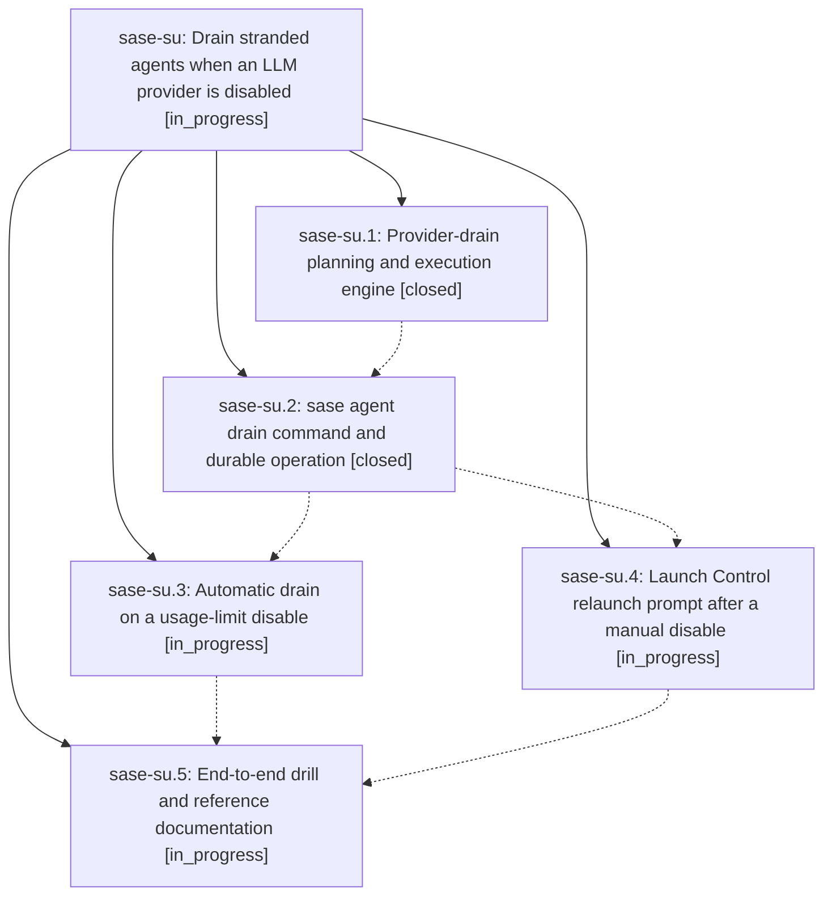

# Bead: sase-su — Drain stranded agents when an LLM provider is disabled

[Bead Pages](../README.md) / sase-su

**Status:** ◐ in_progress · **Type:** ▸ plan · **Tier:** epic
**Owner:** `bryanbugyi34@gmail.com` · **Created by:** [bbugyi200.athena.0ce](https://github.com/sase-org/sase--agents/blob/main/families/bbugyi200.athena.0ce.md) · **Assignee:** `sase-su.land`
**Created:** 2026-08-24 10:29:12 EDT
**Plan:** [202608/provider\_drain.md](https://github.com/sase-org/sase--plans/blob/main/202608/provider_drain.md)

## Description

Disabling a provider — automatically on a usage limit or by hand in Launch Control — relaunches the agents that provider stranded, and says exactly what moved and what did not.

## Notes

[2026-08-24T15:50:21Z · 0ci] DISCOVERED ISSUE: just check fails at lint (symvision) on a clean master tree (HEAD 1b2381366) unrelated to this epic's own diff. The Justfile's _lint-symvision recipe still passes --epic-symbol "sase-su.2(plan_provider_drain)" and --epic-symbol "sase-su.2(execute_provider_drain)" (lines 338-339), but symvision now reports: "symbol 'plan_provider_drain' is already properly used. Remove this unnecessary --epic-symbol entry." and the same for execute_provider_drain. Unlike the closed-bead stale-entry pattern (sase-o7), sase-su.2 is still IN_PROGRESS — these two symbols were apparently already wired up to a real non-test consumer by phase sase-su.1's landing commit (bf3206b8f), making the phase-2 exemption entries redundant from the start. Reproduced with: just install && SASE_SYMVISION_BEAD_STATUS_ONLY=1 BD_COMMAND=tools/sase_bead .venv/bin/symvision src/sase --exclude-decorator gate_command_entrypoint --exclude-decorator builtin_chop <full --epic-symbol whitelist from Justfile>. I hit this while implementing an unrelated approved plan (202608/coder_xprompt_plan_ref.md); confirmed via git status/git log that I did not touch the Justfile. Whichever phase (sase-su.2) actually consumes plan_provider_drain/execute_provider_drain should drop these two now-unnecessary --epic-symbol entries from the Justfile before it or the epic closes.

## Phases

| Bead | Title | Status | Size | Created | Agents | Commits |
|---|---|---|---|---|---:|---:|
| [sase-su.1](sase-su.1.md) | Provider-drain planning and execution engine | ✓ closed | medium | 2026-08-24 | 1 | 1 |
| [sase-su.2](sase-su.2.md) | sase agent drain command and durable operation | ✓ closed | medium | 2026-08-24 | 1 | 1 |
| [sase-su.3](sase-su.3.md) | Automatic drain on a usage-limit disable | ◐ in_progress | medium | 2026-08-24 | 1 | 0 |
| [sase-su.4](sase-su.4.md) | Launch Control relaunch prompt after a manual disable | ◐ in_progress | medium | 2026-08-24 | 1 | 0 |
| [sase-su.5](sase-su.5.md) | End-to-end drill and reference documentation | ◐ in_progress | small | 2026-08-24 | 1 | 0 |

## Lineage

## Agents

| Agent | Bead | Commits |
|---|---|---:|
| [bbugyi200.athena.sase-su.1](https://github.com/sase-org/sase--agents/blob/main/agents/bbugyi200.athena.sase-su.1/README.md) | [sase-su.1](sase-su.1.md) | 1 |
| [bbugyi200.athena.sase-su.2](https://github.com/sase-org/sase--agents/blob/main/agents/bbugyi200.athena.sase-su.2/README.md) | [sase-su.2](sase-su.2.md) | 1 |
| [bbugyi200.athena.sase-su.3](https://github.com/sase-org/sase--agents/blob/main/agents/bbugyi200.athena.sase-su.3/README.md) | [sase-su.3](sase-su.3.md) | 0 |
| [bbugyi200.athena.sase-su.4](https://github.com/sase-org/sase--agents/blob/main/agents/bbugyi200.athena.sase-su.4/README.md) | [sase-su.4](sase-su.4.md) | 0 |
| [bbugyi200.athena.sase-su.5](https://github.com/sase-org/sase--agents/blob/main/agents/bbugyi200.athena.sase-su.5/README.md) | [sase-su.5](sase-su.5.md) | 0 |
| [bbugyi200.athena.sase-su.land](https://github.com/sase-org/sase--agents/blob/main/agents/bbugyi200.athena.sase-su.land/README.md) | [sase-su](README.md) | 0 |

## Commits

| Repo | Commit | Subject | Bead | Committed |
|---|---|---|---|---|
| sase | [`bf3206b`](https://github.com/sase-org/sase/commit/bf3206b8f02c7f5ced964c93ff8574c2d734b5d4) | feat(agent): add provider-drain planning and execution engine | [sase-su.1](sase-su.1.md) | 2026-08-24 11:31:49 EDT |
| sase | [`f13361c`](https://github.com/sase-org/sase/commit/f13361ca35d7d996580e1d481582ef237ab83202) | feat(agent): add provider drain command | [sase-su.2](sase-su.2.md) | 2026-08-24 12:19:57 EDT |
