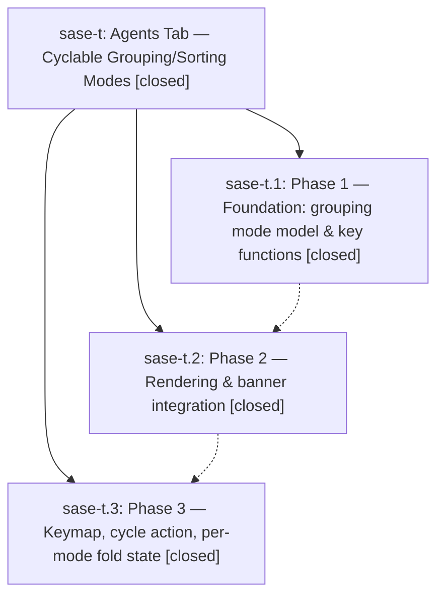

# Bead: sase-t — Agents Tab — Cyclable Grouping/Sorting Modes

[Bead Pages](../README.md) / sase-t

**Status:** ✓ closed · **Resolution:** (unrecorded) · **Type:** plan · **Tier:** epic
**Owner:** `bryanbugyi34@gmail.com`
**Created:** 2026-04-26 05:12:54 UTC · **Closed:** 2026-04-26 06:43:15 UTC
**Plan:** [202604/agents\_tab\_grouping\_modes.md](https://github.com/sase-org/sase--plans/blob/main/202604/agents_tab_grouping_modes.md)

## Phases

| Bead | Title | Status | Size | Agents | Commits |
|---|---|---|---|---:|---:|
| [sase-t.1](sase-t.1.md) | Phase 1 — Foundation: grouping mode model & key functions | ✓ closed | small | 0 | 1 |
| [sase-t.2](sase-t.2.md) | Phase 2 — Rendering & banner integration | ✓ closed | small | 0 | 1 |
| [sase-t.3](sase-t.3.md) | Phase 3 — Keymap, cycle action, per-mode fold state | ✓ closed | small | 0 | 1 |

## Lineage

## Commits

| Commit | Subject | Bead | Committed (UTC) |
|---|---|---|---|
| [`ec7f078`](https://github.com/sase-org/sase/commit/ec7f078d2261355c0b800e5acba9f13e97107493) | feat: add GroupingMode model + date/status bucket helpers (Phase 1) (sase-t.1) | [sase-t.1](sase-t.1.md) | 2026-04-26 05:28:41 |
| [`f68eebb`](https://github.com/sase-org/sase/commit/f68eebbfdde1775624002fdfd0a8563657458e9d) | feat: render Agents-tab BY\_DATE / BY\_STATUS bucket banners (Phase 2) (sase-t.2) | [sase-t.2](sase-t.2.md) | 2026-04-26 05:38:35 |
| [`2fb1d77`](https://github.com/sase-org/sase/commit/2fb1d7701699eaea531bee2552c7d5a893bf0120) | feat: cycle Agents-tab grouping mode with \`g\` (Phase 3, sase-t.3) (sase-t.3) | [sase-t.3](sase-t.3.md) | 2026-04-26 06:00:35 |
