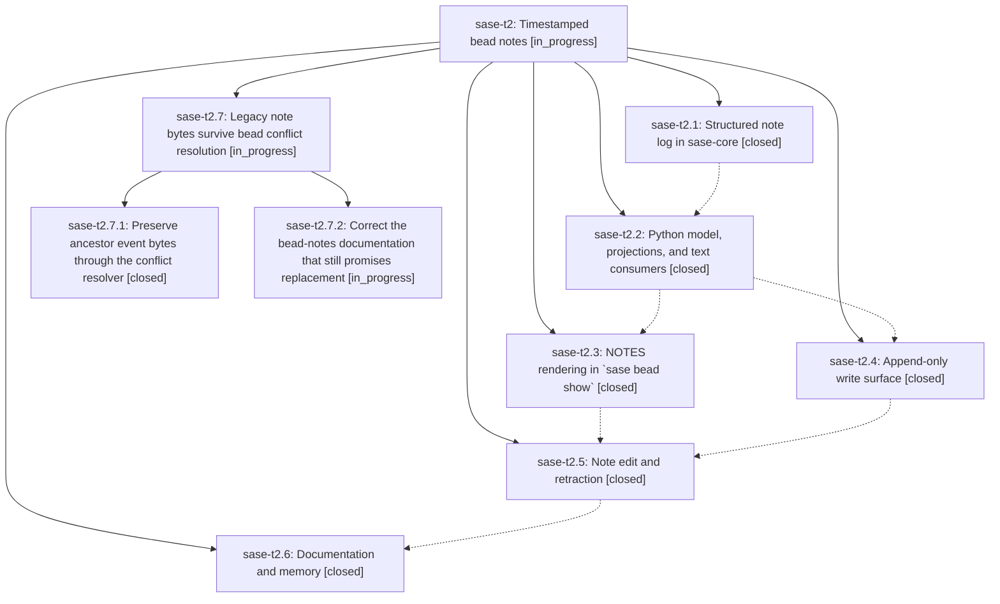

# Bead: sase-t2 — Timestamped bead notes

[Bead Pages](../README.md) / sase-t2

**Status:** ◐ in_progress · **Type:** ▸ plan · **Tier:** epic
**Owner:** `bryanbugyi34@gmail.com` · **Created by:** [bbugyi200.athena.0ct](https://github.com/sase-org/sase--agents/blob/main/families/bbugyi200.athena.0ct.md) · **Assignee:** `sase-t2.land`
**Created:** 2026-08-24 14:37:54 EDT
**Plan:** [202608/timestamped\_bead\_notes.md](https://github.com/sase-org/sase--plans/blob/main/202608/timestamped_bead_notes.md)

## Description

Every bead note carries a real timestamp and author as structured data, no write path can produce an untimestamped or clobbered note, and `sase bead show` renders the note log as a dated, attributed, per-entry section.

## Notes

[2026-08-24T22:56:40Z · 0cx] DISCOVERED ISSUE: During conflict-repair verification at HEAD c09fe5170, just check escalated to the full suite and failed bead CLI structured-note expectations. Reproduced serially on the same tree: tests/test_bead/test_cli_search.py::test_handle_bead_search_compact_includes_closed_and_match_reason now outputs notes: "private needle note" where the test still expects an attributed unknown note line; tests/test_bead/test_cli_golden.py::test_bead_cli_golden_contract[show_json], [show_phase_json], [list_full], [list_json], [list_json_limit], and [list_implicit_closed_json] now emit notes as an array plus notes_text where committed goldens still expect a string. This appears causally tied to the active structured/timestamped notes rollout in phase sase-t2.2, not to the memory-priority conflict repair.

[2026-08-25T02:07:58Z · toobig-41.project_mutations.0] CORROBORATION: During src/sase/bead/_project_mutations.py split cleanup verification on 2026-08-24, just test-scoped escalated to a broad 4-worker suite because the local coverage baseline was stale, then failed 8 bead CLI structured-note expectations: tests/test_bead/test_cli_golden.py list_full, list_json, list_json_limit, list_implicit_closed_json, show_json, show_phase_json; tests/test_bead/test_cli_history.py::test_history_full_makes_overwritten_note_revisions_readable; and tests/test_bead/test_cli_search.py::test_handle_bead_search_compact_includes_closed_and_match_reason. The local diff only touches src/sase/bead/_project_mutations_*.py. The JSON/golden/search failures match the existing structured-note rollout note on this epic; the history assertion also appears to be the same timestamped note projection class.

[2026-08-25T02:56:18Z · sase-sq.7.1.land] CORROBORATION (sase-sq.7.1.land, master df956212b): the structured/timestamped-notes drift on this epic is what four sase-sq.7.1 phase agents independently reported as PROPOSED FOLLOW-UPs (sase-sq.7.1.3 note 1, sase-sq.7.1.4 note 1, sase-sq.7.1.5 note 2, sase-sq.7.1.6 notes 1-2), each attributing it to a different unrelated cause. Reproduced serially on clean master df956212b with no working-tree changes: 8 failed, 75 passed for tests/test_bead/test_cli_golden.py + test_cli_history.py + test_cli_search.py. Failing nodes: test_cli_golden.py::test_bead_cli_golden_contract[list_full|list_json|list_json_limit|list_implicit_closed_json|show_json|show_phase_json], test_cli_history.py::test_history_full_makes_overwritten_note_revisions_readable (separately tracked as sase-t9, hardcoded date literal, different root cause), and test_cli_search.py::test_handle_bead_search_compact_includes_closed_and_match_reason (asserts 'unknown] private needle note', actual output is 'notes: "private needle note"'). Note that sase-sq.5 note 2 argues the same sase-core structured-notes change (bda9efc, released v0.32.0) is why dev installs built from the linked sase-core checkout diverge from the pinned <0.32.0 published floor, which is the environment every agent's just check runs in. No new task bead created; routing here per the existing DISCOVERED ISSUE notes on this epic.

[2026-08-25T06:09:32Z · sase-sq.8.1.land] CORROBORATION: the bead-CLI structured-note drift still reproduces on master 882ba36f5 (a newer HEAD than the df956212b run already recorded here). Full-suite run: 6 nodes in tests/test_bead/test_cli_golden.py (list_full, list_json, list_json_limit, list_implicit_closed_json, show_json, show_phase_json) plus tests/test_bead/test_cli_search.py::test_handle_bead_search_compact_includes_closed_and_match_reason. show_json's golden still expects "notes": "" while cli_detail_json.py emits a notes array plus notes_text; the search node still expects the pre-structured-notes 'unknown] private needle note' rendering instead of 'notes: "private needle note"'. Reproduced by sase-sq.8.1.land while verifying epic sase-sq.8.1 (retire the config glossary); unrelated to that epic, whose commits never touch src/sase/bead. The eighth node in that historical cluster, test_cli_history.py::test_history_full_makes_overwritten_note_revisions_readable, is sase-t9's hardcoded-date cause, not this one.

[2026-08-25T08:09:28Z · sase-sq.land--1] DISCOVERED ISSUE (corroboration, sase-sq.land): the bead-CLI structured-note drift still reproduces at master 39bc4bc70, one commit newer than sase-sq.8.1.land's corroboration at 882ba36f5. Full-suite 'just test-cost' while landing epic sase-sq failed 7 nodes with this signature, all reproduced in an isolated single-node rerun: tests/test_bead/test_cli_golden.py::test_bead_cli_golden_contract[list_full, list_json, list_json_limit, list_implicit_closed_json, show_json, show_phase_json] and tests/test_bead/test_cli_search.py::test_handle_bead_search_compact_includes_closed_and_match_reason. Signature is unchanged and is exactly this epic's timestamped-notes migration: goldens expect the scalar note field ('"notes": ""', header 'NOTES') while the live CLI emits the structured list plus a separate text field ('"notes": []' with 'notes_text', header 'NOTES (1)'), and the compact search row now renders 'notes: "private needle note"' instead of the goldens' '[unknown] private needle note'. Not caused by epic sase-sq: my landing diff touches only memory-web templates, ACE config-hub tab-strip thresholds, and their tests, and these nodes fail identically with that diff absent from their import closure. No new task filed; recorded here because this epic owns the schema change that must refresh the goldens.

[2026-08-25T11:03:48Z · sase-t8.land] CORROBORATION (sase-t8.land, master 2d908ca11): the bead-CLI structured-note drift still reproduces on a newer HEAD than any run already recorded here. Serial run of tests/test_bead/test_cli_golden.py + test_cli_history.py + test_cli_search.py: 8 failed, 34 passed. Failing nodes unchanged: test_cli_golden.py::test_bead_cli_golden_contract[list_full|list_json|list_json_limit|list_implicit_closed_json|show_json|show_phase_json], test_cli_history.py::test_history_full_makes_overwritten_note_revisions_readable (separately tracked as sase-t9, hardcoded date literal, different root cause), and test_cli_search.py::test_handle_bead_search_compact_includes_closed_and_match_reason. Routed here rather than to a new task: this is the PROPOSED FOLLOW-UP that phase bead sase-t8.3 recorded (note 1) while verifying epic sase-t8, and sase-t8.3 had already proven it pre-existing by git-stashing its own changes and reproducing all 8 identically on clean HEAD. Epic sase-t8 touches no bead code, so it is not a contributing cause.

[2026-08-25T11:16:08Z · codex-01a03885] CORROBORATION: During beads-sidecar clone reliability verification at HEAD 2d908ca1145b, the governed 36,803-test lane reproduced the timestamped-note golden/search drift: six test_bead_cli_golden parameter cases (list_full, list_json, list_json_limit, list_implicit_closed_json, show_json, show_phase_json) plus test_handle_bead_search_compact_includes_closed_and_match_reason. The local diff only touches SDD sidecar clone reference/retry behavior, its tests, and a destructive-operation audit allowlist. The separate history-date failure was corroborated on exact task sase-t9.

[2026-08-25T13:30:15Z · sase-t2.land] LAND VERIFICATION (sase-t2.land, master 9c5d26eac) — landing INTERRUPTED, epic stays open pending a child epic.

VERIFIED COMPLETE. All six phases are implemented in tracked code, not just reported. sase-core (linked repo, opened via /sase_repo): BeadNoteWire with validate() and parse_legacy_note_blob in bead/wire.rs, NoteEdited/NoteRemoved operations + payloads + reducer arms in bead/events.rs, bead_append_note/bead_note_edit/bead_note_remove PyO3 bindings with round-trip tests in sase_core_py/lib.rs. sase: frozen BeadNote dataclass and Issue.notes_text in bead/model.py, note_codec.py, note_presentation.py (bead_note_label/bead_note_search_text/NOTE_EDITED_MARKER), cli_detail_json.py emitting notes + notes_text, the --notes tombstone in cli_crud_update.py (live probe exits 1 with the teaching error naming sase bead note), -n/--note on update and -e/--edit / -x/--remove on note in parser_bead_lifecycle.py, and tools/check_bead_note_migration. Every text consumer named in the plan reads notes_text. docs/beads.md and docs/configuration.md document the record shape, the deliberate --format json break, and the --edit/--remove repair path.

DISCOVERED-ISSUE NOTES 1-7 ON THIS BEAD ARE RESOLVED. The bead-CLI structured-note drift that seven agents corroborated between 2026-08-24 18:56 and 2026-08-25 07:16 no longer reproduces. Commit 436baa7c1 (bead sase-th.2) refreshed the six golden CLI fixtures, the stale test_cli_search.py flat-notes assertion, and the test_cli_history.py hardcoded date. Verified: .venv/bin/python -m pytest tests/test_bead/test_cli_golden.py tests/test_bead/test_cli_search.py tests/test_bead/test_cli_history.py -q gives 83 passed. sase bead epic-symbols sase-t2 reports no entries and just symvision is clean.

INTEGRATION. Reviewed every commit from b74bfa37a (this epic's first) to HEAD. Nothing since the epic started duplicates or conflicts with the structured note log; the one place that had to integrate with it (the golden fixtures) already did, in 436baa7c1. No src/ module outside the bead package still reads Issue.notes as a string.

REMAINING EPIC WORK — proposing child epic plan sase_plan_legacy_note_bytes_in_conflict_resolution.md with this bead as parent, so its land agent resumes this landing.
(1) src/sase/bead/conflict_resolver.py round-trips every CONFLICTED stream through the bead_merge_event_streams_with_relocation binding, and since IssueWire.notes became Vec<BeadNoteWire> that round-trip rewrites historical bytes. Confirmed empirically against the live binding: an issue_created payload with "notes":"" loses the field entirely, and a non-empty legacy string becomes a structured record array. That is the exact corruption _stream_integrity.py refuses to publish

… and 5193 more characters

## Phases

| Bead | Title | Status | Size | Created | Agents | Commits |
|---|---|---|---|---|---:|---:|
| [sase-t2.1](sase-t2.1.md) | Structured note log in sase-core | ✓ closed | medium | 2026-08-24 | 1 | 2 |
| [sase-t2.2](sase-t2.2.md) | Python model, projections, and text consumers | ✓ closed | medium | 2026-08-24 | 1 | 2 |
| [sase-t2.3](sase-t2.3.md) | NOTES rendering in \`sase bead show\` | ✓ closed | medium | 2026-08-24 | 1 | 1 |
| [sase-t2.4](sase-t2.4.md) | Append-only write surface | ✓ closed | small | 2026-08-24 | 1 | 1 |
| [sase-t2.5](sase-t2.5.md) | Note edit and retraction | ✓ closed | medium | 2026-08-24 | 1 | 2 |
| [sase-t2.6](sase-t2.6.md) | Documentation and memory | ✓ closed | small | 2026-08-24 | 1 | 1 |

## Lineage

## Agents

| Agent | Bead | Commits |
|---|---|---:|
| [bbugyi200.athena.sase-t2.1](https://github.com/sase-org/sase--agents/blob/main/agents/bbugyi200.athena.sase-t2.1/README.md) | [sase-t2.1](sase-t2.1.md) | 2 |
| [bbugyi200.athena.sase-t2.2](https://github.com/sase-org/sase--agents/blob/main/agents/bbugyi200.athena.sase-t2.2/README.md) | [sase-t2.2](sase-t2.2.md) | 2 |
| [bbugyi200.athena.sase-t2.3](https://github.com/sase-org/sase--agents/blob/main/agents/bbugyi200.athena.sase-t2.3/README.md) | [sase-t2.3](sase-t2.3.md) | 1 |
| [bbugyi200.athena.sase-t2.4](https://github.com/sase-org/sase--agents/blob/main/agents/bbugyi200.athena.sase-t2.4/README.md) | [sase-t2.4](sase-t2.4.md) | 1 |
| [bbugyi200.athena.sase-t2.5](https://github.com/sase-org/sase--agents/blob/main/agents/bbugyi200.athena.sase-t2.5/README.md) | [sase-t2.5](sase-t2.5.md) | 2 |
| [bbugyi200.athena.sase-t2.6](https://github.com/sase-org/sase--agents/blob/main/agents/bbugyi200.athena.sase-t2.6/README.md) | [sase-t2.6](sase-t2.6.md) | 1 |
| [bbugyi200.athena.sase-t2.7.1](https://github.com/sase-org/sase--agents/blob/main/agents/bbugyi200.athena.sase-t2.7.1/README.md) | [sase-t2.7.1](sase-t2.7.1.md) | 1 |
| [bbugyi200.athena.sase-t2.7.2](https://github.com/sase-org/sase--agents/blob/main/families/bbugyi200.athena.sase-t2.7.2.md) | [sase-t2.7.2](sase-t2.7.2.md) | 0 |
| [bbugyi200.athena.sase-t2.7.land](https://github.com/sase-org/sase--agents/blob/main/agents/bbugyi200.athena.sase-t2.7.land/README.md) | [sase-t2.7](sase-t2.7.md) | 0 |
| [bbugyi200.athena.sase-t2.land](https://github.com/sase-org/sase--agents/blob/main/families/bbugyi200.athena.sase-t2.land.md) | [sase-t2](README.md) | 0 |

## Commits

| Repo | Commit | Subject | Bead | Committed |
|---|---|---|---|---|
| sase | [`b74bfa3`](https://github.com/sase-org/sase/commit/b74bfa37abe2fd6c466a086949931aeb46680e53) | feat(bead): support structured note projections | [sase-t2.1](sase-t2.1.md) | 2026-08-24 16:16:20 EDT |
| sase-core | [`sase-core@bda9efc`](https://github.com/sase-org/sase-core/commit/bda9efc59f6ea65aa286df9c7bb0c5a89500a3be) | feat(bead)!: store notes as structured records | [sase-t2.1](sase-t2.1.md) | 2026-08-24 16:17:04 EDT |
| sase | [`f6c1467`](https://github.com/sase-org/sase/commit/f6c14672253185772692f4183e64f07c8df396a8) | feat(bead): carry structured notes through the Python model and read consumers | [sase-t2.2](sase-t2.2.md) | 2026-08-24 17:08:28 EDT |
| sase-core | [`sase-core@75eb619`](https://github.com/sase-org/sase-core/commit/75eb61989b173010b6f8dba23e10534867737ff7) | feat(bead): default the notes column to an empty structured list | [sase-t2.2](sase-t2.2.md) | 2026-08-24 17:10:57 EDT |
| sase | [`9488beb`](https://github.com/sase-org/sase/commit/9488beb9824ef83157b076f5daf85fed2e31d18d) | feat(beads): render structured note records | [sase-t2.3](sase-t2.3.md) | 2026-08-24 18:30:49 EDT |
| sase | [`96151bb`](https://github.com/sase-org/sase/commit/96151bbb435c32858e61c8c0d39708d540b22896) | feat(bead): append notes from update | [sase-t2.4](sase-t2.4.md) | 2026-08-24 18:39:42 EDT |
| sase | [`868fa81`](https://github.com/sase-org/sase/commit/868fa81e1ac8df8de112608b769721b047290abb) | feat(bead): add sase bead note --edit/--remove for note edit and retraction | [sase-t2.5](sase-t2.5.md) | 2026-08-25 08:35:46 EDT |
| sase-core | [`sase-core@f06a103`](https://github.com/sase-org/sase-core/commit/f06a103287504c5348463e001f83a69654e99656) | feat(bead): add NoteEdited/NoteRemoved events and note edit/remove mutations | [sase-t2.5](sase-t2.5.md) | 2026-08-25 08:36:44 EDT |
| sase | [`f73b56e`](https://github.com/sase-org/sase/commit/f73b56e01dc43492e4b7c651c699caad3caec1df) | docs(beads): document note --edit/--remove and update --note vs --notes | [sase-t2.6](sase-t2.6.md) | 2026-08-25 08:54:41 EDT |
| sase | [`8c3ec87`](https://github.com/sase-org/sase/commit/8c3ec87f97d35e50cc4b2994ee3c271236a4ca9d) | fix(bead): preserve legacy conflict event bytes | [sase-t2.7.1](sase-t2.7.1.md) | 2026-08-25 10:17:31 EDT |
