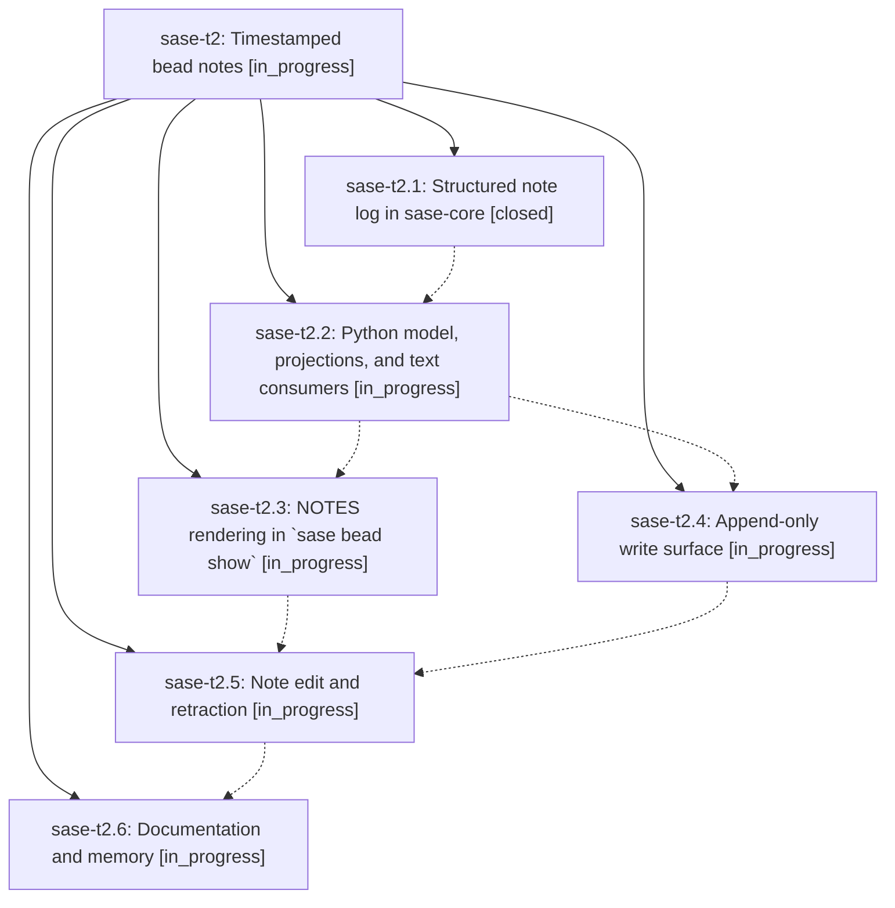

# Bead: sase-t2 — Timestamped bead notes

[Bead Pages](../README.md) / sase-t2

**Status:** ◐ in_progress · **Type:** ▸ plan · **Tier:** epic
**Owner:** `bryanbugyi34@gmail.com` · **Created by:** [bbugyi200.athena.0ct](https://github.com/sase-org/sase--agents/blob/main/families/bbugyi200.athena.0ct.md) · **Assignee:** `sase-t2.land`
**Created:** 2026-08-24 14:37:54 EDT
**Plan:** [202608/timestamped\_bead\_notes.md](https://github.com/sase-org/sase--plans/blob/main/202608/timestamped_bead_notes.md)

## Description

Every bead note carries a real timestamp and author as structured data, no write path can produce an untimestamped or clobbered note, and `sase bead show` renders the note log as a dated, attributed, per-entry section.

## Phases

| Bead | Title | Status | Size | Created | Agents | Commits |
|---|---|---|---|---|---:|---:|
| [sase-t2.1](sase-t2.1.md) | Structured note log in sase-core | ✓ closed | medium | 2026-08-24 | 1 | 2 |
| [sase-t2.2](sase-t2.2.md) | Python model, projections, and text consumers | ◐ in_progress | medium | 2026-08-24 | 1 | 1 |
| [sase-t2.3](sase-t2.3.md) | NOTES rendering in \`sase bead show\` | ◐ in_progress | medium | 2026-08-24 | 1 | 0 |
| [sase-t2.4](sase-t2.4.md) | Append-only write surface | ◐ in_progress | small | 2026-08-24 | 1 | 0 |
| [sase-t2.5](sase-t2.5.md) | Note edit and retraction | ◐ in_progress | medium | 2026-08-24 | 1 | 0 |
| [sase-t2.6](sase-t2.6.md) | Documentation and memory | ◐ in_progress | small | 2026-08-24 | 1 | 0 |

## Lineage

## Agents

| Agent | Bead | Commits |
|---|---|---:|
| [bbugyi200.athena.sase-t2.1](https://github.com/sase-org/sase--agents/blob/main/agents/bbugyi200.athena.sase-t2.1/README.md) | [sase-t2.1](sase-t2.1.md) | 2 |
| [bbugyi200.athena.sase-t2.2](https://github.com/sase-org/sase--agents/blob/main/agents/bbugyi200.athena.sase-t2.2/README.md) | [sase-t2.2](sase-t2.2.md) | 1 |
| [bbugyi200.athena.sase-t2.3](https://github.com/sase-org/sase--agents/blob/main/agents/bbugyi200.athena.sase-t2.3/README.md) | [sase-t2.3](sase-t2.3.md) | 0 |
| [bbugyi200.athena.sase-t2.4](https://github.com/sase-org/sase--agents/blob/main/agents/bbugyi200.athena.sase-t2.4/README.md) | [sase-t2.4](sase-t2.4.md) | 0 |
| [bbugyi200.athena.sase-t2.5](https://github.com/sase-org/sase--agents/blob/main/agents/bbugyi200.athena.sase-t2.5/README.md) | [sase-t2.5](sase-t2.5.md) | 0 |
| [bbugyi200.athena.sase-t2.6](https://github.com/sase-org/sase--agents/blob/main/agents/bbugyi200.athena.sase-t2.6/README.md) | [sase-t2.6](sase-t2.6.md) | 0 |
| [bbugyi200.athena.sase-t2.land](https://github.com/sase-org/sase--agents/blob/main/agents/bbugyi200.athena.sase-t2.land/README.md) | [sase-t2](README.md) | 0 |

## Commits

| Repo | Commit | Subject | Bead | Committed |
|---|---|---|---|---|
| sase | [`b74bfa3`](https://github.com/sase-org/sase/commit/b74bfa37abe2fd6c466a086949931aeb46680e53) | feat(bead): support structured note projections | [sase-t2.1](sase-t2.1.md) | 2026-08-24 16:16:20 EDT |
| sase-core | [`sase-core@bda9efc`](https://github.com/sase-org/sase-core/commit/bda9efc59f6ea65aa286df9c7bb0c5a89500a3be) | feat(bead)!: store notes as structured records | [sase-t2.1](sase-t2.1.md) | 2026-08-24 16:17:04 EDT |
| sase | [`f6c1467`](https://github.com/sase-org/sase/commit/f6c14672253185772692f4183e64f07c8df396a8) | feat(bead): carry structured notes through the Python model and read consumers | [sase-t2.2](sase-t2.2.md) | 2026-08-24 17:08:28 EDT |
