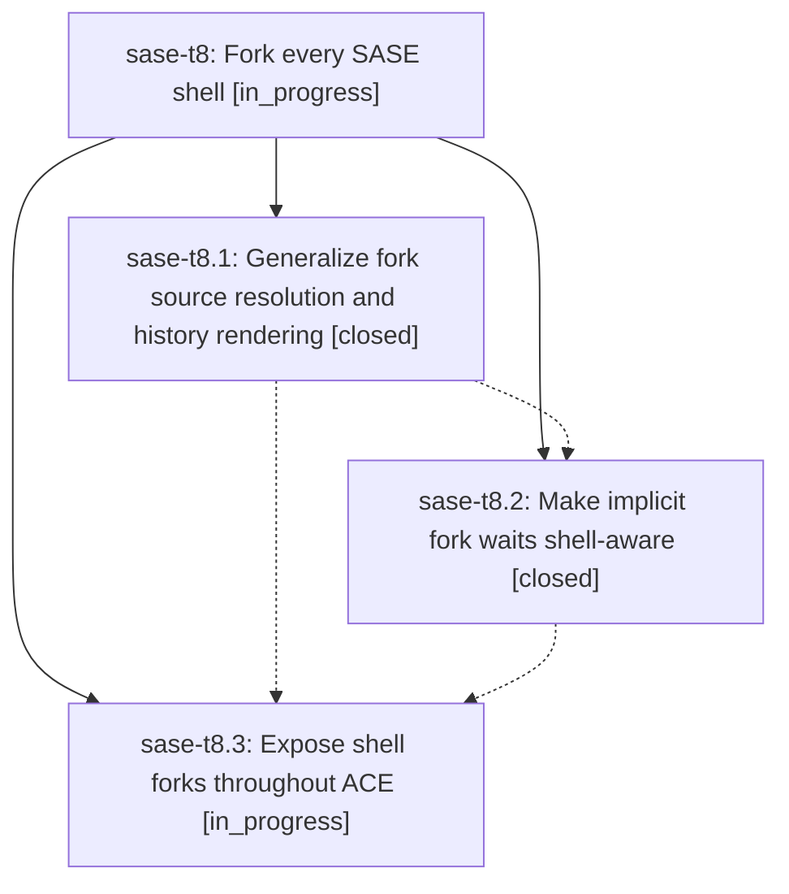

# Bead: sase-t8 — Fork every SASE shell

[Bead Pages](../README.md) / sase-t8

**Status:** ◐ in_progress · **Type:** ▸ plan · **Tier:** epic
**Owner:** `bryanbugyi34@gmail.com` · **Created by:** [bbugyi200.athena.0cz.f1](https://github.com/sase-org/sase--agents/blob/main/families/bbugyi200.athena.0cz.f1.md) · **Assignee:** `sase-t8.land`
**Created:** 2026-08-24 18:28:17 EDT
**Plan:** [202608/fork\_every\_shell.md](https://github.com/sase-org/sase--plans/blob/main/202608/fork_every_shell.md)

## Description

The #fork xprompt reliably resumes any SASE shell or mixed-shell agent family, waits for live sources without getting stranded by terminal failures, and gives the receiving agent clear, intuitive, typed history for agent and proc shells.

## Notes

[2026-08-24T23:03:11Z · 0d3] DISCOVERED ISSUE: sase-sq.7.1.2.f0 and sase-sq.7.1.2.f0.f0 both failed launch with
`SASE_AGENT_DEFERRED_WORKSPACE=1 but extracted wait metadata is empty; refusing to
continue in the placeholder workspace`, never reaching a model. Root cause is a
composition bug introduced by e4534d265 (fix(agent): allow forking failed agents):
launch preflight (`has_deferred_start_directive()`) is a cheap, conservative lexical
scan that always treats an explicit `#fork:<name>` as deferred and sets
`SASE_AGENT_DEFERRED_WORKSPACE=1`. Directive extraction, which runs later with access to
real agent state, correctly drops the now-moot implicit wait via
`fork_parent_wait_is_unreachable()` once the named parent has gone terminally failed.
`bootstrap_agent_run()` in src/sase/axe/run_agent_runner_bootstrap.py then hit a fatal
assertion on the resulting `deferred_workspace=True, has_wait=False` state, even though
that is a legitimate state: the post-admission launch path
(`_prepare_workspace_and_repos()` in src/sase/axe/run_agent_runner_launch.py) already
claims a real workspace via `claim_deferred_workspace()` before any model execution.

Filed as a small, standalone repair (plan 202608/repair_failed_agent_fork_launch.md,
tier: tale) rather than folded into this epic, since it is a compatibility fix for the
e4534d265 regression, not a new fork architecture. Files this tale expects to touch:
src/sase/axe/run_agent_runner_bootstrap.py (drop the fatal assertion, document the
invariant) and tests/test_axe_run_agent_runner_deferred_workspace_outcomes.py (turn the
old "deferred without extracted wait fails" test into a regression proving the
conservative path still claims a real workspace and reaches the run loop). It also adds
a new composition-level regression
(tests/test_axe_run_agent_failed_fork_admission.py) connecting launch preflight,
directive extraction, and runner admission for a terminally failed, no-transcript
`#fork` parent - reproducing the sase-sq.7.1.2.f0 shape - while asserting an explicit
`%wait:<failed-parent>` is never silently dropped.

This does not compete with sase-t8.2's shell-aware implicit-fork-wait work: it only
restores the launch-boundary invariant (conservative deferred provisioning must not
crash bootstrap just because the wait it implied turned out to be terminal) that
sase-t8.2's typed fork-dependency model should also uphold once it lands.

[2026-08-24T23:19:54Z · 0d3--3] Implemented repair_failed_agent_fork_launch: replaced the hard assertion in src/sase/axe/run_agent_runner_bootstrap.py with conservative admission logic so a failed-fork parent is admitted and claims a real workspace instead of crashing. Added tests/test_axe_run_agent_failed_fork_admission.py as a new composition regression test, and updated tests/test_axe_run_agent_runner_deferred_workspace_outcomes.py to cover the changed outcomes. Verification: just test-scoped passed (628 passed, 0 failed). just check's SASE validation gate fails on pre-existing, unrelated memory drift (init memory --check wants to update chezmoi sase.md/README.md), confirmed unrelated to this diff via git stash reproducing the same failure on plain master; fixing that requires user permission to edit memory files, not granted in this conversation.

## Phases

| Bead | Title | Status | Size | Created | Agents | Commits |
|---|---|---|---|---|---:|---:|
| [sase-t8.1](sase-t8.1.md) | Generalize fork source resolution and history rendering | ✓ closed | medium | 2026-08-24 | 1 | 1 |
| [sase-t8.2](sase-t8.2.md) | Make implicit fork waits shell-aware | ✓ closed | medium | 2026-08-24 | 1 | 1 |
| [sase-t8.3](sase-t8.3.md) | Expose shell forks throughout ACE | ◐ in_progress | medium | 2026-08-24 | 1 | 0 |

## Lineage

## Agents

| Agent | Bead | Commits |
|---|---|---:|
| [bbugyi200.athena.sase-t8.1](https://github.com/sase-org/sase--agents/blob/main/families/bbugyi200.athena.sase-t8.1.md) | [sase-t8.1](sase-t8.1.md) | 0 |
| [bbugyi200.athena.sase-t8.2](https://github.com/sase-org/sase--agents/blob/main/agents/bbugyi200.athena.sase-t8.2/README.md) | [sase-t8.2](sase-t8.2.md) | 1 |
| [bbugyi200.athena.sase-t8.3](https://github.com/sase-org/sase--agents/blob/main/agents/bbugyi200.athena.sase-t8.3/README.md) | [sase-t8.3](sase-t8.3.md) | 0 |
| [bbugyi200.athena.sase-t8.land](https://github.com/sase-org/sase--agents/blob/main/agents/bbugyi200.athena.sase-t8.land/README.md) | [sase-t8](README.md) | 0 |

## Commits

| Repo | Commit | Subject | Bead | Committed |
|---|---|---|---|---|
| sase | [`4fb8f3b`](https://github.com/sase-org/sase/commit/4fb8f3baee6d17b387f8eda4ee5242be8d936241) | feat: Generalize fork source resolution and history rendering (sase-t8.1) | [sase-t8.1](sase-t8.1.md) | 2026-08-24 19:18:57 EDT |
| sase | [`2a3e1d2`](https://github.com/sase-org/sase/commit/2a3e1d2c658bd6357bd71c8c8b91d4a56c4c65c2) | feat(agent): make implicit fork waits shell-aware | [sase-t8.2](sase-t8.2.md) | 2026-08-24 20:25:54 EDT |
