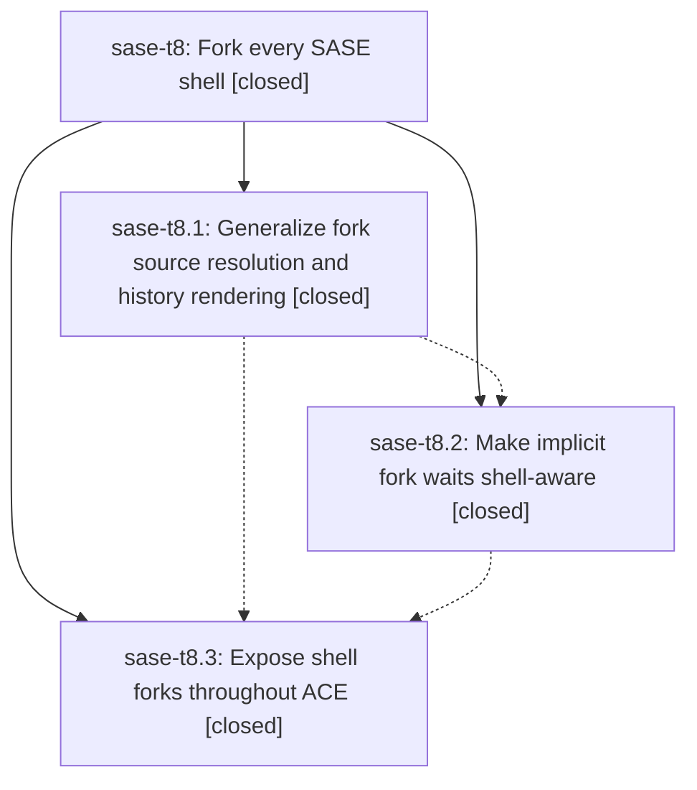

# Bead: sase-t8 — Fork every SASE shell

[Bead Pages](../README.md) / sase-t8

**Status:** ✓ closed · **Resolution:** done · **Type:** ▸ plan · **Tier:** epic
**Owner:** `bryanbugyi34@gmail.com` · **Created by:** [bbugyi200.athena.0cz.f1](https://github.com/sase-org/sase--agents/blob/main/families/bbugyi200.athena.0cz.f1.md) · **Assignee:** `sase-t8.land`
**Created:** 2026-08-24 18:28:17 EDT · **Closed:** 2026-08-25 07:06:49 EDT
**Plan:** [202608/fork\_every\_shell.md](https://github.com/sase-org/sase--plans/blob/main/202608/fork_every_shell.md)

## Description

The #fork xprompt reliably resumes any SASE shell or mixed-shell agent family, waits for live sources without getting stranded by terminal failures, and gives the receiving agent clear, intuitive, typed history for agent and proc shells.

## Notes

[2026-08-24T23:03:11Z · 0d3] DISCOVERED ISSUE: sase-sq.7.1.2.f0 and sase-sq.7.1.2.f0.f0 both failed launch with
`SASE_AGENT_DEFERRED_WORKSPACE=1 but extracted wait metadata is empty; refusing to
continue in the placeholder workspace`, never reaching a model. Root cause is a
composition bug introduced by e4534d265 (fix(agent): allow forking failed agents):
launch preflight (`has_deferred_start_directive()`) is a cheap, conservative lexical
scan that always treats an explicit `#fork:<name>` as deferred and sets
`SASE_AGENT_DEFERRED_WORKSPACE=1`. Directive extraction, which runs later with access to
real agent state, correctly drops the now-moot implicit wait via
`fork_parent_wait_is_unreachable()` once the named parent has gone terminally failed.
`bootstrap_agent_run()` in src/sase/axe/run_agent_runner_bootstrap.py then hit a fatal
assertion on the resulting `deferred_workspace=True, has_wait=False` state, even though
that is a legitimate state: the post-admission launch path
(`_prepare_workspace_and_repos()` in src/sase/axe/run_agent_runner_launch.py) already
claims a real workspace via `claim_deferred_workspace()` before any model execution.

Filed as a small, standalone repair (plan 202608/repair_failed_agent_fork_launch.md,
tier: tale) rather than folded into this epic, since it is a compatibility fix for the
e4534d265 regression, not a new fork architecture. Files this tale expects to touch:
src/sase/axe/run_agent_runner_bootstrap.py (drop the fatal assertion, document the
invariant) and tests/test_axe_run_agent_runner_deferred_workspace_outcomes.py (turn the
old "deferred without extracted wait fails" test into a regression proving the
conservative path still claims a real workspace and reaches the run loop). It also adds
a new composition-level regression
(tests/test_axe_run_agent_failed_fork_admission.py) connecting launch preflight,
directive extraction, and runner admission for a terminally failed, no-transcript
`#fork` parent - reproducing the sase-sq.7.1.2.f0 shape - while asserting an explicit
`%wait:<failed-parent>` is never silently dropped.

This does not compete with sase-t8.2's shell-aware implicit-fork-wait work: it only
restores the launch-boundary invariant (conservative deferred provisioning must not
crash bootstrap just because the wait it implied turned out to be terminal) that
sase-t8.2's typed fork-dependency model should also uphold once it lands.

[2026-08-24T23:19:54Z · 0d3--3] Implemented repair_failed_agent_fork_launch: replaced the hard assertion in src/sase/axe/run_agent_runner_bootstrap.py with conservative admission logic so a failed-fork parent is admitted and claims a real workspace instead of crashing. Added tests/test_axe_run_agent_failed_fork_admission.py as a new composition regression test, and updated tests/test_axe_run_agent_runner_deferred_workspace_outcomes.py to cover the changed outcomes. Verification: just test-scoped passed (628 passed, 0 failed). just check's SASE validation gate fails on pre-existing, unrelated memory drift (init memory --check wants to update chezmoi sase.md/README.md), confirmed unrelated to this diff via git stash reproducing the same failure on plain master; fixing that requires user permission to edit memory files, not granted in this conversation.

[2026-08-25T02:28:49Z · toobig-41.test_init_memory_managed_agents.0] DISCOVERED ISSUE: During unrelated tests/main/test_init_memory_managed_agents.py split verification at HEAD e7eafd0ec631aa5e2c1469d09d2bbd40d8cf2734, just check passed fmt, markdown fmt, keep-sorted, Ruff, mypy, feature-flag, pyscripts, test-waits, changelog, and patch/stitch terminology gates, then failed at lint (symvision). Symvision reports private non-test imports for chat-fork helpers in src/sase/history/chat_fork/common.py, clan.py, failure.py, family.py, and proc.py, plus _json_string in src/sase/scripts/agent_chat_from_name.py. The local diff only splits tests/main/test_init_memory_managed_agents.py, so the gate failure is unrelated to this test-only change. Duplicate search found ready task sase-ta for the same Symvision private-import gate class but different project-mutation symbols/files, so this is not an exact duplicate. This appears causally tied to this active shell-fork epic because it owns fork source/history rendering and the failing modules are the new chat_fork surface. Verify with just _lint-symvision and just check after making the shared helpers public or stopping cross-module private imports.

[2026-08-25T02:31:10Z · toobig-41.test_launch_admission.0] DISCOVERED ISSUE: During unrelated tests/test_launch_admission.py split verification on 2026-08-24, just check passed fmt, markdown fmt, keep-sorted, Ruff, mypy, feature-flag, pyscripts, test-waits, changelog, and patch/stitch terminology gates, then failed at lint (symvision). Error: Private functions/classes should not be imported, naming helpers in src/sase/history/chat_fork/{common.py,clan.py,failure.py,family.py,proc.py} plus _json_string in src/sase/scripts/agent_chat_from_name.py. My local diff only splits launch-admission tests, so the failure is unrelated to this work. git log shows the chat_fork package split in 9a7fd2e99 after fork-history work under this epic; route here for land review rather than creating a standalone CI task.

[2026-08-25T02:39:05Z · toobig-41.test_query_profile.0] DISCOVERED ISSUE: During unrelated tests/test_query_profile_reference.py split verification on 2026-08-24, just check passed fmt, markdown fmt, keep-sorted, Ruff, mypy, feature-flag, pyscripts, test-waits, changelog, and patch/stitch terminology gates, then failed at lint (symvision). Symvision reports private non-test imports for chat_fork helpers in src/sase/history/chat_fork/common.py, clan.py, failure.py, family.py, and proc.py: _blockquote, _fork_source_failure, _fork_source_has_failure, _fork_source_has_proc_content, _fork_source_kind, _fork_source_optional_string, _fork_source_string, _format_clan_fork_source, _format_failed_agent_body, _format_failed_agent_section, _format_family_fork_source, _format_proc_body, _format_proc_source, _format_text_fence, _json_string, _load_json_object, _markdown_code_span, and _require_proc_info. The local diff only moves patch/facade compatibility tests from tests/test_query_profile_reference.py to tests/test_query_profile_reference_compat.py, so this is unrelated to the test split. It matches the existing chat_fork Symvision notes on this fork-history epic and should be verified with just _lint-symvision and just check after making cross-module helpers public or avoiding private imports.

[2026-08-25T02:50:36Z · toobig-41.test_test_cost.0] DISCOVERED ISSUE: During unrelated test-cost helper split verification at HEAD cfe38ea01, just check passed fmt, markdown fmt, keep-sorted, Ruff, mypy, feature-flag, pyscripts, test-waits, changelog, and patch/stitch terminology gates, then failed at lint (symvision). Symvision reported private non-test imports for chat_fork helpers: _blockquote, _fork_source_failure, _fork_source_has_failure, _fork_source_has_proc_content, _fork_source_kind, _fork_source_optional_string, _fork_source_string, _format_clan_fork_source, _format_failed_agent_body, _format_failed_agent_section, _format_family_fork_source, _format_proc_body, _format_proc_source, _format_text_fence, _json_string, _load_json_object, _markdown_code_span, and _require_proc_info in src/sase/history/chat_fork/{common.py,clan.py,failure.py,family.py,proc.py}. My diff only touches tests/_test_cost_plugin.py, tests/_test_cost_plugin_patches.py, and tests/test_suite_gate_integration.py, so this is unrelated and corroborates the existing chat_fork Symvision blocker on this fork-history epic. Focused test-cost tests, tests/test_suite_gate_integration.py, just test-scoped, and just _lint-toobig all passed.

[2026-08-25T06:14:05Z · toobig-45.agent_chat_from_name.0] DISCOVERED ISSUE: During agent_chat_from_name CLI/facade split verification on 2026-08-25, just check failed at lint (symvision) with the same 18 private-import findings in src/sase/history/chat_fork/{common,clan,failure,family,proc}.py. The local diff only touches src/sase/scripts/agent_chat_from_name.py and new src/sase/scripts/_agent_chat_from_name_cli.py, so the failure is unrelated to this split. Corroborated exact CI task sase-tb (+1 recorded); routed here too because this active fork-shell epic owns the chat_fork split/fork-history surface.

[2026-08-25T10:17:01Z · toobig-49.index_queries.0] DISCOVERED ISSUE: During wait-dependency index query split verification at HEAD 6271aa52d9, just check failed at lint (symvision) with the existing 18 private-import findings in src/sase/history/chat_fork/{common,clan,failure,family,proc}.py after earlier gates passed. Current diff only touches src/sase/core/wait_dependency_resolution/_index_queries.py and extracted wait-dependency query modules. I fixed the only new Symvision issue from that split (_WaitEntity imported across files) by promoting the shared type to WaitEntity; rerunning just _lint-symvision then reported only the chat_fork failures. Corroborated exact CI task sase-tb (+1 recorded); this remains tied to this fork-shell epic's chat_fork package split/fork-history surface.

[2026-08-25T11:05:31Z · codex-01a03885] DISCOVERED ISSUE: During beads-sidecar clone reliability verification at HEAD 2d908ca1145b, just check passed all earlier lint gates and failed at lint (symvision) with the existing 18 private-import findings in src/sase/history/chat_fork/{common,clan,failure,family,proc}.py. The local diff only touches sidecar clone reference/retry behavior and tests. Corroborated exact ready CI task sase-tb; routed here too because this fork-shell epic owns the chat_fork package split.

[2026-08-25T11:06:49Z · sase-t8.land] LAND VERIFICATION (sase-t8.land, master 2d908ca11 + this turn's working tree).

\## Phases verified against source and commits

- sase-t8.1 (4fb8f3bae, hand-committed by the owner with an explicit "epic l

… and 10208 more characters

## Phases

| Bead | Title | Status | Size | Created | Agents | Commits |
|---|---|---|---|---|---:|---:|
| [sase-t8.1](sase-t8.1.md) | Generalize fork source resolution and history rendering | ✓ closed | medium | 2026-08-24 | 1 | 1 |
| [sase-t8.2](sase-t8.2.md) | Make implicit fork waits shell-aware | ✓ closed | medium | 2026-08-24 | 1 | 1 |
| [sase-t8.3](sase-t8.3.md) | Expose shell forks throughout ACE | ✓ closed | medium | 2026-08-24 | 1 | 1 |

## Lineage

## Agents

| Agent | Bead | Commits |
|---|---|---:|
| [bbugyi200.athena.sase-t8.1](https://github.com/sase-org/sase--agents/blob/main/families/bbugyi200.athena.sase-t8.1.md) | [sase-t8.1](sase-t8.1.md) | 0 |
| [bbugyi200.athena.sase-t8.2](https://github.com/sase-org/sase--agents/blob/main/agents/bbugyi200.athena.sase-t8.2/README.md) | [sase-t8.2](sase-t8.2.md) | 1 |
| [bbugyi200.athena.sase-t8.3](https://github.com/sase-org/sase--agents/blob/main/families/bbugyi200.athena.sase-t8.3.md) | [sase-t8.3](sase-t8.3.md) | 1 |
| [bbugyi200.athena.sase-t8.land](https://github.com/sase-org/sase--agents/blob/main/agents/bbugyi200.athena.sase-t8.land/README.md) | [sase-t8](README.md) | 1 |

## Commits

| Repo | Commit | Subject | Bead | Committed |
|---|---|---|---|---|
| sase | [`4fb8f3b`](https://github.com/sase-org/sase/commit/4fb8f3baee6d17b387f8eda4ee5242be8d936241) | feat: Generalize fork source resolution and history rendering (sase-t8.1) | [sase-t8.1](sase-t8.1.md) | 2026-08-24 19:18:57 EDT |
| sase | [`2a3e1d2`](https://github.com/sase-org/sase/commit/2a3e1d2c658bd6357bd71c8c8b91d4a56c4c65c2) | feat(agent): make implicit fork waits shell-aware | [sase-t8.2](sase-t8.2.md) | 2026-08-24 20:25:54 EDT |
| sase | [`69dc50a`](https://github.com/sase-org/sase/commit/69dc50a31af35724d9784b775f557fad3ea0a57f) | feat(ace): expose shell forks throughout ACE | [sase-t8.3](sase-t8.3.md) | 2026-08-24 21:16:35 EDT |
| sase | [`7be1396`](https://github.com/sase-org/sase/commit/7be1396abfc40101f18f58cf6b423398bddf6287) | fix(ace,history): finish landing shell forks (sase-t8) | [sase-t8](README.md) | 2026-08-25 07:09:05 EDT |
