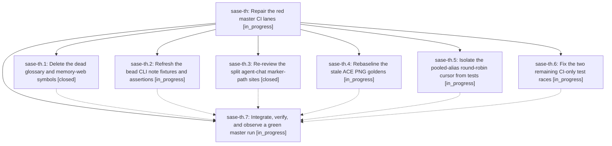

# Bead: sase-th — Repair the red master CI lanes

[Bead Pages](../README.md) / sase-th

**Status:** ◐ in_progress · **Type:** ▸ plan · **Tier:** epic
**Owner:** `bryanbugyi34@gmail.com` · **Created by:** [bbugyi200.athena.0d8](https://github.com/sase-org/sase--agents/blob/main/families/bbugyi200.athena.0d8.md) · **Assignee:** `sase-th.land`
**Created:** 2026-08-25 07:31:59 EDT
**Plan:** [202608/repair\_red\_master\_ci.md](https://github.com/sase-org/sase--plans/blob/main/202608/repair_red_master_ci.md)

## Description

Every GitHub Actions job on the sase default branch — lint, test (3.12/3.13/3.14), coverage-contexts, and visual-test — passes on a clean master tree, with each failure fixed at its own root cause rather than muted.

## Phases

| Bead | Title | Status | Size | Created | Agents | Commits |
|---|---|---|---|---|---:|---:|
| [sase-th.1](sase-th.1.md) | Delete the dead glossary and memory-web symbols | ✓ closed | small | 2026-08-25 | 1 | 1 |
| [sase-th.2](sase-th.2.md) | Refresh the bead CLI note fixtures and assertions | ◐ in_progress | small | 2026-08-25 | 1 | 0 |
| [sase-th.3](sase-th.3.md) | Re-review the split agent-chat marker-path sites | ✓ closed | small | 2026-08-25 | 1 | 1 |
| [sase-th.4](sase-th.4.md) | Rebaseline the stale ACE PNG goldens | ◐ in_progress | medium | 2026-08-25 | 1 | 0 |
| [sase-th.5](sase-th.5.md) | Isolate the pooled-alias round-robin cursor from tests | ◐ in_progress | medium | 2026-08-25 | 1 | 0 |
| [sase-th.6](sase-th.6.md) | Fix the two remaining CI-only test races | ◐ in_progress | medium | 2026-08-25 | 1 | 0 |
| [sase-th.7](sase-th.7.md) | Integrate, verify, and observe a green master run | ◐ in_progress | medium | 2026-08-25 | 1 | 0 |

## Lineage

## Agents

| Agent | Bead | Commits |
|---|---|---:|
| [bbugyi200.athena.sase-th.1](https://github.com/sase-org/sase--agents/blob/main/agents/bbugyi200.athena.sase-th.1/README.md) | [sase-th.1](sase-th.1.md) | 1 |
| [bbugyi200.athena.sase-th.2](https://github.com/sase-org/sase--agents/blob/main/agents/bbugyi200.athena.sase-th.2/README.md) | [sase-th.2](sase-th.2.md) | 0 |
| [bbugyi200.athena.sase-th.3](https://github.com/sase-org/sase--agents/blob/main/agents/bbugyi200.athena.sase-th.3/README.md) | [sase-th.3](sase-th.3.md) | 1 |
| [bbugyi200.athena.sase-th.4](https://github.com/sase-org/sase--agents/blob/main/agents/bbugyi200.athena.sase-th.4/README.md) | [sase-th.4](sase-th.4.md) | 0 |
| [bbugyi200.athena.sase-th.5](https://github.com/sase-org/sase--agents/blob/main/families/bbugyi200.athena.sase-th.5.md) | [sase-th.5](sase-th.5.md) | 0 |
| [bbugyi200.athena.sase-th.6](https://github.com/sase-org/sase--agents/blob/main/agents/bbugyi200.athena.sase-th.6/README.md) | [sase-th.6](sase-th.6.md) | 0 |
| [bbugyi200.athena.sase-th.7](https://github.com/sase-org/sase--agents/blob/main/agents/bbugyi200.athena.sase-th.7/README.md) | [sase-th.7](sase-th.7.md) | 0 |
| [bbugyi200.athena.sase-th.land](https://github.com/sase-org/sase--agents/blob/main/agents/bbugyi200.athena.sase-th.land/README.md) | [sase-th](README.md) | 0 |

## Commits

| Repo | Commit | Subject | Bead | Committed |
|---|---|---|---|---|
| sase | [`5fff948`](https://github.com/sase-org/sase/commit/5fff948a9735e7f613006a10c8cb34ea8c363d88) | fix(memory): retire dead glossary symbols | [sase-th.1](sase-th.1.md) | 2026-08-25 07:47:55 EDT |
| sase | [`18ce1d6`](https://github.com/sase-org/sase/commit/18ce1d6e5056a25b75cde00fe3841b21be88ea8e) | test(agents): review split chat marker paths | [sase-th.3](sase-th.3.md) | 2026-08-25 07:49:59 EDT |
