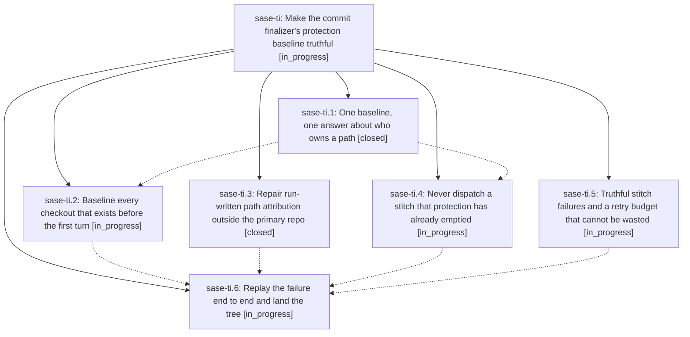

# Bead: sase-ti — Make the commit finalizer's protection baseline truthful

[Bead Pages](../README.md) / sase-ti

**Status:** ◐ in_progress · **Type:** ▸ plan · **Tier:** epic
**Owner:** `bryanbugyi34@gmail.com` · **Created by:** [bbugyi200.athena.0d9](https://github.com/sase-org/sase--agents/blob/main/families/bbugyi200.athena.0d9.md) · **Assignee:** `sase-ti.land`
**Created:** 2026-08-25 07:37:54 EDT
**Plan:** [202608/commit\_finalizer\_protection\_truth.md](https://github.com/sase-org/sase--plans/blob/main/202608/commit_finalizer_protection_truth.md)

## Description

A turn's own work is never mistaken for foreign dirt. The dirty-path baseline is captured before the agent can write, every consumer reads it through one contract, the finalizer refuses to dispatch a stitch that protection has already emptied, and a stitch failure reports the reason the VCS provider actually gave instead of spending a whole attempt budget on an identical, guaranteed-to-fail retry.

## Phases

| Bead | Title | Status | Size | Created | Agents | Commits |
|---|---|---|---|---|---:|---:|
| [sase-ti.1](sase-ti.1.md) | One baseline, one answer about who owns a path | ✓ closed | medium | 2026-08-25 | 1 | 1 |
| [sase-ti.2](sase-ti.2.md) | Baseline every checkout that exists before the first turn | ◐ in_progress | medium | 2026-08-25 | 1 | 0 |
| [sase-ti.3](sase-ti.3.md) | Repair run-written path attribution outside the primary repo | ✓ closed | small | 2026-08-25 | 1 | 1 |
| [sase-ti.4](sase-ti.4.md) | Never dispatch a stitch that protection has already emptied | ◐ in_progress | medium | 2026-08-25 | 1 | 1 |
| [sase-ti.5](sase-ti.5.md) | Truthful stitch failures and a retry budget that cannot be wasted | ◐ in_progress | medium | 2026-08-25 | 1 | 0 |
| [sase-ti.6](sase-ti.6.md) | Replay the failure end to end and land the tree | ◐ in_progress | medium | 2026-08-25 | 1 | 0 |

## Lineage

## Agents

| Agent | Bead | Commits |
|---|---|---:|
| [bbugyi200.athena.sase-ti.1](https://github.com/sase-org/sase--agents/blob/main/agents/bbugyi200.athena.sase-ti.1/README.md) | [sase-ti.1](sase-ti.1.md) | 1 |
| [bbugyi200.athena.sase-ti.2](https://github.com/sase-org/sase--agents/blob/main/agents/bbugyi200.athena.sase-ti.2/README.md) | [sase-ti.2](sase-ti.2.md) | 0 |
| [bbugyi200.athena.sase-ti.3](https://github.com/sase-org/sase--agents/blob/main/agents/bbugyi200.athena.sase-ti.3/README.md) | [sase-ti.3](sase-ti.3.md) | 1 |
| [bbugyi200.athena.sase-ti.4](https://github.com/sase-org/sase--agents/blob/main/agents/bbugyi200.athena.sase-ti.4/README.md) | [sase-ti.4](sase-ti.4.md) | 1 |
| [bbugyi200.athena.sase-ti.5](https://github.com/sase-org/sase--agents/blob/main/families/bbugyi200.athena.sase-ti.5.md) | [sase-ti.5](sase-ti.5.md) | 0 |
| [bbugyi200.athena.sase-ti.6](https://github.com/sase-org/sase--agents/blob/main/agents/bbugyi200.athena.sase-ti.6/README.md) | [sase-ti.6](sase-ti.6.md) | 0 |
| [bbugyi200.athena.sase-ti.land](https://github.com/sase-org/sase--agents/blob/main/agents/bbugyi200.athena.sase-ti.land/README.md) | [sase-ti](README.md) | 0 |

## Commits

| Repo | Commit | Subject | Bead | Committed |
|---|---|---|---|---|
| sase | [`f67d6e6`](https://github.com/sase-org/sase/commit/f67d6e6a44a42afebab52ace729e8f1f22d11e92) | fix(finalizers): attribute run-written paths outside the primary repo | [sase-ti.3](sase-ti.3.md) | 2026-08-25 07:57:21 EDT |
| sase | [`1fe598e`](https://github.com/sase-org/sase/commit/1fe598e2d4cf9161d8a7d8e081cbaa0d547d7fbe) | fix(finalizer): unify baseline ownership reads | [sase-ti.1](sase-ti.1.md) | 2026-08-25 08:10:40 EDT |
| sase | [`fab5f73`](https://github.com/sase-org/sase/commit/fab5f731eb32478b32edd4d91f39f2272e541207) | feat(finalizers): refuse a stitch dispatch protection has already emptied | [sase-ti.4](sase-ti.4.md) | 2026-08-25 08:33:59 EDT |
