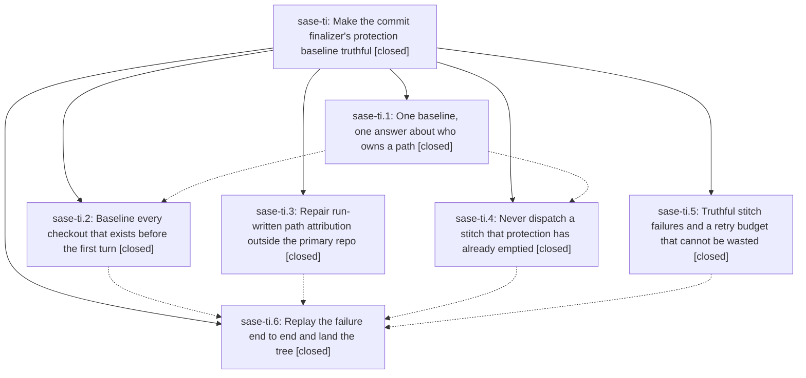

# Bead: sase-ti — Make the commit finalizer's protection baseline truthful

[Bead Pages](../README.md) / sase-ti

**Status:** ✓ closed · **Resolution:** done · **Type:** ▸ plan · **Tier:** epic
**Owner:** `bryanbugyi34@gmail.com` · **Created by:** [bbugyi200.athena.0d9](https://github.com/sase-org/sase--agents/blob/main/families/bbugyi200.athena.0d9.md) · **Assignee:** `sase-ti.land`
**Created:** 2026-08-25 07:37:54 EDT · **Closed:** 2026-08-25 11:41:02 EDT
**Plan:** [202608/commit\_finalizer\_protection\_truth.md](https://github.com/sase-org/sase--plans/blob/main/202608/commit_finalizer_protection_truth.md)

## Description

A turn's own work is never mistaken for foreign dirt. The dirty-path baseline is captured before the agent can write, every consumer reads it through one contract, the finalizer refuses to dispatch a stitch that protection has already emptied, and a stitch failure reports the reason the VCS provider actually gave instead of spending a whole attempt budget on an identical, guaranteed-to-fail retry.

## Notes

[2026-08-25T15:41:02Z · sase-ti.land] VERIFIED (step 1). All six phases landed and each phase's acceptance criteria are met in the source, not just in its close note. Two phases (sase-ti.4, sase-ti.6) were auto-closed by `sase stitch create` with "no verification implied", so I read their code and tests directly.

- scope (1fe598e2d): `_load_finalizer_dirty_baseline`'s run_start-only filter is gone. One canonical loader, `load_finalizer_baseline_records` (commit_finalizer_baseline.py:167), keeps `scope` intact, canonicalizes duplicate normalized paths with an earliest-captured/scope-precedence sort key, and both views derive from it -- `load_dirty_baseline` (provenance) and `_load_baseline_fingerprints` (protection, commit_validation.py:104). Grepped the tree: no residual scope filter survives outside that module. Invariant + run-20260825070100 regression tests at tests/llm_provider/test_commit_finalizer_baseline.py:516 and :599.
- checkouts (222a11ea0): `collect_baseline_repositories` (commit_finalizer_state.py:59) now enumerates main, configured siblings, SDD sidecars (clean ones included), the agents prompt archive, and every `sase/repos/**` checkout with a `.git` entry, under an explicit scan limit + depth cap that logs what it skipped. `capture_opened_repo_dirty_baseline` is idempotent by normalized path as well as repo_id (commit_finalizer_baseline.py:129), so a late `sase repo open` of an already-baselined path is a no-op; the repo_id-points-elsewhere refusal still returns a diagnostic string rather than raising. Family-attach inheritance still short-circuits capture (run_agent_runner_bootstrap.py:100).
- attribution (f67d6e6a4): `written_paths_from_tool_calls` returns the recorded path verbatim; `_workspace_relative` now applies only at render time (declaration_recovery_evidence.py:198). The two near-identical `_direct_written_paths` copies are collapsed into one shared `direct_written_paths`, used by both declaration_context_evidence.py:90 and declaration_deferrals.py:251. Sibling-prefix negative test present.
- guard (fab5f731e): `dispatch_commit_decisions` computes `unexpected_remaining_paths` before dispatch and, when protection covers everything, raises `protected_paths_exhausted` naming the paths and the record's repo_id/scope/captured_at, without consuming budget (`preflight_attempt` calls `allocate_attempt`, not `consume_before_execute`). Submit side mirrors it in `_reject_exhausted_commit_protection` (declaration_deferrals.py:123). The code is not in RETRYABLE_DIAGNOSTIC_CODES.
- fidelity (bd2619467): `stitch_failure_message` emits both bounded, labelled streams with the exit-code fallback preserved; `record_stitch_artifacts` writes `attempt-<n>.<repo>.inputs.json` with excludes, HEAD, dirty fingerprints, message digest, argv, and message file; an unchanged fingerprint yields `stitch_retry_skipped_identical_inputs` instead of a second mutating attempt. That phase also fixed a real infinite-loop bug it exposed: `is_retryable_result` now scopes to the latest attempt's diagnostics (ledger.py:121).
- verify (9c164528e): both live e2e regressions exist and pass -- clean pre-existing sidecar written before any open now commits with exactly one attempt consumed, and a genuinely pre-existing dirty sidecar file stays protected and uncommitted while the run's own change still commits. error_report.md rendering asserted for both the protection refusal and the enriched stitch failure.

All 113 tests across the epic's suites pass (protection guard, repair fidelity, live e2e, baseline, bootstrap baseline, declaration context/deferrals/recovery evidence, execution ledger, historical refusal corpus, protocol harness controller).

INTEGRATED (step 2). Reviewed every commit since the epic's first (f67d6e6a4..HEAD, 20 commits). Only one non-epic commit touched an epic file: 70a9d1015 reintroduced a stray `FinalizerBaselineRecord = _FinalizerBaselineRecord` alias line into commit_finalizer_baseline.py; d4347600c already removed it and `just symvision` is clean. No other landed change duplicates or conflicts with this epic -- the three `written_paths_from_tool_calls` consumers and both baseline readers are all inside src/sase/finalizers and were converted, and 9cf604978's workspace leasing does not create checkouts outside the paths `collect_baseline_repositories` now walks. As integration I updated docs/commit_workflows.md, which described the dispatch step as if it always ran `sase stitch create` and described max_attempts without the new retry-evidence rule; it now documents `protected_paths_exhausted` and `stitch_retry_skipped_identical_inputs`. sase_final.md's empty-fingerprints guidance is still correct and is in fact strengthened by the checkouts phase, so it was left alone.

LANDING GATE. `just check-full` on master 1a96ea92b: every lint gate, SASE validation, and committed-plan validation green; full suite 2 failed / 36892 passed / 13 skipped in 18m12s. Both failures are proven caused by active epic sase-tj's phase sase-tj.4 (ec2044ba9), not by this epic, which touched no ACE files: test_artifacts_scaffold.py::test_subtab_strip_labels_and_accents_cover_all_panes fails deterministically in isolation because ec2044ba9 added 'agents' to FIXED_ARTIFACTS_PANE_IDS while the test still asserts the pre-agents 4-tuple, and test_agents_pane_mount.py::test_agents_pane_mounts_activates_and_loads (a file ec2044ba9 added) failed full-lane only and passes in isolation. Both recorded as a DISCOVERED ISSUE note on sase-tj rather than filed as tasks, since that epic is in progress with sase-tj.9 still open.

FOLLOW-UP DISPOSITION. Every PROPOSED FOLLOW-UP on the child beads was resolved on master before this landing; none needed a new task.
- sase-ti.1 #1, sase-ti.3 #1, sase-ti.5 #1 (three reports of the same src/sase/sdd/_store_link.py ruff-format violation blocking the fmt gate): fixed on master -- `ruff format --check` reports "1 file already formatted" and check-full's fmt (python) gate is green.
- sase-ti.5 #2 (10 test-scoped failures: six test_cli_golden NOTES-column drifts, test_cli_history, test_cli_search, the artifact marker-path audit): all fixed on master -- 86 tests across those files pass. Tracked separately and already closed as sase-t9 and sase-tc.
- sase-ti.6 #2 part 1 and sase-ti.5 #2's sidecar-clone ImportError: fixed by 70a9d1015, which repointed the monkeypatch to sase.sdd._store_clone_ops.time.sleep; the node passes. An open READY task sase-tl still describes it, so I added a note there recording that its own proposed fix has already landed rather than +1'ing a defect that no longer reproduces.
- sase-ti.6 #2 part 2 (test_global_state_leak_detector.py::test_snapshot_includes_live_config_token_refresh_threads full-lane flake): exact semantic duplicate of ready task sase-t6, corroborated with `sase bead +1 sase-t6` carrying this epic's independent observation. It passed in isolation today (19 passed) and did not fail in this landing's full-lane run.
- sase-ti.6 #1 (cross-agent report from 0db: symvision unused public FinalizerBaselineRecord): resolved by 9c5d26eac + d4347600c; `just symvision` prints "All public/private classes/functions are used properly!".

`sase bead epic-symbols sase-ti` reports no --epic-symbol entries; the only whitelist line in the Justfile is keyed to the still-open epic sase-n4.

## Phases

| Bead | Title | Status | Size | Created | Agents | Commits |
|---|---|---|---|---|---:|---:|
| [sase-ti.1](sase-ti.1.md) | One baseline, one answer about who owns a path | ✓ closed | medium | 2026-08-25 | 1 | 1 |
| [sase-ti.2](sase-ti.2.md) | Baseline every checkout that exists before the first turn | ✓ closed | medium | 2026-08-25 | 1 | 1 |
| [sase-ti.3](sase-ti.3.md) | Repair run-written path attribution outside the primary repo | ✓ closed | small | 2026-08-25 | 1 | 1 |
| [sase-ti.4](sase-ti.4.md) | Never dispatch a stitch that protection has already emptied | ✓ closed | medium | 2026-08-25 | 1 | 1 |
| [sase-ti.5](sase-ti.5.md) | Truthful stitch failures and a retry budget that cannot be wasted | ✓ closed | medium | 2026-08-25 | 1 | 1 |
| [sase-ti.6](sase-ti.6.md) | Replay the failure end to end and land the tree | ✓ closed | medium | 2026-08-25 | 1 | 1 |

## Lineage

## Agents

| Agent | Bead | Commits |
|---|---|---:|
| [bbugyi200.athena.sase-ti.1](https://github.com/sase-org/sase--agents/blob/main/agents/bbugyi200.athena.sase-ti.1/README.md) | [sase-ti.1](sase-ti.1.md) | 1 |
| [bbugyi200.athena.sase-ti.2](https://github.com/sase-org/sase--agents/blob/main/agents/bbugyi200.athena.sase-ti.2/README.md) | [sase-ti.2](sase-ti.2.md) | 1 |
| [bbugyi200.athena.sase-ti.3](https://github.com/sase-org/sase--agents/blob/main/agents/bbugyi200.athena.sase-ti.3/README.md) | [sase-ti.3](sase-ti.3.md) | 1 |
| [bbugyi200.athena.sase-ti.4](https://github.com/sase-org/sase--agents/blob/main/agents/bbugyi200.athena.sase-ti.4/README.md) | [sase-ti.4](sase-ti.4.md) | 1 |
| [bbugyi200.athena.sase-ti.5](https://github.com/sase-org/sase--agents/blob/main/families/bbugyi200.athena.sase-ti.5.md) | [sase-ti.5](sase-ti.5.md) | 1 |
| [bbugyi200.athena.sase-ti.6](https://github.com/sase-org/sase--agents/blob/main/agents/bbugyi200.athena.sase-ti.6/README.md) | [sase-ti.6](sase-ti.6.md) | 1 |
| [bbugyi200.athena.sase-ti.land](https://github.com/sase-org/sase--agents/blob/main/agents/bbugyi200.athena.sase-ti.land/README.md) | [sase-ti](README.md) | 1 |

## Commits

| Repo | Commit | Subject | Bead | Committed |
|---|---|---|---|---|
| sase | [`f67d6e6`](https://github.com/sase-org/sase/commit/f67d6e6a44a42afebab52ace729e8f1f22d11e92) | fix(finalizers): attribute run-written paths outside the primary repo | [sase-ti.3](sase-ti.3.md) | 2026-08-25 07:57:21 EDT |
| sase | [`1fe598e`](https://github.com/sase-org/sase/commit/1fe598e2d4cf9161d8a7d8e081cbaa0d547d7fbe) | fix(finalizer): unify baseline ownership reads | [sase-ti.1](sase-ti.1.md) | 2026-08-25 08:10:40 EDT |
| sase | [`fab5f73`](https://github.com/sase-org/sase/commit/fab5f731eb32478b32edd4d91f39f2272e541207) | feat(finalizers): refuse a stitch dispatch protection has already emptied | [sase-ti.4](sase-ti.4.md) | 2026-08-25 08:33:59 EDT |
| sase | [`222a11e`](https://github.com/sase-org/sase/commit/222a11ea0d19603031071abddebd30e44f41435f) | fix(finalizer): baseline pre-existing checkouts | [sase-ti.2](sase-ti.2.md) | 2026-08-25 08:41:40 EDT |
| sase | [`bd26194`](https://github.com/sase-org/sase/commit/bd26194672f76c4e5690d0047c70721875c4ab6c) | fix(finalizers): stop wasting stitch retries and fix a retry-loop hang | [sase-ti.5](sase-ti.5.md) | 2026-08-25 09:05:50 EDT |
| sase | [`9c16452`](https://github.com/sase-org/sase/commit/9c164528e3eb51989b7086db72f49aec17c7309c) | test(finalizers): add commit dispatch protection guard and live e2e regression coverage | [sase-ti.6](sase-ti.6.md) | 2026-08-25 10:46:59 EDT |
| sase | [`cddbc1f`](https://github.com/sase-org/sase/commit/cddbc1f16777b662416590da4e3a46bf84712214) | docs(finalizers): document the protection and retry guards | [sase-ti](README.md) | 2026-08-25 11:44:08 EDT |
