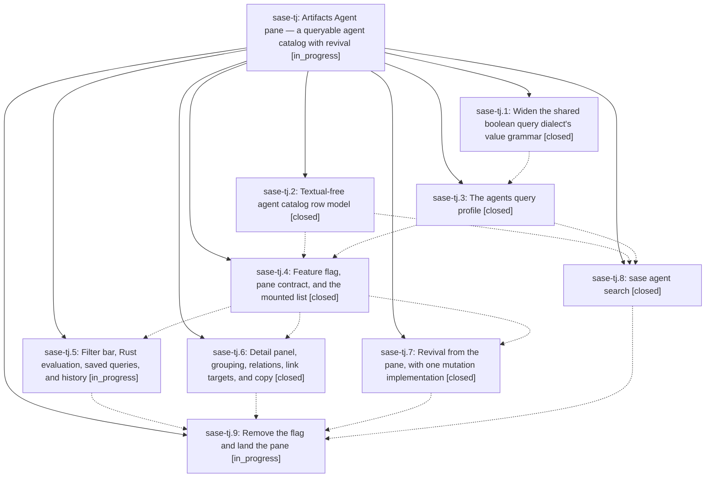

# Bead: sase-tj — Artifacts Agent pane — a queryable agent catalog with revival

[Bead Pages](../README.md) / sase-tj

**Status:** ◐ in_progress · **Type:** ▸ plan · **Tier:** epic
**Owner:** `bryanbugyi34@gmail.com` · **Created by:** [bbugyi200.athena.0da](https://github.com/sase-org/sase--agents/blob/main/families/bbugyi200.athena.0da.md) · **Assignee:** `sase-tj.land`
**Created:** 2026-08-25 08:09:37 EDT
**Plan:** [202608/artifacts\_agents\_pane.md](https://github.com/sase-org/sase--plans/blob/main/202608/artifacts_agents_pane.md)

## Description

The Artifacts tab gains an "Agent" pane that catalogs every agent SASE has ever named, filters it with the shared query dialect, resolves the `agent:` half of the artifact-link graph, and revives dismissed agents — with `sase agent search` giving the same catalog and dialect headless.

## Notes

[2026-08-25T15:39:46Z · sase-ti.land] DISCOVERED ISSUE: two ACE test failures caused by phase sase-tj.4 (ec2044ba9), found by epic sase-ti's land agent while running the landing gate on master 1a96ea92b.

1. DETERMINISTIC: tests/ace/tui/test_artifacts_scaffold.py::test_subtab_strip_labels_and_accents_cover_all_panes fails in isolation. ec2044ba9 added the 'agents' entry to FIXED_ARTIFACTS_PANE_IDS (src/sase/ace/tui/_artifact_tab_model.py:32), which flows into ARTIFACTS_PANE_IDS (src/sase/ace/tui/artifact_tabs.py:281), but the test's assertion at tests/ace/tui/test_artifacts_scaffold.py:522 still expects the pre-agents 4-tuple ('patches','stitches','beads','files'). Actual is ('patches','stitches','beads','agents','files') -- 'At index 3 diff: agents != files'. Note the pane is behind the sase-tj feature flag but FIXED_ARTIFACTS_PANE_IDS is not flag-gated, so the assertion is unconditionally wrong. Repro: .venv/bin/python -m pytest tests/ace/tui/test_artifacts_scaffold.py::test_subtab_strip_labels_and_accents_cover_all_panes -q

2. FULL-LANE FLAKE: tests/ace/tui/test_agents_pane_mount.py::test_agents_pane_mounts_activates_and_loads (added by ec2044ba9) failed in the same full 'just check-full' lane (2 failed, 36892 passed, 13 skipped, 18m12s) but passes in isolation on the same tree.

Neither is caused by epic sase-ti, which touched only src/sase/finalizers/**, src/sase/llm_provider/commit_finalizer_*, and src/sase/axe/run_agent_runner_bootstrap.py -- no ACE files. Routed here rather than filed as tasks because sase-tj is active and sase-tj.9 ('Remove the flag and land the pane') is still open.

## Phases

| Bead | Title | Status | Size | Created | Agents | Commits |
|---|---|---|---|---|---:|---:|
| [sase-tj.1](sase-tj.1.md) | Widen the shared boolean query dialect's value grammar | ✓ closed | medium | 2026-08-25 | 1 | 2 |
| [sase-tj.2](sase-tj.2.md) | Textual-free agent catalog row model | ✓ closed | medium | 2026-08-25 | 1 | 1 |
| [sase-tj.3](sase-tj.3.md) | The agents query profile | ✓ closed | medium | 2026-08-25 | 1 | 1 |
| [sase-tj.4](sase-tj.4.md) | Feature flag, pane contract, and the mounted list | ✓ closed | medium | 2026-08-25 | 0 | 1 |
| [sase-tj.5](sase-tj.5.md) | Filter bar, Rust evaluation, saved queries, and history | ◐ in_progress | medium | 2026-08-25 | 1 | 0 |
| [sase-tj.6](sase-tj.6.md) | Detail panel, grouping, relations, link targets, and copy | ✓ closed | medium | 2026-08-25 | 1 | 1 |
| [sase-tj.7](sase-tj.7.md) | Revival from the pane, with one mutation implementation | ✓ closed | medium | 2026-08-25 | 1 | 1 |
| [sase-tj.8](sase-tj.8.md) | sase agent search | ✓ closed | small | 2026-08-25 | 1 | 1 |
| [sase-tj.9](sase-tj.9.md) | Remove the flag and land the pane | ◐ in_progress | medium | 2026-08-25 | 1 | 0 |

## Lineage

## Agents

| Agent | Bead | Commits |
|---|---|---:|
| [bbugyi200.athena.sase-tj.1](https://github.com/sase-org/sase--agents/blob/main/agents/bbugyi200.athena.sase-tj.1/README.md) | [sase-tj.1](sase-tj.1.md) | 2 |
| [bbugyi200.athena.sase-tj.2](https://github.com/sase-org/sase--agents/blob/main/agents/bbugyi200.athena.sase-tj.2/README.md) | [sase-tj.2](sase-tj.2.md) | 1 |
| [bbugyi200.athena.sase-tj.3](https://github.com/sase-org/sase--agents/blob/main/agents/bbugyi200.athena.sase-tj.3/README.md) | [sase-tj.3](sase-tj.3.md) | 1 |
| [bbugyi200.athena.sase-tj.5](https://github.com/sase-org/sase--agents/blob/main/families/bbugyi200.athena.sase-tj.5.md) | [sase-tj.5](sase-tj.5.md) | 0 |
| [bbugyi200.athena.sase-tj.6](https://github.com/sase-org/sase--agents/blob/main/agents/bbugyi200.athena.sase-tj.6/README.md) | [sase-tj.6](sase-tj.6.md) | 1 |
| [bbugyi200.athena.sase-tj.7](https://github.com/sase-org/sase--agents/blob/main/families/bbugyi200.athena.sase-tj.7.md) | [sase-tj.7](sase-tj.7.md) | 1 |
| [bbugyi200.athena.sase-tj.8](https://github.com/sase-org/sase--agents/blob/main/agents/bbugyi200.athena.sase-tj.8/README.md) | [sase-tj.8](sase-tj.8.md) | 1 |
| [bbugyi200.athena.sase-tj.9](https://github.com/sase-org/sase--agents/blob/main/agents/bbugyi200.athena.sase-tj.9/README.md) | [sase-tj.9](sase-tj.9.md) | 0 |
| [bbugyi200.athena.sase-tj.land](https://github.com/sase-org/sase--agents/blob/main/agents/bbugyi200.athena.sase-tj.land/README.md) | [sase-tj](README.md) | 0 |

## Commits

| Repo | Commit | Subject | Bead | Committed |
|---|---|---|---|---|
| sase | [`aad3d0a`](https://github.com/sase-org/sase/commit/aad3d0ab0e5a26c485ff05eb960efec661c24309) | fix(query): widen boolean value grammar | [sase-tj.1](sase-tj.1.md) | 2026-08-25 08:37:49 EDT |
| sase-core | [`sase-core@6c38c68`](https://github.com/sase-org/sase-core/commit/6c38c6844d6580d7213e525d7a42c492427d2312) | fix(query): widen boolean tokenizer values | [sase-tj.1](sase-tj.1.md) | 2026-08-25 08:38:39 EDT |
| sase | [`2a0c7d6`](https://github.com/sase-org/sase/commit/2a0c7d6fa8593ab1758117a8ed59cb0a13b5f3b2) | feat(agents): add Textual-free agent catalog row model | [sase-tj.2](sase-tj.2.md) | 2026-08-25 09:00:01 EDT |
| sase | [`70a9d10`](https://github.com/sase-org/sase/commit/70a9d101583f0610a48ae09fe304c97b6d0ff232) | feat(query-profile): add agents built-in profile | [sase-tj.3](sase-tj.3.md) | 2026-08-25 09:53:04 EDT |
| sase | [`ec2044b`](https://github.com/sase-org/sase/commit/ec2044ba9d7ab7a9c937a15c8add25a7ea3c2a65) | feat: Feature flag, pane contract, and the mounted list (sase-tj.4) | [sase-tj.4](sase-tj.4.md) | 2026-08-25 10:50:57 EDT |
| sase | [`2fa772b`](https://github.com/sase-org/sase/commit/2fa772b93d3e28c1ffaab259a7b946eac897203f) | feat(ace-tui): add agents pane with detail view and artifact relations | [sase-tj.6](sase-tj.6.md) | 2026-08-25 11:48:31 EDT |
| sase | [`85e2f76`](https://github.com/sase-org/sase/commit/85e2f768ec6b08d90b937590f8b9230e65624067) | feat(agent): add catalog search command | [sase-tj.8](sase-tj.8.md) | 2026-08-25 11:53:38 EDT |
| sase | [`a1e029c`](https://github.com/sase-org/sase/commit/a1e029c657392929f52a565946829e2cf5dbbc90) | feat(tui): revive agents from artifact pane | [sase-tj.7](sase-tj.7.md) | 2026-08-25 12:09:32 EDT |
