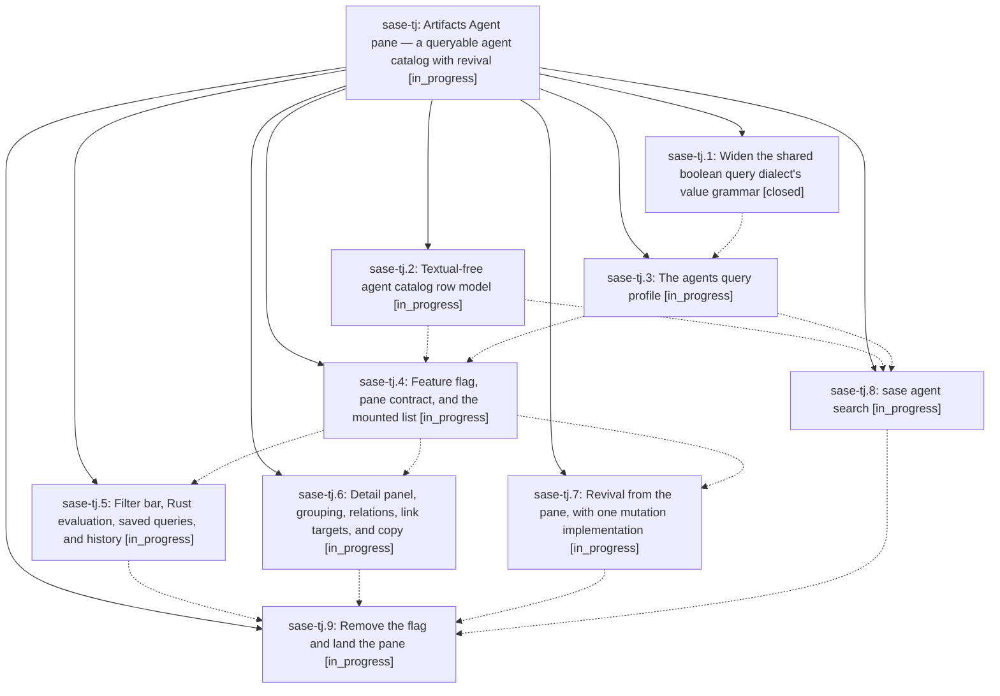

# Bead: sase-tj — Artifacts Agent pane — a queryable agent catalog with revival

[Bead Pages](../README.md) / sase-tj

**Status:** ◐ in_progress · **Type:** ▸ plan · **Tier:** epic
**Owner:** `bryanbugyi34@gmail.com` · **Created by:** [bbugyi200.athena.0da](https://github.com/sase-org/sase--agents/blob/main/families/bbugyi200.athena.0da.md) · **Assignee:** `sase-tj.land`
**Created:** 2026-08-25 08:09:37 EDT
**Plan:** [202608/artifacts\_agents\_pane.md](https://github.com/sase-org/sase--plans/blob/main/202608/artifacts_agents_pane.md)

## Description

The Artifacts tab gains an "Agent" pane that catalogs every agent SASE has ever named, filters it with the shared query dialect, resolves the `agent:` half of the artifact-link graph, and revives dismissed agents — with `sase agent search` giving the same catalog and dialect headless.

## Phases

| Bead | Title | Status | Size | Created | Agents | Commits |
|---|---|---|---|---|---:|---:|
| [sase-tj.1](sase-tj.1.md) | Widen the shared boolean query dialect's value grammar | ✓ closed | medium | 2026-08-25 | 1 | 2 |
| [sase-tj.2](sase-tj.2.md) | Textual-free agent catalog row model | ◐ in_progress | medium | 2026-08-25 | 1 | 0 |
| [sase-tj.3](sase-tj.3.md) | The agents query profile | ◐ in_progress | medium | 2026-08-25 | 1 | 0 |
| [sase-tj.4](sase-tj.4.md) | Feature flag, pane contract, and the mounted list | ◐ in_progress | medium | 2026-08-25 | 1 | 0 |
| [sase-tj.5](sase-tj.5.md) | Filter bar, Rust evaluation, saved queries, and history | ◐ in_progress | medium | 2026-08-25 | 1 | 0 |
| [sase-tj.6](sase-tj.6.md) | Detail panel, grouping, relations, link targets, and copy | ◐ in_progress | medium | 2026-08-25 | 1 | 0 |
| [sase-tj.7](sase-tj.7.md) | Revival from the pane, with one mutation implementation | ◐ in_progress | medium | 2026-08-25 | 1 | 0 |
| [sase-tj.8](sase-tj.8.md) | sase agent search | ◐ in_progress | small | 2026-08-25 | 1 | 0 |
| [sase-tj.9](sase-tj.9.md) | Remove the flag and land the pane | ◐ in_progress | medium | 2026-08-25 | 1 | 0 |

## Lineage

## Agents

| Agent | Bead | Commits |
|---|---|---:|
| [bbugyi200.athena.sase-tj.1](https://github.com/sase-org/sase--agents/blob/main/agents/bbugyi200.athena.sase-tj.1/README.md) | [sase-tj.1](sase-tj.1.md) | 2 |
| [bbugyi200.athena.sase-tj.2](https://github.com/sase-org/sase--agents/blob/main/agents/bbugyi200.athena.sase-tj.2/README.md) | [sase-tj.2](sase-tj.2.md) | 0 |
| [bbugyi200.athena.sase-tj.3](https://github.com/sase-org/sase--agents/blob/main/agents/bbugyi200.athena.sase-tj.3/README.md) | [sase-tj.3](sase-tj.3.md) | 0 |
| [bbugyi200.athena.sase-tj.4](https://github.com/sase-org/sase--agents/blob/main/agents/bbugyi200.athena.sase-tj.4/README.md) | [sase-tj.4](sase-tj.4.md) | 0 |
| [bbugyi200.athena.sase-tj.5](https://github.com/sase-org/sase--agents/blob/main/agents/bbugyi200.athena.sase-tj.5/README.md) | [sase-tj.5](sase-tj.5.md) | 0 |
| [bbugyi200.athena.sase-tj.6](https://github.com/sase-org/sase--agents/blob/main/agents/bbugyi200.athena.sase-tj.6/README.md) | [sase-tj.6](sase-tj.6.md) | 0 |
| [bbugyi200.athena.sase-tj.7](https://github.com/sase-org/sase--agents/blob/main/agents/bbugyi200.athena.sase-tj.7/README.md) | [sase-tj.7](sase-tj.7.md) | 0 |
| [bbugyi200.athena.sase-tj.8](https://github.com/sase-org/sase--agents/blob/main/agents/bbugyi200.athena.sase-tj.8/README.md) | [sase-tj.8](sase-tj.8.md) | 0 |
| [bbugyi200.athena.sase-tj.9](https://github.com/sase-org/sase--agents/blob/main/agents/bbugyi200.athena.sase-tj.9/README.md) | [sase-tj.9](sase-tj.9.md) | 0 |
| [bbugyi200.athena.sase-tj.land](https://github.com/sase-org/sase--agents/blob/main/agents/bbugyi200.athena.sase-tj.land/README.md) | [sase-tj](README.md) | 0 |

## Commits

| Repo | Commit | Subject | Bead | Committed |
|---|---|---|---|---|
| sase | [`aad3d0a`](https://github.com/sase-org/sase/commit/aad3d0ab0e5a26c485ff05eb960efec661c24309) | fix(query): widen boolean value grammar | [sase-tj.1](sase-tj.1.md) | 2026-08-25 08:37:49 EDT |
| sase-core | [`sase-core@6c38c68`](https://github.com/sase-org/sase-core/commit/6c38c6844d6580d7213e525d7a42c492427d2312) | fix(query): widen boolean tokenizer values | [sase-tj.1](sase-tj.1.md) | 2026-08-25 08:38:39 EDT |
