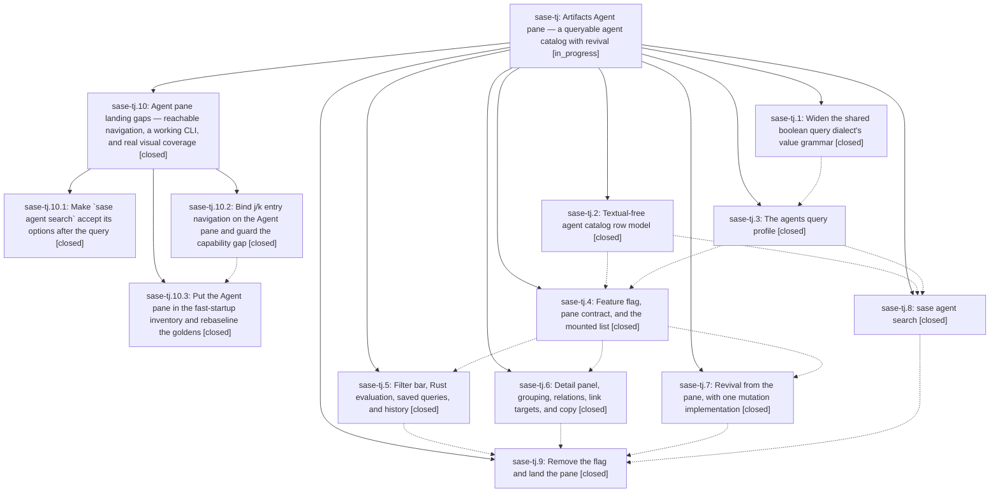

# Bead: sase-tj — Artifacts Agent pane — a queryable agent catalog with revival

[Bead Pages](../README.md) / sase-tj

**Status:** ◐ in_progress · **Type:** ▸ plan · **Tier:** epic
**Owner:** `bryanbugyi34@gmail.com` · **Created by:** [bbugyi200.athena.0da](https://github.com/sase-org/sase--agents/blob/main/families/bbugyi200.athena.0da.md) · **Assignee:** `sase-tj.land`
**Created:** 2026-08-25 08:09:37 EDT
**Plan:** [202608/artifacts\_agents\_pane.md](https://github.com/sase-org/sase--plans/blob/main/202608/artifacts_agents_pane.md)

## Description

The Artifacts tab gains an "Agent" pane that catalogs every agent SASE has ever named, filters it with the shared query dialect, resolves the `agent:` half of the artifact-link graph, and revives dismissed agents — with `sase agent search` giving the same catalog and dialect headless.

## Notes

[2026-08-25T15:39:46Z · sase-ti.land] DISCOVERED ISSUE: two ACE test failures caused by phase sase-tj.4 (ec2044ba9), found by epic sase-ti's land agent while running the landing gate on master 1a96ea92b.

1. DETERMINISTIC: tests/ace/tui/test_artifacts_scaffold.py::test_subtab_strip_labels_and_accents_cover_all_panes fails in isolation. ec2044ba9 added the 'agents' entry to FIXED_ARTIFACTS_PANE_IDS (src/sase/ace/tui/_artifact_tab_model.py:32), which flows into ARTIFACTS_PANE_IDS (src/sase/ace/tui/artifact_tabs.py:281), but the test's assertion at tests/ace/tui/test_artifacts_scaffold.py:522 still expects the pre-agents 4-tuple ('patches','stitches','beads','files'). Actual is ('patches','stitches','beads','agents','files') -- 'At index 3 diff: agents != files'. Note the pane is behind the sase-tj feature flag but FIXED_ARTIFACTS_PANE_IDS is not flag-gated, so the assertion is unconditionally wrong. Repro: .venv/bin/python -m pytest tests/ace/tui/test_artifacts_scaffold.py::test_subtab_strip_labels_and_accents_cover_all_panes -q

2. FULL-LANE FLAKE: tests/ace/tui/test_agents_pane_mount.py::test_agents_pane_mounts_activates_and_loads (added by ec2044ba9) failed in the same full 'just check-full' lane (2 failed, 36892 passed, 13 skipped, 18m12s) but passes in isolation on the same tree.

Neither is caused by epic sase-ti, which touched only src/sase/finalizers/**, src/sase/llm_provider/commit_finalizer_*, and src/sase/axe/run_agent_runner_bootstrap.py -- no ACE files. Routed here rather than filed as tasks because sase-tj is active and sase-tj.9 ('Remove the flag and land the pane') is still open.

[2026-08-25T18:58:31Z · sase-tj.land] LANDING INTERRUPTED (sase-tj.land, master e5989fd28). Verification found three
defects the epic shipped, all confirmed by running the code on this tree. They are
epic-caused, so they stay epic work: child epic plan
sase_plan_agent_pane_landing_gaps.md is proposed with parent_bead sase-tj, and its
land agent resumes this landing.

WHAT WAS VERIFIED GOOD. All nine phases closed. Grammar widened in lockstep in
Python (_PROPERTY_VALUE_RE, src/sase/ace/query/profile_reference_boolean.py:28) and
Rust (is_bare_word_byte, crates/sase_core/src/query/tokenizer.rs:24), released in
sase-core v0.32.4 (commit 6c38c68); the <0.32.0 pyproject window is by design and
the release-branch reconciler ratchets it (Justfile:112). Catalog package is
Textual-free; agents profile survived the c258d6bb6 per-pane package split and is
still registered in _BUILTIN_SCHEMA_BUILDERS. `sase artifact pane show agents`
reports digit 6, six relations, three grouping modes, the artifacts_agents copy
group, and can_mutate. Nm-collision hints present. `agent` branch added to
_known_target_for_ref; canonical agent: reference emitted from
reference_for_entry_target. Flag registry entry, schema block, and Off branch all
gone. `sase bead epic-symbols sase-tj` reports no entries; `just symvision` clean.
Integration reviewed across all 32 commits since aad3d0ab0: nothing outside the
epic conflicts with or duplicates it, and fc270fe4c already repaired the duplicate
ArtifactsAgentsActionsMixin base.

DEFECT 1 -- `sase agent search QUERY -j|-l|-p` is broken. The positional QUERY uses
nargs=argparse.REMAINDER (src/sase/main/parser_agent_search.py:70), which captures
the flags into the query text. `sase agent search 'kind:family' -l 3` exits 2 with
"error: Unexpected character: - (at position 61)"; the same flag before the query
works. All four tests in tests/test_agent_search_cli.py build argparse.Namespace by
hand or assert on format_help(), so no test has ever run argv through the parser.

DEFECT 2 -- the pane declares entry navigation it binds no key for. `sase artifact
pane show agents` reports entry_navigation ON and entry_open ON; its Keys table has
no j, k, or enter, while `show files` lists files_next j / files_prev k /
files_view_selected enter. No agents_next or agents_prev action exists in src/.
AgentsNavigationMixin.move_selection() is already there, so only the wiring is
missing. The help modal's Agent Pane section splats *artifact_list_navigation, so
the pane advertises navigation it does not have.
check_declared_keys_resolve_to_named_actions cannot catch this: it filters
CAPABILITY_HOST_ACTIONS by action_applies_to_contract, leaving only jump_to_entry,
which resolves. bench_artifacts_jk.py documents the gap and points at "the filed
bug bead" -- no such bead exists.

DEFECT 3 -- the shipped sub-tab strip has zero PNG coverage. _fast_artifacts_subtabs
(src/sase/ace/testing/_startup.py:74) hard-codes stitches/patches/beads/plan/files
with no agents entry, and AcePage defaults to startup_policy="fast", so every
visual golden renders an Artifacts strip without the Agent pane.
`just test-visual -k "artifacts or tab_icon_glyphs"` passes 134 tests against that
stale reality, which is why the land phase's required golden refresh silently never
happened and why no artifacts_agents_* golden exists. The epic worked around the
stub twice (test_agents_pane_mount.py and a second AcePage in bench_artifacts_jk.py)
rather than fixing it. The six pane snapshots the land phase named -- populated,
empty, family-grouped, filter completion, filter parse error, narrow -- are absent.

ALSO FOLDED INTO THE CHILD PLAN: test_agents_pane_mount.py awaits page.pause() and
then asserts pane.snapshot is not None with no bounded wait, so the real 12,525-row
off-thread build loses the race under load. That is the order-dependent failure
reported as PROPOSED FOLLOW-UP on sase-tj.8 and as note #1 on this bead by
sase-ti.land; e5989fd28 removed the flag plumbing but left the racing shape.

NOTE #1 ITEM 1 IS FIXED. The deterministic
test_subtab_strip_labels_and_accents_cover_all_panes failure was repaired by
e5989fd28; verified passing here alongside the conformance and scaffold suites (15
passed).

LANDING CHORES DONE THIS TURN. Closed flag bead sase-tm, which sase-tj.9 left open
against sase_flags.md's rule that flag removal closes the bead in the same change;
tools/check_feature_flags rule 8 was warning about it and now exits clean.

FOLLOW-UP DISPOSITIONS. sase-tj.1#1 / sase-tj.2#2 (symvision unused public
FinalizerBaselineRecord): already fixed on master by 9c5d26eac + d4347600c, `just
symvision` clean -- no task. sase-tj.5#2 (home SASE memory init drift): `sase init
memory --check` now reports clean -- no task. sase-tj.5#1 (notification tag-strip
xdist flake): exact semantic duplicate of ready task sase-t3, corroborated with +1.
sase-tj.2#3 (known_project_keys covers only enabled projects): filed as sase-ts,
ready, with measured evidence that 15 of 289 patch-carrying rows report
project-key-shaped values. sase-tj.3#1 (deferred v2 query fields): DECLINED as a
task. The parent plan §3.4 asked only that these be recorded as a note on the
dialect phase bead, and that note is permanent on sase-tj.3. Each field needs an
artifact-index schema migration plus a reindex, and the dismissed archive has no
equivalent, so a bead now would be the wish list the `feature` task type warns
against rather than actionable work.

NOT VERIFIED. The land phase's monitored `just check-full` gate never ran, and j/k
p95 was never captured. Both belong to the resumed landing; p95 is blocked on
defect 2 and is assigned to the child plan's navigation phase.

[2026-08-26T11:28:47Z · sase-tj.10.land] DISCOVERED ISSUE (sase-tj.10 land agent, master e8de34fe0): the Copy as palette is unreachable on the Artifacts Agent pane, so the entire artifacts_agents copy group this epic shipped is dead code. Caused by this epic, not by sase-tj.10.

REPRODUCTION (run on this tree, not inferred):
  .venv/bin/python -c '
  from tests.ace.tui._copy_as_palette_helpers import PaletteHarness
  from sase.ace.tui.actions.clipboard._palette import build_copy_as_context
  app = PaletteHarness(); app.current_tab = "artifacts"
  app.current_artifacts_subtab = "agents"
  print(build_copy_as_context(app), app.notifications)'
prints 'None [("No Patch to copy", "warning")]'.

ROOT CAUSE: src/sase/ace/tui/actions/clipboard/_palette.py:28 declares
_ARTIFACT_SUBTABS = frozenset({"stitches", "beads", "files"}). build_copy_as_context()
routes to build_artifacts_context() only when the leaf pane is in that set or is a
document pane; 'agents' is neither, so it falls through to _build_patch_context(app).
That file was last touched by 7060a2ec4, before this epic added the pane, so the pane
was never added to the set.

USER IMPACT: '%' (copy_tab_content -> action_start_copy_mode) is the only entry to the
Copy as palette, and action_start_copy_mode returns early when the context is None, so
_copy_mode_active is never set and the copy footer never paints. On the Agent pane it
warns 'No Patch to copy'. Nine copy targets this epic declared and keyed are therefore
unreachable: copy_targets_for('artifacts_agents') returns
['reference','name','link','path','chat','prompt','json','handoff','snapshot'] and
src/sase/default_config.yml:695-704 binds all of them. Only 'reference' has another
door ('y' -> artifacts_copy_reference); the other eight have none. The docstring at
src/sase/ace/tui/actions/clipboard/_artifacts.py:103 states the intended contract --
'Sha/bug/id/etc. copies remain reachable through copy mode (%)' -- which does not hold
for this pane.

NOT A ONE-LINE FIX. Adding 'agents' to _ARTIFACT_SUBTABS is necessary but not
sufficient: in _palette_artifacts.py, _selected_artifact_object() (line 130) falls
through to getattr(pane, 'selected_issue') and _artifact_objects() (line 145) falls
through to pane.issues/_issue_target for any subtab that is not
stitches/beads/files/document, so both return nothing for the Agent pane. Each needs an
agents branch, and artifact_target_state() needs warm previews for the nine targets,
plus palette coverage in tests/ace/tui/test_copy_as_palette_contexts.py (which has no
agents case today) and a _copy_as_palette_helpers.PaletteHarness._agents_pane resolver.

WHY THIS IS RECORDED HERE: th

… and 2466 more characters

## Phases

| Bead | Title | Status | Size | Created | Agents | Commits |
|---|---|---|---|---|---:|---:|
| [sase-tj.1](sase-tj.1.md) | Widen the shared boolean query dialect's value grammar | ✓ closed | medium | 2026-08-25 | 1 | 2 |
| [sase-tj.2](sase-tj.2.md) | Textual-free agent catalog row model | ✓ closed | medium | 2026-08-25 | 1 | 1 |
| [sase-tj.3](sase-tj.3.md) | The agents query profile | ✓ closed | medium | 2026-08-25 | 1 | 1 |
| [sase-tj.4](sase-tj.4.md) | Feature flag, pane contract, and the mounted list | ✓ closed | medium | 2026-08-25 | 0 | 1 |
| [sase-tj.5](sase-tj.5.md) | Filter bar, Rust evaluation, saved queries, and history | ✓ closed | medium | 2026-08-25 | 1 | 1 |
| [sase-tj.6](sase-tj.6.md) | Detail panel, grouping, relations, link targets, and copy | ✓ closed | medium | 2026-08-25 | 1 | 1 |
| [sase-tj.7](sase-tj.7.md) | Revival from the pane, with one mutation implementation | ✓ closed | medium | 2026-08-25 | 1 | 1 |
| [sase-tj.8](sase-tj.8.md) | sase agent search | ✓ closed | small | 2026-08-25 | 1 | 1 |
| [sase-tj.9](sase-tj.9.md) | Remove the flag and land the pane | ✓ closed | medium | 2026-08-25 | 1 | 1 |

## Lineage

## Agents

| Agent | Bead | Commits |
|---|---|---:|
| [bbugyi200.athena.sase-tj.1](https://github.com/sase-org/sase--agents/blob/main/agents/bbugyi200.athena.sase-tj.1/README.md) | [sase-tj.1](sase-tj.1.md) | 2 |
| [bbugyi200.athena.sase-tj.10.1](https://github.com/sase-org/sase--agents/blob/main/agents/bbugyi200.athena.sase-tj.10.1/README.md) | [sase-tj.10.1](sase-tj.10.1.md) | 1 |
| [bbugyi200.athena.sase-tj.10.2](https://github.com/sase-org/sase--agents/blob/main/agents/bbugyi200.athena.sase-tj.10.2/README.md) | [sase-tj.10.2](sase-tj.10.2.md) | 1 |
| [bbugyi200.athena.sase-tj.10.land](https://github.com/sase-org/sase--agents/blob/main/families/bbugyi200.athena.sase-tj.10.land.md) | [sase-tj.10](sase-tj.10.md) | 1 |
| [bbugyi200.athena.sase-tj.2](https://github.com/sase-org/sase--agents/blob/main/agents/bbugyi200.athena.sase-tj.2/README.md) | [sase-tj.2](sase-tj.2.md) | 1 |
| [bbugyi200.athena.sase-tj.3](https://github.com/sase-org/sase--agents/blob/main/agents/bbugyi200.athena.sase-tj.3/README.md) | [sase-tj.3](sase-tj.3.md) | 1 |
| [bbugyi200.athena.sase-tj.5](https://github.com/sase-org/sase--agents/blob/main/families/bbugyi200.athena.sase-tj.5.md) | [sase-tj.5](sase-tj.5.md) | 1 |
| [bbugyi200.athena.sase-tj.6](https://github.com/sase-org/sase--agents/blob/main/agents/bbugyi200.athena.sase-tj.6/README.md) | [sase-tj.6](sase-tj.6.md) | 1 |
| [bbugyi200.athena.sase-tj.7](https://github.com/sase-org/sase--agents/blob/main/families/bbugyi200.athena.sase-tj.7.md) | [sase-tj.7](sase-tj.7.md) | 1 |
| [bbugyi200.athena.sase-tj.8](https://github.com/sase-org/sase--agents/blob/main/agents/bbugyi200.athena.sase-tj.8/README.md) | [sase-tj.8](sase-tj.8.md) | 1 |
| [bbugyi200.athena.sase-tj.9](https://github.com/sase-org/sase--agents/blob/main/agents/bbugyi200.athena.sase-tj.9/README.md) | [sase-tj.9](sase-tj.9.md) | 1 |
| [bbugyi200.athena.sase-tj.land](https://github.com/sase-org/sase--agents/blob/main/families/bbugyi200.athena.sase-tj.land.md) | [sase-tj](README.md) | 0 |

## Commits

| Repo | Commit | Subject | Bead | Committed |
|---|---|---|---|---|
| sase | [`aad3d0a`](https://github.com/sase-org/sase/commit/aad3d0ab0e5a26c485ff05eb960efec661c24309) | fix(query): widen boolean value grammar | [sase-tj.1](sase-tj.1.md) | 2026-08-25 08:37:49 EDT |
| sase-core | [`sase-core@6c38c68`](https://github.com/sase-org/sase-core/commit/6c38c6844d6580d7213e525d7a42c492427d2312) | fix(query): widen boolean tokenizer values | [sase-tj.1](sase-tj.1.md) | 2026-08-25 08:38:39 EDT |
| sase | [`2a0c7d6`](https://github.com/sase-org/sase/commit/2a0c7d6fa8593ab1758117a8ed59cb0a13b5f3b2) | feat(agents): add Textual-free agent catalog row model | [sase-tj.2](sase-tj.2.md) | 2026-08-25 09:00:01 EDT |
| sase | [`70a9d10`](https://github.com/sase-org/sase/commit/70a9d101583f0610a48ae09fe304c97b6d0ff232) | feat(query-profile): add agents built-in profile | [sase-tj.3](sase-tj.3.md) | 2026-08-25 09:53:04 EDT |
| sase | [`ec2044b`](https://github.com/sase-org/sase/commit/ec2044ba9d7ab7a9c937a15c8add25a7ea3c2a65) | feat: Feature flag, pane contract, and the mounted list (sase-tj.4) | [sase-tj.4](sase-tj.4.md) | 2026-08-25 10:50:57 EDT |
| sase | [`2fa772b`](https://github.com/sase-org/sase/commit/2fa772b93d3e28c1ffaab259a7b946eac897203f) | feat(ace-tui): add agents pane with detail view and artifact relations | [sase-tj.6](sase-tj.6.md) | 2026-08-25 11:48:31 EDT |
| sase | [`85e2f76`](https://github.com/sase-org/sase/commit/85e2f768ec6b08d90b937590f8b9230e65624067) | feat(agent): add catalog search command | [sase-tj.8](sase-tj.8.md) | 2026-08-25 11:53:38 EDT |
| sase | [`a1e029c`](https://github.com/sase-org/sase/commit/a1e029c657392929f52a565946829e2cf5dbbc90) | feat(tui): revive agents from artifact pane | [sase-tj.7](sase-tj.7.md) | 2026-08-25 12:09:32 EDT |
| sase | [`b85cdff`](https://github.com/sase-org/sase/commit/b85cdffd3de6c93b04e9a43c8bf913fed69e2a31) | feat(artifacts): wire agent pane query session | [sase-tj.5](sase-tj.5.md) | 2026-08-25 13:23:35 EDT |
| sase | [`e5989fd`](https://github.com/sase-org/sase/commit/e5989fd286ed5f2e328e8928c7894028d697285a) | feat(artifacts): remove agents-pane feature flag and fix stale test fixtures | [sase-tj.9](sase-tj.9.md) | 2026-08-25 14:20:23 EDT |
| sase | [`ba8a9cc`](https://github.com/sase-org/sase/commit/ba8a9cc75d0e50442257f01ef9b5a7aec5d9b7b9) | fix(agent-search): let \`sase agent search\` accept -j/-l/-p after the query | [sase-tj.10.1](sase-tj.10.1.md) | 2026-08-25 15:23:29 EDT |
| sase | [`9b4f7d4`](https://github.com/sase-org/sase/commit/9b4f7d41a6d4de19454f1972d1e8f54391723205) | feat(artifacts-agents): bind j/k navigation on the Agent pane and guard capability reachability | [sase-tj.10.2](sase-tj.10.2.md) | 2026-08-25 15:35:02 EDT |
| sase | [`e8de34f`](https://github.com/sase-org/sase/commit/e8de34fe0c52a13610fd78ae865f982ffde1b4c6) | feat: Put the Agent pane in the fast-startup inventory and rebaseline and rebase the goldens (sase-tj.10.3) | [sase-tj.10.3](sase-tj.10.3.md) | 2026-08-26 06:37:43 EDT |
| sase | [`a5989a8`](https://github.com/sase-org/sase/commit/a5989a8738023567daf8b215a2b2a1c4865453bc) | test(artifacts-agents): repair the Agent pane visual fixture and rebaseline one golden | [sase-tj.10](sase-tj.10.md) | 2026-08-26 08:21:15 EDT |
