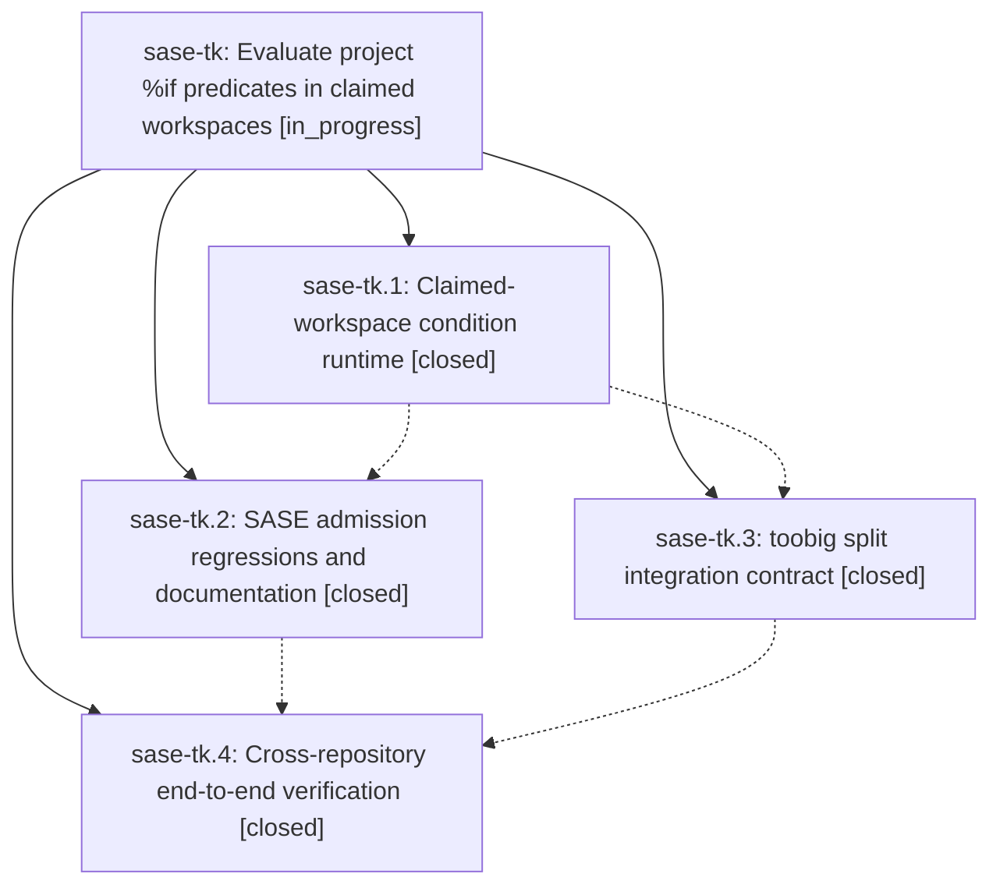

# Bead: sase-tk — Evaluate project %if predicates in claimed workspaces

[Bead Pages](../README.md) / sase-tk

**Status:** ◐ in_progress · **Type:** ▸ plan · **Tier:** epic
**Owner:** `bryanbugyi34@gmail.com` · **Created by:** [bbugyi200.athena.0dd](https://github.com/sase-org/sase--agents/blob/main/families/bbugyi200.athena.0dd.md) · **Assignee:** `sase-tk.land`
**Created:** 2026-08-25 08:40:50 EDT
**Plan:** [202608/claimed\_workspace\_if.md](https://github.com/sase-org/sase--plans/blob/main/202608/claimed_workspace_if.md)

## Description

Project-scoped %if predicates run only after admission claims and prepares a numbered workspace, so stale source checkouts cannot admit obsolete agents.

## Notes

[2026-08-25T17:03:56Z · sase-tk.land] DISCOVERED ISSUE: land audit found an epic-caused condition-claim leak after all phases closed. In src/sase/agent/launch_condition_workspace.py, acquire_condition_workspace() acquires OperationalLease before write_json_marker_atomic(); if marker persistence raises (reproduced by injecting OSError), the raw exception escapes and release_operational_lease is called 0 times. AdmissionEngine catches only ConditionWorkspaceError/Unavailable, so the request can crash without a visible condition_error while leaving lease(launch-if:...) RUNNING. Remaining work must release the just-acquired lease exactly once on marker-write failure, translate the failure into the condition error contract, cover helper/engine behavior, and reverify before epic closure. Reproduction during sase-tk land audit: raised=simulated marker write failure; release_calls=0.

[2026-08-25T17:13:29Z · sase-tk.land] IMPLEMENTED condition marker failure repair for 202608/condition_workspace_marker_failure.md. Cleanup assertions: test_condition_workspace_marker_write_failure_releases_acquired_lease injects OSError from write_json_marker_atomic after fake operational lease acquisition; acquire_condition_workspace raises ConditionWorkspaceError with the OSError as __cause__; release_operational_lease receives exactly one policy whose workflow starts lease(launch-if:); no condition_workspace_lease.json marker exists. Admission assertions: test_marker_write_failure_fails_closed_without_evaluating_condition records complete admission with summary.condition_errors == 1, never invokes the predicate, keeps the _run_plan dispatcher fail guard uncalled, releases exactly once, leaves no marker, journals condition_error with no checking phase, and writes a receipt outcome of condition_error with the marker-persistence message. Verification: just install passed; .venv/bin/python -m ruff check src/sase/agent/launch_condition_workspace.py tests/test_launch_condition_workspace.py passed; .venv/bin/pytest tests/test_launch_condition_workspace.py passed 14 tests; .venv/bin/pytest tests/test_launch_admission_failures.py tests/test_launch_condition_runtime.py passed 13 tests; just check passed, including fmt/lint/SASE validation/committed-plans gates and scoped pytest selecting 75 of 3351 files. Initial bare pytest used system Python and failed before collection because rich was unavailable there; all verification above used the repo venv.

## Phases

| Bead | Title | Status | Size | Created | Agents | Commits |
|---|---|---|---|---|---:|---:|
| [sase-tk.1](sase-tk.1.md) | Claimed-workspace condition runtime | ✓ closed | medium | 2026-08-25 | 1 | 1 |
| [sase-tk.2](sase-tk.2.md) | SASE admission regressions and documentation | ✓ closed | small | 2026-08-25 | 0 | 1 |
| [sase-tk.3](sase-tk.3.md) | toobig split integration contract | ✓ closed | small | 2026-08-25 | 1 | 0 |
| [sase-tk.4](sase-tk.4.md) | Cross-repository end-to-end verification | ✓ closed | xsmall | 2026-08-25 | 1 | 0 |

## Lineage

## Agents

| Agent | Bead | Commits |
|---|---|---:|
| [bbugyi200.athena.sase-tk.1](https://github.com/sase-org/sase--agents/blob/main/agents/bbugyi200.athena.sase-tk.1/README.md) | [sase-tk.1](sase-tk.1.md) | 1 |
| [bbugyi200.athena.sase-tk.3](https://github.com/sase-org/sase--agents/blob/main/agents/bbugyi200.athena.sase-tk.3/README.md) | [sase-tk.3](sase-tk.3.md) | 0 |
| [bbugyi200.athena.sase-tk.4](https://github.com/sase-org/sase--agents/blob/main/families/bbugyi200.athena.sase-tk.4.md) | [sase-tk.4](sase-tk.4.md) | 0 |
| [bbugyi200.athena.sase-tk.land](https://github.com/sase-org/sase--agents/blob/main/families/bbugyi200.athena.sase-tk.land.md) | [sase-tk](README.md) | 1 |

## Commits

| Repo | Commit | Subject | Bead | Committed |
|---|---|---|---|---|
| sase | [`9cf6049`](https://github.com/sase-org/sase/commit/9cf60497818ced2098ef7483302e64ee411b46a7) | feat(agent): lease workspaces for project conditions | [sase-tk.1](sase-tk.1.md) | 2026-08-25 10:16:54 EDT |
| sase | [`9fb3a18`](https://github.com/sase-org/sase/commit/9fb3a1805e3cdec51e7d6a42a2340e834f514904) | feat: SASE admission regressions and documentation (sase-tk.2) | [sase-tk.2](sase-tk.2.md) | 2026-08-25 10:52:42 EDT |
| sase | [`0bdca93`](https://github.com/sase-org/sase/commit/0bdca9380de38a8fe7857531537839944bd9f415) | fix(agent): release condition lease on marker failure | [sase-tk](README.md) | 2026-08-25 13:15:10 EDT |
