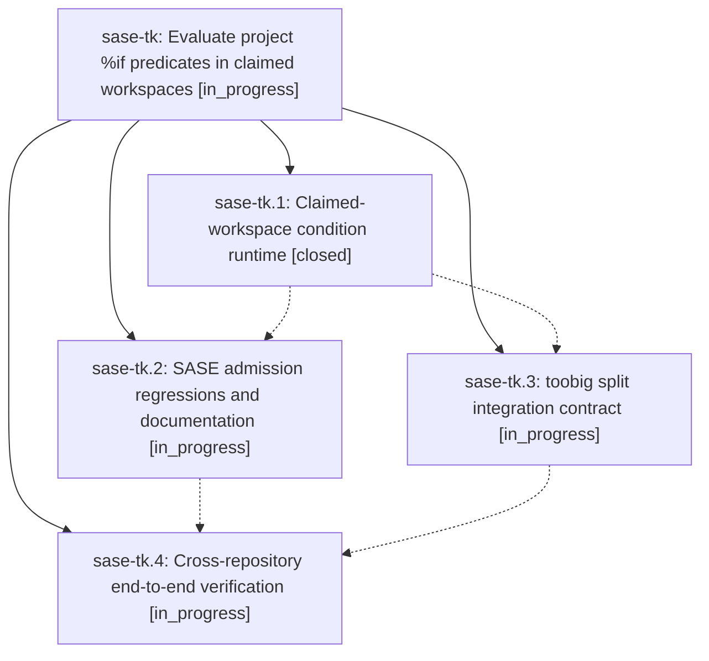

# Bead: sase-tk — Evaluate project %if predicates in claimed workspaces

[Bead Pages](../README.md) / sase-tk

**Status:** ◐ in_progress · **Type:** ▸ plan · **Tier:** epic
**Owner:** `bryanbugyi34@gmail.com` · **Created by:** [bbugyi200.athena.0dd](https://github.com/sase-org/sase--agents/blob/main/families/bbugyi200.athena.0dd.md) · **Assignee:** `sase-tk.land`
**Created:** 2026-08-25 08:40:50 EDT
**Plan:** [202608/claimed\_workspace\_if.md](https://github.com/sase-org/sase--plans/blob/main/202608/claimed_workspace_if.md)

## Description

Project-scoped %if predicates run only after admission claims and prepares a numbered workspace, so stale source checkouts cannot admit obsolete agents.

## Phases

| Bead | Title | Status | Size | Created | Agents | Commits |
|---|---|---|---|---|---:|---:|
| [sase-tk.1](sase-tk.1.md) | Claimed-workspace condition runtime | ✓ closed | medium | 2026-08-25 | 1 | 1 |
| [sase-tk.2](sase-tk.2.md) | SASE admission regressions and documentation | ◐ in_progress | small | 2026-08-25 | 1 | 0 |
| [sase-tk.3](sase-tk.3.md) | toobig split integration contract | ◐ in_progress | small | 2026-08-25 | 1 | 0 |
| [sase-tk.4](sase-tk.4.md) | Cross-repository end-to-end verification | ◐ in_progress | xsmall | 2026-08-25 | 1 | 0 |

## Lineage

## Agents

| Agent | Bead | Commits |
|---|---|---:|
| [bbugyi200.athena.sase-tk.1](https://github.com/sase-org/sase--agents/blob/main/agents/bbugyi200.athena.sase-tk.1/README.md) | [sase-tk.1](sase-tk.1.md) | 1 |
| [bbugyi200.athena.sase-tk.2](https://github.com/sase-org/sase--agents/blob/main/agents/bbugyi200.athena.sase-tk.2/README.md) | [sase-tk.2](sase-tk.2.md) | 0 |
| [bbugyi200.athena.sase-tk.3](https://github.com/sase-org/sase--agents/blob/main/agents/bbugyi200.athena.sase-tk.3/README.md) | [sase-tk.3](sase-tk.3.md) | 0 |
| [bbugyi200.athena.sase-tk.4](https://github.com/sase-org/sase--agents/blob/main/agents/bbugyi200.athena.sase-tk.4/README.md) | [sase-tk.4](sase-tk.4.md) | 0 |
| [bbugyi200.athena.sase-tk.land](https://github.com/sase-org/sase--agents/blob/main/agents/bbugyi200.athena.sase-tk.land/README.md) | [sase-tk](README.md) | 0 |

## Commits

| Repo | Commit | Subject | Bead | Committed |
|---|---|---|---|---|
| sase | [`9cf6049`](https://github.com/sase-org/sase/commit/9cf60497818ced2098ef7483302e64ee411b46a7) | feat(agent): lease workspaces for project conditions | [sase-tk.1](sase-tk.1.md) | 2026-08-25 10:16:54 EDT |
