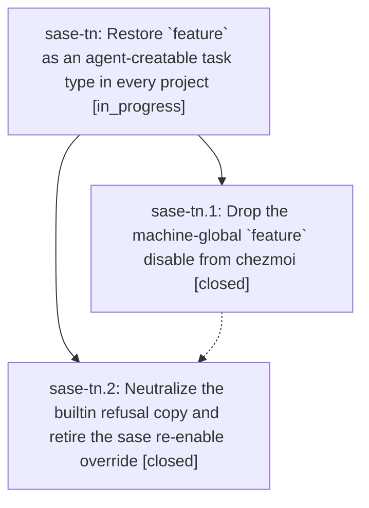

# Bead: sase-tn — Restore \`feature\` as an agent-creatable task type in every project

[Bead Pages](../README.md) / sase-tn

**Status:** ◐ in_progress · **Type:** ▸ plan · **Tier:** epic
**Owner:** `bryanbugyi34@gmail.com` · **Created by:** [bbugyi200.athena.0dk](https://github.com/sase-org/sase--agents/blob/main/families/bbugyi200.athena.0dk.md) · **Assignee:** `sase-tn.land`
**Created:** 2026-08-25 12:36:21 EDT
**Plan:** [202608/feature\_task\_type\_default.md](https://github.com/sase-org/sase--plans/blob/main/202608/feature_task_type_default.md)

## Description

The builtin `feature` task type is agent-creatable everywhere by default: no machine-global `bead.task_types` entry suppresses it, the `sase` project no longer carries a re-enable override, and the shipped `create_refusal` copy no longer names one machine's policy.

## Phases

| Bead | Title | Status | Size | Created | Agents | Commits |
|---|---|---|---|---|---:|---:|
| [sase-tn.1](sase-tn.1.md) | Drop the machine-global \`feature\` disable from chezmoi | ✓ closed | small | 2026-08-25 | 1 | 0 |
| [sase-tn.2](sase-tn.2.md) | Neutralize the builtin refusal copy and retire the sase re-enable override | ✓ closed | small | 2026-08-25 | 1 | 1 |

## Lineage

## Agents

| Agent | Bead | Commits |
|---|---|---:|
| [bbugyi200.athena.sase-tn.1](https://github.com/sase-org/sase--agents/blob/main/agents/bbugyi200.athena.sase-tn.1/README.md) | [sase-tn.1](sase-tn.1.md) | 0 |
| [bbugyi200.athena.sase-tn.2](https://github.com/sase-org/sase--agents/blob/main/agents/bbugyi200.athena.sase-tn.2/README.md) | [sase-tn.2](sase-tn.2.md) | 1 |
| [bbugyi200.athena.sase-tn.land](https://github.com/sase-org/sase--agents/blob/main/agents/bbugyi200.athena.sase-tn.land/README.md) | [sase-tn](README.md) | 0 |

## Commits

| Repo | Commit | Subject | Bead | Committed |
|---|---|---|---|---|
| sase | [`5ca05f6`](https://github.com/sase-org/sase/commit/5ca05f6a57a6b4513559e04c62d08c80b3ca7f6b) | feat(task-types): neutralize feature refusal copy | [sase-tn.2](sase-tn.2.md) | 2026-08-25 13:01:05 EDT |
