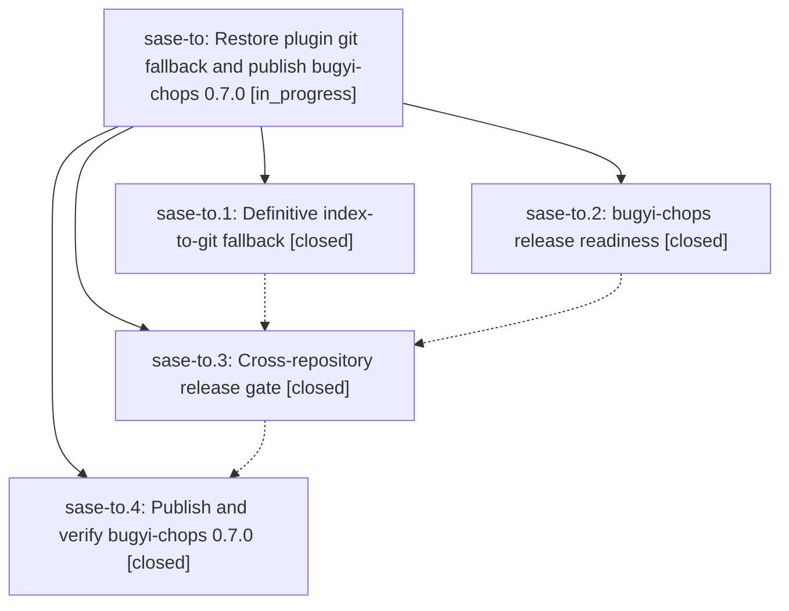

# Bead: sase-to — Restore plugin git fallback and publish bugyi-chops 0.7.0

[Bead Pages](../README.md) / sase-to

**Status:** ◐ in_progress · **Type:** ▸ plan · **Tier:** epic
**Owner:** `bryanbugyi34@gmail.com` · **Created by:** [bbugyi200.athena.0dm](https://github.com/sase-org/sase--agents/blob/main/families/bbugyi200.athena.0dm.md) · **Assignee:** `sase-to.land`
**Created:** 2026-08-25 13:05:34 EDT
**Plan:** [202608/git\_fallback\_and\_bugyi\_chops\_release.md](https://github.com/sase-org/sase--plans/blob/main/202608/git_fallback_and_bugyi_chops_release.md)

## Description

Catalog plugin installs automatically fall back to the repository only when public PyPI definitively lacks the distribution, while bugyi-chops has a green, trusted-publishing release path and its first PyPI release is verifiably published as 0.7.0.

## Notes

[2026-08-25T18:47:45Z · sase-to.land] LAND AUDIT, landing interrupted for remaining epic work. Verified every child and note against the approved plan. No child contains a PROPOSED FOLLOW-UP entry. Phase sase-to.1 commit f818f16a1 implements the typed available, missing, and unavailable PyPI probe, definitive-404-only single and mixed batch fallback, CLI JSON, ACE source previews and durable forced-git argv, tests, and docs. However, the pre-existing PluginsRequired command in src/sase/plugins/_required_gate_spec.py still calls plan_install and execute_install separately for every baked name. That misses this epic plan requirement to use one bounded required-plugin batch and can execute multiple receipt reconstructions planned from the same stale receipt, so a later install can omit an earlier plugin. A validated remaining-work tale is ready in sase_plan_plugins_required_batch_fallback.md. Verified bugyi-chops commit 0a7c2e1f13a425b12eab2e5f1a83c29f8d9fbe9f is still clean origin/master, contains the scoped typed-launch test repairs, hardened trusted-publishing workflow, corrected README, and version 0.7.0. Remote annotated tag v0.7.0 resolves to that commit; GitHub Actions run 32882895101 completed both build and publish successfully; PyPI reports only release 0.7.0 with the expected wheel and sdist. Reviewed every SASE commit after f818f16a1 through bb429cf37; the query-profile, artifacts-pane, copy-target, and agent-catalog changes do not touch or duplicate plugin resolution. bugyi-chops has no commit after the release commit. sase bead epic-symbols sase-to reports no entries. Independent issue: PluginsRequired version_mismatch can no-op as AlreadyInstalled; duplicate and active-epic checks found no owner, so it is recorded separately as ready medium bug task sase-tr with artifact file:explicit:a47997e06b0a3a88bb2e86ac. Do not fold sase-tr into this epic-owned batch repair.

## Phases

| Bead | Title | Status | Size | Created | Agents | Commits |
|---|---|---|---|---|---:|---:|
| [sase-to.1](sase-to.1.md) | Definitive index-to-git fallback | ✓ closed | medium | 2026-08-25 | 1 | 1 |
| [sase-to.2](sase-to.2.md) | bugyi-chops release readiness | ✓ closed | small | 2026-08-25 | 1 | 0 |
| [sase-to.3](sase-to.3.md) | Cross-repository release gate | ✓ closed | xsmall | 2026-08-25 | 1 | 0 |
| [sase-to.4](sase-to.4.md) | Publish and verify bugyi-chops 0.7.0 | ✓ closed | small | 2026-08-25 | 1 | 0 |

## Lineage

## Agents

| Agent | Bead | Commits |
|---|---|---:|
| [bbugyi200.athena.sase-to.1](https://github.com/sase-org/sase--agents/blob/main/agents/bbugyi200.athena.sase-to.1/README.md) | [sase-to.1](sase-to.1.md) | 1 |
| [bbugyi200.athena.sase-to.2](https://github.com/sase-org/sase--agents/blob/main/agents/bbugyi200.athena.sase-to.2/README.md) | [sase-to.2](sase-to.2.md) | 0 |
| [bbugyi200.athena.sase-to.3](https://github.com/sase-org/sase--agents/blob/main/agents/bbugyi200.athena.sase-to.3/README.md) | [sase-to.3](sase-to.3.md) | 0 |
| [bbugyi200.athena.sase-to.4](https://github.com/sase-org/sase--agents/blob/main/agents/bbugyi200.athena.sase-to.4/README.md) | [sase-to.4](sase-to.4.md) | 0 |
| [bbugyi200.athena.sase-to.land](https://github.com/sase-org/sase--agents/blob/main/families/bbugyi200.athena.sase-to.land.md) | [sase-to](README.md) | 1 |

## Commits

| Repo | Commit | Subject | Bead | Committed |
|---|---|---|---|---|
| sase | [`f818f16`](https://github.com/sase-org/sase/commit/f818f16a10c6b46e49e0ea8b87d79e7b4d830bd4) | feat(plugins): fall back to git install only on definitive PyPI 404 | [sase-to.1](sase-to.1.md) | 2026-08-25 13:52:44 EDT |
| sase | [`269329d`](https://github.com/sase-org/sase/commit/269329d34f0b32cfef8089f168c3e07c9b70dfa1) | fix(plugins): batch required-plugin gate installs | [sase-to](README.md) | 2026-08-25 15:30:36 EDT |
