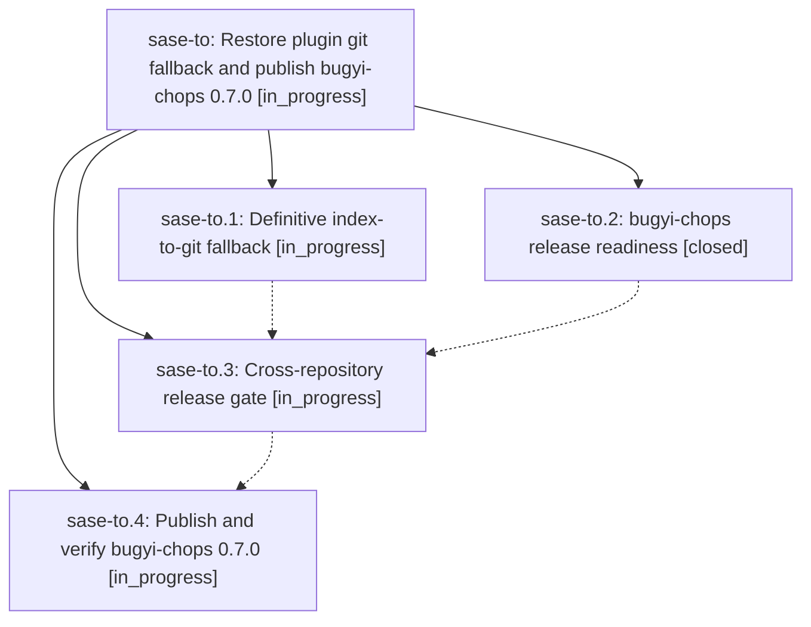

# Bead: sase-to — Restore plugin git fallback and publish bugyi-chops 0.7.0

[Bead Pages](../README.md) / sase-to

**Status:** ◐ in_progress · **Type:** ▸ plan · **Tier:** epic
**Owner:** `bryanbugyi34@gmail.com` · **Created by:** [bbugyi200.athena.0dm](https://github.com/sase-org/sase--agents/blob/main/families/bbugyi200.athena.0dm.md) · **Assignee:** `sase-to.land`
**Created:** 2026-08-25 13:05:34 EDT
**Plan:** [202608/git\_fallback\_and\_bugyi\_chops\_release.md](https://github.com/sase-org/sase--plans/blob/main/202608/git_fallback_and_bugyi_chops_release.md)

## Description

Catalog plugin installs automatically fall back to the repository only when public PyPI definitively lacks the distribution, while bugyi-chops has a green, trusted-publishing release path and its first PyPI release is verifiably published as 0.7.0.

## Phases

| Bead | Title | Status | Size | Created | Agents | Commits |
|---|---|---|---|---|---:|---:|
| [sase-to.1](sase-to.1.md) | Definitive index-to-git fallback | ◐ in_progress | medium | 2026-08-25 | 1 | 1 |
| [sase-to.2](sase-to.2.md) | bugyi-chops release readiness | ✓ closed | small | 2026-08-25 | 1 | 0 |
| [sase-to.3](sase-to.3.md) | Cross-repository release gate | ◐ in_progress | xsmall | 2026-08-25 | 1 | 0 |
| [sase-to.4](sase-to.4.md) | Publish and verify bugyi-chops 0.7.0 | ◐ in_progress | small | 2026-08-25 | 1 | 0 |

## Lineage

## Agents

| Agent | Bead | Commits |
|---|---|---:|
| [bbugyi200.athena.sase-to.1](https://github.com/sase-org/sase--agents/blob/main/agents/bbugyi200.athena.sase-to.1/README.md) | [sase-to.1](sase-to.1.md) | 1 |
| [bbugyi200.athena.sase-to.2](https://github.com/sase-org/sase--agents/blob/main/agents/bbugyi200.athena.sase-to.2/README.md) | [sase-to.2](sase-to.2.md) | 0 |
| [bbugyi200.athena.sase-to.3](https://github.com/sase-org/sase--agents/blob/main/agents/bbugyi200.athena.sase-to.3/README.md) | [sase-to.3](sase-to.3.md) | 0 |
| [bbugyi200.athena.sase-to.4](https://github.com/sase-org/sase--agents/blob/main/agents/bbugyi200.athena.sase-to.4/README.md) | [sase-to.4](sase-to.4.md) | 0 |
| [bbugyi200.athena.sase-to.land](https://github.com/sase-org/sase--agents/blob/main/agents/bbugyi200.athena.sase-to.land/README.md) | [sase-to](README.md) | 0 |

## Commits

| Repo | Commit | Subject | Bead | Committed |
|---|---|---|---|---|
| sase | [`f818f16`](https://github.com/sase-org/sase/commit/f818f16a10c6b46e49e0ea8b87d79e7b4d830bd4) | feat(plugins): fall back to git install only on definitive PyPI 404 | [sase-to.1](sase-to.1.md) | 2026-08-25 13:52:44 EDT |
