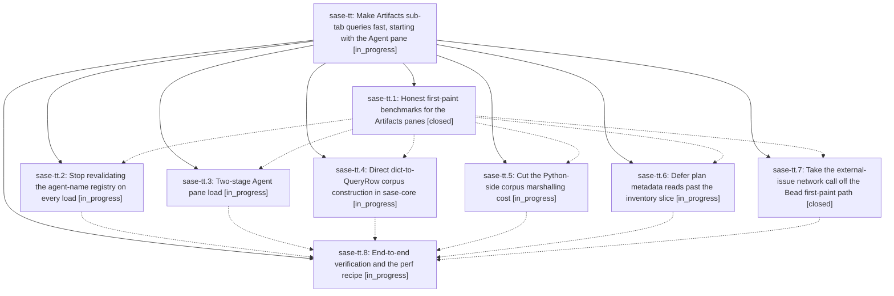

# Bead: sase-tt — Make Artifacts sub-tab queries fast, starting with the Agent pane

[Bead Pages](../README.md) / sase-tt

**Status:** ◐ in_progress · **Type:** ▸ plan · **Tier:** epic
**Owner:** `bryanbugyi34@gmail.com` · **Created by:** [bbugyi200.athena.0do](https://github.com/sase-org/sase--agents/blob/main/families/bbugyi200.athena.0do.md) · **Assignee:** `sase-tt.land`
**Created:** 2026-08-25 14:59:11 EDT
**Plan:** [202608/artifacts\_query\_performance.md](https://github.com/sase-org/sase--plans/blob/main/202608/artifacts_query_performance.md)

## Description

Every Artifacts sub-tab paints its default `limit:100` view in well under half a second on a live-scale corpus, and the corpus work that only a wider query needs happens after first paint instead of before it.

## Notes

[2026-08-25T20:09:00Z · 0ds] INTEGRATION: epic sase-tw ("Artifact links that survive, derive themselves, and pay for
the turn", plan:202608/artifact_link_durability_and_derivation.md) was proposed 35
minutes after this epic, and its phase sase-tw.13 (agent-pane-filters) edits four of the
same files: src/sase/agents/catalog/_query.py,
src/sase/ace/tui/widgets/artifacts/query_rows.py,
src/sase/ace/tui/widgets/artifacts/agents_data.py, and src/sase/agents/cli_search.py.
Neither plan mentions the other. sase-tw.13 already carries a "do not start until
sase-tj.10 has landed" gate; it now also waits for this whole epic to land, and has been
told so on its own bead.

This epic lands first and owns the Agent pane's first-paint budget, so §2.1's ≤400ms
Agent target is a shared budget rather than a private one. sase-tw.13 adds a per-row
artifact-link facet join to agent_catalog_query_entry — the exact function sase-tt.5 is
shrinking — and has been told to re-run tests/perf/bench_artifacts_first_paint.py and
hold that number. See the note on sase-tt.8 for what that requires of the perf recipe.

One fact this epic's measured breakdown does not itemize: AgentsSnapshot already carries
an artifact_links: ArtifactLinksSnapshot field, and load_agents_snapshot already calls
load_artifact_links_snapshot(project) (agents_data.py:24-56). It is cheap today at 112
machine-global aggregate rows. Epic sase-tw's stated goal is ~1,600+ rows, so treat it
as a growing cost on the load path rather than a constant.

## Phases

| Bead | Title | Status | Size | Created | Agents | Commits |
|---|---|---|---|---|---:|---:|
| [sase-tt.1](sase-tt.1.md) | Honest first-paint benchmarks for the Artifacts panes | ✓ closed | small | 2026-08-25 | 1 | 1 |
| [sase-tt.2](sase-tt.2.md) | Stop revalidating the agent-name registry on every load | ◐ in_progress | medium | 2026-08-25 | 1 | 0 |
| [sase-tt.3](sase-tt.3.md) | Two-stage Agent pane load | ◐ in_progress | medium | 2026-08-25 | 1 | 0 |
| [sase-tt.4](sase-tt.4.md) | Direct dict-to-QueryRow corpus construction in sase-core | ◐ in_progress | medium | 2026-08-25 | 1 | 0 |
| [sase-tt.5](sase-tt.5.md) | Cut the Python-side corpus marshalling cost | ◐ in_progress | medium | 2026-08-25 | 1 | 0 |
| [sase-tt.6](sase-tt.6.md) | Defer plan metadata reads past the inventory slice | ◐ in_progress | medium | 2026-08-25 | 1 | 0 |
| [sase-tt.7](sase-tt.7.md) | Take the external-issue network call off the Bead first-paint path | ✓ closed | medium | 2026-08-25 | 1 | 1 |
| [sase-tt.8](sase-tt.8.md) | End-to-end verification and the perf recipe | ◐ in_progress | small | 2026-08-25 | 1 | 0 |

## Lineage

## Agents

| Agent | Bead | Commits |
|---|---|---:|
| [bbugyi200.athena.sase-tt.1](https://github.com/sase-org/sase--agents/blob/main/agents/bbugyi200.athena.sase-tt.1/README.md) | [sase-tt.1](sase-tt.1.md) | 1 |
| [bbugyi200.athena.sase-tt.2](https://github.com/sase-org/sase--agents/blob/main/families/bbugyi200.athena.sase-tt.2.md) | [sase-tt.2](sase-tt.2.md) | 0 |
| [bbugyi200.athena.sase-tt.3](https://github.com/sase-org/sase--agents/blob/main/agents/bbugyi200.athena.sase-tt.3/README.md) | [sase-tt.3](sase-tt.3.md) | 0 |
| [bbugyi200.athena.sase-tt.4](https://github.com/sase-org/sase--agents/blob/main/agents/bbugyi200.athena.sase-tt.4/README.md) | [sase-tt.4](sase-tt.4.md) | 0 |
| [bbugyi200.athena.sase-tt.5](https://github.com/sase-org/sase--agents/blob/main/agents/bbugyi200.athena.sase-tt.5/README.md) | [sase-tt.5](sase-tt.5.md) | 0 |
| [bbugyi200.athena.sase-tt.6](https://github.com/sase-org/sase--agents/blob/main/agents/bbugyi200.athena.sase-tt.6/README.md) | [sase-tt.6](sase-tt.6.md) | 0 |
| [bbugyi200.athena.sase-tt.7](https://github.com/sase-org/sase--agents/blob/main/agents/bbugyi200.athena.sase-tt.7/README.md) | [sase-tt.7](sase-tt.7.md) | 1 |
| [bbugyi200.athena.sase-tt.8](https://github.com/sase-org/sase--agents/blob/main/agents/bbugyi200.athena.sase-tt.8/README.md) | [sase-tt.8](sase-tt.8.md) | 0 |
| [bbugyi200.athena.sase-tt.land](https://github.com/sase-org/sase--agents/blob/main/agents/bbugyi200.athena.sase-tt.land/README.md) | [sase-tt](README.md) | 0 |

## Commits

| Repo | Commit | Subject | Bead | Committed |
|---|---|---|---|---|
| sase | [`4fcd567`](https://github.com/sase-org/sase/commit/4fcd56796af06c5d42611f9b94c2cc92ec8c3918) | test(perf): add first-paint bench for artifacts pane and dedupe agent-catalog bench helpers | [sase-tt.1](sase-tt.1.md) | 2026-08-25 15:46:55 EDT |
| sase | [`e234d5d`](https://github.com/sase-org/sase/commit/e234d5df9bd3422c6fa099bbd727ee90f54dac1a) | perf(beads): defer external issue refresh | [sase-tt.7](sase-tt.7.md) | 2026-08-25 16:23:47 EDT |
